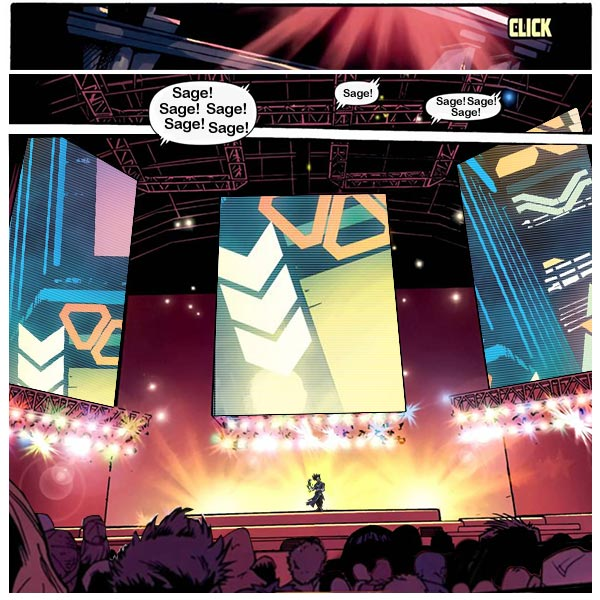
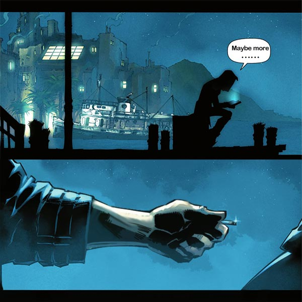
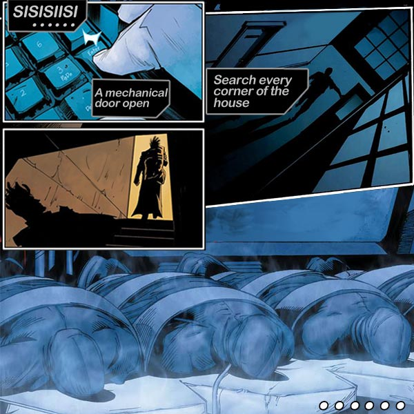

# 🔮 Biography $age 🔮
## Chapter 1

Skeleton Sea--Narev Stadium
In the middle of the stadium floats a mechanical stage in the shape of a pyramid. A 3D holograph is projected above the stage in perfect quality and resolution. All kinds of light and laser robots light up the surrounding stage, creating a spectacular light show!
“King of rapper - The Skeleton Sea Tour is about begin! Let’s do a countdown”
“10”
“9”
......
“2”
“1”
As soon as the projected three-dimensional numbers disappeared, a sparkling red light from the sky shone on to the stage. And a dazzling person was standing under the light!
“Ahhhhh! ~“
\$gae! \$gae! $gae!” Fans went crazy.
In one of the corners of the stadium was a figure of a man, wearing cap with sunglasses on, his face was covered in a mask, his hand holding a camera. He seemed to be completely out of sync with the audience’s passionate energy of cheers.

## Chapter 2

In a dark room, a man was quickly flipping through the videos in his camera.
In one of the videos, \$age is recorded walking out of a closed room, in his hand he was carefully holding a glass cup of some sort, which had some intriging red liquid in it.
$age checked the liquid, observed it for a while and then drank it.
Immediately after, his body started to twitch, his eyes turned red, but instead of agony, he seemed to enjoy it and even had a strange grin on his face during the process. He looked really excited, he then took the cup and crushed it in his palm whitout leaving a single cut in his hand. He also started moving noticeably faster than before.
sissing...the video then ends
"Gonna get rich this time, right? Perhaps even better. Hahaha”
The man’s deep laughter echoed in the room.

## Chapter 3

“Sissing”
The image is switched to indoor.
The living room has a simple layout, and there are many decorations with artworks around. Every corner of the room is unobstructed in the lens, the person holding the camera obviously doesn't want to let any corners go. 
“boom! Ouch” cried the painting. It seemed to have bumped into something.
After not moving for a while, a sound of a mechanical door opening came from the behind.
A mechanical door was wide open in an inconspicuous corner of the room.
Various complicated experimental instruments are placed in the room. Beside the instruments was a huge cage, in the cage was a strange long-like animal. It had the body of a lion, wings of a bat and the scales of a reptile. The animal's limbs and head were firmly chained down, it had all manner of experimental tubes stuck into its body. Some of the tubes had red liquid flowing through it, these liquids didn’t look like human blood, as they were even more red than that. It seemed like the liquid itself was throbbing within the tubes. 
All of sudden, all lights went out. 
“Tap,tap,tap...” of foot step sounds that were gradually getting bigger. When it stopped, it could see a pair of red eyes looming in the dark.
“Sissing”
The image then suddenly stopped.

