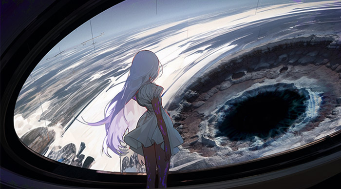
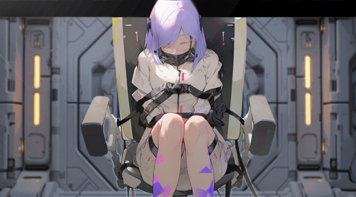
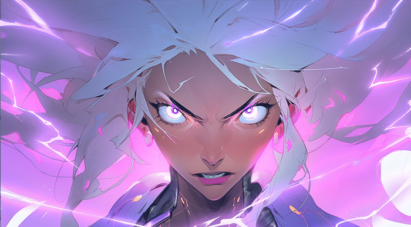

# 💍 Biography Abiroth 💍
## Chapter 1

In the year of 20012, on Bell, also known as Witch's Paradise. 
“Welcome, my new friends, if you like my stream please subscribe me so that you won’t miss the my adventure on this land. I am currently in the Witch's Paradise that took EverGreat Company 300 years to develop, the recently trending tourist planet. Many people are attracted here for the awakening of supernatural powers. Mr.Bear grylls says ‘Can you show us some witches?’. No problem, Mr.Bear. One second, and there you go, those wearing retro uniforms with controllers on their necks are the ones. But seeing them suppressing prisoners, they might be the Witch Squad. We’d better not to mess with them. Ok, let’s back to the topic. Currently, the best-known place for humans to awaken is the Dreamland, but unfortunately, it's dangerous and not open to the public. So, you should have an idea of the value of this planet now. My target this time is the Bell Basin, a giant crater left by the fragment of a star of the constellation Orion in the year of 19712. It's a miracle that this planet still exists after the collision. The company thought it would become a second sun at that time, with a huge electromagnetic field creating constant high temperatures and brightness. Those who survived became witches, a true human evolution. Once we leave the city, we can see the basin. While we're not there yet, everyone, please, please, please subscribe my channel and some donations will significantly help my evolution trip here. Thank you.”
A golden-haired young man with VR glasses walked towards the city gate, casually someone gave him a flyer, it says something about ‘Apocalypse’. Before he could continue reading, he felt dizzy, and an earthquake occurred. Without thinking, he followed the crowd to an open square in front of the city gate. Excitedly, he explained to the audience what had happened. The Witch Squad arrived at the city gate, and blocked the road to the meteor crater. The earthquake gradually subsided.
In the city's center stands a 488-story landmark building called the Paradise Tower.  Shrouded in mystery, its 200-400 floors are not open to the public. At this moment, a white-haired girl in the tower looked out of the giant window towards the Bell Basin, swaying rhythmically.
Bang! The automatic door was forcefully pushed open. A redheaded witch threw a square metal object and manipulated it towards the girl. Another blue-haired witch froze the air around the girl. The other four witches approached. However, the resistance they anticipated did not occur. The girl was subdued instantly, and metal transformed into bracelets and anklets, integrating into the wall. She was suspended in mid-air with a sophisticated controller around her neck, gazing outside with a paler complexion.
Tock, tock, tock, looking sluggish, a lady in EverGreat uniform arrived. 
“Tell me, how did you manage to appear in two places at once? And where did you hide him?” 
Silence filled the room, making everyone uneasy. With a snap of her fingers, the girl was dramatically restrained, and the other witches inflicted pain on her. The lady sank down into the sofa, elegantly lit a cigar, picked up a remote control, and played some soothing music. Hearing the soothing sound, the girl gradually relaxed and “fell asleep.”

## Chapter 2

“Hey, folks, it seems things are not going smoothly. Let's see if there's a hidden passage to the outside of the city. Mr.Bear, thank you for your donation, now I feel full of courage.” 
The optimistic golden-haired young man cheered himself up and seized the opportunity for some rewards. He explored along the city wall, suddenly noticing a shadow covering him. Startled, he rolled sideways, drawing an ion-cutting knife.
“The apocalypse is imminent. By the order of my lord, I will guide the lost lambs.” The speaker, dressed in black robes, hands pressed against the metal wall, melted it into a doorway. The youth, stunned, pulled out the flyer from his pocket, feeling ecstatic. 
“What does it mean to be the chosen one? I'm going to save the world.”
He passed through the doorway and glanced back to find the city wall restored. As he turned, he slipped and slid down the slope towards the dark hole of the meteor crater. Tense and puffing, he searched for a landing point, but in vain. Just as he prepared for his last words on the live stream, the sound of rushing wind came from the darkness. He felt himself wrapped by a cold serpent. When his vision cleared, he saw a white-haired girl with tears slipping down her face and a metallic whip-shape cyberware replacing her left arm, and a corpse in EverGreat uniform at her feet.
“Sorry to disturb your sand sliding. I woke up to find only one person left. I'm looking for my family. Do you know where the witches gather? I accidentally killed him, whom I intended to ask.”
The youth broke into a cold sweat, his golden hair turning somewhat green just like his face. Silently, he closed the live stream, thinking, “Is this the Apocalypse?”

**Paradise Tower**

“Miss Williams, we've found him.” Someone reported to the lazy lady.
“Oh? Where?”
“Bell Basin, a youtuber is doing a live stream,” looking at the girl on the wall, the reporter hesitated for a bit, “and she's there too.”
“Interesting, let's trend it. It’ll be a good publicity. Take her with us; we'll meet the other one.”
They lifted the girl onto the aircraft, securing her on a specially made seat. Miss Williams sat across from her, staring at her absentmindedly, contemplating who knows what. Smoothly, they found the other “her,” or rather, “she” found them. The voices of the blond youth echoed in “her” ears, “only the people working in EverGreat know the answer to this question. See, things with that logo belong to EverGreat.”
So, the whip girl looked up to see the aircraft with a giant logo, ablaze with lightning, rising from the ground and descending from the sky, and broke through the window to confront Miss Williams and the fainted girl in her seat. The squads arrived, surrounding her, and separating her from Miss Williams. Two identical individuals faced each other. When the atmosphere froze, a mirage appeared in the sky, resembling another Paradise planet. The girl on the chair suddenly opened her eyes, and everyone heard the ringing bells. Ding, the mirage clarified and approached; ding, it became clearer and drew closer. The girl on the chair stared at the illusion, her feet swinging slowly and steadily, ding, ding, ding.
Miss Williams lost her composure for the first time. Absentmindedly, she murmured, “Why again?”

**Outside the Paradise**

As soon as the trending topic appeared, various forces flocked around the Paradise, waiting for it to explode for profit or perish in pieces. Only when IFOB's fleet arrived did the others leave disappointed. $age looked at the Paradise in front of her, the meteor crater resembling an eye, blinking with dropped frames. A layer of solidifying halo gradually covered the planet. He felt regret for couldn't stop “stranding” again. Three parallel universes stranding is far beyond his imagination. His theory couldn't be confirmed, unless he found any kind of power can slow down the process of the stranding. Then, “galaxy flats” might appear and trillions of lives can be saved. Thoughts racing, he saw the speed of the halo and blinking magically slowing down.

## Chapter 3

At this point, the planet became a Lost Paradise. Satan emerged from the underground, and angels fell from the sky. The girl on the chair looked down with one eye and up with the other, seeing all suffering, stopping this with her best. People fell from the sky, and numerous flying ships and unknown witches poured down from the mirage.
Miss Williams opened her personal terminal. In a sea of red warnings, she entered a series of passwords in desperation, as if opening Pandora's Box. “Kill these two witches for me, hold on for a moment, and the Oracle will come.”
All landing windows on floors 200-400 of the high tower were open, and four mechanical legions flew out. Upon closer inspection, they all carried controllers, wearing retro skirts with vacant stares. They were the true “specialty” of the paradise - the Mechanized Witch Legion, with the company code “Oracle.” Oracle rapidly descended upon the unknown flying craft and witches in the sky. The situation on the battlefield reversed. However, it seemed that the other side had discovered the uniqueness of this Williams' aircraft. Suicidal figures rushed towards them, and one person successfully entered through the window previously destroyed by the whip girl. Upon landing, that person stared fixedly at the two identical girls over there. Williams opened fire, and she tried to dodge. The mask on her face was shattered, and white hair scattered. Destiny finally met here.
“There's one more? They are the incarnations of misfortune, ominous signs. Killing them is the only way to save this planet. The company promises you the status of free citizens and a reward of 300 years' salary.”
The almost complete Oracle force entered in an orderly manner, tightly surrounding the Three. Various superpowers and cutting-edge weapons almost simultaneously locked onto them. The mask girl extended her left arm, and a purple metal device fell to the ground. She shouted, “Discard your cyberware.” The whip girl removed her mechanical arm almost without hesitation. A strong magnetic field swept in, and all Oracle around were blown away. The entire aircraft was blown into a spherical shape like a balloon. Unexpectedly, the spacecraft's thrusters could still operate at this time, carrying the metal mass forward, avoiding the tragic end of mutual destruction.
However, the crisis was still there. The surviving witches and the Oracle fiercely attacked the mask girl. The mask girl was obviously exhausted, and she could only manage to pull a piece of metal in front of her. She was pushed against the wall, her head buzzing, and blood flowing from unknown wounds, barely breathing. The whip girl came to her senses from the previous impact, enduring tears, biting her lip, and covering the chair girl with her own coat. Purple spots appeared all over her body, and the air around her was pierced by lightning, crackling. This space lost all sound, and the surface of the spacecraft was filled with purple light. Someone's lips moved, and they were ultimately engulfed by the light. The spacecraft's thrusters were finally destroyed, and the entire spacecraft fell straight down, crashing near a meteorite crater, breaking into pieces.
After a long time, $age landed here and saw a white-haired girl with purple metal wings inserted into the soil, looking as if someone was supporting her on both sides.
He walked forward and greeted, “I am \$age from IFOB. Miss, do you need help?” 
The girl slowly looked up at him, “Hello, I am Abiroth, pleased to meet you.”
The Galaxy-flats Landing Operation then was initiated.

