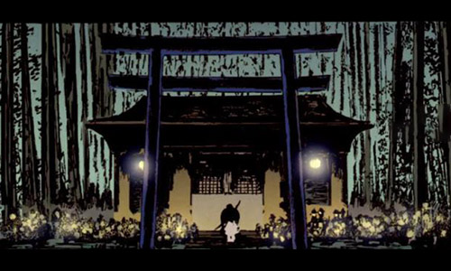
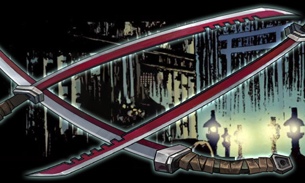
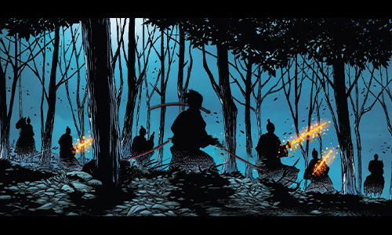

# ⚔️ Biography Akai ⚔️
## Chapter 1: Bloodline

The wind howled through the mountain village, sweeping over the snow-covered homes. At the base of the mountain, the Akai family forge stood. The flame inside was burning as ever, so warm and eternal.  
Taki Akai was born on a bitter winter night, beneath a sky darkened by crimson clouds. His grandmother saw it as a sign—an omen of his destiny, bound by the sword, for the crimson was as much like the forging fire. His father, the last of the village's traditional swordsmiths, and his mother, a descendant of an ancient samurai clan, were also born of a bloodline forged in fire and steel.  
From when he could hold a blade, Taki was proven different. His eyes as a baby were incredibly bright and focused. By three months, he could grasp a mini sword with steady hands. By seven, he could already skillfully wield two wooden swords by the workbench, his movements sharp and precise. His father was surprised.  
"At the Akai forge," his grandfather would say, "we do more than shape steel. We are the guardians of peace. A sword is not just a weapon—it is a belief." These words were etched deep into Taki’s heart. Each blade was alive, and every forging was a moment of rebirth.  
In the family vault, three legendary swords hung in quiet anticipation—"Earthshatter," "Skybreaker," and a nameless, mysterious black blade. They seemed to wait for Taki, their true master.  

## Chapter 2: Awakening

At Taki's thirteen, a fateful event changed Taki Akai’s life. A group of wandering samurai stormed into the village, demanding the Akai family surrender their ancestral secrets of sword forging. His father refused, and in the ensuing battle, he was gravely wounded. Taki watched in horror as his father fell, and an overwhelming fury ignited within.  
He broke into the weapons room, instinctively grabbing three legendary blades—Earthshatter, Skybreaker, and the nameless black sword. At that moment, something within him stirred. The swords danced in his hands as if conscious, repelling the invaders with ease.  
At fifteen, war broke out along the border. The enemy forces, like a swarm of locusts, poured out of the mountains, their black-armored army swiftly overtaking nearby villages. Taki watched as his family was slaughtered in the chaos, and in an instant, his hidden warrior’s spirit awoke.  
It was a blood-soaked evening, the whole village was consumed by despair. As the enemy’s blade killed the villagers, Taki held the legendary swords of his bloodline. Earthshatter weighted a mountain, Skybreaker cut through the air, and the nameless black sword seemed to hum with a mysterious power.  
Their power was enormous. The young Taki, wielding three swords, carved a bloody path through the enemy ranks. With each strike, he honored life; with each move, his swords screamed for justice.  
When the battle ended, Taki stood alone on the battlefield, the three swords dripping with the enemy's blood. The villagers looked upon him with awe and reverence—he was no longer the innocent child they had known, but a true Kenshi.  
That night marked the start of the legend: "The Three-sword Kenshi" was born.  

## Chapter 3: The Legend

As the years passed, the name of Taki Akai spread far and wide. He was a warrior, a guardian—an entity who could balance war and peace.  
His swordsmanship had transcended the boundaries of conventional martial arts. Every strike was like a breathtaking dance, the three blades in his hands seeming to come alive. The Thousand Blade Storm was his most renowned technique, one that could release a flurry of strikes in an instant, so fast that it was impossible to be captured.  
Yet, Taki Akai never saw himself as a killer. To him, the sword was not a death bringer, but rather, a protection, a justice, and the most fragile yet unbreakable link between life and death. He used his swords between war and peace—at once a lethal edge, and at other times, a tool of protection.  
Legend has it that he once held off an army of a thousand men, weaving an impenetrable wall of steel with just his three legendary blades. But more often than not, he preferred to resolve conflict through reconciliation, using the wisdom of the sword to quell the fires of war.  
The years passed, yet Taki Akai's name was still heard. The three swords, no longer just weapons, had become an extension of his very spirit. No matter how many years had passed, he always believed: true strength did not lie in slaughter, but in protection.  
The sword would, in the end, find its way.  

