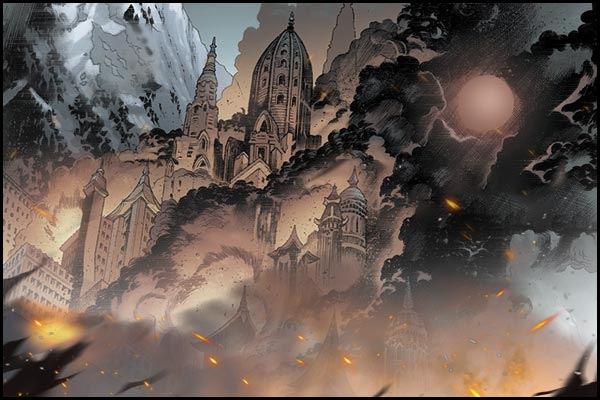
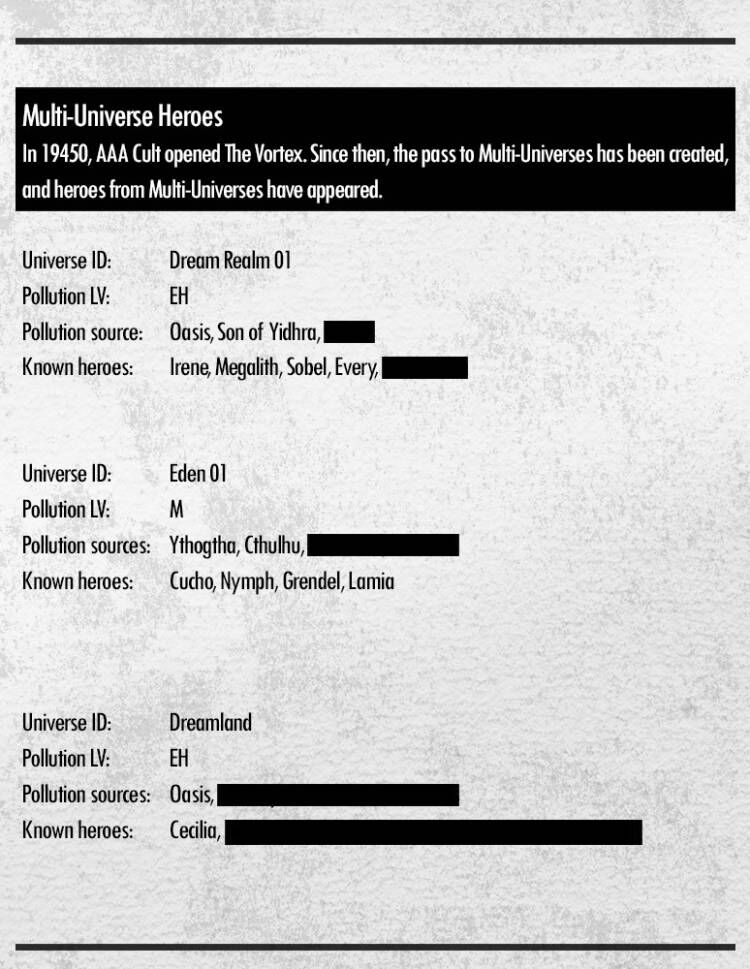
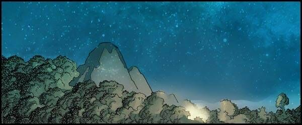

# Biography Aning�kh
## Part 1

👿The Fallen of the World
Harnes originally was a small town with a beautiful scenery, it’s located at the sea and neighbors the Marca Forest, the people of the town fish for a living. Every winter the villagers of the town hold a hunting festival to commemorate the Great Shaman. Many tourists would come at this time to experience this local custom. Every tourist that comes here has to wear animal fur and recite the words to show their thanks for the Great Shaman, there are also those have a deeper faith in the Great Shaman, they pray to the Shaman for wealth, health, love and other similar desires. However, the Great Shaman can only protect them, nothing else. In Dark Era, it is best gift people want to receive. Harnes that year was filled with voices of cheer and joy, yet now Harnes is in ruins. All the houses have collapsed roofs with ashes and blood scattered everywhere.
In the Marca Forest, the wooden fence surrounds the area of the little town, within the fence there are all sorts of simple wooden houses, the people of these houses are the new living residents of Harnes. Anga’s father Ankkut is this generation’s Shaman. He is right now contemplating the problem about the Boogeyman. Precisely, once the whole world fell into the Nightmare, the creatures from those legends and fairy tales actually came to life. These faceless monsters are real cold-hearted killers, but as a Shaman he was also awakened the ability to summon spirits, which in the end did help him stave them off. But, a heavy price had to be paid for its power. He has no choice, and instead can only go with the flow of the universe’s fate, however the one things he cannot give up is his talented son, Anga.
At this point Anga hadn’t yet realized what had happened, the fear of escaping had faded and gradually he developed a longing for adventure and exploration, consequently he decided to accompany his mouse friend on a voyage. When Ankkut saw Anga side by side with the mouse he laughed. This laugh startled Anga and the mouse, “Anga, I am leaving for a hunting this winter, and I will not come back in short time. Find Uncle Kane tomorrow, he will take care of you. You are a born Shaman, you will go to Ancestral Hall and make your own choice one day. I know that, I know that for a very very long time.“ Ankkut looked at his son as if he see through all time and spaces.
Once Ankkut left, the Boogeyman didn’t appear for quite some time. But, over the course of this period, Anga only managed to grow a little, he was still a child in everyone’s eyes. That is precisely when the long awaited Boogeyman made their appearance, and this time there was no Shaman to stop them.

 

## Part 2

🔆The Great Shaman
It was of vital importance that the Hunting Festival would start on time. During this Festival a new Shaman was to be elected. In the center of the village, at the ancestral hall gate, candidates gathered here to be the new Shaman. Even though Shamans will cost their life in battling with Boogeyman, just like Ankkut, many people still came. According to the tradition, the selection of the Shaman will be based on talent. Once the ceremony begins, candidates will take part spontaneously until a new Shaman awakened his unique power.
On the first day of the ceremony Kane did not see Anga at ancestral hall. While relieved, there is also some loss. He knew Anga had a gift. Anga was able to see Inua naturally, he even made friends with the Zoogs’ Inua, this is already a power that Shamans usually have, the only difference is that a real Shaman communicates with a stronger Inua.
On the other hand, Anga followed his friend, a zoog, was quickly running to the depths of the forest. Until he encountered a group of Enchanted Rats surrounding a little girl and trying to cook her. He drew his staff from his waist and lunged towards them, he swung his long staff forcing the rats to disperse, and stretched his hand out and took the dazed girl, put a fur coat on her and carried her out on his back. He glared at the rats and roared them away like an angry tiger, he then turned around and ran back home. When he arrived at the village gate the guard was amazed when he saw the unfamiliar girl on his back, afterall the fields around the Enchanted Wood are actually even more dangerous than the Boogeyman themselves, thus no strangers were permitted to enter the village, these villagers have never seen a stranger before.
The arrival of this girl did not impact on the ceremony, on the second day Anga finally set foot on the path of his destiny, no matter how many times required, he knew that one day he would walk up to the ancestral hall.
When people saw Anga arrive, the spectators parted to make way for him. He then stood in front of the ancestral hall and read out loud the inscription on the ancestral tablet, “Let me alone bear death, let me alone bear Samsara, let me alone spread hope. Once I adapt to death, I will dominate it.“
A majestic force erupted from within him, his fists were equipped with a set of brass knuckles and his knees were covered with two sharp tiger shields. His appearance was exactly the same as the Great Shaman from the legends. Kane got a little excited and he came up to the front and shouted, "The Great Shaman, this is the Great Shaman.” In that moment all the villagers seemed to have come to a new appreciation for the custom of this ceremony, and they all bowed down to the ancestral hall and prayed, "May Aningákh bless us.”

