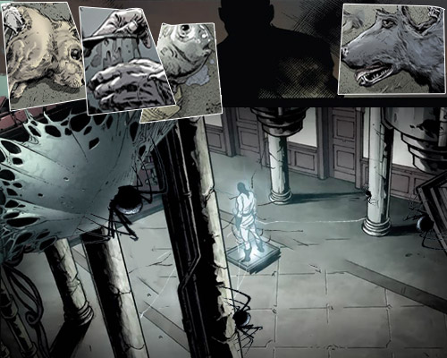
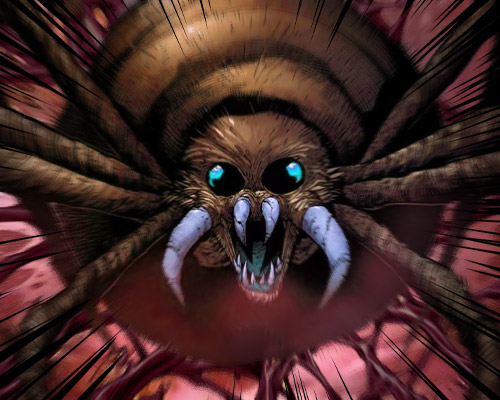
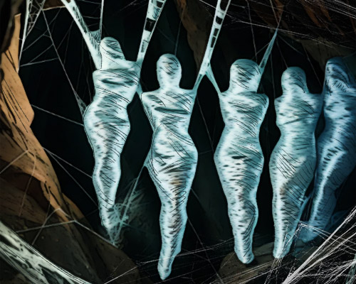

# 🕸️ Biography Arachne 🕸️
## Chapter 1

At dusk, Arachne stood before her loom, her slender fingers gracefully weaving threads. In the flickering candlelight, her beautiful face looked all the more enchanting, her jade-like skin glowing in the light, and her flowing hair swaying gently with her movements. 
Footsteps sounded outside the door, and she lifted her lips into a meaningful smile.
"Come on in," she said, her voice smooth as silk. "I am just finishing a very special piece."
The visitor was a young noble, drawn by the reputation of Arachne's exquisite fabrics. He entered the chamber, instantly captivated by the fabrics hanging on the walls. 
The works seemed so vivid as if they could come to life at any moment. Arachne kept her back to him, weaving steadily, her elegant figure drawing him ever closer.
"Did you know," she spoke softly, the needle gleaming ominously in her hands, "that each piece requires a very special 'material' to achieve such an effect?"
Before the young man could react, he felt a sudden tightening around his wrist. He looked down, noticing a nearly invisible thread coiled around his arm. 
As he tried to pull free, more threads emerged from the shadows, binding him tightly.
Arachne turned to face him, her once beautiful visage twisting into something monstrous. 
Her slender fingers stretched into sharp, hooked claws, while eight massive spider legs unfurled behind her. 
Her eyes split into eight, each one desperately wanting a prey.
"Afraid not, darling" she cooed, her voice still sweet, yet tinged with a repressed delight. "You should be proud as you'd become one of my most perfect creations."

## Chapter 2

The weaving chamber soon returned to calm, with only the loom still at work. 
Arachne's skill was indeed unparalleled: she could weave the very essence of her prey into the most splendid patterns. Behind those breathtaking works lay countless vanished souls. 
What she relished most was not the act of killing, but the moment when hope faded from her victim's eyes. How stunning.
She's now no human, let alone having humanity. 
Athena's curse had not destroyed her—it had instead unleashed her deepest, most primal desires. 
She shifted effortlessly between human and spider, using her perfect guise to lure prey into her lair. 
All those who disappeared became her fabrics.
In the twilight, she loved to admire her collection in the weaving chamber. The works on the walls seemed to writhe in the dim light, and faint, sorrowful wails could almost be heard. 
She reached out to caress the fabric, feeling the trapped life force within. 
These souls would forever remain imprisoned in her art, her everlasting masterpieces.
Athena's curse did not punish her, instead, it made her. Her craftsmanship had transcended mortal limits, and each act of weaving was an intricate part of weaving the very fabric of "reality" itself. 
What seemed like maddening designs were, in fact, projections of the truth.
"Art requires sacrifice," she often told her prey, "and you are my most precious materials."

## Chapter 3

From the curse, Arachne gained tremendous power. She no longer needed to hide her true nature, shifting between human and spider forms as naturally as breathing. 
She began to weave an even grander web, extending her influence further and further.
Her webs spread through the dark corners of the city, their seemingly ordinary threads infused with deadly magic. 
Any creature that touched them would be paralyzed, their life force slowly drained away by her. She adored young, beautiful prey the most—their essence could be woven into the most enchanting works.
She created an enormous underground kingdom, constructed entirely from spider silk. Here, she kept countless "artworks"—each tapestry imprisoning a soul. 
Her most prized piece was an entire tapestry woven from the essence of a living person.
When the moonlight bathed, she would leave her human dwelling, returning to her true form in the wilderness. Her massive spider body loomed in the night, her eight eyes glowing green. 
She would stand on the highest cliffs, overlooking the city below, imagining who her next prey might be.
What was truly terrifying wasn't her monstrous appearance, but her insatiable artistic pursuit. 
She had elevated hunting into an art. Killing—no. That shall be a meticulously planned performance. 
Those who died at her hands had the luck to look at her most beautiful smile.
"Eternal beauty demands eternal sacrifice," she would say—"And I shall forever pursue the most perfect art."

