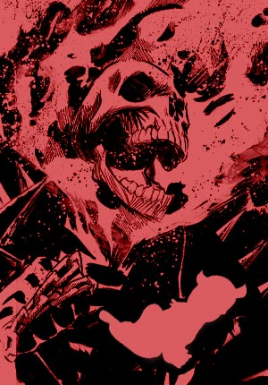
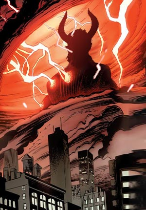
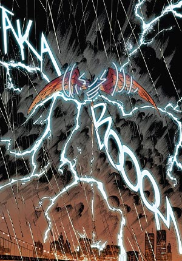

# 🌋 Biography Balor 🌋
## Chapter 1: Birth

In the deepest hell, at a lake of raging fire, the demon lord Angbar used an ancient magical ritual, and from lava and ash a new life was born.
At first, only a weak figure emerged from the pool of blood, curled up like an infant. But soon the figure quickly grew in size and height, eventually forming into a demonic form over three meters tall – pitch black, eyes blood red, with strong muscles and sharp claws.
"Your name, is Balor. You will become my most vicious demon." The demon lord said to him in an ancient language. Balor struggled to stand up, and let out his first low, guttural roar. Flames ignited over his body, a gift from the hellfire.
After that, Balor underwent hundred years of training and challenges. The demon lord put him through extreme environments, honing his strength and will. Through baptism of blood and fire, Balor obtained formidable combat skills, and the ability to control hellfire for destruction.
Balor readily went to the human realm, and wrecked havoc there. He used hellfire to burn down villages, swung his giant sword to slay warriors, and reaped countless souls. Finally he completed his mission, proving himself to be the most ruthless fighter in the demon world. The demon king appointed him as the messenger of demons, to spread plague, war and despair in the human world according to the demon realm's will.
From then on Balor's name struck fear amongst humans, becoming a chilling demon messenger.

## Chapter 2

Balor had been executing his mission of reaping cursed souls in the human world for centuries, but he had grown weary of such grim work. 
He craved greater purpose, something that could bring some extraordinary meaning to his demonic life. 
So one day, he decided to rebel against his master in the underworld, and strike out on his own to the human realm.
Balor traveled across the human world, searching for souls that were as lost as he was. He found many such souls hiding in unexpected places that people tend to overlook: dark damp alleys, run-down taverns, abandoned houses from years past, forgotten graves...
Balor gathered these misfit souls, assembling them into a team. 
They were motivated by a shared sense of purpose, united as one.
Under Balor's leadership, these demons no longer wandered aimlessly, but started wreaking havoc across the human world, spreading war and plague, throwing humans into chaos and violence. 
Their ultimate goal was to turn everything bright and beautiful in this world into nothingness, making the world fall into the same despair as the underworld, and have all humans taste the suffering of these demons.

## Chapter 3

In the repetitive days, Balor discovered an unfamiliar concept in the surface world - "the sky". It was a mythically vast and boundless space, bright, free, completely different from the dark and enclosed underworld where Balor dwelled.
Balor looked up and saw the dazzling sea of clouds floating in the sky, with pure white light piercing through. Above the distant firmament lay the eternal life and freedom that humans aspired towards. This sight profoundly shocked Balor, igniting a brand new desire within him - to possess "the sky" and turn it into a part of the underworld.
"I will conquer the "sky", let gloom cover the sun, making the human world fall into eternal darkness!" Thinking so, Balor released thousands of winged demons and dragons, attempting to fly and occupy "the sky".
However, the sky had the magical ability to repel evil beings from approaching. As Balor's demon troops flew higher, the storms and lightning in the sky grew more intense, beating them back.
Balor summoned his army to fly towards "the sky", unleashing dark magic in an attempt to corrupt it. But "the sky" had the power to dispel evil, rendering the dark magic ineffective.
Unresigned, Balor continued depleting his magic to strengthen the army. Finally exhausted, he transformed into a gigantic black dragon charging at the firmament, thunder rumbled violently as lightning struck down.
When layers of lightning shocked Balor into unconsciousness, a teenage boy descended from the sky...

