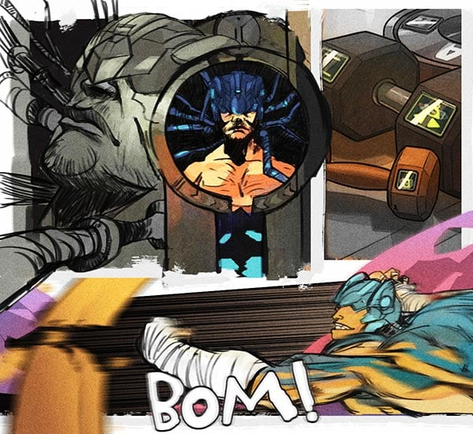
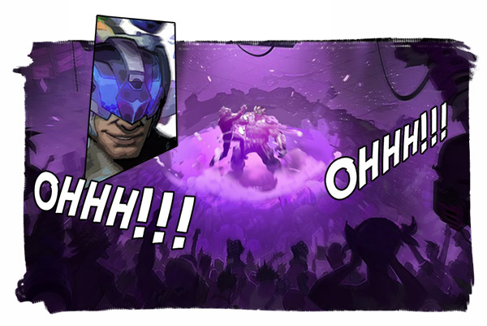
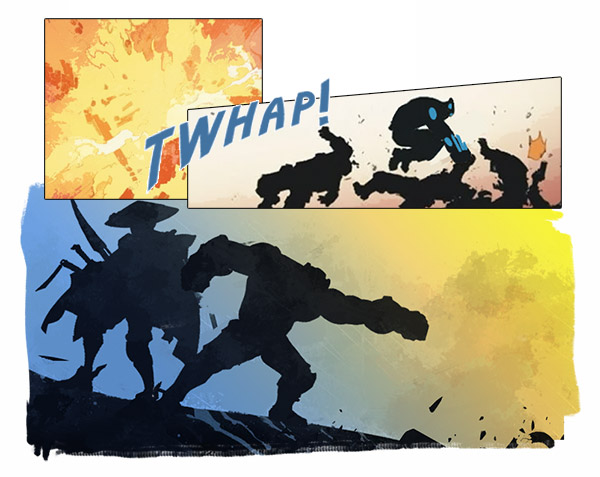

# ⭐ Biography Beamon ⭐
## Chapter 1

A big roaring sound was heard in the training room, it was yet another broken metal sand bag that carried out.
“This is already the 13th broken metal sand bag this month.”
“That was less than half of what was last month.”
“Yeah, yeah, but we’re only been 5 days into this month!”
Samuel had overheard the staff worker’s conversation, which brought him into a deep think. He knew that the impact from the incident on Beamon was too strong. So he tasked himself with training everyday, and started punishing his enemies more and more cruelly. Some of the gangsters were even had their skulls smashed. This is a dangerous signal

## Chapter 2

There were thunderous cheers all around, and countless camera flashes dazzling the entire venue. After winning this battle, he will find out the answer to that incident.
As the man in the silver hat crept up to the center of the arena, he felt as if the truth itself was approaching him, his heart began to beat violently, the whole world fell into darkness, just then a beam of white light shot into the venue, the ground trembled violently under the powerful shock wave, and everything collapsed.
Weightless.
It was that dream again...After regaining consciousness, Beamon realized he was completely covered in sweat, he started breathing deeply to calm himself down. He got up, and then banged a fist against the wall. A blue fist mark was left on the shattered wall.
“99.”

## Chapter 3

“Hey man, this time I got 20 of them.” Beamon boasted. Of course, the person he tried talking to didn’t reply, but this didn’t bother him, as he had long gotten used to this type of silent dialogues.
“Let’s go for a drink at the B’s Club with the lady, the bounty reward this time is quite awesome. Haha.” still no response, but Beamon was sure, Sayung would show up at the bar on time as usual.
But this time something unexpected happened, after Sayung was late by an hour, news came from the headquarters that a small town in the south had been slaughtered, moreover all current clues led straight to a man with a silver hat on his head and holding a silver blade.
Beamon did everything he could to find the Sayung, but it seemed like he had completely disappeared from the earth. His anxiousness and despair soon changed into anger and hopelessness.
“if it was me who had slaughtered the town, what would you do? Sayung.“

