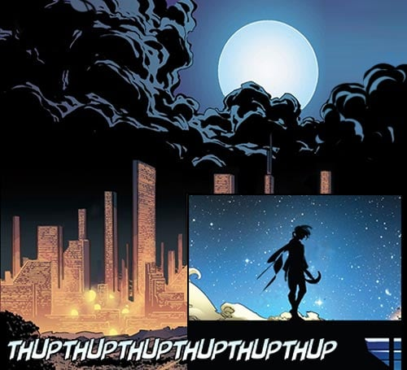
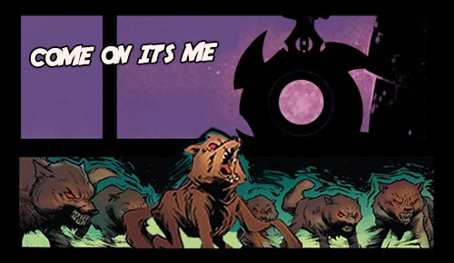
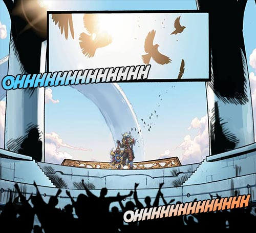

# Biography Beckinsale
## Chapter 1

Once upon a time in ancient Rome, when all surrounding walls were carved with Ares, the god of war, a luxurious bath with fruit and appetizers was being had, on the side lay two special weapons, just when a light breeze blew on the white yarn, a voice spoke: “Come now, Mrs. Ben will now dress for the Colosseum, also, do not forget to wipe my babies clean, they are now hungry, so let them taste fresh blood”, as the voice finished speaking, he took a piece of fruit and gulped it down. All the surrounding maids acted with haste, wasting no time.

## Chapter 2

“Go, kill her”
“Quick, charge now”
“It’s here, so be careful”
The crowd in the Colosseum cheered on as the warrior charged forward towards the beast, the beast then exposed its claws to make an attack, but the warrior then quickly dodged it, after which he then used his momentum to draw his weapon to strike back. After several rounds of fighting, the two could hardly stand, both were tired and injured.
Meanwhile, on the top of one of the most luxurious balconies in the Colosseum was a noblewoman in armor, she watched the battle between the man and the beast with disdain and contempt. She sat languidly in her chair with a roulette blade in one hand and gently stirring a glass of wine in other.
“What an embarrassment, it’s now my turn” said the noblewoman.”

## Chapter 3

“Beckinsale, Beckinsale, Beckinsale”
The crowd roared in unison, as Beckinsale stepped down from her balcony. As she approached, she then leaped into the arena. She gripped her weapons firmly, staring at the lion facing her.
“A little kitten like this couldn’t satisfy me”
Then all of sudden the Ares chariot in her hand started spinning rapidly. She looked at the weapon in her hand.
“Looks like you and me are both hungry.”
"“\~Thump!\~Thump!”
With these two sounds of the iron bar, two more lions stepped out on to the arena. Beckinsale slowly stepped towards her opponents with a fierce look in her eyes. Just then two of lions pounced at her, while the other ran around getting ready to attack from behind."
Almost immediately Beckinsale attacks by throwing her spinning blade, which completely slices one of the lions in half. She then with her chain pulled back the weapon only to slice the other one into two pieces. Just at that moment the lion from her back opened its mouth getting ready to bite her. Beckinsale then quickly turned around in anticipation of this, and drove her Phobos Blade from her shoulder right into the gut of the last lion, killing it instantly.
The battle then ended with Beckinsale wiping her weapons clean, while looking at the bodies of three dead lions.
“I would like to make a fair deal with you, either to exchange my blood for your life, or your blood for my life.”

