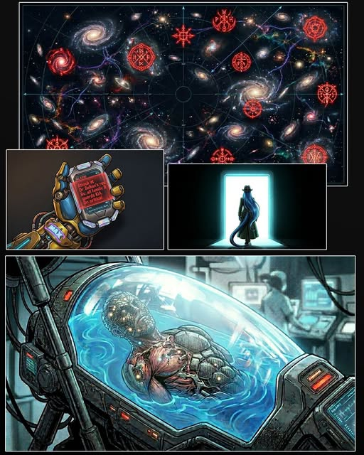
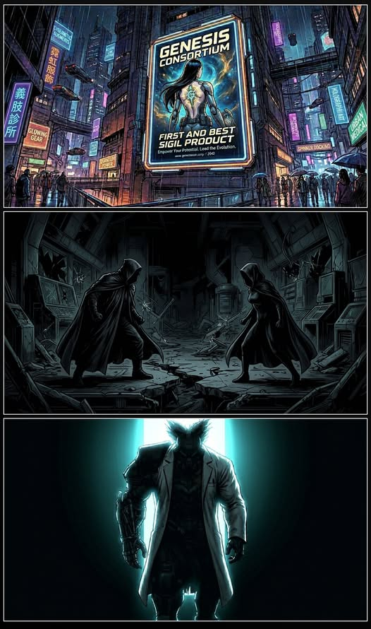
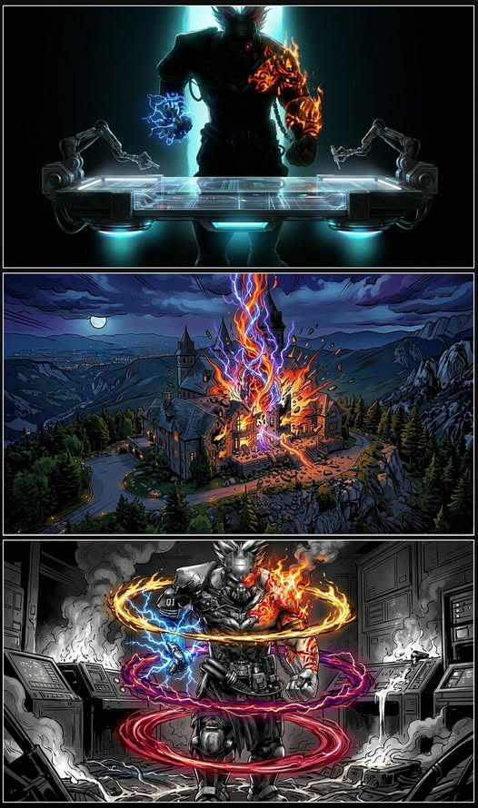
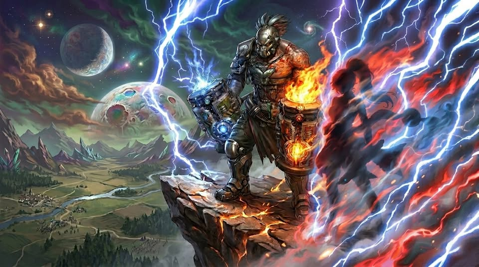

# Biography Bolkan
## Part 1 The Crime

Inside the IFOB Grand Assembly Hall, silence ran deep as an abyss.
Despite prolonged efforts, the AAA cult's hidden strongholds remained untraceable. Instead, IFOB found itself forced into containment, sealing Sigils wherever they emerged. By now, one truth was undeniable: their spread could no longer be stopped.
Backed by powers such as the Eternal Group and Genesis, leading universities and elite consortia had begun establishing “Sigil Research Institutes.” Under the pretense of safe utilization, they pursued Sigil applications with reckless ambition—auctioning fragments, recruiting specialists, and dragging the academic world into a frenzy of profit and prestige, blind to the void lurking beneath.
Debate fractured the chamber. Some called for the immediate eradication of all illegal research. Others warned of escalating conflict with capital powers. No resolution emerged.
Gilbert traced the stellar map, his brow drawn tight.
“We still have no lead on the point of descent, yet Sigils have already become a ‘mainstream discipline.’ The trend is irreversible. We need a way to neutralize them urgently.”
Mikaela gave a loose shrug.
“And where exactly do we find that? In front of Sigils, we’re all amateurs.”
“Which is precisely why this matters,” another voice cut in.
“Dr. Bolkan, this year’s Sobel Prize laureate. His latest model shows unprecedented stability in both inorganic and biological trials.”
Before Gilbert could respond, his communicator flared. He scanned the report, his knuckles whitening as he read.
“Attack at Dr. Bolkan’s res. 6s: all family & guards KIA. Dr. critical.”
The hall erupted.
“Irene. You’re up.”
She nodded once and was gone.
By the time Irene and Sobel reached the suburban residence, it was already a ruin. Electronics had melted into charred debris under extreme voltage. The reinforced alloy door had been burned through into a warped cavity. Most bodies were brittle, fragmented—DNA recovery nearly impossible.
Sobel crouched, brushing carbon residue between his fingers. 
“Can’t identify the ignition source anymore… but the energy level’s absurd. I’d say this was a Sigil.”
Irene did not linger. Forensic drones were deployed. She moved on to the hospital.
Inside the medical pod, half of Bolkan's upper body was gone. Nanomachines worked to rebuild him with Cyberware, salvaging what little remained. He was alive, barely, but hollow. His gaze was vacant, his lips moving in soundless fragments. There would be no answers from him.

## Part 2 The Chaos

Weeks passed. The galaxy grew restless.
The struggle over Sigils escalated into open conflict.
The Genesis Consortium ignited the spark, unveiling a “successful human integration case” at a high-profile press conference, a modified woman presented as proof that Sigils marked the next step in human evolution.
The Aurora Order condemned it immediately, denouncing the technology as heretical and lethal, calling for a galaxy-wide boycott.
The backlash came fast.
Within a week, an Aurora Order stronghold in the cosmic shallows was annihilated. Thousands dead. Dozens of core operatives lost. Retaliation was obvious.
The Aurora Order responded in kind, offering free Sigil engraving and high-grade Cyberware to recruit mercenaries. War spread rapidly. Factions exploited the chaos.
Amid it all, the Bolkan case faded into obscurity—unsolved, abandoned.
Irene seized the moment. She withdrew the visible guards, staged a facade of abandonment, and set a trap. Then, they waited.
In the nights that followed, intruders arrived one after another—agents, spies, opportunists. None was the one she sought.
Until the third night, two figures stepped into the underground lab: the modified woman from the Genesis, and Mr. Z of the Aurora Order. Neither of them could gauge the other’s strength, and both feared drawing attention. After a brief standoff, they seemed ready to retreat.
“Not so fast. I have been expecting both of you for quite some time.”
The voice belonged to Dr. Bolkan, who had blocked the only exit. He was about to continue when his gaze fell on the woman from the Genesis. A strange, inexplicable sense of familiarity crashed over him. It terrified him. He slammed his hand against his own head, paying no heed even as blood spilled down.
“Damn it… no time left,” he said, steadying himself with effort. “I will show you the art of Sigil integration. After that… kill me.”

## Part 3 The Truth

“Gilbert… we may need Lady Stasis here.” Irene realized the situation had slipped beyond her control. With the personnel on site, they likely couldn’t protect the doctor or detain the two intruders.
Inside the lab, Bolkan moved with terrifying clarity. A portable nanoworkshop unfolded at his command. Precision tools danced as he engraved Sigils into his own flesh and Cyberware, calmly explaining each step like a lecture. The atmosphere was eerily serene, yet the modified woman and Mr. Z were both in a cold sweat.
“Final step. Do not hold back.” A whisper in an unknown tongue followed. “Hai, ng gnai thar!”
The moment it was complete, violent lightning and flames burst from the doctor’s body, instantly disabling every monitoring system. The screens dissolved into static.
Mr. Z hurled a cluster of grenades at the doctor without hesitation, but the modified woman flung out a strange metal weapon and knocked them all aside.
“Nafh thar?” The woman called out tentatively.
A stronger surge of energy erupted. Mr. Z hesitated for a split second, then still grabbed her and dragged her out of the lab.
In the next instant, lightning and flames tore through the air, reducing the house to rubble. Reeling from the shockwave, they had no choice but to scatter and vanish into the night.
When the dust cleared, Bolkan remained. His cybernetic body was embedded with pulsing lightning vortices, while fiery Sigils burned over his skin. Powerful energy roiled around him, a metal mask concealed his face, and his eyes shone crimson and unfamiliar.
Irene approached cautiously, but Bolkan lunged at her without warning. Startled, she immediately triggered Confusion and barely slipped past the attack.
Meanwhile, Karena spread her Aura of Stasis, attempting to lock Bolkan in place. Yet the Sigil energy raging within him was far too volatile, and every seal was violently broken apart. After a long struggle amid the ruins, they finally managed to subdue him.
Bolkan collapsed to the ground and finally regained his senses. He looked bewildered at first, then helpless until at last he broke down in tears.
“Why didn’t you kill me? Why?”
Gilbert stepped forward and offered him a cigarette. “Tell us what happened.” He paused. “Maybe we can help.”
“It all started… when he found me.”

## Part 4 Side Story

I once fancied myself a seeker standing atop the summit of knowledge—until desire stripped away all my pretense. I pursued truth, yet lusted after worldly fame and renown all the while. 
That vanity rooted deep in my soul ultimately left me powerless against temptation.
A refined stranger held out an olive branch, which I accepted without hesitation. The knowledge he bestowed became the core foundation of my research. I claimed all accomplishments as my own, basking in the accolades with a clear conscience, yet I ignored the long-forgotten warning: the knowledge borne by the emblem has ever been honey-coated poison.
The moment my first experiment succeeded, there was no elation, no cheer. An invisible hand violently wrenched my consciousness away, severing it from my mortal flesh in an instant. 
When I came to my senses, cracked scorched earth lay beneath my feet, and a blood-red firmament hung overhead, eternal and unbroken. This was an unnamed savage planet, devoid of civilization and order. Tongues divided all its inhabitants, and strangers knew nothing but endless slaughter.
I thought it merely a momentary lapse of awareness. Yet as days turned to months, seasons cycled on, I endured a full bitter decade trapped on this desolate world.
Over those ten years, I cast off the gentle mildness of a scholar and devolved into a blade-wielding beast. The mutated abominations of this wasteland bore twisted limbs and innate bloodlust. I clung to life through endless battles; my wounds scabbed over only to split open again, while hunger and fear gnawed at my mind relentlessly.
On the verge of breaking point, I saved a young maiden of around twenty—the very same age as my daughter in the real world. As she drifted in and out of consciousness, she called out for father in the tongue I knew well. Sensing she too carried a tragic past, I lied to her outright, telling her I was her father, the father of this savage planet.
I taught her the arts of thunder and flame. She surpassed me by far, and thanks to that, we carved out our own territory in this hellish realm, rising to become overlords of this land.
Then the "gods" found us.
Only overlords were worthy of knowing their existence.
They cloaked themselves in human form, their features indistinguishable from ordinary folk. But tear away that mortal facade, and beneath lay cold, rigid silicon flesh—no heartbeat, no warmth, not a trace of human emotion. They named themselves the Great Race, gazing indifferently upon every birth and death across the planet, watching us struggle, slaughter one another and perish like ants. They toyed with humanity at will: remolding a person into another’s likeness, reviving the dead, all merely to sate their own twisted faith.
In that instant, the lifelong knowledge I had accumulated crumbled completely. The origin of mankind, the meaning of existence—all the truths I had sworn by turned into ridiculous farces. I even began to doubt whether my original world was but a plaything in the eyes of these transcendental beings.
My consciousness snapped back to my body. I collapsed into my laboratory chair, drenched in cold sweat. I checked the time: only five days had passed in reality.
What chilled me to the marrow was that none of my assistants or family noticed anything amiss. They greeted me with smiles, chatting casually about trivial happenings over those five days, their manner unnervingly natural. A horrifying truth dawned on me: during my absence, something else had seized control of my body, living my life in my place. It had done so flawlessly, undetected by anyone.
It was a fear burrowed deep into my bones—I was no longer the sole master of my own flesh.
I dared not speak a word of it, choosing to feign composure and bury myself in research. I numbed my mind with mountains of experimental data, striving to dismiss the decade on the savage planet, the silicon-based gods, and the daughter who had stood beside me as nothing but an absurd nightmare. Yet the more I fled, the more palpable the emblem grew. It seemed alive, burning in my mind and tempting me endlessly day and night.
Late one night, as I stared at the emblem upon my desk, an irresistible impulse swept over me: I must merge with it.
Bewitched beyond my own control, I picked up a carving knife and etched every line of the emblem into my chest, stroke by stroke. Agony crashed over me, and my consciousness was torn away once more—returning me to that savage planet. The familiar scorched land, the crimson sky, and the distant roars of alien beasts filled the air. My eyes instinctively turned to the ruined corner where I once dwelt. There, the maiden who had shared my hardship curled asleep amid tattered rags, dust smudging her face yet resting in quiet peace. This time, however, I remained for merely seventy-three minutes.
Seventy-three minutes later, I jolted awake, back in my laboratory.
What unfolded before my eyes was a sea of fire and rubble.
My home was gone, reduced to charred ruins and the pungent stench of blood. Overwhelming hatred consumed me. Lying in the medical pod, only one thought lingered in my mind: revenge.
I forged a plan.
The massacre soon drew agents of IFOB to investigate. The scene was laced with eerie anomalies they could not unravel, yet by sheer coincidence, they turned the ruins into a natural trap—luring all greedy schemers who coveted my research achievements.
I decided to turn their scheme to my advantage. I lay low under this cover, watching coldly as various forces probed and plotted, patiently seeking the one powerful soul capable of slaying the invisible entity dwelling inside me. At long last, my awaited chance arrived.
The female cyborg from Genesis, and Mister Z of the Aurora Assembly—both ambitious and peerlessly strong, perfect pawns for my vengeance.
I recreated the pivotal experiment right before their eyes. My intent was plain: to send my consciousness to the savage planet of my own volition. The moment my soul departed my flesh, the unknown entity possessing me would lay exposed before Mister Z and the cyborg. They would kill it, and avenge my slaughtered family.
The experiment succeeded. My consciousness plunged once more into the savage planet’s spiritual realm—but no tidings of victorious revenge awaited me.
The second my soul returned to my body, I knew I had failed. I could not fathom why the hidden entity within me had allowed them to leave unharmed.
Hatred still blazed in my heart, yet fear burned far hotter.
I finally faced reality. Before I could exact my bloody revenge, I must survive first. No matter if that decade on the savage planet was truth or illusion, no matter how invincible those silicon gods were, no matter how eerie the entity in my body might be—I would live on.
Only by living could I seize a chance to turn the tide; only by living could I tear apart the boundless darkness shrouding my entire existence.
Thus, when others ask what befell me, I suddenly realize—I still hold the chance to take revenge with my own hands.
I will find the mysterious man who bestowed that forbidden knowledge upon me.
And I will tear him to shreds.

