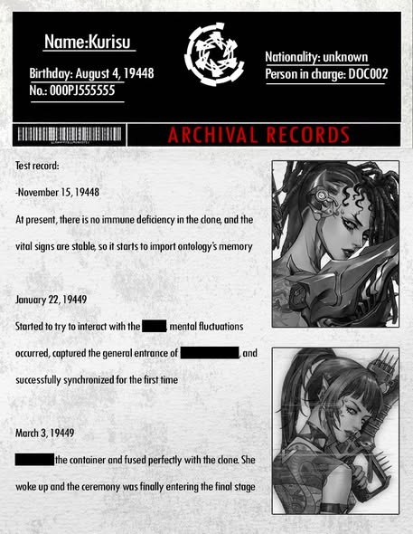
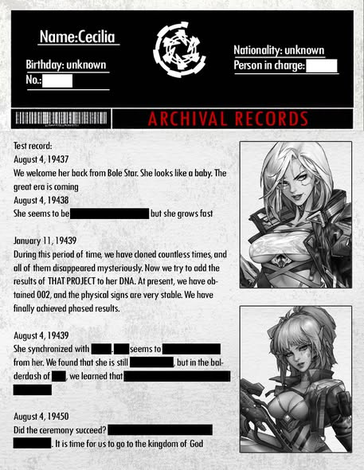
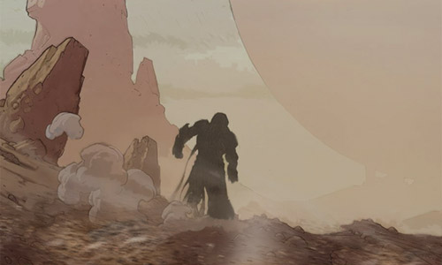
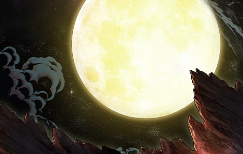
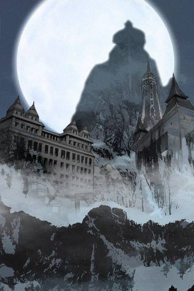

# 🌌 Biography Cecilia in dreamland 🌌
## Chapter 1: Prologue

**IFOB Star Parliament Hall**

On the highest floor of the IFOB headquarters there is a huge circular conference hall. During its construction Gilbert had proposed to make it transparent, thus blending it in with the universe, as it was to become a starting point to travel to other universes. That is when numerous heroes started arriving to the conference hall. They surrounded the huge circular table inside, the table was designed to seat 12 chairmen with differently shaped seats. This was an obvious mimic of the Round Table legend from the ancient civilization. Today, only 4 sat at the at the table, which were Gilbert, Lavinia, Irene and Cecilia.  
“On behalf of the 37 heroes present here, I welcome you to IFOB.” Gilbert addressed Cecilia and the seven heroes sitting behind her.  
“I know what you have come for, but knowledge I have has great powers, which I don’t believe you are ready to take on. Look at us, I wouldn’t want a repeat of what happened to us in this universe, this is the very reason why we came to IFOB after our escape.” Cecilia’s words made the atmosphere of the whole hall go cold. “The danger of that knowledge I will guard with my life, but my experience I will share with you.”  
With these words she presented a book. Lavinia, who was sitting next to her, leaned in for a better look at the book. It’s cover consisted of some strange drawings, which looked like a huge Moon floating above land. This book was titled “Cecilia In Dreamland”.  
“Is this a fairytale?” Lavinia looked over at Cecilia with a strange look.  
It seemed that Cecilia knew what she was thinking, and spoke in haste before Lavinia could say anything, “Please have a look, in here is written my whole experience in Dreamland. Regarding the author of this book, I cannot speak his name. He is too strong, but I can’t figure out what he wants, some of you may have already encountered him before. My advice to you is to be careful with the objects and knowledge that he bestows you.” Cecilia said, stroking her necklace, while her eyes inadvertently glanced over Every's armor. Every glanced back, they made eye contact for a moment and then nodded at each other.  
The conference hall then fell silent.  
Lavinia then impatiently opened the fairytale book.   

## 🔅Chapter 2:  Falling into the mouse hole

Young Cecilia was a lovely girl. One day, while she lay on the grass bathing in the sun, she fell into a sleep. While half asleep and half conscious, she saw a mouse with a meat colored beard pass by while he was nagging. She look at the way mouse came from and decided to chase after it. As she got closer to the mouse she heard it say, “I need to run faster, otherwise I’ll be late for the Festival.” Just when she wanted to inquire more, she fell into a big black hole.  
Just when she fell in she had a little dejavu, it had seemed as if she had been here before, or, it had seems she had experienced many odd things in this short moment.  
When she woke up again, she was lying in completely foreign place to her. She found herself in a prairie field of some sort, the grass was up to her chest, in front of her lay a path, which led to only God knows where. Behind her was a cave, the cave had a huge stone gate, on which carved two guards, they cracked a big smile when she looked at them. Young Cecilia decided to leave this place and find Mr. Mouse, although the grass made her feel cozy and warm, like her mother’s hug, it felt like warm like her mother’s body.  

## 🔅Chapter 3: Big Brother

Young Cecilia went along the unknown path for who knows how long, she eventually came to a forest, the forest was some what dark, she was a little scared at the time, but just then Mr. Mouse appeared again. She chased it into the forest, but soon she could not find her way back. Fortunately, just then a group of mice came and picked her up and carried her moving forward, they even held a party afterwards and invited Young Cecilia to a sauna, the warm water had dazed her, and she thought Mr. Mouse's friends were too hospitable.  
It was then a Big Brother and Mr. Mouse, arrived at the scene. Unfortunately, they had arrived too late, as the party was already finishing up, all the mice were going back to their homes one after the other. The Big Brother took Cecilia and carried her back to his home. As she lay on Big Brother’s back, she looked on to the village they were entering, besides the big gates, the village seemed to be completely deserted. Cecilia was thinking that the curfew of this village must be quite early, as she kept on thinking, she gradually drifted off into a dream. That night she slept quite soundly.  
When she awoke on the second day, she discovered that the village was holding a Festival, it was quite bustling. She was ecstatic about this, she followed Big brother and the group of people up to a huge building. The peculiar thing was, no one entered the room. She went on staring at the room with curiosity, it was dark and it wasn’t possible to distinguish what was inside. Then, the Big Brother began to perform a show. Just when all eyes were on Big Brother, she snuck into the building. Inside she saw a big plush throw pillow. She threw herself onto the big soft rug, but then realized that there was someone else sitting beside her It was a man with a lame eye. But she recalled the one eyed man as kind and friendly towards her, but what happened after she couldn’t quite remember.  
When she woke up the man with the lame eye was gone, it was only Big Brother and Mr. Mouse left. Big Brother told her that Mr. Mouse will take her back home, her home was called ‘Moon Hall’. She bore it in mind. She felt sad when she had to wave Big brother good-bye.  

## 🔅Chapter 4: Falling asleep by the Medicinal Lake

Young Cecilia and Mr. Mouse left the village and traveled to Eastern Continent in search of Moon Hall. Climbing over a huge hill, they arrived in Eastern Continent, a brown plain, where they came across a giant with a ringing bell in his hand, followed by numerous fluffy critters. Simply listening to the sound from the ringing bell for a short while, Cecelia followed the giant unconsciously as well. But Mr. Mouse dragged her away, for which she was sullen for the next few days.   
Fortunately, she found a lake that smelled very fragrant, the water from this lake was extremely sweet and refreshing. After taking a sip, the soreness in her body was completely gone. Mr. Mouse gulped the water from this lake to his heart's content, and then they all fell asleep. In her dream, young Cecilia felt that she was sleeping on clouds, floating leisurely, as if she were sleeping in a cradle or in her mother’s arms. Suddenly the clouds dispersed, and she fell and opened her eyes in horror, realizing that she was already lying in a bed, with a kind old man looking at her. Young Cecilia told the old man about her dream, and the old man shared with her many thrilling stories in return, noting that there was a Spring City not far away from here, where Spring Festival would soon be held, and that people from all over the continent would go to Spring City. Young Cecilia then followed the old man to Spring City.  
Arriving in Spring City and stepping on its agate-paved pavement, young Cecilia was greeted by the merchant and the grooms, as if she used to live in this city. Along the main road in the city, she noticed that there were increasingly more people walking ahead of her, crowded but orderly towards the same direction. Shortly afterwards, she saw where people were headed for——a huge temple made of turquoise. Inexplicably, the plush pillow in the village her Big Brother lived suddenly came to her mind. Meanwhile, a priest sitting and reading inside the temple stood up, asking her to get in and make a wish. Cecilia wanted to go back to her ancestral home. So, she made a wish about returning to the Moon Hall. Surprisingly, a fairy appeared and took her to a new continent.  

## 🔅Chapter 5: Anun below the moon

Coming down from the bridge, young Cecilia and Mr. Mouse saw the moon in the sky, so huge that it nearly covered half of the sky. Unfortunately, it was surrounded by clouds, so no one could really make out if there was anything on the moon. Below the moon, there was a mountain towering into the sky. At first glance, it seemed as if the mountain was holding up the moon.  
“In eight-cloud-rising Anun,  
an eightfold fence to enclose my wife  
An eightfold fence I build,  
And, oh, that eightfold fence!”  
After taking a several steps down the road, young Cecilia heard someone singing, faintly yet audibly. Following the sound, they reached a vast basin, the picturesque view of layers of walls and rising fumes of which made one linger. ‘Time seems to have pressed the pause button in here’, shortly after this thought sprang to mind, young Cecilia felt something burning on her chest. She then hastily reached out for the necklace hanging on her chest and held it in her hands. It was still boiling hot and hurting her hands a little bit. Suddenly, out of nowhere came a murmur, and the necklace disappeared into thin air from her hands. When she raised her head and looked up again, the distant fumes had joined the clouds that were covering the moon. Birds were singing, tree branches were dancing, everything was thriving again.  
In a tavern of Anun, Mr. Mouse gleaned clues about the Moon Hall from a ranger. When Mr. Mouse came back with young Cecilia, wanting to meet the ranger again, unfortunately the entrance of the city was set aflame, so they lost touch with the ranger. When they met the ranger again, he was enjoying his meal. Oddly enough, the food was queuing to be eaten. Young Cecilia wanted to get a load of the food, but the ranger did not allow her to stay. At night, the kind-hearted ranger and his wife returned the necklace young Cecilia lost previously and invited her to visit their house. Before putting her to sleep, the ranger promised young Cecilia that he would go to the Moon Hall with her. With the ranger’s reassurance, young Cecilia fell asleep quietly.  

## Chapter 6: The City of Truth

In order to reach the Moon Hall, young Cecilia and her party came to the foot of Mount Barch, preparing to go over it and head to Glaad. Ever since Yae wiped out the Koujins, the plants in Mount Barch had been growing wildly for thousands of years without any harassment from their archrivals. The original mountain path had become rickety, and the twelve palaces built along it had been deserted. The good thing is that with Mr. Mouse leading the way, they never deviated from the mountain path and did not encounter any danger.  
There was a legend about the twelve palaces built on the Mount Barch. Since ancient times, there had been people going on a pilgrimage by climbing palaces and ascending to the moon, from which the path earned the title of the heaven-ascending path. At the end of the path sit the Purity Moon Palace, behind which was the city of Glaad built along the mountain. Oddly, the Purity Moon Palace was located at the peak of the mountain, where had seen little rain or snow. No wonder all saw it as a holy object of pilgrimage. At this time, young Cecilia looked beyond at the Purity Moon Palace and found that it was no longer surrounded by its former golden splendor; the alloy that covered its outer wall was dull and densely filled with black and brown traces, looking evil and horrible.   
As the crowd was feeling sentimental, clouds of white fog emerged relentlessly from behind the Purity Moon Palace, spreading down rapidly. Suddenly, the place was filled with white fog and became barely visible. Young Cecilia groped her way towards the Palace, wanting to hide herself. However, she lost her footing and fell down into a huge black hole. On her way down, she had a feeling that this was strangely familiar, as if she had been here before and experienced many things.   
Suddenly, someone pulled her out. She opened her eyes and found herself standing in front of the Purity Moon Palace. The black hole and clouds of white fog were nothing but a surreal dream. Leaning against the wall of Purity Moon Palace was a grey-haired man with a shrunken nose and high forehead wearing gold armor and red robes, his body straightened up, his eyes tightly closed, looking pale and lifeless due to the cold weather. She stepped forward without making any noise and patted his shoulder gently. After what seemed like ages, the man did not move a bit or give any response, so young Cecilia went around him carefully and entered the Purity Moon Palace. In the meantime, the man slowly opened his eyes, revealing golden pupils.  

