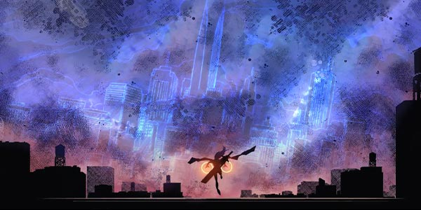
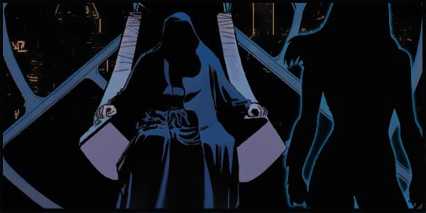
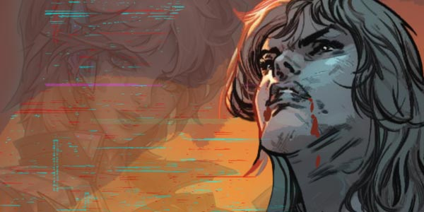
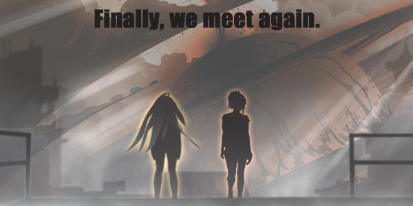

# 🌠 Biography Cecilia 🌠
## Chapter 1

“An unfathomable destructive force!” was exclaimed out of nowhere, just then a black portal appeared, from which two shadows gracefully leaped out of, they were $age and Lavinia.
The paradise “Eden Secret Garden” before you has become the most real place for human suffering, the entire infant’s cabin pillar had been utterly destroyed, broken bodies could be seen everywhere, the thick smell of flesh and blood had attracted all observers from neighboring stars, millions of eyes in sky gazing down choosing which people to gobble up. It was as if a cold heartless God was watching down on the people.
“This fluctuation of energy belongs to that maniac.” When the Lavinia smelt that scent of destruction in the air, she couldn’t help but think back to her vague memory of her past as a weak little girl, which also had two shadows, but just then her memory stopped there, as any further thinking of her past brought excruciating headaches along with the whispers of the Archdragon.

## Chapter 2

City of Eternity Alpha.
“You did well, Kurisu. Now hand to me Nymph’s Essence Stone”, said the black robed man sitting on the Iron Throne, who was pointing down at the girl leaning on her bike with his haggard finger.
“Yes, Master”, the girl smiled evilly, pretending to take something from her waist, but suddenly took a puff of cigarette, and instantly summoned a psionic gun from her waist, "bang bang bang" ten bullets in a row.
This energy of destruction along with the ballistic intertwining created an inescapable net that strangled the black robed man on the throne to death. And in an instant he disintegrated into dust.
“Argh, another clone.” The girl spat on the floor in frustration.
An angry voice then roared in the air, “ Kurisu, I have said before, those who do not follow orders will meet their doom, this was your last chance.”
But the girl responded by revving her engine and raised her middle finger.
The black phantom shadow then swiftly disappeared into the bright city, dragging out its long tail of smoke.

## Chapter 3

"Give it up, Kurisu, you are not my opponent at all, hand over the blood essence stone, only I am the most perfect vessel of God."
Masses of black robed people lead by NO.2 surrounded Kurisu, they then whipped out a thousand chains at her tying her up, the chains then sucked her blood and energy from her body like leeches.
Just when Kurisu could feel life slowly drifting away from her body, a black portal appeared beside her, out came $age and followed by him was Lavinia.
“Join IFBO, Kurisu.” Lavinia rode her Dragon forward, attempting to cut the chains that had bound Kurisu.
Kurisu raised the corners of her lips lightly after hearing this, and there was no fear on her face covered in bright red blood.
“No, Lavinia, You cannot control me and I will do as I please, nothing can stop us.”
“Us”, why is it “Us”?
At first Lavinia couldn’t understand, but then Behind Kurisu suddenly began to flash holographic fragments, which then slowly formed a figure, then all of sudden her memory came flooding back, it was her!

## Chapter 4

The silver haired lady that appeared behind Kurisu, gradually took form.
There was no other energy fluctuating, her face appeared expressionless, no one could understand why she had appeared, just like no one can understand why light penetrates darkness.
She raised her white transparent arm, which had “000” tattooed on to it, and pointed to the man with the chains and softly spoke the following: “Be silent”, and then pointed to Kurisu and Lavinia and said: “Released”.
Number 2 felt as if his powers within him became sealed, the power in his chains disappeared, which he quickly dropped from feeling so weak. While Lavinia on the other hand felt more power than ever before.
A powerful bright light shone on the lake as if a huge bright rock hit the water, circles of energy to ripple across the lake. Once everything had calmed down, the only ones left from the battle were, Lavinia, $age and the woman in white hugging Kurisu in her arms.
“Hello, Lavinia, we meet again at last.”

