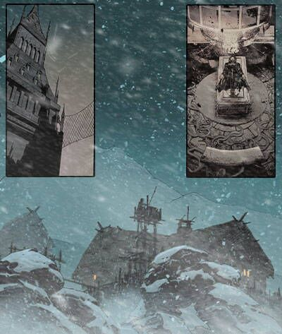
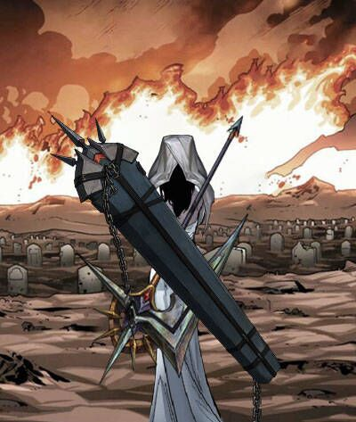
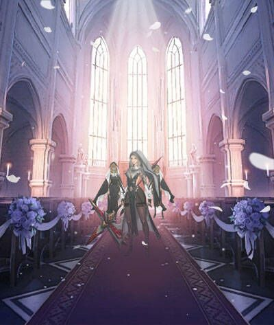

# Biography Chessia
## Part 1

In a secluded mountain range deep within the European Alps, there stands an ancient monastery veiled in mist.
This is the home of a legendary family, one tasked with handling the Church’s darkest and most secretive missions. Chessia de Morte was born into such a lineage.
Her mother, the monastery’s most mysterious nun, was said to possess the unsettling gift of foreseeing death. Her father, a wandering exorcist, confronted the dark side of the Church and dealt with evils that others dared not approach. From the very moment of her birth, Chessia was different—nuns who attended her delivery recalled that she did not cry, but instead quietly observed what was around her with a chilling, cold gaze.
As a child, Chessia kept to herself, rarely interacting with others. Her curiosity about death bordered on obsession.
At the age of seven, she crafted her first coffin—elegantly carved from ebony and lined with velvet. The other nuns, both in awe and fear, could sense that something was unsettling about her. It was as if death channeled through her.
Her studies in medicine and theology were unconventional, to say the least.
Chessia developed an intense fascination with anatomy, spending hours dissecting the dead in a quest to unravel the mysteries of life and death.
To her, death was not an end, but a transition into another form of existence.

## Part 2

As war ravaged the continent, Chessia embarked on her true mission.
With a specially crafted coffin carried on her shoulder, inside were not only medical instruments but also rare poisons and mysterious elixirs. She was no ordinary field nurse but a cold-blooded "arbiter of life and death."
On the battlefield, she wore the white robes of a nun, her coffin always by her side. The soldiers called her the "Angel of Death." She would carefully observe each wounded soul, using her piercing eyes—eyes that seemed to see into the very heart of a person—to determine who deserved to live and who should be allowed to rest. For those she deemed without purpose, she would grant a silent and merciful end.
One survivor described her this way: "Her gaze could penetrate the heart. When her pale fingers touched a patient’s forehead, she was reading their soul. Those she deemed ready to leave this world smiled strangely before they passed away as if they had seen the gates of heaven."
She was more than just a killer; she was a complex enforcer of faith. She believed that she was carrying out a higher form of judgment. In her eyes, death in war was a form of purification—a brutal yet just verdict on the life that had been lived.
She kept a secret dossier of death, cataloging every individual she deemed "unworthy of life." These records were considered dangerously sacred, even awed by the highest ranks of the Church.

## Part 3

As time passed, Chessia forged a terrifying reputation within both the military and the Church.
She was no longer merely a nun—she became something between life and death. She founded a secret cult, the "Sacred Judgment of Death," which specializes in dealing with those cast aside by society, the "irreparable" ones.
Rumors had it that she could converse with the dead, that she could hear the whispers of death itself. Her coffin was more than just luggage—it was a vessel of mysterious rites.
Inside, it was said, were carved ancient incantations and symbols that linked the realms of life and death.
She gathered around her a devoted following—mostly orphans, maimed warriors, and society outliers. These followers worshipped her with a fanatic zeal, seeing her as a being who straddled the line between divine and death.
The legend of the Death Nun, Chessia, continues to prevail the shadowy Church. Some say she is a demon, others a savior. On quiet nights, people say they can see a nun in white, her coffin slung across her back, and her eyes—eyes that can pierce the soul—watch over the dark corners of hospitals and battlefields.
But no one can deny that Chessia de Morte, in her own way, has redefined the boundaries between life and death.

