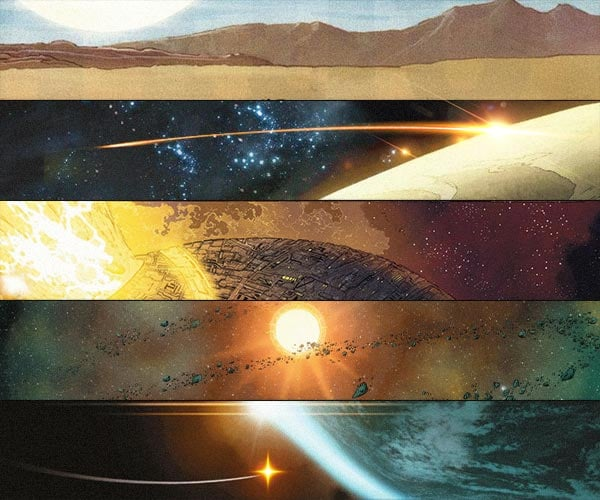
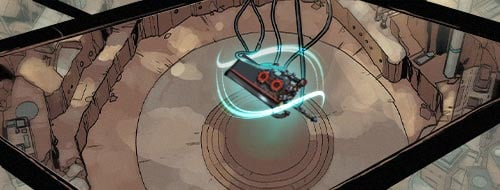
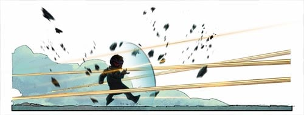
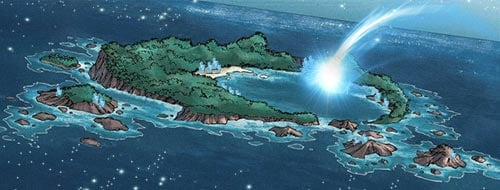

# 💫 Biography Cucho 💫
## Chapter 1

🪐**The First Galaxy: Capital Star**  
The Alliance controls most galactic regimes.  
Technology gives individuals unlimited freedom (physical liberation, uploading consciousness, duplication, transplantation and immortality)  
Mysterious Institution: The Garden of Eden  
🪐**The Second Galaxy: Chaos**  
This is the galaxy with the fastest developing technology, where machinery has taken over a big part of the labor force.  
Ferry War: Some people realize that sooner or later they will be replaced by those machines, so a war breaks out.  
🪐**The Fifth Galaxy: Mixed**  
Not bound by Star Alliance laws/regulations.  
It has the rarest minerals and the largest black market in the universe.  
🪐**The Seventh Galaxy: Banished**  
Star pirates occupy, are fighting the alliance.  
In order to fight against the powerful Alliance, a small group of anti-government forces are forced to form an alliance, with the seventh system as a stronghold.  
🪐**The Eighth Galaxy: Desert**  
Old Human Base  
Highest scientific Research Institution: Lighthouse  
Sticking to the human base, it is difficult to survive.  
Outside the base is the Abyss where genetically mutated creatures are rampant.  

## Chapter 2

**The Second Galaxy: Chaos**
This is the galaxy with the fastest developing technology, where machinery has taken over a big part of the labor force.  
As the most vital tool of production and companion to man, the robots play an increasingly important role in various fields.  
New various weapons are displayed on the wall of laboratories. The most eye-catching object hanging in the laboratory center is the Sword, which has a blue halo glowing around it.  
“Dr, Lang Ning, You...you should rest”, the sound of a stumbling robot came through the open door of the laboratory, its pronunciation was not very standard. Blogger laughs and turns back to look at the little robot hopping towards him.  
"Cucho, you’re here, come and try out my newly engineered helmet, it’s so strong it can protect your head from a comet!" He redirected the little robot to the Operating Panel, and put the helmet on it personally.  
”A c..c..comet, why would a comet hit my me on the head?”  
“Dr. Lang Ning, why did you not install a language system in it?” The assistant replied with a helpless look on his face.  
“Tang Ning, nothing is born with the ability to speak.” The doctor reached out his hand, patted the girl on her head and smiled at her.  
Cucho was at the mercy of the Doctor, he looked at the Sword on the wall and asked, “Doctor, can I now take the gift that you gave me?”  
“No, it would fuse with you! Wait til you’re older and more powerful, then you can take it.“  

## Chapter 3

Ephemeris 537  
Some of the Star People are now worshiping those “Conscious Robots”, but the other group of people gradually started realizing that if this continues the way it does, the robots will replace us humans, and thus War had broken out between these two faculties.  
Santo City  
“Traitor, get out of Santo!”  
“Santo does not permit entry to robots. Go back to where you came from!” The people dressed in back cloaks charged at the small figure attacking with their guns, but these didn't hurt him.  
Cucho didn't fight back, he just walked in one direction.  
Rain poured over the cemetery, here is where all those who perished in the War are buried.  
“You shouldn’t be here.” Tang carried a bouquet of white flowers, her complexion was pale and her eyes were unusually sharp.  
Cucho came up to the tombstone, looking at the black and white photo he smiled and said, “I know I shouldn’t be here. I just came to take my Sword.”  
“You! After everything the Doctor did for you? But after all, you are a robot. What could you understand of it?“  
Cucho stopped, “Hahah, It’s true, I really don’t understand you humans, and since you won’t tell me, I have no choice but to find it myself.” After saying that, he was about to turn around and walk away.  
“It’s not in Santo anymore, it’s not even in “Chaos”, during the war the laboratory was plundered, the thieves took advantage of the chaos and escaped the “Mixed”. Tang’s voice was coming from behind.  
“Tang, thank you.“  
“I will never forgive you.“  
“You don’t have to forgive me, ever.“  

## Chapter 4

“Santo will never be the same as before. Are you sure you still want to defend it?“  
Cucho stood upon a roached ground, this wasteland upon which he stood was his birthplace - The Santo City Laboratory, after the war all machines were destroyed by the people who feared intelligent robots.  
“They’re all just a bunch of Allied dogs.”  

----------------------------------------------  
“A Transitioning Wormhole was discovered up ahead, stability is at 20%, safety level 2. Confirm to transition?”  
“Confirm”  
“Warning, safety level is too low. Confirm to transition?“  
“Confirm”  

----------------------------------------------  
When Cucho awoke he realized he that he had fallen into a crack, his ship was in complete ruins, but his own external armor had only suffered minor scratches.  
Crystal clear rocks filled the shores of the lake, including the distant cave mines, where huge machines would mine them. They employed a special type of equipment to absorb the power of the crystals.  
“This is Kyanite, this is the rarest mineral in the Mixed.” He picked up a crystal from the fallen debris to feel its power.  
“I will at all costs take back what is mine.“  

