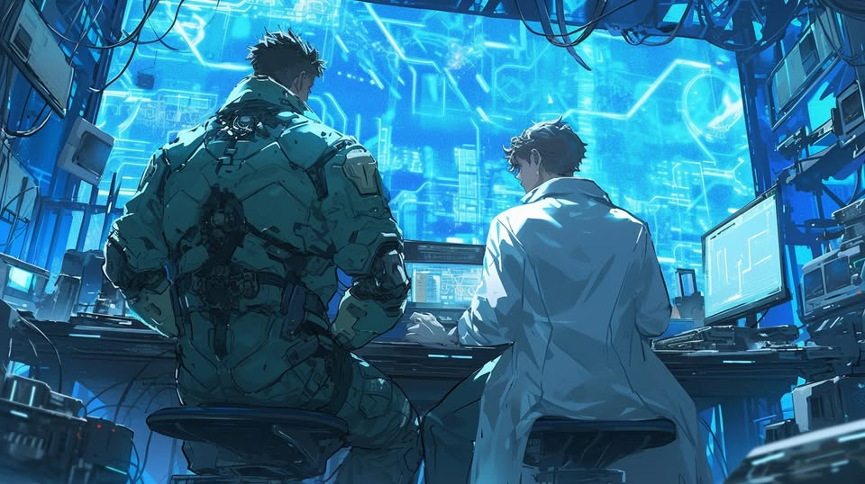
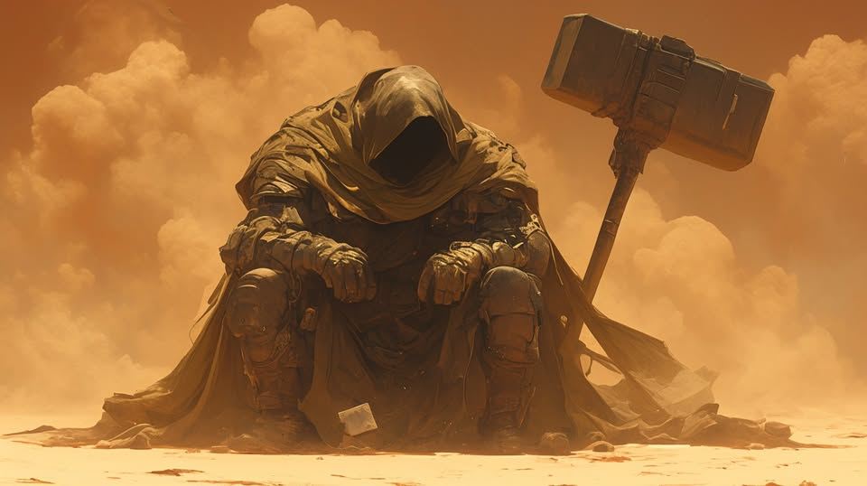
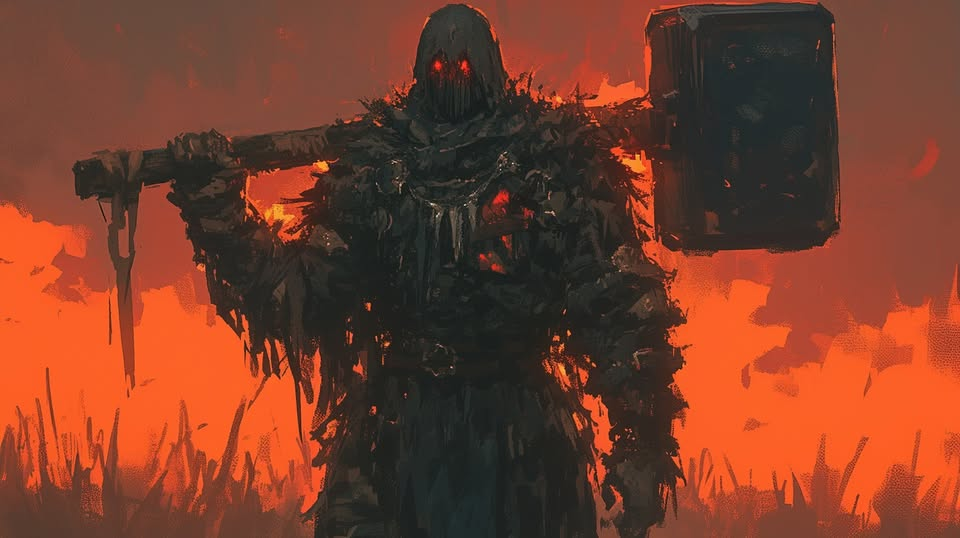

# 🟣 Biography D 🟣
## Chapter 1

At The Supreme Court of the Human Alliance
The courtroom was filled with audiences, and the media cameras had already been calibrated, waiting to record the highly anticipated final trial of the monopoly case. As the court clerk stood up to read the court rules, the old judge finally struck the gavel, and the side door opened. Accompanied by several fully armed soldiers, Ms. A entered the room at leisure. On the plaintiff's seat, the lawyer arose, activated the prompter on his prosthetic eye, and began to speak:
"Respected judge, jury, and esteemed audience:
I would like to express my gratitude to all righteous individuals for their attention and support. On behalf of the Genesis Corporation, the Gemstone Association, the Serious Science Society, the NORN Group, the Free Wings Biotech Trading Company, and other organizations and entities, I will now state the details of the Aurora Order's monopoly on synthetic body material and processing technology. I will also present relevant evidence. I believe with all the details presented, every distinguished audience present will make a fair judgment.
...
On Shallows of the Shan-hai Universe
"Excuse me. Coming through." A burly man casually pushed aside the gangsters crowded at the entrance of the Aurora Order's headquarters. Stumbled by the push, a gangster fell on the ground and quickly pulled out a weapon, cursing under his breath, "Damn you bas..." But just in a glance, he recognized the face, and his tone swiftly changed, "What a windy day! It almost blew me away." In the meantime, his gaze shifted to his companions behind the burly man, silently signaling something. Eventually, the door-blocking gangsters were blown away by the 'wind', and the young man inside finally opened the door and stepped forward.“
"There you are! These 'flies' are so annoying. Unfortunately, we can't deal with them at this point. Otherwise, they would have been lying on my dissecting table, like before." This young man with a pale face complained.

## Chapter 2

"Next, the defendant may make their statement," said the judge.
Ms. A nodded to the judge and rose from her seat.
"I have only one thing to say. The Aurora Order has never, and will never, resort to any means to suppress competition. On the contrary, our goal is to help, to spread wisdom and abundance. Those who fear competition, well, they are not us."
Ms. A glanced around the room until everyone was intimidated by her vibe. Then she gracefully sat down, pulling out a gold coin and fiddling with it.
On an Unknown Stealth Transport Plane
"Bang!"
The sound of engines and rushing wind couldn't drown out the noise of the man below swinging a hammer to smash the sand. The heavily armed person on the transport plane watched in cold sweat as the sand rose into the air. After a long while, the sound finally settled. The sand showered down, gradually revealing a figure sitting on a crystal, eating snacks. Alone, since he had already stuffed his opponent into a container.
"Eagle Eye, report, over." commanded the captain.
"Eagle Eye reporting. The target has three major injuries. Sternum broken, the left shoulder bone shattered, the abdomen pierced and still bleeding. Very likely poisoned. The remote measurements indicate erratic heart rate, over."
The captain was apparently shocked and blanked out for several seconds until he noticed the target calmly injecting himself with medication as if he had never been severely injured.
"The person below is severely injured, we are having the upper hand. All units, on my command, execute Plan C!"
Ten minutes later, the captain watched as the man in front of him raised his hands in surrender. As he got the instructions from his earpiece, he signaled for his subordinates to take the man away.
In Aurora Order Stronghold Lab
"Dr. Hofstadter, I've brought you the materials you requested. I hope you can demonstrate the Aurora Order's cyberware production technology here," said the captain, showing him the container containing the Han Ba, along with the barely conscious D. Clearly, the Aurora Order's stronghold had already been breached. The pale-faced young doctor looked at D and made a decision in his mind.
"Of course. Help me get the big guy onto the dissecting table, and give me a quiet environment. I'll be ready to start right away," replied Dr. Hofstadter.
The captain nodded as he listened to new instructions in his earpiece, then left. Before leaving, he took a glance at D to make sure it lay motionless and breathed a sigh of relief.
The door was closed. Dr. H quickly grabbed a dozen vials from the cabinet and arrayed them on the sterile bench. Turning back, he extracted a small portion of Han Ba's blood, dripping it into each vial before inserting all vials into the nearby apparatus. Then, he retrieved a tube from under the dissecting table, one end inserted into D's vein, the other into the Han Ba's. As the nearby machine stopped, he removed all the vials and injected their contents into D's body. Taking a short break, he looked at D, held his tears, and covered D's eyes with a cloth.
Now's the official work. He opened D's chest, removed his heart, and carried the warm organ to the cyberware workshop for pre-processing. Returning with a portable toolbox, he stood at the dissecting table, activated the pedal, and watched as the mixed blood of D and the Han Ba flowed into a large metal container below the table. Next, he took the pre-processed heart from the mechanical arm, sat down, started the timer, and quietly began sculpting the heart prosthesis.

## Chapter 3

The captain quietly stubbed out his cigarette, staring at Dr. D on the monitor, suddenly feeling something unusual. He walked to another monitor from a frontal angle, signaling for zooming in. He saw Dr. H holding a pink heart covered in disordered green lines, with half of its ventricle replaced by a highly flexible metallic material, emitting a faint red glow once powered, indicating it is an exceptionally high-quality prosthetic. "Everything is going smoothly," he thought to himself. He turned around, lit another cigarette, and took a deep drag, suddenly thinking of something. He shoved aside Eagle Eye and personally adjusted the camera angle, focusing on D. Having seen countless corpses, he knew a corpse couldn't decompose like this in such a short time—it looked exactly like a zombie. A zombie, that Drought Omen!
"Eagle Eye's team, stay here. Others, one minute to suit up. Move, move!"
H calmly placed the heart back into D's chest, carefully stitching it up and finally securing a special panel over the chest. Watching the panel light up in red, feeling the heartbeat again, H softly said, "I'm gonna go buy you some time."
With that, he removed his lab coat, retrieved a button from D's loosened hand, pressed it, then casually tossed it aside, walking towards the door blasted open.
At The Supreme Court of the Human Alliance
A, who was on the verge of falling asleep, suddenly noticed her phone lighting up. Her expression turned increasingly serious. She tapped the table with gold coin, interrupting the opposing lawyer's impassioned speech.
"Let me put an end to today's debate. Consortium under Aurora Order's name will cease all profit-driven sales of any products immediately."
She paused for a moment, then turned to look at the smiling CEO of Genesis Group sitting in the audience, staring at him intently as she continued,
"We have just announced the release of crucial patents, including those for Aurora Order's cyberware workshop and Spacetime Amber extraction technology. From now on, the Aurora Order will transform into a nonprofit organization, dedicated to upholding the dissemination of knowledge and the enrichment of civilization, at any cost. May the Moon Presence bear witness!"
As a conclusion, she tapped the coin on the table once more.
"Bang!"
The captain raised his shield to block D's hammer strike, but in just one strike, his newly acquired prosthetic arm lost sensation. Even worse, his metal knee, now kneeling on the ground, was severely deformed, making him have to keep a semi-kneeling posture facing D, who was advancing with a large container of blood on his back. However, D didn't even spare him a glance as he strode past. The captain wanted to command the remote team to give fire support, but watching D taking low-temperature rounds, incendiary bombs, and armor-piercing rounds without any intention of slowing down, he felt utterly powerless.
The temporary retreat of the giant gave rise to many illusions, but in reality, no one could stop its advance. D razed all Genesis Group strongholds on the Shan-hai universe. Simultaneously, all members of the Aurora Order in Galaxy-flats began a fierce counterattack, igniting their fury across the land and spreading their knowledge throughout the beach. It's time for more new legends.

