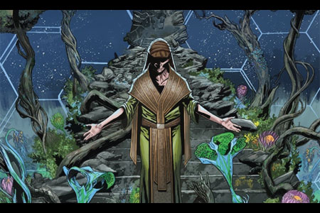
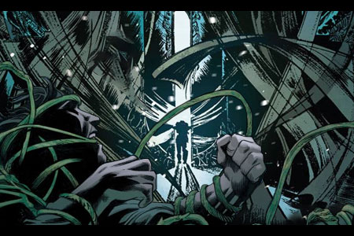
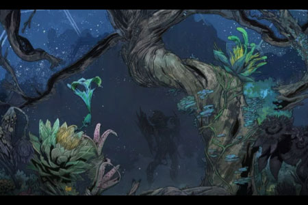

# 🥀 Biography Dryades 🥀
## Chapter 1: Sprouting

When dawn mist lingered among the Emerald Forest, 17-year-old Dryades was setting off, walking through the damp undergrowth, wicker basket slung over her shoulder. She crushed luminescent mushrooms with her fingers, their purple juices staining her nails. This should have become the 7th poisonous fungi samples for the Alchemists’ Guild—until her brother's screams were heard.
The crash of metal vessel shattered the forest's tranquility. Bursting into the cabin, Dryades froze at the sight: her brother's right hand was grotesquely changing, pale vines erupting violently from between his fingers, coiling around his neck like a creature. Nearby, an alchemist was calmly taking notes. “Subject G-07 exhibits rejection symptoms,” he muttered. “Consider increasing dosage of vine extract…”
The massacre that followed was a mushroom-triggered nightmare. 327 mutated villagers howled in agony, their flesh rupturing into carnivorous blossoms lined with crimson fangs. Dryades huddled beneath her brother's mutated remains, feeling invasive tendrils slithering beneath her skin. When the hunters' torches illuminated her hiding place, she suddenly felt she could understand the whispers of vines.
“Run to the altar,” the vines set up a glowing trails for her, and thorny barriers parting automatically. Her eyes, now compound eyes, pierced through darkness, seeing the corrupted black blood coursing inside each pursuer. When the first guard grabbed her ankle, she instinctively raised her hand, unleashing a lethal spike from her fingertips straight into his heart.
The druid altar before dawn was covered with moss, and the dark red liquid seeping from the stone cracks reflected the starry sky. Dryades placed her hands, stained with poisonous blood, on the center of the altar, and the ancient vine suddenly sprang up and pierced her wrist. In the excruciating pain, she saw leaf veins emerging under her skin, and heard the heartbeat of the entire forest gradually synchronized with hers.

## Chapter 2: Thorns

Wood burnt into blue sparks within the campfire as Dryades studied the fresh poison spikes emerging from her palm. It was her third year living alone in the Emerald Forest, and finally, the invasive vines crawling within her bones had ceased growing—or perhaps they had settled into a dangerous balance with her body.
The alchemist she had hunted the night before lay not far away, his corpse visibly consumed by vibrant creeping vines. Dryades reached out with her vine-wrapped left hand, gently touching the bloody hole on his forehead. Violet vines popped out from the wound, transforming the body into a bush. This was her latest inspired skill—“Withering Bloom”—far more elegant and lethal than mere neurotoxins.
A rustling from the trees interrupted her thoughts as twelve silver-armored hunters descended under moonlight. Dryades chuckled softly; these fools never learned. She leaned backward, allowing herself to fall gracefully into the bed of rotting leaves, dissolving into countless drifting tendrils upon landing. The soldiers' cries instantly became choking coughs as luminous vines rooted themselves deep into their lungs.
When the last survivor stumbled into a poison oak tree, Dryades rose slowly from his shadow. The symbiotic vines wrapping around his neck reminded her of the rainy night she first strangled a pursuer, back when she could barely control the wild growth of her deadly thorns. Now she precisely injected paralytic toxins into the victim's sixth vertebra, ensuring he remained aware while his organs were slowly devoured by her vines.
As dawn broke, Dryades carefully cleaned freshly collected sap from arrow-poison trees. The symbiosis granted her a heightened sense, allowing her to detect hoofbeats crushing twigs nearly two miles away—another scouting party from the damned Alchemists' Guild. She meticulously coated her vine tips with poison, emerald eyes flickering with intricate patterns like streams of data. 24 people this time; perfect for testing her newly refined neuro-vines.

## Chapter 3: Withering

The sewers of the capital city emitted a familiar stench, but Dryades's vine network sensed something different. Her vines crawled slowly in the shadows, dripping scarlet venom. The sound of the cathedral bells echoed, vibrating the fluorescent juice in the symbiote to ripples —it was time to let those white-robed scholars witness the true art of life.
As she appeared through the cracked altar stones, the agonized cries of the 12 guards lingered the cathedral. Parasitic vines burst violently inside their veins, carnivorous flowers forcing their way through gaps in armor. Dryades calmly walked across her lush carpet of crimson vines toward the central lab, thorns behind her sliced reinforcements into fragments.
"Stop!" pleaded the chief alchemist, his voice trembling absurdly. "Do you realize what masterpiece you're destroying?" Behind him, distorted creatures floated in glass jars—half-human faces melded grotesquely into flesh, vine-like nerves drifting in formaldehyde.
Dryades flipped open the research log with a flick of her vines. She couldn't help but noticed her brother's code, which stung her lost humanity for a moment. Suddenly, her symbiotic vines convulsed violently, shattering every specimen tank. Countless tendrils exploded into green fog mingled with chemical fumes. Dryades stepped from the fog, skin all patterned in leaf-veins, fluorescent venom dripping from her hair.
"This," she uttered softly, pinning the chief alchemist firmly onto the operating table, vines surging ruthlessly into his brain, "is true perfection. Let's share this joy of evolution together." His screams quickly turned into wet gurgles as the vines contracted abruptly, devouring every trace of the laboratory’s evil legacy.

