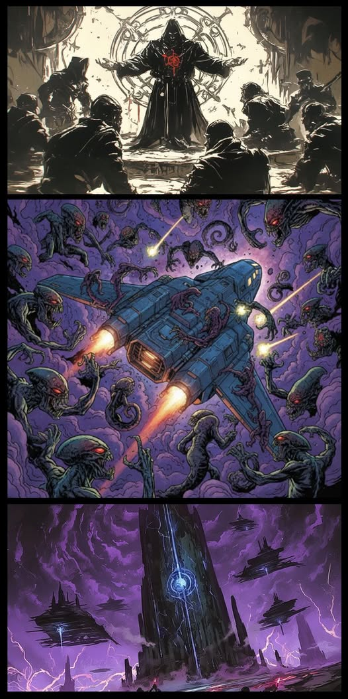
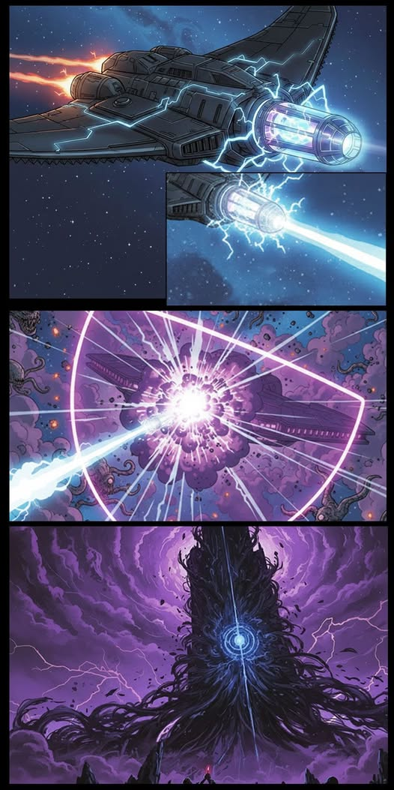
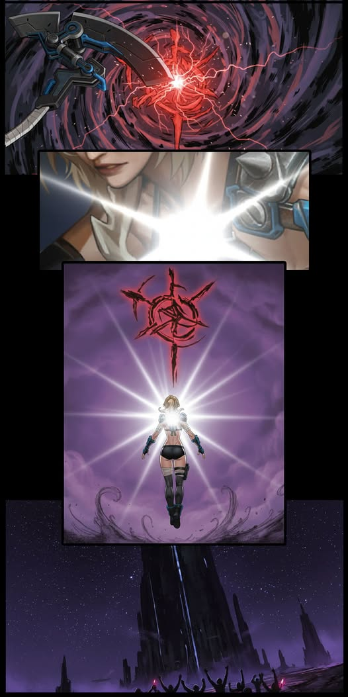

# 🦈 Biography Elena Ko 🦈
## Chapter 1

In the lightless depths of the Skeleton Sea galaxy, the Sharp Shark fleet cut through the interstellar currents like metallic fangs. Energy conduits coiled around the hulls glimmered with a cold blue sheen, a jarring contrast to the deathly silence of the deep sea.  
Elena Ko stood at the center of the bridge aboard the flagship Star Devourer. Her left eye, a mechanical prosthetic, flickered softly as it projected navigational data directly onto her retina. This was her eighth Stellar Core Energy transport mission for the Eternal Silence Consortium.  
The fleet's course quietly passed through the Starweave Coral Expanse. One of the planets here had once been Elena's childhood sanctuary, a holy world that bloomed under stellar radiance. Now, only vast stretches of withered remains lingered. The seas were saturated with dusky-purple Void Miasma, exuding a nauseating reek of decay.   
Her mechanical eye locked onto swarms of hideous deep-sea aberrations: twisted creatures with multi-jointed tentacles and skin riddled with irregular bioluminescent pustules. From their maws came low, inhuman frequencies as they hurled themselves madly against coral reefs. The suction cups on their tentacles were strong enough to tear metal apart.   
Instinctively, Elena brushed the skin beneath her uniform at her chest. A tiny totem hidden there pulsed with a faint, almost imperceptible warmth. The massive scythe hanging from a hook along the bridge wall responded in kind. The arcane patterns etched into its blade flickered with a thread of pale gold light, vanishing in an instant.  
“Commander,” the vice-captain reported, his voice trembling. The gears in his mechanical arm whined softly with tension. “The energy fluctuations in the cargo hold are resonating with those aberrations. Stability is dropping. This place… our home… could it be connected to the Consortium's energy extraction?”  
Elena's fingers clenched, nails biting into her palm. Memories surged like a rising tide. As a child, she had questioned the absurdity of blind Stellar Worship. For that, the conservative faction of the Deepsea Holy Descendants branded her a heretic and cast her out. The elders' furious condemnation, the hostility of her own kin, the moment she was thrown from the habitat pod into the freezing void—those scars had never healed.  
At that moment, her private communicator crackled to life. A heavily encrypted signal came through, laced with desperate sobbing. “The starweave is dying… The outsiders are draining the star itself…” It was Ellen. The pull between memory and homeland tore violently at Elena's heart. The glow of her mechanical eye flickered erratically. At last, she bit down and keyed the channel shut, her voice hard as iron. “Mission first. That's not our concern. Inspect the cargo.”  
As Elena turned away, she whispered to her terminal, "It's not that I won't look back. You never gave me a reason to." Yet the hesitation in her eyes betrayed her.  
Elena hadn't gone far when disaster struck without warning. The energy seal on the transport bay ruptured. Pure stellar core energy erupted like a geyser, instantly engulfed by dusky-purple Void Miasma and transformed into a violently corrosive torrent. Like a beacon in the darkness, the surge drew in aberrant creatures in numbers several times greater than before. They swarmed the fleet, tentacles slamming against the shields with shrill metallic screeches.   
At the instant of the breach, the totem at Elena's chest flared with searing heat, forming a faint, spontaneous halo that shielded her and nearby crew from a shard of corrosive debris. Her heart skipped, but there was no time to dwell on it.  
The energy leak had triggered the Eternal Silence Consortium's pre-installed Purge Protocol. Near three Stellar Core Extraction Towers in the distance, escort warships immediately locked onto the Star Devourer. Their main cannons charged, radiant and blinding in the abyssal dark. To them, the flagship was now nothing more than a “runaway transport” to be erased.  
Caught between enemies front and rear, Elena did not hesitate. She seized the bridge controls and forcibly altered the fleet's trajectory. “All hands! Hard turn to Starweave Coral Expanse now!” The fleet burst through the encirclement of aberrations, weaving through drifting planetary debris for cover, and forced its way into what had once been a sacred land.  
The corals that once shone with stellar brilliance were now completely smothered by Void Miasma. The Stellar Prayer Stele she used to climb as a child stood corroded, the totems of the Deepsea Holy Descendants being eaten away by dark energy. Thick, blood-like fluid seeped from the stele's cracks, accompanied by faint whispers that seemed to leak from the void itself. Farther ahead, colossal Stellar Core Extraction Towers of the Eternal Silence Consortium pierced the protective barrier of the core zone of the deep sea.  
Below, AAA priests in grotesque rune-carved robes encircled a massive rune circle, perverting stellar energy into void-tainted power for the Void Anchor Device rooted to the ground. Nearby cages held dozens of conservative Deepsea Holy Descendants, bound by energy chains. The stellar totems on their chests were dimming, a sign of life being siphoned away.  
Ellen's encrypted signal came again, this time breaking under the strain of despair, “Elena… they're going to destroy everything… hurry—” The transmission cut off.  
Standing on her homeland at last, Elena faced the lingering bond she'd never truly severed. With one hand, she raised her massive mechanical scythe high, the energy along its blade blazing to life. "All guns, full barrage! Target the escort warships. Let's do something big!"  
Resolve flashed in her mechanical eye. The cannons of the Sharp Shark fleet roared in unison, and battle erupted between them and the warships of the Eternal Silence Consortium.  

## Chapter 2

Within the Starweave Coral Expanse, searing energy flames intertwined with Void Miasma, forming a lethal kill zone. Though the Sharp Shark fleet knew the terrain of the deep sea intimately and excelled at guerrilla tactics, they remained outgunned by the Eternal Silence Consortium's heavy warships. The Star Devourer's shields failed fast. Cannon fire breached the hull, rupturing conduits that spewed electrical arcs and hissing sparks.  
"Commander, shields at 30%! Enemy heavies are regenerating!" a crew member shouted over comms, voice cracking with panic.  
Elena's gaze swept the battlefield, ice-cold. "Modified Eddy Torpedoes—now! Vortices to shred their formation. Shark Drones on energy cores and repairs!"  
At her command, Sharp Shark escorts unleashed their torpedoes. Massive spatial vortices erupted across the battlefield, trapping two Eternal Silence Consortium warships and crippling their maneuverability.  
Just as the battle reached its fiercest, the IFOB stealth recon ship Phantom Shadow decloaked slowly. Inside its bridge, Moana manipulated the scanning arrays, her voice steady as data streamed in. “Detecting a colossal aberrant signature ahead. Fleet identifiers confirmed: Eternal Silence Consortium transport and escort warships.”  
Beside her, Every's eyes lit up. He slammed the weapon activation switch without hesitation. “Target acquired. Charge particle cannon. Prepare to fire!”  
The Phantom Shadow's particle cannon began to charge, its blinding blue glow locking directly onto the Star Devourer. Elena's mechanical eye instantly registered the lethal energy spike. Her heart lurched. “Particle cannon! Full barriers, now!” At the same time, she instinctively raised her massive scythe before her. The patterns along its blade flared violently, expanding into a dense energy shield that overlapped with the ship's defensive barrier.  
The particle beam struck the Star Devourer from the flank. The ship's energy reserves plunged to zero in an instant. Yet the blast also obliterated the aberrations surrounding the vessel. The layered barriers absorbed most of the impact, sparing the ship from total disintegration. Elena felt the totem at her chest surge with unbearable heat, as though it were consuming and assimilating the residual energy of the particle strike.  
Meanwhile, aboard the IFOB stealth ship, Moana noticed something unusual: “This transport isn't a colossal aberration. It's just surrounded by them." She zoomed in on the scan feed.  
Every's brow furrowed. "If friend or foe is unclear, then we go public. Request communications.” Moana's fingers flew across the console as she transmitted to the Star Devourer and its escorts. "This is IFOB. Cease fire immediately. Shut down barriers and prepare for inspection.”  
Elena stared at the incoming message, suspicion gnawing at her. But time allowed no hesitation. "Pull back. Create distance from the escorts. Signal IFOB—we'll hold position for their personnel."  
As communications with IFOB were underway, chaos erupted anew. The support ships of Deepsea Holy Descendants arrived without warning. Their main guns roared indiscriminately, hammering Eternal Silence Consortium warships, Sharp Shark fleet, and IFOB forces alike. The Phantom Shadow, drained of power, lost its barriers and took a direct hit through the hull. The Consortium escorts fared worse: under focused fire, one vaporized completely.  
Elena gazed at the familiar stellar totems emblazoned on the newcomers' hulls. Turmoil churned within her. She closed her eyes, drew a slow breath, then opened them again. Fatigue edged her voice when she spoke. "Rapid repairs. Defensive formation. Activate backup power from the cargo hold. Then team to me, move cargo out, abandon the hold.”  
The chaotic three-way standoff created the perfect opening for the Eternal Silence Consortium and the AAA farther behind the lines. The output of the Stellar Core Extraction Towers spiked by 50%. Dark energy surged forth like a tide, thickening the Void Miasma throughout the Starweave Coral Expanse. The whispers of the void grew clearer, closer, and more insistent.  

## Chapter 3

Amid attacks from front and rear, Elena's mechanical eye locked onto a sight that struck her to the core. Several young warriors of the Deepsea Holy Descendants, grievously wounded and drenched in blood, were still charging toward the Stellar Core Extraction Tower. Their goal stood clear: obliterate the Void Anchor Device beneath, no matter the cost. One of them was struck directly by void energy. Most of his body corroded away in an instant. Yet with his final strength, he hurled a stellar crystal into the rune circle. The crystal detonated, releasing a burst of pure energy that briefly tore open a pocket of clarity within the suffocating Void Miasma.  
For the first time, Elena wavered. She'd always seen the conservatives as obstinate isolationists who rejected all outsiders. Only now did she realize their hostility stemmed from fierce devotion to their homeland. Like her, they could not bear to watch the Starweave Coral Expanse be destroyed.  
At that moment, the stellar totem upon her chest continued to radiate heat. Elena had long regarded it as a mere instinct of bloodline, never realizing that this untainted totem had been quietly absorbing scattered stellar energy all along, forging a hidden bond with the core power of her homeland.  
“I can't wait any longer,” Elena decided.  
Elena seized the moment and piloted a small fighter straight into the Deepsea Holy Descendants' formation. Once the fighter landed, she stepped out, pulled open the fabric over her chest, and revealed the uncorrupted totem burned into her flesh. It was carved there in secret by her mother on the day of her exile, serving as a symbol of the bloodline bond she could never sever from the Deepsea Holy Descendants.  
"I'm not here for your approval," Elena said, her voice calm but unyielding, sincerity burning in her eyes. "My grievances and anger mean nothing against what's happening now. If the extraction tower cannot be shut down, nothing here will survive."  
The leader of the Deepsea Holy Descendants, white-haired with a cracked chest totem, stared at the Void Miasma devouring the core zone. Hostility faded from his eyes, replaced by guilt and iron resolve. "You're right," he said. "When survival's at stake, rules mean nothing." He glanced at Elena, then the IFOB members on comms, and finally agreed to the alliance.  
The three-way coalition was forged instantly. Elena immediately laid out the battle plan: “Sharp Shark, harass outer escorts with speed and terrain, block reinforcements. IFOB with me, breach the extraction tower, crack the rune circle's energy nodes, destroy the Void Anchor Device. Holy Descendants, restore the core zone barriers with stellar energy against the aberrations. Target AAA priests with stellar blasts. Your power counters the void.” Moana and Every nodded in agreement. The leader of the Deepsea Holy Descendants ordered full execution of the plan. All three forces swiftly moved into their combat positions.  
The final battle began. Every entered his Unrestricted State at once, charging forward at full speed. Moana's shields allowed him to advance without hesitation, while Elena and an elite squad of Holy Descendants provided cover, carving paths through the Void Miasma.  
Once inside the extraction tower's range, Every and Moana quickly located the rune circle's energy nodes using detectors designed by Mikaela. Every shattered the protective casings with his mechanical arm, while Moana manipulated her observation eye to decrypt the energy codes. “Decryption complete. Preparing to detonate the nodes!” Moana triggered the explosion. The rune circle's energy nodes erupted at once, sending black void energy surging out of control. The priests' chants broke off mid-syllable as they were swallowed by the rampaging energy. Cut off from its power source, the Void Anchor Device began to collapse.  
Right then, the unleashed energy and ancient runes resonated with terrifying intensity. Elena was the first to react. She rushed toward the runes without hesitation, her scythe carving a seven-colored arc through the darkness like a rainbow. Yet the resonance did not cease. For a single instant, it felt as though the entire planet was being observed by a gaze beyond dimensions. Then, countless blurred runes manifested across the surface. Under their influence, the planet itself seemed to awaken as a living being. Massive aberrant tentacles erupted, striking at every form of life in reach.  
Elena was drawn into the resonance. She could neither advance nor retreat. Her scythe was bound to the runes, her consciousness locked onto the runes, unable to attend to anything else. Within the black torrent of void energy, her totem became the only source of light, like a star illuminating the entire Skeleton Sea galaxy.  
That light spread outward, igniting one holy descendant after another, without visible end. Together, they began to wrest control of their homeland from the runes. Those with impure hearts, upon encountering the runes, were overwhelmed by chaotic thoughts. Blood surged to their heads, and they burst into crimson blossoms. Those driven by curiosity glimpsed endless secrets within the runes. Their minds were consumed, and they withered into lifeless husks. Those fanatical in faith seemed to behold the gods themselves and, unable to restrain themselves, offered their lives to the heavens. Their lives were taken by the runes, or perhaps, they seized the runes in return. Across the planet, runes belonging to humanity grew ever more numerous, while those belonging to the planet itself faded.  
At last, the light blooming from the holy descendants flowed back into Elena. A seven-colored halo enveloped them all, fortifying the defenders and empowering the slayers.  
At that precise moment, Moana seemed to understand without words. She removed the bracelet given by Wolfsbane and hurled it toward Elena. In the darkness, Starshine flared once more. Arcane and Abundance energies surged forth, joining the grand resonance. Starshine and Elena's halo together began to suppress the runes.  
Before long, Elena felt she could finally move again. From the void, sharks wreathed in curses surged forth one after another, tearing through AAA cultists and consortium troops alike. The AAA cultists never received a second glance from that transcendent gaze, and with that, the battle's outcome was sealed.  
After hours of brutal combat, the Eternal Silence Consortium's escort fleets lay shattered and defeated. Stellar Core Extraction Towers powered down one by one. The Void Anchor Device crumbled to ruin. The choking Void Miasma over the Starweave Coral Expanse finally lifted, allowing stellar light to pierce the depths once more and reviving faint glimmers of life amid the withered coral. The core zone's stellar energy began its slow restoration. Totems on the Stellar Prayer Stele halted their erosion, cracks no longer weeping viscous ooze.  

