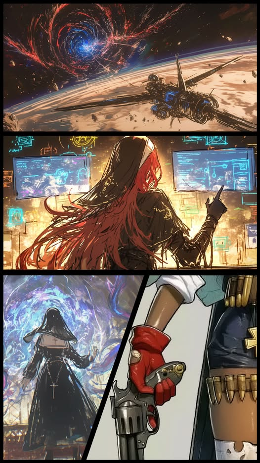
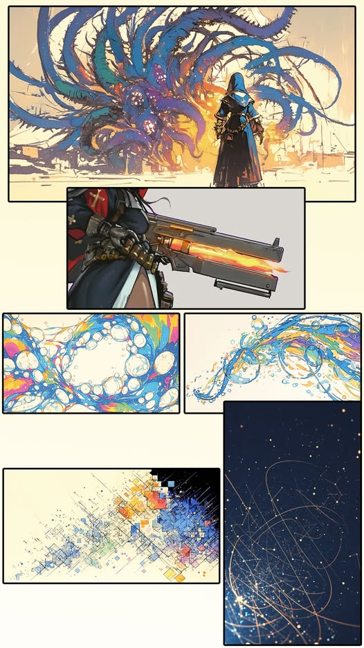
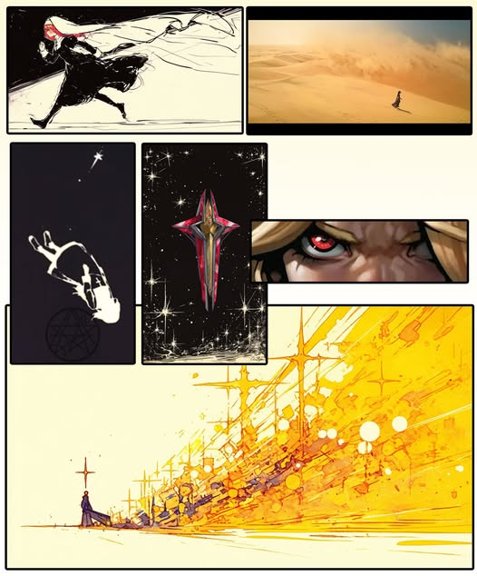

# ✝️ Biography Ella ✝️
## Chapter 1

The Ribbon Station orbited steadily along the NO.XIVI ring, its silver-gray hull tracing faint arcs through the deep void. It was a joint route between IFOB and the Corporations, a designated “safe island” drifting beyond all inhabited worlds where high-risk experiments unfolded beyond public sight.
Far in the distance, a vortex of black and crimson churned, scattering prismatic light like fractured crystals across the cosmic shallows. Bathed in this radiance, the Ribbon’s surface scales pulsed in a steady rhythm, opening and closing every three seconds. The absorbed light flowed through the seams like the faint breath of a slumbering leviathan. Forged with the Shan-hai Universe's latest bionic technology, the station drifted unseen through the cosmos, a transparent phantom beyond all physical detection.
Without warning, the space above the station fractured into a honeycomb lattice. From within, a cruciform ship burst forth, trailed by pale-blue warp residue that quickly faded into silence. The ship halted precisely over the Ribbon’s docking port. A metallic arm extended, and the coupling ring moved into position, its clicks muted by the vacuum.
“Docking unresponsive. Retrying in 10 seconds…” the ship’s AI intoned.
“Abort connection. Expedition Monastery on standby.” Chessia’s voice was calm and cold. Her fingers danced as she bound the bandage soaked in silver-lined reagent around her forearm. The chain clasped in place with a sharp, metallic click. “Contact Gilbert. Begin live feed. Prepare to board.”
As Chessia turned toward the rear of the ship, the blonde nun, Ella, was already waiting by the hatch. The mechanical arm behind her held the Sacred Scythe and the Ender’s Coffin in solemn poise. Her gloved fingers brushed along each exorcist bullet at her belt, the metal shells tapping a quiet, deliberate rhythm.
When they reached the docking chamber, both froze. The ship had already connected to the Ribbon. The hatch seal shimmered with a faint green glow, as if the earlier “unresponsive” report had been a mirage. Meanwhile, in the IFOB command room, Gilbert and Lavinia watched the live feed, unaware of anything unusual.
Chessia stepped back half a pace. Ella understood without a word and raised her weapon. The blast that followed shattered the silence, turning the hatch into a warped mass of molten metal, drifting weightlessly in the airlock. Swarms of quadrotors poured out like a silver hive, flooding the Ribbon’s corridors.
Minutes later, a holographic projection flickered to life in the cabin. “Upper main hall: multiple unconscious personnel located. No visible injuries. No signs of the Ribbon Guard or research staff.” “Lower experiment zone: no abnormalities detected.”
The two nuns exchanged a glance and stepped into the docking corridor. The instant their boots touched the Ribbon’s hull, the live feed from the IFOB command room was drowned in prismatic light. Colors writhed across the display, coalescing into a vague silhouette before dissolving into nothing. The sudden brilliance went unnoticed, even by the ever-vigilant Lavinia, who instinctively averted her gaze from the unnatural glow.
Inside the station, Chessia commanded her nanomechs to lift the unconscious and transfer them to the ship. Ella advanced toward the lower deck but suddenly halted. The passage ahead glowed under surgical lamps, yet faint motes of color crept across her vision like living threads of light. She pressed a hand against the Casket of Solaris on her right thigh. The heat of the metal casing seeped through the fabric of her habit, but it could not still the tremor rising from instinctive dread.
From the maintenance shaft behind her came a sharp sizzle. The log box was being engulfed by a viscous stream of iridescent energy, twisting and corrupting the data flowing within. Suddenly, a translucent tendril shot out from the mass, crackling with fragmented electricity as it lashed toward the upper part of Ella's back, just behind the heart.

## Chapter 2

Chessia stared at the patient’s vitals, her brows furrowed deep. The green indicators on the screen traced a perfectly steady line: no toxins, no injuries, even the heartbeat stayed within range. Yet the very calmness of those readings was the deadliest sign of all.
No sign of intrusion, no system alarms. The entire station felt as if someone had pressed mute, leaving not a single survivor to speak. There was only one explanation: the experiment zone had gone rogue. And Ella was in danger!
Chessia let the nanomechs continue their automated transfer of the wounded, seized her weapon, and dashed down the corridor. Her boots hammered the metal floor in quick, sharp echoes.
On the lower deck, Ella rolled aside just as the exorcist pistol thundered. The large-caliber round struck the prismatic tendril. Then the data aberration shattered instantly into a rain of metallic shards, their faint clatter fading as the colored glow dispersed into darkness.
When she rose, the corridor behind her had already been devoured by darkness. Each aberration she destroyed plunged another section into silence, its lights extinguished. The lower deck’s data streams and power were now fully under their control. Such complete domination could mean only one thing: the source of the aberrations lay far beyond her clearance level. The missing scientists and guards were, in all likelihood, already gone.
Ella no longer hesitated. She released the Solaris from her thigh frame, the mechanical arm aligning precisely with the white casing. Gears whirred to life, and the cross-shaped luster receded like a withdrawing tide. The weapon unfolded layer by layer, its muzzle condensing a blinding white radiance. Her gaze was unwavering as she pulled the trigger toward the heart of the light ahead. Twisted beams crawled out of the void, writhing to entangle again, yet they froze and dissolved within the searing glow.
Ella pressed a hand against the overheated barrel, forcing her breath to steady. The corridor lay empty once more, save for a faint, pulsing shimmer in the dark ahead. She kept moving forward: Fire, Advance, Fire, Advance.
Tap. Tap. Tap. Drops of crimson blood slid from her nose and vanished into the shadows below.
Ella was out of ammo, but the battle was far from over. Her judgment weapon, Sanction, continued devouring every remaining trace of energy: the station's dying reserves, the aberrations' residual charge, her personal power cells, even her own bioenergy. The sector had already been stripped bare, and the only thing left for Sanction to consume was her. Even with Sanction gnawing at her very essence, her steps never wavered.

---
The Ender's Coffin in Chessia's hand cut through the darkness of the lower deck. Bathed in soft white light, she traced the streaks of crimson blood until she found Ella. The blonde nun slumped on the floor, Sanction held firmly in her arms. Nosebleed had stained the cross on her chest, and the lowered veil cast her face in shadow. Only the faint rhythm of her breathing proved she was still conscious. The lab door behind her gleamed with cold silver, and before her, the darkness extended into infinity.

## Chapter 3

The endless desert stretched in all directions, pale and silent. Ella walked forward, her eyes vacant. Wind and sand scraped against her habit, whispering like static. Here, time no longer moved. Her steps grew unsteady, every stride sinking deeper into the scorching dunes until the ground suddenly gave way. Cold sand engulfed her limbs, pressing in with suffocating weight, dragging her down into total black.
At the deepest point of the void, tangled lines shimmered and converged, forming a Starshine Sigil that revolved slowly in the emptiness.

---
Whilst on the other side, Chessia knelt beside Ella. The nutrient and energy fluids from her injector vanished the instant they touched Ella’s palm, consumed entirely by Sanction. Chessia frowned at the weapon—the etched lines along its metal casing still pulsed with faint light, proof that it was far from dormant. Her gaze shifted toward the sealed lab door behind Ella. She opened the Ender’s Coffin, letting its white energy flow into both Ella and Sanction. “Hold on,” she whispered.
A faint hum filled the silence as the coffin’s glow began to fade. What in the world was Ella fighting? So much energy, and it had only weakened the enemy. Darkness slowly recoiled beneath the dimming pale light, and the sterile gleam of the lab began to bleed through. Chessia was just about to close the coffin and ready herself for combat when the lab door clicked open on its own, releasing a surge of white light that swept through the corridor, blinding her until the world turned black and she fell to the floor.

---
Ella lay in darkness, right at the center of the Starshine Sigil. A choking thirst gripped her throat, her skin burning as if aflame. Then came a whisper, soft and broken, so close it brushed against her ear. “Eat it.”
The sigil’s lines wavered. Countless distorted “Ellas” flickered into being around her, one clutching a shattered Sanction, another drenched in blood. Each fell still upon the glowing lines, their faces serene, their eyes empty.
Just then Ella’s eyes snapped open. Blinding white light seared her vision as she instinctively reached for the cracked Sanction beside her and fired toward the lab. The surge of energy hung in the air for a heartbeat before tearing through every chromatic barrier, striking deep into the lab’s core.
Silent screams flared like bursts of color. Expressionless, Ella moved on, her weapon pulsing red with each command: Fire, Advance, Fire, Advance. When she reached the lab center, the muzzle met resistance like pressing against cotton. She pulled the trigger again and again. Fire, Fire, Fire……
Then, all light receded like a retreating tide. The Starshine Sigil in the void fractured with spiderweb cracks and burst into motes of fading light. Hands trembling, Ella drew out the Solaris and pressed it against Sanction’s fractured surface. In the corner of her eye, the fallen scientists and guards lay scattered beside the workbenches, unconscious.
Ella exhaled slowly and pressed the communicator, her voice hoarse and drained. “Monastery report... purification complete.”
A burst of static answered, then Gilbert’s weary voice followed. “Finally got through. Good work. Return immediately—no need to proceed to Hematite Planet. New orders are in place.”

