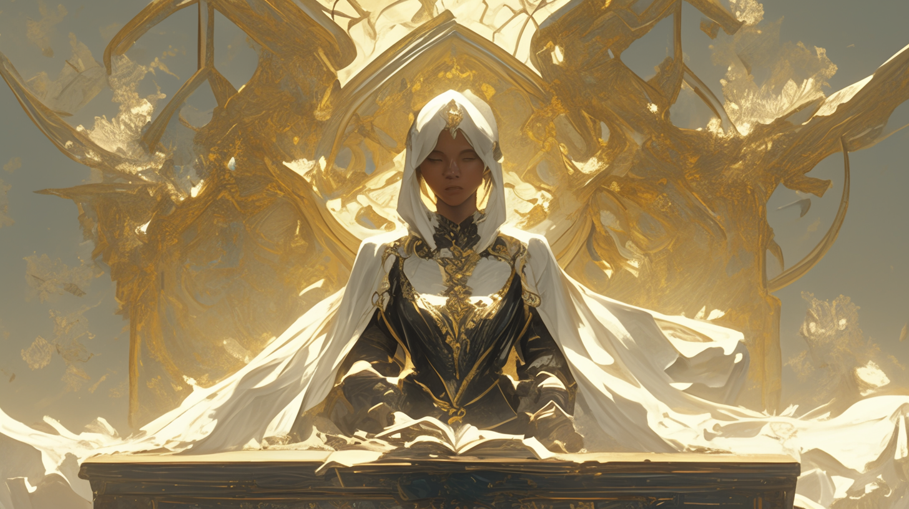
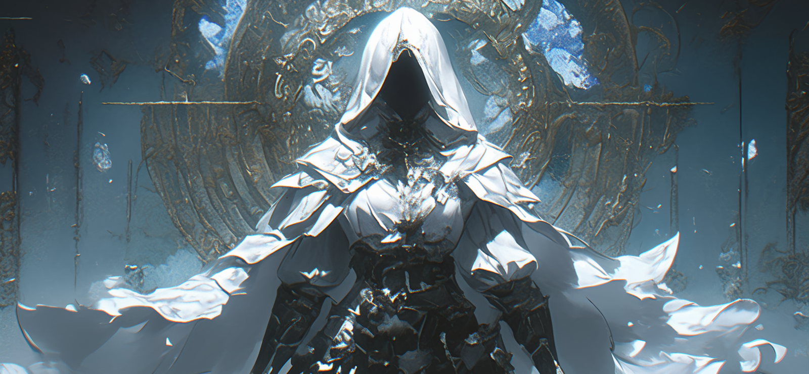
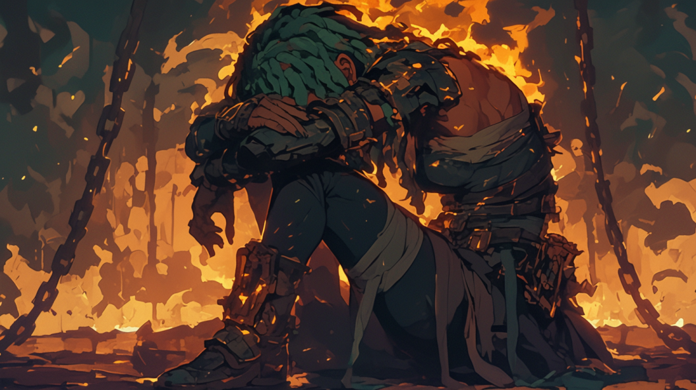

# 🗡️ Biography Enus 🗡️
## Chapter 1

IFOB Essence Research Institute
Lavinia opened the door that marked "\$".
“If you want space, I hope you take your helmet off soon as you get up to Venus and choke...”
\$age, freely rapping and rhythmically tapping the buttons, was modifying atomic structures on a holographic display. Hearing the door open, he turned and complained, “Yo, buddy, didn’t you see the ‘Do Not Disturb’ sign at the door?... Well, hey, Lav! What brings you here?”
Lavinia glanced at \$age and pulled a green crystalline substance the size of a football from her backpack, inside which was a giant red eye.
“A Saint from the Aurora Order thought he was clever and caused a huge mess. Now the entire vortex is filled with rage and the fetid stench of chaos. That presence didn’t intend to hide at all. It was easy for me to trace it to a shallow with no signs of stranding. It’s a resource planet from Genesis. I only brought back this thing; take a look.”
\$age’s expression grew serious. He activated his simulated universe field and placed the green crystal inside.
“No signs of stranding mean that an overwhelming external force directly consumed all possibilities of that planet; which is bad. As for this crystal, it contains pure, potent life force, resembling Dream Essence. If this formed naturally, the concentration of life force there must be terrifyingly high…”
“Hell yeah. It was suffocating. I could only stay there for half a day.”
“And only you could. This is a big deal. With IFOB in such chaos now, I need to turn to the Empyrean for help. At least they will…”
"At least we have consented to this arbitration, and this is the fairness we offer." A white-hair and dark-skin young female adjudicator looked down at the protesting shareholders of Genesis. Her voice carried an innate authority, and her cloak moved as she spoke, the sound of metal chains clinking from within.
"But look at the score, -34,576! We are dragged by down traitors in our faction. How can we possibly compete? You might as well directly declare us a loss! As one of the eight permanent members, we have the right to request a review of the arbitration rules!"
"I understand. The tribunal can agent this council meeting and initiate the process for amending the Charter..." The sound of chains intensified, yet the adjudicator remained expressionless.
"Haven't you got ears? We meant the rules of this arbitration, not the Charter amendment! Are you trying to play tricks on me? Don’t forget that it's because of Genesis that the Empyrean can exist!"
Hearing this, the adjudicator nodded and pulled an ancient tome from her cloak—"Chronicles of the Hunters," which documented the lives of the Empyrean demon hunters who sacrificed themselves to protect humanity. Clearly, she cherished this book, as she carefully took out a metal bookmark from within and placed it gently on the table before her. The bookmark activated the table, and a holographic display unfolded, playing combat footage from each ring along with detailed data. Some minutes passed, and the adjudicator returned the bookmark to its place, looking down at the discontented Genesis shareholder.
"Now, I declare the verdict is as follows:
According to precedent, any means are permissible in arbitration, except for the prohibitions outlined in Chapter Four of the Charter. In this arbitration, Genesis incited internal chaos within IFOB and hired the NORN Group to form a third-party faction first. Subsequently, the Aurora Order used Cyberware to win people over. Both actions are within the permissible means of the Charter. Therefore, the results remain unchanged.
According to Article 118 of Chapter Four of the Charter, the initiation of an arbitration rule modification by a permanent member requires a 'Weighing the Heart' ritual. Upon passing, the rule modification will be presided over by the adjudicator.
This adjudicator preserves your right to initiate the 'Weighing the Heart'" ritual.
The Genesis shareholder sighed in relief and nodded with contentment. The adjudicator, noticing this, lowered her eyes, and this time the chains were silent.
"Genesis's contribution to humanity over the past century has been positive. The ritual describes a pass. I will preside over the rule modification."
"Then I'll leave it to you, your honor," the shareholder laughed heartily and left.
Left alone in the room, the adjudicator silently wiped the chains on her arm, her knuckles white. She understood that this rule modification would surely deal a severe blow to the reputation of the Empyrean. But since the rules were to be changed, she would do it in her own way, in the oldest manner.

## Chapter 2

“Fxxk, I knew there was something wrong with this arbitration. Not only did a third party show up, but they could change the rules midway. This is too obvious.”
“For sure. the score for Genesis is clearly questionable. Changing the scoring rules at this point means there's no way for us to turn the tables. Fxxk the Genesis!”
“Rematch!”
“Yeah, rematch!”
Ever since the rule modification was announced, people have been protesting day and night at the adjudicator’s residence. The mansion’s doors had to remain firmly shut. Meanwhile, in a border town beneath the Empyrean, the NORN Group abruptly hyped the promotion of several rings. For a time, they overshadowed the Empyrean. Fighters settled scores in NORN's underground matches, some fighting for victory, others for their lives. Injuries and fatalities suddenly became common, and most of the losers turned out to be supporters of the Aurora Order. Genesis's fighters, on the other hand, were unexpectedly strong. They were robust and fought fiercely, making it hard to believe they could have lost over 30,000 points. Thus, conspiracy theories began to spread.
At the entrance of the NORN Arena, \$age looked up at the Empyrean shrouded in dark clouds, feeling inexplicably irritable. They had arrived during the rematch controversy, and since then, the Empyrean's doors had remained shut, preventing them from meeting anyone inside. To make matters worse, he had likely forgotten to shut down his portable workshop’s research sequence last night, causing it to overload and run out of power by morning. He had no choice but to come to the NORN Group to buy a backup battery. At this moment, Lavinia spoke up,
“This place is filled with the aura of rituals and abundance. Our coming here is no coincidence, probably someone's orchestrated 'coincidence.'” She raised an eyebrow at \$age, a bit gleeful at his misfortune.
\$age immediately understood. He knew there was something suspicious about his streak of bad luck. Just as he was about to complain about the culprit, he noticed a cloaked figure entering the arena, accompanied by the distinct sound of chains. The figure seemed oddly familiar.
“The power of the rituals is growing stronger. Let's check inside.”
As soon as Lavinia and \$age entered, a well-dressed android enthusiastically approached them, introducing the day's match schedule and various betting options. It even offered small loans. \$age took the tablet handed to him and immediately noticed the large advertisement at the top: “Mystery Challenger (in small print: The Unclean One) issues a challenge to all factions!”
On the Ring
“Ladies and gentlemen! I present you today's major role, 'The Unclean One'! Today's rule is: no rule!!!!! Anyone who can knock down The Unclean One wins! The winner's prize includes a custom full-body Cyberware suit sponsored by the Aurora Order, a set of top-quality Dream Essence from the IFOB Research Institute, a black card from the NORN Group loaded with 10 billion NORN Coins, and a mysterious reward from the Empyrean!”
The host’s introduction ignited the entire arena. While on the stands, $age knew he was being fooled again by that Saint from the Aurora Order as soon as he heard the prize list.
Soon, a burly man dressed in an Aurora Order uniform stepped into the ring. The Unclean One extended the bandage- and chain-wrapped arms from under the cloak, holding them out horizontally like scales, then remained still. The burly man, seemingly enraged by this act of disdain, drew a curved greatsword from his back, rested the blade against the other party's neck, and lowered his position. With a hunter's stride, he seemed to vanish from the ring for a moment. The next move, he showed up right in front of The Unclean One, twisting his body to deliver a diagonal flaming slash. Such a wide-range strike seemed impossible to dodge, but The Unclean One raised the spiked gauntlets attached to the sword hilt to block the greatsword. The Unclean One traced the blade down to the hilt and twisted, revealing a significant difference in strength. The greatsword was easily disarmed, and the burly man, seeing the blade now at his neck, flushed red and conceded defeat.
This scene repeated as seven or eight challengers stepped up, only to be disarmed and defeated in moments. No one dared to challenge after that. The host had to take over the stage, announce a short break, and played some advertisements, allowing the atmosphere to gradually cool down.

## Chapter 3

No one knew how much time had passed when someone in the stands shouted, "Where are the Genesis heroes?" Lavinia knew it was him. The call was echoed by the crowd, and finally, someone from Genesis stepped into the ring.
The challenger seemed to have learned from previous failures. He wore titanium steel soft armor with several small kinetic deflection shields protecting his vitals. In his left hand, he held a plasma spear, and his right hand hovered over a laser crossbow at his waist. Stepping into the ring, he cautiously drew the crossbow and fired three shots in quick succession. The Unclean One maintained a usual pace, dodging swiftly,  swinging iron chains, and advancing.
Initially, the challenger dodged, but as the enemy's shots increased, he charged directly. The laser bolts were absorbed upon hitting the cloak. Seeing this, the challenger swung his spear skillfully, clearly a martial arts master. However, the chain locked onto the spear's head, making it impossible to be withdrawn. Once in close, the shields were useless, only to be shattered by a single strike. The spiked gauntlet pierced the titanium armor, leaving a bloody hole. After several rapid follow-up punches, the challenger knelt in a pool of blood.
Probably thinking the loser couldn't fight anymore, The Unclean One just walked away. But then the man gushed out green blood, his body glowing green as his muscles seemed to swell too. Lavinia sprang from her seat and ran towards the ring. At that moment, the man roared and lunged at The Unclean One, blocking the coming sword with his hand. The shattered titanium armor revealed the man's bark-like skin. He flipped The Unclean One over and grabbed this person's head with one hand.
The helmet fell off, revealing The Unclean One's long green hair—it's a she. She used her foot to kick up his sword, slashing off the man's arm and head, but plants with eyes sprouted from the wounds. The Unclean One growled, "Heretic," and shed her cloak. Golden tattoos on her back began to glow, the chains around her body trembling. The light revealed several blood-red marks on the monster. She stabbed and struck these marks with a flurry of blows until the monster finally fell. But it wasn't over. A group of glowing green fighters rushed out from the Genesis rest area.
As the Unclean One fought the monster, \$age took out a Jiachen Dragon Coin, crushed it, and waited for the Dragon Group to arrive—they were experts in dealing with plant monsters. Then he joined Lavinia in the battle. With their help, the fight quickly ended. The Unclean One put down her weapon and sat on the ground, silently, like a child who had done wrong but was unwilling to admit it.
Sure enough, soon a figure in the same cloak as the Unclean One arrived, accompanied by a major Genesis shareholder.
“An adjudicator fought and killed an innocent. Empyrean must explain.” the shareholder demanded.
“Venus, you have the right to defend yourself,” the cloaked figure said.
“All for humanity!” Venus replied in a firm and defiant tone.
“Things have changed. We are no longer the Human Continuation Committee. Leave the demon-hunting to IFOB and other capable members,” the elder shouted, chains clinking. Yet The Unclean One remained silent.
“Since you persist, under Article 813, you now face disjunction, title stripped, and permanent exile.”
He drew a sword, pointing it at Venus. She felt her spine heat up. Despite his words, training for demon hunters never ceased, nor did safety measures against rogue hunters. She felt strangely relieved at the thought of dying for her cause.
“Wait! According to the Charter, life and death should not be included in arbitration. All participants have signed death waivers. This lady joined the Unclean’s faction, so killing other faction members isn’t against the Law. Stop your private punishment!” \$age stepped forward, standing in front of Venus.
“You could be right. Should this be my misjudgment, I will also face corresponding punishment. But the verdict is said and cannot be changed. I cannot stop it,” the elder responded decisively, and somewhat eagerly.
So Lavinia cast a radiant shield over Venus, enduring the penalty for her until Venus's spine cooled down.
“Very well, since the penalty has been executed, you are no longer an adjudicator of the Empyrean. You may no longer call yourself Venus,” the elder's tone shifted, “Child, you are free. From now on, you can pursue your own justice.”
Then the audience left.
“Well then, you two, we’ve delayed long enough. Take me to hunt demons,” Venus said.
$age and Lavinia were surprised. The girl took out a metal bookmark from her pocket, which read, “To die for humanity, demon hunting begins today.”
“This morning, these words suddenly appeared on the bookmark. At first, I thought it was my teacher's encouragement. Until the penalty came, until you stood up for me, I realized it was actually a guidance. Tell me, shouldn't the latter part of the message apply to you two as well?”

