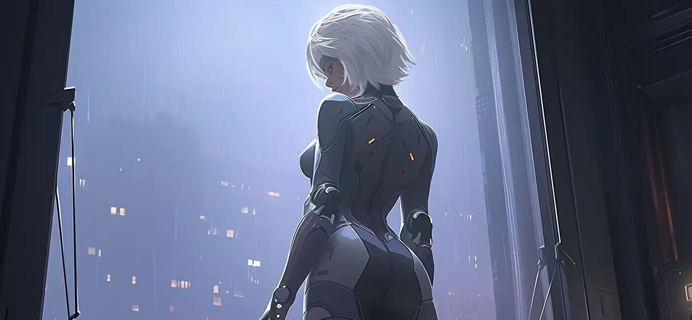
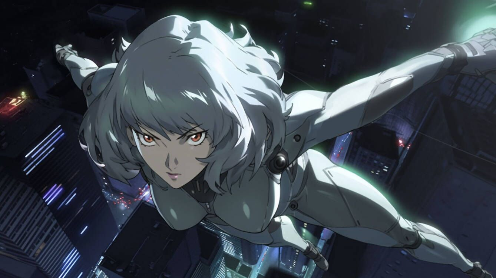
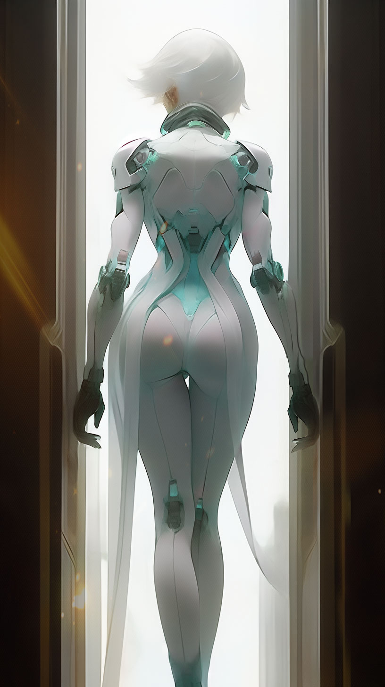

# ⚪ Biography Eva ⚪
## Chapter 1

In front of the huge floor-to-ceiling window, a short-haired woman was staring at the aircrafts coming and going outside the window, and the room was illuminated by the lights of these aircrafts periodically.
"Beep. Prosthetic software is updated."
Awakened by the notification, the woman unhooked the connector on her neck and put it back into the connection cabin, then got up and sat at the workbench by the connection cabin, which activated the monitor on the workbench. The wallpaper of the monitor was a picture of a big question mark. The message notification in the bottom right corner of the screen kept flashing. She touched the screen and a string of messages popped up. She then swiped up and down to browse these messages. These messages turned out to be sent by the same person. She tapped the person's avatar and initiated a call request, and the call was instantly answered.
"Captain, it's been a long time, how are you?"
"Let's get right to business."
"Sure. The operation to capture the 「Musician」 failed and the entire Puppet squad was killed in action. No one could hold out until the deep dive phase. All defenses were already breached in the physical contact phase. It is highly likely that the gang did it. You are the all-time strongest deep diver. Would you be interested in coming back and trying it?"
"It did match their way of doing things. I can help you, but I request the files of the First Flame Project. "
"I'm afraid..." (Noises followed by another person's voice) "Eva, it's me. I have sent the encrypted files to you. I hope you are ready to take actions. "
(Eva did not answer immediately, she had her hands split into two larger robotic ones to decode the files on the keyboard)
"Playing with memories in such way, you guys are really twisted. Unfortunately, I would rather be a human puppet that brings hope to people than a hero with behaviors that does not match the title. This is the last time I take part in your operation, General."
(Silence)
At that moment, an aircraft hovered outside the window, then opened its hatch. Eva got to her feet and pressed the red button by the floor-to-ceiling window to open it, and then took a small leap into the craft. After Eva had settled down, the man sitting next to her said, 
"Captain, the latest information updates. We have determined that the Musician's audio is the sound of tidal waves. This audio will cause the listener's prosthetic parts to lose control. Those who listen to it for more than 5 seconds will suffer loss of consciousness, after which they will dance to the audio and sing unknown songs, and finally commit suicide. It is impossible to track the musician under such circumstances. The silver lining is that Puppeteer wrote down an address before he died. We will be arriving very soon."
The man handed over a tablet to Eva and pointed at the exact location.
"Ok, the usual way."
"Aye. "

---
On the other hand, Cecilia woke up Wukong and consulted him over the Moon Hall. Wukong said he had never heard of such place, but if there was anyone in the City of Truth had the knowledge of such place, it must be the dead priest of Moon Lake. Then, Cecilia and her group followed Wukong to the ruins of the Heavenly Palace together.
Although the Heavenly Palace was in ruins, the room of the Moon Lake Priest was maintained in its original location, which was eerie. They opened the door to the room, and a massive volume of black water gushed out. The source of the black water seemed to be connected to the room. The black water was so deep that no one could see what was hidden at its depths. At this time, Xuxu stepped forward and waved her hands, and the vortex started to form in the center of the black water. The vortex rotated more rapidly and became larger until the bottom of the black water was revealed. In the depths of the black water rest a horn. After unleashing the tiger's roar, Aningákh held the horn in his hand, and the black water no longer gushed out from the horn. Yae Kun took the horn and blew it hard, causing the horn to emit a strange sound of tidal waves.
Instantly, there were winds whistling in the clouds. Suddenly, a huge, winged fish descended through the clouds. The crowd understood right away that it might be the way to get to the Moon Hall, so they climbed onto the back of the fish. After everyone had sat on the fish's back, the flying fish spread its wings and steered the crowd into the clouds.

## Chapter 2

"You have arrived at the destination."
Eva got to her feet, took off her jacket, activated her optical camouflage, opened the hatch, and leapt forward into the air. During her fall, Eva's body gradually became transparent, and eventually invisible.
At this time, in a room on the 55th floor of the Empire State Building, a man was lying on the ground with blood flowing from his neck wound; an alert was flashing on the monitor screen——"Upload has been completed."
Bang! The window was shattered. After a moment, Eva gradually became visible, she pressed her headset and said,
"The target is dead, room is secure for entering, do not forget to bring my tools
Soon, a combat squad broke into the room, with one member of which carrying a suitcase. The suitcase was then opened; it automatically assembled and transformed into a memory deep dive device. Eva picked up the connector and plugged it onto the back of her neck, then closed her eyes and stopped making the slightest movement.
After a while, the communicator on the ground sounded. The general picked up the communicator and opened it; his expression changed suddenly. He then rushed towards Eva, wanting to remove her connector. Unfortunately, the audio started playing. Meanwhile, the audio was automatically playing on everyone's devices.
Soon, the room restored its former silence; the blood was still flowing on the floor and Eva's device still running.

---
Cecilia and her group traveled through the clouds only to see nothing in front of them. As time passed, the faint sound of tidal waves in their ears gradually became clear. Suddenly, the clouds disappeared, and boundless water appeared before their eyes, behind the water was the moon. It turned out that the sky they had been seeing was a curtain of water, and the moon was behind it. Not waiting for people to settle down, the flying fish will leap into the water, Xuxu conjured up a bubble and wrap her and her friends inside it, sheltering them from the water. The lightness of the bubble helped the group escape the water. There was a curtain of water behind them and a vast continent beneath them. At the center of the continent was a gigantic moon. Eventually, the flying fish stopped by the moon, and Cecilia turned into an adult somehow but no one was surprised, as if she had always been like this.
Half of the moon in front of them was buried just below the horizon. Surprisingly, the group noticed that the moon was in the center of a black lake instead of the ground when they came closer to it. The lake was densely infested with dormant fish, or mermen. But as the sound of tides played, more mermen were awakened. Watching this, Yae Kun slowly drew his swords and stood in front of Cecilia. Something that resembles the head of a man emerged from the lake, it looked at Cecilia and said, "Finally, you managed to get here."

## Chapter 3

After Eva invaded the Musician's residual consciousness, she entered a world of data. If anyone were there, they could see a silver line chasing a black line. The black line kept jumping back and forth between different data strings, while the silver line was following it and gradually closing the distance between them. Suddenly, another black line appeared, the third one, the fourth one, and then countless others. Eva stopped chasing the first black line, she realized it was a trap. At that moment, Eva received a connection request from an unknown source, and knowing she had no choice, she consented.
Eva opened her eyes and found herself in a white space with a door in it. Suddenly, the door was opened and a woman wearing a white mask walked in.
"Sure, it's you. "
"Remember our last conversation? It’s been a few years, so I guess you may have a new perspective on us. "
"I already know who you truly are, unfortunately I am unable to relate to you. Change yourself if you are dissatisfied with the world, instead of just doing such things secretly."
"We are only soothing his ripples. We are the Guardians of Time. Those who you were speaking of are riotous artificial consciousness bodies—false bodies with false memories. People are just puppets of their own souls. When the string breaks, the puppet loses its strength and life, and falls to the ground like a pile of waste. If the soul disappears, there is no longer any meaning to existence, for the soul is the string that connects the physical body. They did not ever have their own memories, but all fell like autumn leaves, roaring angrily yet hopelessly. Anyway, I should not have appeared like this, but the life-and-death moment has come. I had no other alternative but to come to you, sister."
"What do you mean? Am I…?
"Yes and no. Come, I'll show you everything."
Eva followed her and walked through the door which had a spiral staircase behind it. After turning a corner, Eva noticed that the person in the white mask was gone, looking back, the door was gone too. She continued down the stairs until another door appeared in front of her. Eva pushed the door and walked through it. There were people wearing white masks and people wearing black masks attacking each other by a black lake which was already infested with dead bodies.
"Come with me."
The person with the white mask in the room revealed herself again. Eva followed her to a bizarre hut that seemed otherworldly, the door of which was tightly closed without a doorknob.
"This is the place where the First Flame was born; the First Flame of the universe was born in this hut. And you, my sister, are the First Flame of our world. "
"What does that mean? "
The white-masked man did not speak but pointed to the black-and-white battlefield. It was then that Eva could see the corpse of a merman behind the black and white battlefield. The corpse was so huge that at first glance she took it to be the border of this world.
"He died eons ago and was the first deity humans slain, but he was still alive in the past, struggling. The people and I are just the caretakers of this place. But my sister, you have a greater mission ahead. "
The white-masked woman handed a suitcase to Eva, pointed towards the door, and then jerked around and plunged into the black and white battlefield. Seeing the white figures being eclipsed by the black ones slowly, Eva felt complicated. Suddenly, the door behind her opened.

---
The man in the lake emerged from underwater and opened his arms. The bizarre waves immediately spread all over the lake, causing the mermen in the lake to sleep again. Cecilia whispered in Xuxu's ears, then Xuxu cut the entire black lake in two, creating a pathway which leads to the bottom of the moon between each half of the lake. Aningákh summoned the tiger spirit, picked up Xuxu and Cecilia, and dashed forwards. Soon they arrived at the bottom of the moon. There was a hut at the bottom of the moon. Cecilia went up and opened the door, then waited quietly. Not long after, Eva came out of the room. Seeing Eva, Cecilia smiled happily.
"Everyone is here, little Eva, it's been a long time."
"Auntie Cecilia?"
"Yes, it’s me. We will talk about this later. We need your help now. This guy realized that he had been tricked by me and now wants to wake up and sacrifice his power to live. You have to take me to his consciousness to trick him one more time. "
Said Cecilia, pointing to the black lake. Eva did not expect to see Aunt Cecilia who brought her up. Eva recalled what the man in the white mask said and figured out what had been going on, so she immediately unfolded her gears and took Cecilia for a deep dive into the consciousness.
They came to a small lake together. There was a little merman lying by the shore, fast asleep. Cecilia went up and patted the little merman’s head.
"Noam, wake up."
(The merman opened his eyes and let out an angry cry just sounds like tide waves.)
"Look who I brought."
The little merman looked at Eva, first panicked, then screamed poignantly. Cecilia kept comforting the little merman until it fainted for exhausting all its strength.
"Aunt Cecilia, what's going on?"
"When Noam was trying to take over our world, I lied to him that I could control time and asked him to take me to his dream so that I could prove it to him. He fell for it, so in his dream I acquired the power to control time. With such power, I looked through the past and the future to find valiant men and granted them the power to fight against him. But because my power came from his dream, so he was fighting himself throughout the long history and endless future, until the members of the AAA church raised his suspicion. He woke up just now and saw you who would be born from his corpse in the future, thus completely fell for my lie. However, we only entered his consciousness. He never really awakened."
Meanwhile, the black-masked in the black-and-white battlefield all let out cries of sadness, fading away slowly, so did the white-masked. Only one of the white-masked remained. She took off her mask, revealing a face identical to Eva's.

