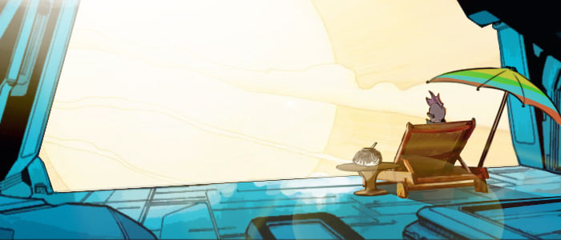
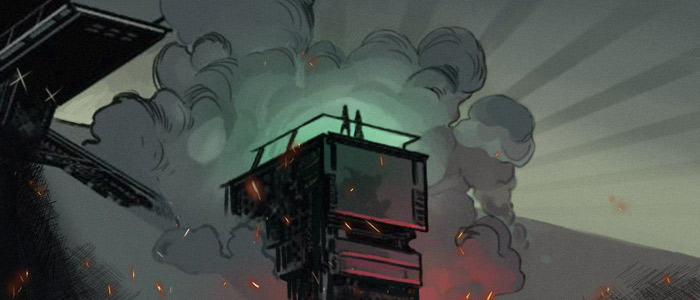
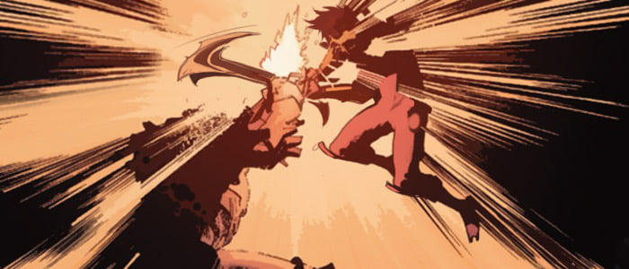
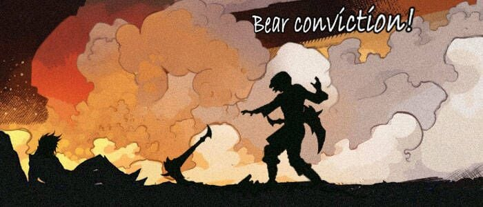
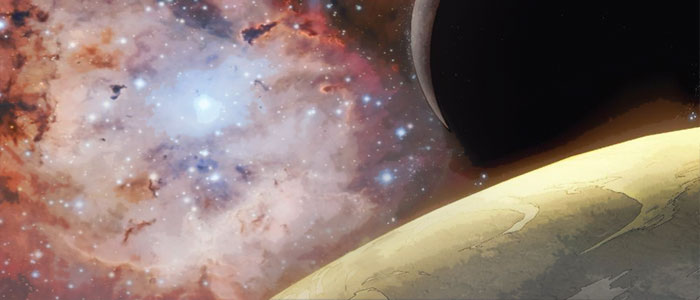

# 🧪 Biography Every 🧪
## Chapter 1

💥**Mars, Miracle City, Guardians’ Base**  
This is a resting room facing the sun. A middle-aged man with sunglasses is enjoying sunbathing on a mechanical recliner. On the side table is his military uniform and an antique radio.  
🗞️ **“Mars News.**  
The Friendship Voyager has just safely made it back to earth, they have just successfully established mutual trade relations with the Tunal of Alpha Monocerotis. The crew received greetings from Turing, Chairman of the Solar System Alliance and were then invited to take part in a banquet. At the banquet, Captain Richard presented products from their recent trade with the Tunal, one of which was a totem statue representing the Tunal Culture.   
According to the Captain, this Tunal totem statue was consecrated by the whole civilizations together, they believe that this totem had gifted them with psychic abilities, granting them the spiritual power to thrive in this harsh environment. In presenting this gift Tunal had expressed their respect and they wish they could develop the Oasis with earth together.  
After the banquet, Chairman Turing expressed his confidence in the peaceful development of relations between the two-star systems and their future. Currently, the alliance is already planning to dispatch their next trading fleet to Monocerotis. The alliance is also encouraging any able individuals or groups to come to the alliance and apply for their qualifications certificate, we are organizing spontaneous exploration fleets and trade fleets to open up safer routes......”  
“What a crap future.”The man turned off the radio with disdain for what he just heard. He then took his clothes and headed for the shower.   
He had been serving in Special Force for 28 years, he was one of those rare soldiers that were left from the Dark Forest era. He has been with the alliance from the beginning when the wages were at their peak until now, where the alliance is falling into arrears, he had always intuitively felt the alliance’s upcoming crisis, including the crisis with the people in the solar system.   
The people in the solar system welcomed the middle-aged crisis of the interstellar era, which he also did. He has been married for so many years, yet has no savings and no qualification to have a child. As he was daydreaming in his bath, he heard someone enter.  
“Did you decide to go to the Oasis?”  
“Yeah, what else can I do? I may have a fostering qualification, but on the other hand, you and I both know how expensive raising a kid can be, I’d rather just getting my bonuses before retiring.”  
“Yeah, 20 years can go by in the blink of an eye, but no matter what in the end you’re still going to be a father, so going to Oasis isn’t a bad choice. Not like me, all I’ll have after retirement is some combat skills, other than that, I won’t have anything. Retirement is the same as unemployment.”  
“We are far behind in terms of efficiency from AI, nowadays companies don’t even consider us. Civilians from class D families like us can only go to the Oasis. You should think about it, maybe you’ll find a girlfriend over there, hahaha.”  
“At the Oasis? I am still young, I don’t want to go over there now. I heard there were a few newly established exploration fleets looking to hire, I am going go over to give it a try.”  
Once he heard this, a sparkle appeared in the man’s eye, as if he just made an important decision in his life.  

## Chapter 2

“Message to all crew members, this ship will go into level 3 transition state in 24 hours, all crew members under Rank 5 please make your way to Sleep Cabins, all Rank 6 crew members please make your way to the Gravity Room and stand by.”  
With this announcement, one by one every crew member entered Sleep Cabins. In Sleep Cabin No.3, everyone was sitting upright on their sleeping capsules staring at the only man who was standing.  
“Edward, say something.”  
“As you all know, this is the 7th hibernation announcement made. We have flown for almost 3 years now, their promise to reward us just keeps getting pushed back, and I am sure all of you are fed up with it. But the worst part of this, according to my sources, is that this hibernation round is not even due to the transition, but it's actually because the ship's supplies are insufficient.”  
With this said, the originally quiet cabin quieter, and only some people's rapid breathing could be heard.  
“This time we must take action. I have contacted some old friends of mine, who wants to join us?”  
Everyone stood up.  

---  
🗝️**The Command Room.**  
A young man dressed in a luxury suite was yelling at everyone in a fury.  
“You bunch of idiots. How can such an important thing only be discovered now. I brought you a route map from the company, and you still lost track of it. Did you guys suck in too much cosmic dust? One by one you are all becoming incompetent. So tell us, Jerry, what should we do now?”  
Captain Jerry sighed and then stood out.  
“Dust in Monoceres is not simple. We have been capturing and studying this kind of dust in these past few years. It extremely inertial, and it seems to be able to cut off any rays, power, radiation or waves known to us. Most important thing is, it's everywhere in Monoceres. This is the reason why we aren't able to track down our location all the time. Someone is hiding this information from all of us. The only thing we can do now is fly to Alpha Monoceres, this is the only direction, which we can secure, moreover......”  
“No, actually according to our navigation route, even if we deviated, we won't deviate too far. Do you guys know how much the company invested? We have to bring back something. Now, revise the route for me, fully explore this space with a radius of 1 light year.”  
“But, Mr. James, our supplies are not sufficient enough to continue such exploration.”  
“Wise up, please! Exploration doesn't need that many people, let the ones we don't need hibernate, then......", the young man made a gesture of wiping his neck and said, “our supplies should be enough then.” Once he said this, he looked at each person in the eyes, everyone avoided his eye contact, he then made a final call: “Since nobody has any objections, let's do it.”  

---  
🗝️**The Gravity Room**  
Meanwhile, all the captains on board had gathered up in the Gravity Room. Everyone here has served in the space army, and they came from different planets. Theoretically speaking, these R6 captains shouldn't know each other, thus it is difficult to build trust in this environment. But this time, they have united together, all because of one middle-aged man with the green scar on his face.  
“Captain, Edward has gone to recruit people, we will take over this ship once we have the situation under control.” said Anne.  
This man, who they're calling captain, was a former captain of a special team in space army. He has been in many great battles during the Dark Forest era, and has witnessed space explorations and the space colonization of the human race. Everybody gathered here because of him, because he was the first and is the only one alive, who was awarded the Galaxy Hero Medal, and his name was Every. The West Monoceres Company underestimated his potential influence in space army.  
“It is time.”  
Every stood up and took two of his battle sabres in his hand. As soon as he picked up his weapons, the blade lit up green along with his whole body. As if his weapon and his body were one unit, “it” was now awakened. It was as if he changed somehow, when he took up his weapons, the green rays coming from his body also made everyone else's suit light up in green as well. Every then grinned.  
“Bear conviction! Fight as one!”  
“Bear conviction! Fight as one!” shouted everyone after him.  

## Chapter 3

At the bridge leading to the Command Cabin, the emergency lights on both sides emit a faint light.  
🟢Only dim green lights heading towards the Command Room could be seen.  

---  
🗝️**The Command Cabin.**  
A man in combat uniform leaned over and reported something in James's ear. From his face, it was not good news. By the look on James's face, the news was not good.  
“Damn it, those bastards are now rebelling.”  
Before his voice had died away, the sound of metal colliding along with an explosion was heard in the distance from the cabin. Jerry was stunned for a brief moment, but then quickly collected himself and rushed over to the control panel to check the monitors. On the screens, he could see indistinct green lights coming from the dust and smoke.  
“This is.......the Ghost Squad? It's him! Tom, initiate the defense systems now, prepare an evacuation for the cabin. Rose, gather the supplies. Sergeant Jack, hold them off outside for a bit. We're in big trouble.”  
“Sir, sorry to interrupt, but don't worry. We know the profile of every single person on board this ship. The Double Blades Every, yea...his Extend technology is from my family. He is simply an unfortunate experimental specimen, that year after he slaughtered his teammates, he is no longer what he was. Jack, show the captain our new Extend equipment.”  
James patted Jack on the shoulder, Jack then took off his uniform and revealed his transformed body which is similar to Every's.   
Pffff...Steam then puffed out from Jack's mask, the mask then fell off, it was as if he turned off his restrictions, a blue light lit upon his body, and an invisible force field started to unfold, a researcher standing by the side was then thrown off his feet for 2 meters, while other combatants standing within range, their bodies covered in that dark blue light, this blue light covering their bodies acted similarly to the green one on Every.  

## Chapter 4

On the other side, Every was leading his rebel team, they had just broken through the defense system.   
At this point, nothing stood between them and the cabin. With victory in sight, they let down their guard for a little. But it was at this moment, spears from their blind spot came flying towards Every and his team. Every stepped to the side to evade it, but he failed, and only had time to mark enemies. What seemed to be an empty hallway all of sudden appeared a glowing blue defense squad.  
“You seem surprised? You probably also realized that your body is slowly becoming rigid, it’s a defect that was detected in the Extend Technology from the early generation.” Jack walked over slowly, cutting off Annie's head, who was nailed to the ground by a spear, “Look at you, doesn’t feel good to be penetrated by energy crystals, right?” As he said this he dropped Annie's head and went over to another one, who was also penetrated by the spear.   
“You stooge of Richard.”   
Every's voice sounded like a repressed beast. It was quite visible how strong his fury was, a purple erosion started to spread throughout his body, even more, green energy crystals started to pierce out from his body, his weapons and armor started to change form. He pulled out the spear from his body, the wound from the spear healed immediately, even his teammates beside him could feel pressure coming from his powers, this pressure also acted as another source of strength for his teammates. As they were just adapting to this pressure, Every charged forward.  
Jack wasn’t expecting this level of power to come from Every, all he could do was defend himself, unfortunately, Every’s irrational attack covered Jack’s whole team behind him. He had suppressed the entire squad alone. The squad unit standing closest to Jack was instantly stabbed, blood just kept gushing out from his helmet. To make matters worse, Every noticed this squad unit is serious injured, and with a single slash, sliced him in half. Every then turned to another enemy unit, who happened to be injured also, to Every’s surprise, this enemy unit suddenly moved faster and dodged his fatal attack on him.  
“Wo”, another strong force field had collided with Every’s. Jack had hit Every on the shoulder, the long sword in his hand had disappeared, and as a replacement, he gained two ferocious icon fist. Jack got up close to Every to not give him any leeway for his sword and to try to use quick hand-to-hand combat skills on him. But Every finally came up with a quick dodge and used the back of the sword to block Jack’s fists.   
After which, the two started going at each other with crazy attacks, force fields became stronger, no one could get a move in. Others watched as the erosion on Jack and Every started to grow bigger and bigger, and energy crystals had even protruded out from Every’s head.  
“Do you want to die?” Jack saw how green rays were shining out of Every’s eyes, but Every still managed to remain calm with his attacks, but when he glanced over to see how his own moderator was displaying 95%, he started to get nervous. Even though he was the top Extender in new generation, he had never tested it to 100%, but somehow Every’s just keeps getting stronger, then all of a sudden he realized, “Infinite Extend, was that experiment a success?”  
Every didn’t answer, instead, he pulled out two blades, lifting up two iron fists with one blade, and the other stabbed in Jack's shoulder and sliced through Jack’s neck, sending his head flying through the air. After killing Jack, Every turned towards his team, “Bear conviction！”  
“Fight as one!”, as they called back, Every smiled in content."  

## Chapter 5

**Profile: Experiment-X012**
“North Star, this is Ghost 002, the squad has arrived at the targeted destination, please indicate target.”  
“Ghost Squad, this is North Star, mission target is an illegal Extender, permission to over extend 50%, mission starts now.”  

---  
“North Star, this is Ghost 001, the squad has arrived at the targeted destination, please indicate target.”  
“Ghost Squad, this is North Star, mission target is an illegal Extender squad, permission to over extend with no restriction, mission starts now.”  
Every, wearing a holographic helmet, turned around to his teammates, “Guys, an mission without restriction. Let's be careful and have some fun. Bear conviction！”  
“Fight as one!”, as their response echoed in the walk-talky, Every began to move towards five mission targets. What he didn't notice, was the moderator of his Extend limiter had been closed up completely.  
Without hesitation, he charged at the group of people, looking at these 5 surprised-looking targets, he thought for a moment that this mission was going to be easy. But as the battle progressed, he realized that the other side had strong teamwork, they also kept aiming their attacks at his helmet, which is weird and made him keeping over extend. After taking a look at the 45% displayed on the helmet screen, he over extends to 60% in the blink of an eye. At which point he started feeling pain all over his body, his ability to focus became compromised, his mind became overridden with flashing thoughts, and a strange feeling suddenly came over him. Just at this vulnerable moment of his, four of the targets rushed over and seized his arms and legs completely immobilizing him, the last target then came at him with a blade in his hand getting ready to strike his head. There was no escape, his helmet had finally broke, and everything went dark.  

---  
Then he heard heavy breathing, Every regained consciousness, he saw his assistant captain standing in front of him. Every's sword pierced into his heart. Every then looked down and saw 4 mutilated bodies of the squad that had pinned him. He glanced at his hand, and saw it was showing that the limiter displaying 100%, he started to tremble.  
“Captain, the mission is complete. Bear conviction!”  
Every answered automatically, “Fight as one!”  
The assistant captain hugged him with a smile on his face, as he leaned on Every, his breathing eventually stopped.  
“Bear conviction！”  
No one answered.  
“Bear conviction！”  
“Bear conviction！”  
“Bear conviction！” Every yelled again and again, only this time no one yelled back.  

## Chapter 6

💫 **“Mars News.**  
The Great Explorer Fleet just confirmed that they are lost in the Monocerids, this was already the third Starship Fleet of Richard's family that has gone missing at the Monocerids in the past few years, and the 7th Heavy Starship that has gone missing overall. According to experts, there is an unknown force against the human race in Monocerids, because currently there are no survivors nor fleet debris has been found. By the looks of this performance, either enemies' technology is well beyond human race, or they have a strong attacking force, then all battles will happen aboard the ship, like the battles in ancient times at sea.  
Due to these unknown factors, the budget for exploration has been significantly reduced from almost all companies. Chairman Turing said that the human race is currently in a crisis, if we don't find a new trade route soon, the economic internal circulation will be on the brink of a collapse. He called on all companies, organizations and governments to increase the construction of oasis, and to open a new economic internal circulation, that could correspond with the the slow progress of Monocerids exploration.  
During the last constitutional amendment conference, a bill was passed to lift the age limit for entry into the oasis. After the passage of the bill, oasis ushered in a new round of population explosion, with new residents aged 10-18 accounting for 84% of the new population. The passage of this Bill marks that the oasis has entered the universal era and a younger era. Experts say, that the future holds a speedy and prosperous development......”  
“What a crap future” The man turned off the radio with disdain for what he just heard. He looked up at the universe full of stardust, his body tensed up, as if he was about to face a wicked and powerful opponent.  

