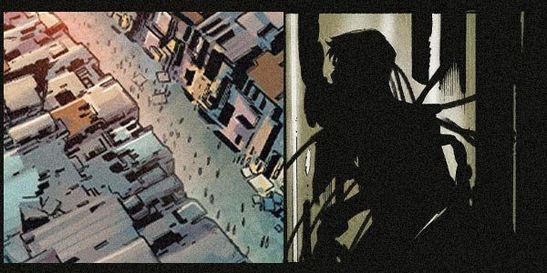

# 🔮 Biography Grendel 🔮
## Chapter 1

💫**The Fifth Galaxy: Mixed**  
This place is home to some of the rarest minerals, it is also the biggest black market in the galaxy.  
In the biggest black market of the galaxy lives are cheap here. Human trafficking can be seen  everywhere, human life is more of a “commodity” around here. Killers with four transformed limbs have been mutated into a combination of man and beast, at the Paradox, as long as you have enough money, you can buy any weapons you desire.  
📍**Underground Laboratory**  
Various flasks with fluorescent substances prompted up on shelves.  
Next to a large machine, there is a dark figure, his limbs are imprisoned by chains, his back with full of tubings injected into it, which were connected to his arteries and veins. The tubings consisted of a flow of a purple substance, which was continuously pumped throughout his veins and his heart.  
After 2 hours, the specimen had awakened and started yelling loudly, pain twisted his face into agony. He started struggling through his chains. The purple substance was then injected into his system causing strong contractions in his blood vessels, this caused the specimen to have constant convulsions.  
“Please stay awake, so that the experiment can continue.” The sound of footstep approached, someone had entered the Laboratory.  

## Chapter 2

Grendel entered the Laboratory, he had just came back from the black market, on his back he was carrying goods from the day’s shopping.  
He tossed the bag on to the floor and came up to the specimen, he checked for changes and wrote them down.  
After some time, he placed his hand on the face of the specimen and smiled: “Excellent, you’ve passed the first test.” Grendal cut open the specimen with his sharp fingernails, making the specimen’s face turn red with blood.  
“Oh dear, I am truly sorry.”  
“You...You’re insane!” The specimen shouted flailing all four of his limbs.  
“Insane? I suggest you to be more grateful rather than calling me names. If the experiment is successful, you will become an unprecedented new weapon, you will become the sensation of the “Mixed”, is that not exciting?”  
Grendal stood up and ignored the piercing cries from behind. He knew how to destroy life while doing it with purpose, and he also knew how to transform the body to obtain new life.  
He needs to go through more experiments, in order to pursue to “Human Refinement”.  

# Chapter 3

ll Alchemy is based on the principal of “Equal Exchange”, the understanding and decomposition of matter, and consequently the most advanced science of structure.  
But in the field of Alchemy, the biggest“ taboo” is “Human Refinement”.  
The specimen has entered a state of drowsiness. Grendal adjusted the reagent composition to prepare the specimen for the 2nd phase of the experiment. He increased the drug dose, by increasing the pump of the drug flow, which brought the drug to a boil. The specimen opened his eyes so widely it seemed they were going to split open, his skeleton began to break from within and his flesh started to move as if free of any joints or tendons.  
The specimen screamed helplessly, until he turned into a small creature, which eventually became silent.  
Did it work this time? Grendal, who was an atheist, started to pray.  
At the same time, Grendel tried to  switch the substance with a kind of alchemical rage, which turned out to have a very destabilizing effect on the specimen.   
He held the original flame in the palm of his hand and continued his pursuit for the truth of life.  

