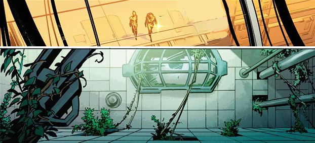
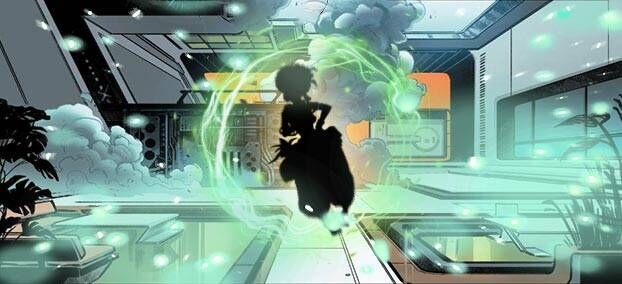
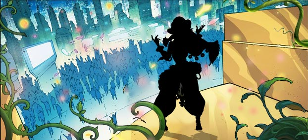

# Biography Horae
## Part 1

In the year 2077, the few remaining cities on Earth called immuno-cities were severely polluted, with the intricate steel labyrinths of buildings deserted inside.
A botanist named Horae used gene technology to cultivate a super plant that glows - Gleam Grass. This grass grows rapidly while emitting a strong fluorescence to illuminate the surroundings.
Leading a research team, botanist Horae built a plant garden in the desert outside the city, using gene technology to breed the glowing super plant "Gleam Grass" in an attempt to restore an oasis.
Horae spread the seeds of Gleam Grass in an abandoned steel city. This city had become ruins due to war, with discarded mechs and architectural debris everywhere. 
At first, Gleam Grass struggled to grow amidst the rust and ruins. Later, under Horae's lead, the plant quickly spread and occupied the entire city. The river-like glow in the steel maze illuminated this dead city, bringing vitality.

## Part 2

Just as the ecological environment was starting to take shape, a violent biker gang suddenly broke into the plant garden, wearing motorcycle jackets and their faces covered in oil. They called themselves "Flying Bugs."
"Get all your Gleam Grass loaded up for me, or else I'll blow up your research institute!" a scar-faced man threatened with a weapon.
"What do you want the Gleam Grass for?" Horae asked warily.
"Ha, with the fluorescent powder extracted from it, we can make laser cannons, or refine it into psychedelic drugs - hot selling stuff on the black market!"
"Stop! That's very dangerous!" Horae tried to step forward to stop them, but the followers had already started plucking the Gleam Grass.
Horae closed her eyes and concentrated. Suddenly, the Gleam Grass that was flowering and fruiting grew wildly, turning into vines several meters high that tightly entwined the hands and feet of the gangsters... Under the illumination of the glowing plants, Horae's team drove back the Flying Bugs.
Horae realized that invasion and war could happen at any time. To establish an "Oasis," her powers were still far from enough at present...

## Part 3

"Don't worry, this experiment has been validated already, nothing will go wrong." Horae said to her assistant.
"Are you sure? With this gene combination, there are still risks."
"Theoretically the problems have been eliminated... Let's begin!"
Horae activated the cultivation chamber. Tens of thousands of glowing spores grew, erupted and scattered outwards.
"Accident! Can't contain them! Escape quick..." Her assistant's terrified cries for help were drowned out by the white light. When Horae opened her eyes, the entire lab was filled with the luminescent spores. She realized they had invaded her body and she had symbiosed with the Gleam Grass...
Standing on a platform woven from vines, Horae overlooked the city. Those buildings ravaged by war were now emitting a lush, green glow.
It turned out the Gleam Grass was not only burgeoning outwards, but also proliferating madly in the crevices of reinforced concrete. Soon, this dead city was shrouded in a fantastical aura.
Horae gazed up at this desolate city, now vibrant and lively, with life and death seemingly so close.
She understood her experiment was now irreversible, those genetically unleashed spores had already seeped into her flesh and blood. She could feel a powerful energy surging inside her body.
Horae closed her eyes, perceiving this force heralding new life. Perhaps she and this luminous city would eventually transform into a dazzling beam of light in this lifeless desert.
Maybe that was her purpose for existing.

