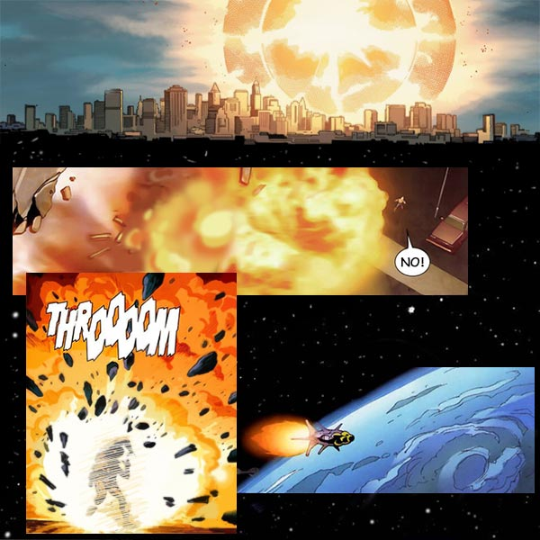
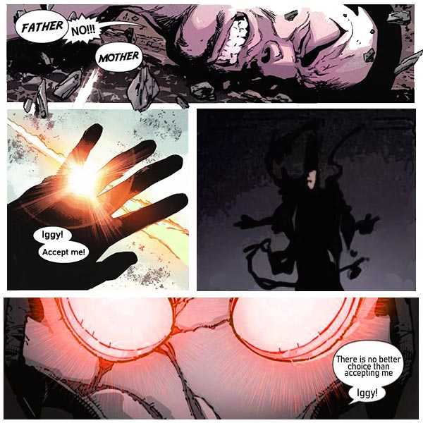
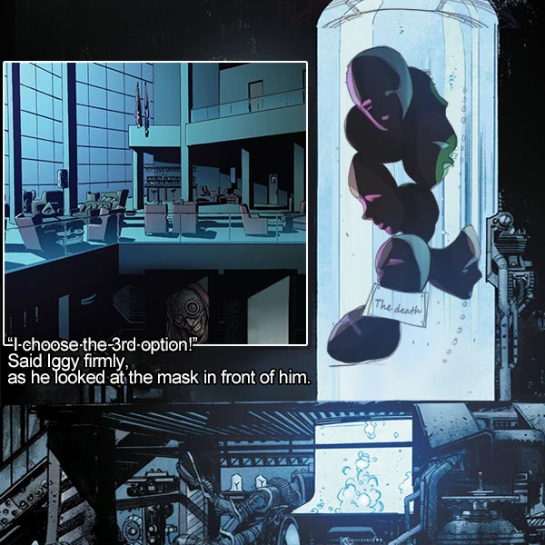

# 👹 Biography Iggy 👹
## Chapter 1

Somewhere in the midst of the Skeleton Sea a huge Big Bang occurred, giving birth to a multi-dimensional universe, this caused the Skeleton Sea to become a connecting hub for all the parallel universes. The Big Bang is sign that the third stage of the Skeleton Sea of Chaos has begun. Meanwhile, the flow of radiation from the Big Bang had caused more than half of the area to erode, and had left many civilizations destroyed. ——《The Epic Universe》 The Big Bang in the Skeleton Sea. Year 19450.  

**Skeleton Sea, Area 111, Artillery State**
Day and night, 🌃  
One day, Iggy decided to sneak into his parents’ lab, while they were away from home. Iggy’s parents were well known specialists of the Artillery State, and especially well known in AI field. Ever since Iggy was little had he longed to enter his parents’ lab, but was strictly prohibited from this.   
As he crept in, holding a flashlight, he took his first long awaited glance into the lab, what he saw absolutely astounded him. All sorts of never-seen-before machinery, tools and top notch publications filled the entire room completely. The most interesting of items, which he found was a mask, laying on the work desk in the center of the room, it looked more like a piece of art which was carved into a piece of machinery. There was a faint blue glow in the night. Iggy stared at the mask for awhile, and couldn’t help move towards it, as he stretched his hand out to touch it,  
all of a sudden the sky in the window flashed, the whole sky shone like day and the house started to quake. Frightened, he quickly went into hiding under the table. The shining sky went on for a while, but then after it died down and everything went back to normal, but Iggy felt some discomfort in his body, and was getting ready to go back to his room. Just as soon as he opened the door to leave the lab, he heard sounds of hasty footsteps from a distance along with his mother’s nervous voice calling, “Iggy. Iggy. Where are you? Iggy. Answer me!”  
“I’m here!” He was so trembled with fear, that he couldn’t care about the consequences his mother might bring on him, after getting found out.  
Iggy’s parents pushed opened the gates of their lab, their faces were pale with fear, and didn’t even wait for Iggy to say anything. His mother hugged him and carried him immediately to, what looked like a sleeping cabin outside the lab, where she lay him down, his father then followed right after carrying the mask in his hand from the lab, which he then placed in Iggy’s hand. In a obscure part of the mask was a faint inscription that read “Hannya AI”. Iggy started asking all these questions, but his parents didn’t respond to anything and instead just looked him in the eye, as their look gradually became more stern, they uttered “Iggy, you must survive.” And with those last words they pushed the launch button and Iggy’s space cabin took off.  

## Chapter 2

On some planet far away, there was a man with a delicate and fine mask on.  
His body trembled, and there was a huge pain coming from within his chest, all you could see, was him trying to pull the mask off, but alas to no avail. Under the mask his face was fierce and his eyes were evil with red.  
In a sea of consciousness emerged a mask, and then another mask and then another, they then all looked towards him, and stared, and then in an instant they all simultaneously started rushing towards him. But just in that moment of desperation, an instinct kicked in, he took up a weapon and slashed a mask in half. At this point he only knew the mechanical technique of slashing up and down, and in his mind he could only think one thing, which was to destroy all the masks. After a while, he had finally slashed down the last mask. The mask that he once couldn’t take off, at last, fell to the ground. But at this point his body had already been broken, all the flesh and blood and mechanical transformations were already inseparable. He didn’t really know, whether to consider himself luck or unlucky, the radiation had made his bones become very strong, only because of this was his body able to withstand all the beating until the very end.  
He picked up the mask, looked at it from all four sides, the ground was full of corpses split in half, the whole ground was covered in blood, and the whole planet didn’t have a single organism left. Blood pools can be seen as far as the eye can see, a sight that looked like hell itself. His body had already endured great pain, as blood dripped from his body, he forced himself forward, but only after a few steps he fell into a pool of blood.  

## Chapter 3

**Bilrost College** 🏛
X: “I think you know your body better than I do."  
Iggy stared in complete silence at the legendary leader of the fallen camp.  
“I will now give you a few options my disciple."  
“The first, a weak body, made from ordinary flesh with an abnormal brain (your mind will not be able to differentiate a dream from reality) and your body and mind will shrink rapidly, this body will have a short life expectancy. I suspect that you will not go for this choice, because in this case you don’t deserve saving from me.”  
“The second, a half AI life, this will consist of the removal of all flesh and blood, your body will be reforged and consist of 90% metal, I think as a mechanical master, you know what that sacrifices. Of course before we go through with that, you must prove that you are worth my money.”  
“The third, a biochemical reformer, this would rely on a substantial amount of drugs in order to strengthen the body and the mind, and lastly the mechanical parts of the body, will be squeezed out, or will be called armored skin for living organisms, but the death rate will be high, and as of this point there have been no successful cases. But if you are willing to cooperate, I can provide you with all the needed drugs for free. If you succeed, then that would be pretty exciting.”  
“Think about it, I can give you time, after all this is not an easy decision to make, haha.”  
As he finished speaking, he turned around, getting ready to leave.  
“I choose the 3rd option!” Said Iggy firmly, as he looked at the mask in front of him.  

