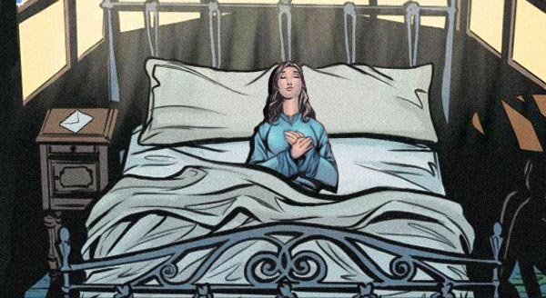
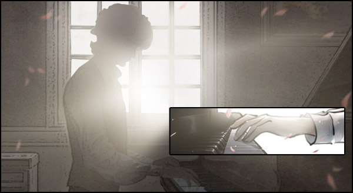
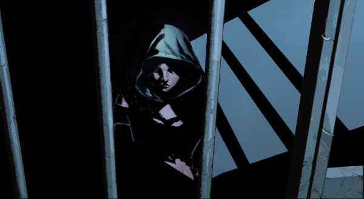
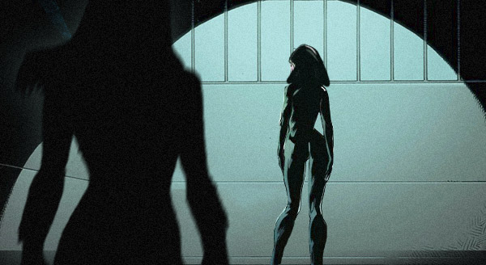
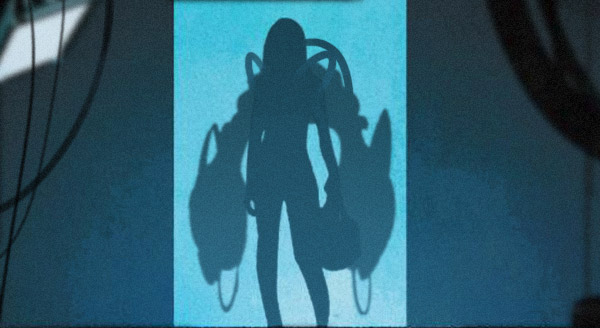

# 🔹 Biography Irene 🔹
## Chapter 1

🏘️**Somewhere in an unknown country, 122 London Street**  
In a small Retro English building, Ms. Una made her way up the stairs. She reached for her key, turned her keys, slipped them in the keyhole, only to find out that the door was unlocked. She scolded and entered the apartment. When she entered, she heard the sound of a piano playing. It was Beethoven’s Moonlight Sonata 3rd Movement. As she listened, she entered the kitchen to prepare lunch for the tenant on the second floor. Not long after, an eager knock on the door was heard, a man’s voice spoke from the other side of the door, “Open the door! There’s been an incident! “Ms. Una opened the door. It’s Watson. Watson nodded to Ms. Una and rushed up to the second floor.  
He then entered a room, where he was met with a winding trail of smoke, the air filled with a pungent smell of burning weed; a young, curly-haired man was lying on the floor with multiple files lying all over the place. The young man didn’t pay any attention to Watson, who had just entered the room. If he hadn't opened his eyes, he looked almost asleep.  
Just as Watson wanted to say something the young stopped him with a “hush.” “It’s not the same this time; Irene has committed suicide.“ said Dr. Watson.   
The young man got up in a hurry, but because he got up too quickly, he fell heavily to the ground. Then he rolled and climbed to Watson, and then he stood firm. Watson could see that the poor man’s face was paler than the last time he came; it appeared that the recent news had taken quite a toll on him.  
“Chief police knows that you will stop at nothing until you see it for yourself, let's go.”  
Without saying a word, the young man quickly turned around, picked up the deerstalker and wind coat on the clothes rack, and ran downstairs.  
“Your pipe.” Reminded Watson, but the curly-haired man seemed to have paid no attention and hurried out the door. Then, after Watson saw that he was deep breathing again and again, he calmed down.  
After getting on the carriage, they soon came to a small manor, and the police were blocking the scene. The Chief Police was a chubby middle-aged man, “Doctor, you've come very quickly. We haven't been here long. We're about to start asking questions. Let's listen together"  
🗝️  
[The Housekeeper (the one who discovered the body): around 8 in the morning, I went to bring breakfast to the Miss as usual. After putting down breakfast, I closed the door and went out. At 9’o clock, following the usual routine, I came to clean up the room but found the door locked, I knocked, but there was no answer. At the time, I had thought that the Miss was still sleeping. At 10, the Miss still had not awakened, so I started calling her from the door, but there was still no answer. As I reached over to use the spare key, I realized it wasn’t there. Only me and the Miss knew where this key was. This was when I thought something must have happened. That’s when I got other people to help me break the door in. When we entered, we found the Miss was neatly dressed and lying on her bed, on her bedside table was a suicide note, when I confirmed her body was breathless I called the police. After calling the police, I called up Sherlock again, but no one answered, so I called Watson, who then instructed me not to let anyone into the Miss's room, and no one has been there since, including myself, nor did I touch anything in the room.  
Maid A: The last time I saw the Miss was last night when she came back from the outside, she came back around midnight, she came back and went straight to her room.  Then I locked the gates, and went back to my room to sleep. In the morning, around 10 o’clock, the maid had come to inform us that the Miss may have been an incident. After breaking the door, only the housekeeper went in and confirmed that the young lady was not breathing. She soon came out and told us not to go in. The rest of us understood very well. After all, we didn't want to see such a scene again, so we all waited for the housekeeper at the door. The housekeeper came back after calling the police and told us to keep an eye on this place and don't let anyone in. Then we stayed here and no one went in until now. The Miss lately has been busy, she hasn’t been in the best of moods, but no one could have thought she was considering suicide. It was not easy to get a new home like this, the Miss really treat us like a family. (She started crying)]  
“Right then, let us go and check the room and the body for ourselves then.”   
They first checked the door and noted that it could only be locked with a key and that although the door was damaged, the lock cylinder remained locked. On the round table was a set of keys and then a single key; by testing the keys, they concluded that these were the keys and backup key to Irene’s room. The room was neat and spotless; it was evident that it was well cleaned recently, all items were set neatly in their place. If someone has searched, it can't be recovered in a short time. The person lying on the bed has a calm expression, just like falling asleep. On the bedside table was the untouched breakfast, a letter and an empty medicine bottle. Watson took the bottle to read the label.  
“These are sleeping pills.“  
The young man approached and took the letter.  
[“Sherlock, I had guessed that the first person to read this letter was going to be you. By this time, I have already left here. The hypocrisy of this world disgusts me, I don’t know if whether there is a heaven or a hell to go to once I leave this place, but no matter what lies, I am curious to see. Apologies for the trouble I put you through. I hope that you can understand my sorrow. I would also ask you to bury me at the END of the Mountain personally. Please do not burn me into ashes, as I am afraid of pain. Till we meet in heaven, my dear brother.“]  

Watson watched as the young curly-haired man read the letter to him. His body trembled. It was the first time he had seen this men so emotional. Just as he wanted to console him, he heard him say.  
“Watson, I shall like to perform an autopsy. Please step aside.” Watson nodded, stepped out and closed the door behind him.  

After a while, the young curly-haired man came out, his hair was disordered, and he was sweating profusely, his face had become even paler than before, and it seemed as if he had lost some weight. Watson looked at him in distress and asked,  
“Well? Was it suicide?”  
> ❔  
    1. How would Sherlock answer, was it suicide? Say your reasons.  
    2. Additional question: Please restore the truth.  
    🎁As long as say a reasonable speculation, you will have the opportunity to get the Perfect Hires.  
>  

## Chapter 2: Electricity and Magnetism

🏡**Somewhere in an unknown country, 122 London Street**  
It was a small Retro English building. Upon entering the building, Watson could hear the sound of a piano coming from the second floor. He stood at the entrance to listen for a while. It was Tempest the Third Movement. He shook his head and went up the stairs.  
He then entered a room, where he was met with a winding trail of smoke, the air filled with a pungent smell of incense; a young, curly-haired man was playing the piano passionately with his eyes closed, he was surrounded by multiple files lying all over the floor. The young man paid no attention to Watson, who had just entered the room; instead, he continued playing until the end of the movement.  
“This here is the case you wanted,” Watson was holding up a file in his hand, “I don't know why you are interested in such old cases. Anyway, it's good to see you bounce back. Your silence after Irene's accident is really worrying.”  
The young man picked up the file and looked through it while Watson stood adjacent. Both seemed eager to investigate the file.  
📍  
[Victim: Michael Faraday  
Time of Report: xxxx-xx-xx  
Investigating Officer: xxxx, xxxx  
Forensic: Sherlock  
Investigation Report: After reporting to the police, the police officer arrived at Faraday’s house. The wife stated that the last day, Faraday had gone down to the basement and hadn’t come out since, only until this afternoon no one answered in basement, so she called up the police for help. The police went down the basement and found that the door to it didn’t have a keyhole. Mrs. Faraday then explained that inside there was an iron bolt and that pulling it will lock the door. She then explained that he would usually lock it to prevent her or their son from a spontaneous entrance during essential experiments. Once the Officer broke down the door, they found Faraday lying on the floor with an electric cord pinched in his hands. He was dead. Based on what was witnessed, no one from outside had visited their house since Faraday went to the basement, and based on the inquiry with the neighbors, no motive could be detected in the wife or the son. Moreover, without leaving traces on the basement door, entering from the outside would be impossible, so the death was concluded to be self-inflicted.  
🖼️  
Attachment 1. Autopsy Report: Bleeding from the back of the head, the rest of the body had no traces of any significant wounds. The cause of death was determined as suffocation from the electric shock. The wound at the back of the head is a result of falling to the floor after being electrocuted.  
Attachment 2. Photograph of Scene 1: Picture is an image of the basement taken from the entrance, the entrance has a switch, the door has been broken into, which faces the laboratory, the one lying on the floor is Faraday  
Note: after inquiry, Faraday's wife didn't know the specific function of the door switch. She only knew it was a safety device. Her son added that it could control the start and shut-down of the generator inside.  
Photograph of Scene 2: The photo is taken from the basement towards the door. It can be clearly seen that there is a wooden slot on the left wall of the door with an iron bar horizontally on it. As long as you pull it to the right, you can lock the door. In the picture, the wooden slot on the wall has been broken, and the iron bar is hung obliquely on the ground.  
Photograph of Scene 3 -5: These images are close-ups of the body. Here is the wound on the back of the head and the Faraday’s hands pinching the electric wire  
Scene photo 6: a panoramic view of the basement, which clearly records Faraday's new invention, the improved disk dynamo. A huge U-shaped iron, wound with dense coils, with the U-shaped upward, and another coil above the middle of the U-shaped notch. This device is connected to the switch outside the door and the wire in the hands of Faraday. The wire is very long. It is also connected to some other experimental devices, such as an iron bar with a length of one meter and a diameter of 5cm, which is also wrapped with dense coils and placed on the ground near the table.]  
The young man closed the file, grabbed his coat and hat and stepped out. Watson followed right after. They rode a carriage right up to Faraday’s house. His wife greeted them at the door.  
For a while, Watson noticed that Sherlock was not speaking, so he took the initiative to speak first, “Good afternoon, Madam, we are from the police station, my name is Watson, and this is Dr. Sherlock, we are here regarding your husband’s death.” Watson, unsure of himself, looked over at Sherlock, who cued him with a nod, from which he then promptly reached out for ID and continued speaking. “Might you be able to tell us the details?”  
Mrs. Faraday glanced at their ID and then stepped aside granting them entrance.  
“What would you like to know?”  
“Uh, Sherlock?” Watson looked at Sherlock.  
“Research.” Said the young man in a hoarse voice.  
Mrs. Faraday gazed at the young man in astonishment, stood up and went to a room. After a while, she returned with a diary of notes and handed them to the young man.  
“These are the notes that my husband left. He had come back from Eastbourne, claiming he came upon new inspiration to design a new device, which unfortunately took his life.” She spoke with reflexes of sobbing.  
“Eastbourne?” Why did he go there?” Watson had seemed surprised.  
"Seven Sisters,  where the people of the Seven Goddess Cult said they got the gift of Goddess. Their leader claims that at the end of the mountain can see the past and the future. I don't know what they said to my husband, so my husband agreed to go together. When he came back, he was very happy and joined the cult."  
The young man closed the diary, took out a pen and started jotting notes, “Would you be willing to go work for my sister? She is currently in need of a maid for the house.” The young man then pointed to the bread, which was several days old, on the table, and then showed the words to Mrs. Faraday.   

---  
“It's a pity. Faraday was Mr. David’s student. The Disc Generator is an amazing piece of invention, but because of the cult’s influence, he decided upon a dangerous experiment.” Once they came out, Watson sighed.  
The young curly haired man looked up at him, shook his head and sighed.  
Watson noticed this and asked politely, “Did I say something wrong?“  

>1. Did Faraday die by accident? Say your reasons.  
    2. Additional question: Please restore the truth.  
    As long as say a reasonable speculation, you will have the opportunity to get the Perfect Hires（Up to 10）  
    *The Deadline for the event is the publication time of the next biography.  

## Chapter 3: Survivor

🏘️**Somewhere in an unknown country, 122 London Street**  
Upon entering the room, Watson could hear the sound of a piano coming from the second floor. He stood at the entrance to listen for a while. It was Sonata Pathétique 3rd Movement. He was already used to this and headed straight for the second floor.  
Watson pushed open the door, where he was met with the fragrance of incense. He thought to himself that his sister's death had taken its toll on him. A young curly-haired man was playing the piano passionately with his eyes closed. He was playing without even looking at the music sheet. Watson glanced at the music sheet and realized it was the file of Faraday case. The young man stopped playing and looked over at Watson.  
There's a new case. Initially, I wasn't going to bother you with this one, but the perpetrator denies all accusations of the crime. It is now under investigation. So I wanted to ask if you were interested.”  
The young man reached out his hand. Watson placed the file in his hand. Although he briefly looked over the file, he noticed newly added notes on the Faraday file, which he picked up and read aloud.  
"Once the assailant knocked Faraday unconscious, he placed the electric wire in his hands, and locked the door with the iron door bar, then wrapped coil around another iron bar, put it under the door bar and turned on the generator. The electric shock caused the victim to hold the wire even tighter, making the death look like an accident. The electricity flowing through turned the iron bar into a magnet. Its magnetism lifted the one end of the iron door bar, preventing it from jamming the basement door, giving the perpetrator a moment to escape. He then turned off the switch outside the basement door, terminating the magnetism, where the iron door bar fell back into its place, now wholly sealing off the basement from the inside. When the door was broken into, the iron bar was flung to the side of the table.”  
Watson continued to look down and saw that the same questions were written repeatedly: "Who is the killer?”  
"You know, no one had gone in or out. So are you saying that you suspect the wife and kid? What would be their incentive? Because he joined the Seven Sisters Cult?“  
The young man looked at Watson with astonishment, which made Watson feel ashamed, so he frustratingly opened the file for the young man.  
“Look, she was a member of the Brotherhood, and the deceased was her father. When the police arrived, she broke the window and ran away, but except for that window, all the other doors and windows were locked, which looks like premeditated. The deceased was discovered in the daughter's bedroom, lying on his back on the daughter's bed. On the bedside cupboard was a glass of water and a used anesthetic bottle.”  
“Why?” A hoarse voice interrupted Watson.  
“What?” Watson looked at the note given by the young man and read it out, "A member of The Brotherhood of Assassins trying to kill an ordinary citizen and being caught, even with anesthetic. Hmm, that is suspicious. As you say, there are many doubts here, such as there were traces of physical fighting in the living room; there were also traces of blood and shreds of someone lying on the floor beside the bed. They fought in the living room and someone lost conscious in the bedroom for a while letting the blood flowed everywhere."  
“Go and see her.” Said the young man.  
Watson and the young man arrived at the detention room and saw a young woman covered in wounds. Her face was so pale it was as if she drained of all her blood.  
“Are you planning to torture her until she confesses?” Asked Watson.  
"No, sir. When she came, she was even more serious, the doctors have already stopped her bleeding, but her wounds are too many. On top of that, she is not very cooperative.”  
Said the policeman by the side.  
"Holmes, you're finally here. I have met your brother. He wanted me to tell you that you were right.”  
After saying this, she leaned over on the wall and lost consciousness. The police and doctors came rushing in desperately trying to revive her, as the young man stood by the side quietly pondering.  

## Chapter 4

“Have you figured it out?” Asked Watson.  
As usual, he received a note, "This case finally let me confirm the previous speculations. Although the previous cases were unreasonable, I found those murderers now. This is a serial homicide or a serial imitation homicide, every case has a Chamber, there are no outsiders, they are made to look like accidents or suicides. I think if she didn't survive this time, it would have looked like a suicide case. She was drugged and tied to the bed by her closest person, and survived after be stabbed so many times. She is tough.“  
"So his father was going to kill her, but she escaped and killed her father?”  
The young man nodded his head, but then after shook it. He then wrote on another piece of note and gave it to him, "Although I don't have any evidence, my hunch is that her father set her up by suicide.“  
“What hatred can make father and daughter turn against each other like this? So Faraday was also killed by his family? Oh, yes, his son knows the function of the switch. He must have studied with his father.” He looked a little excited when he saw the young man nodding. I want to say something, but the young man has gone out.  

---  
**Somewhere in an unknown country, 122 London Street**
The melodious piano sound came from the second floor, which was Moonlight Sonata, the 1st Movement. The wind poured into the room from the window, and the curtains kept dancing with the music. Suddenly a shadow entered the room..  
"I have been waiting for you for a while.” The hoarse voice said.  
“The injury this time is quite serious. If it weren’t for you, I would have died in prison.”  
The visitor was wearing a hoodie to hide her face. She reached out to give the young man a ‘Notebook.’  
“This is?“  
The strange visitor then put her hand on the 'cover' of 'notebook', making the surface light up. The young man was surprised and almost lost his grip.  
"Brotherhood members live throughout history. There are always people who convey the truth from the long river of time, but our wisdom alone can not complete our creed."  
"The Creed?"  
"Yes, so we hope to recruit intelligent members like you to guide us through this journey. Of course, you still have hundreds of lessons to take, to learn more about the pass and the future." She pointed to the tablet. "'Nothing is true, everything is permitted.' What do you think, Ms. Irene? "  
“I've been ready since I saw you in prison. Great, let's start with having a visit to 'the end of the mountain'." Said the young lady.  
"As your wish, Miss Forerunner."  

## Chapter 5

🏘️**Somewhere in an unknown country, 122 London Street**  
The lively piano sound came from the bedroom on the second floor. It was magic waltz. A woman in a long dress was playing in front of the piano and said,“It's the last time. I'm really reluctant.”  
“Miss Forerunner, we have reached an agreement with Captain Every. It is time to leave the Oasis.“  
“Yes, the Tunal people are taking the oasis as their home. Unfortunately, we can't save more people. Is there still no news from my brother? Forget it, that guy can take care of himself. Let’s go.” Then she got up, covered the piano, stroked it again, and turned downstairs.  
“By the way, who am I acting this time?“  
“We’ve prepared an alien bionic singer as a carrier, even though it’s alien, it was the best carrier we could find.“  
“A singer! I hope it will be more interesting than acting my brother.”  
When she got to the door, she left a letter and put it in the porch. On the envelope, it said, To Dear Watson.  
Not long after they left, Watson arrived and found the letter. He opened it.  
“Dear Mr. John H. Watson:  
I am not sure if you’ve been 'logged in' or if you are a member of theirs already. When I first recalled the memories of the other world, I thought I was going mad, but when I joined the Seven Sister Cult, I found there are more people like me. Then they died strangely one by one. You’ve probably guessed it—they were those who got murdered in cases we investigated together. During the initial investigation, I took in some families of the victims and hired them to work in my house. I'm really worried that the murderer will attack them again, such as my poor little maid. However, they do not, perhaps, only special people will be noticed by them. After excluding all possible scenarios, I also had to conclude that someone knows something is wrong with our memory, and I could be their next target.  
So my brother and I hurriedly planned a suicide case to get us out. Oh, by the way, they let him smoke marijuana to control him. It was very clever. At one time, it almost broke the relationship between my brother and me. Fortunately, our acting skills are good. Talking about the suicide case, I used the backup key as a hint to let the housekeeper find my 'death', and then my brother, as a forensic medicine, can naturally cover up the fact that I am still alive and use the autopsy time to exchange our identities, so that he has enough time to investigate 'the end of the mountain'. And I can live safely with his identity, in any case, he is already a drug addict without threat.  
The Seven Sisters cliff is what I think is the origin of the everything. You can't imagine the wonderful expression on Shylock's face when I told him my reasoning and plan. It was as if he had known me for the first time. Even though we are not brother and sister in memory, nor do we even know each other, we understand each other very tactically, and we live good lives here. Who we were in the past is not important.  
About the end of the mountain, if you know nothing about it, you can treat my following words as a fairytale. The world we live in is called oasis. Many people, such as Shylock and I, have died in another world, but our consciousness has been preserved and passed into this world. I may have lived here for hundreds of years. Of course, the people from the outside world have created many, of what they call AI (artificially conscious beings) to make this world to look more real, but the conscious minds of the people in these worlds can be withdrawn at any time, which is what was I was referring to in the beginning about being logged in. They are like changing clothes from their bodies to yours, and the 'dressing room' is at the end of the mountain.  
Now I must return to the outside world. Good bye my friend. Wish to see you again.  
My compliments to you, dear Mr. John H. Watson.   
Dear Irene Holmes”  
When Watson finished reading the letter, in the envelope he found a picture of Irene wearing a dress, he suddenly started laughing.  
“Oh, my sister, this time I won.“  

