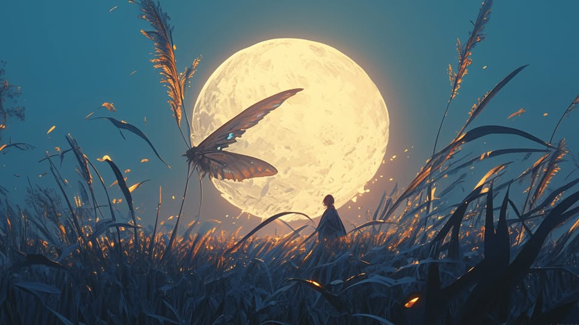
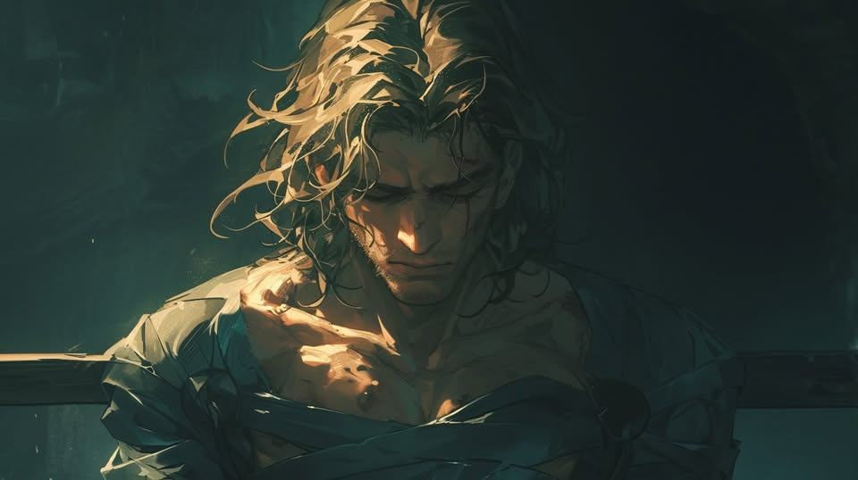
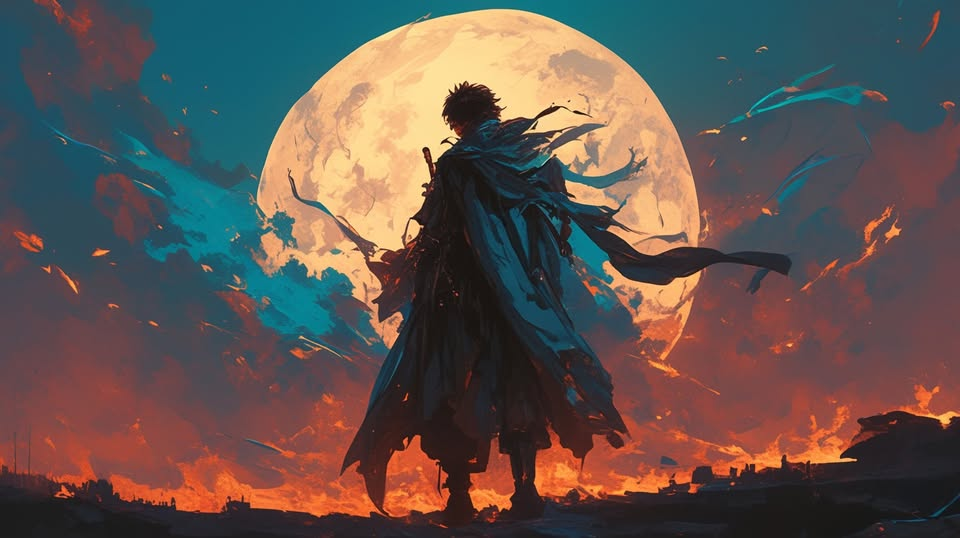

# 🦋 Biography Itheseos 🦋
## Chapter 1

"Around 9 a.m., my scout squad went completely silent. No signal of their trace. Meanwhile, Genesis has dispatched a full fleet to station in low orbit around Kathre and is currently constructing an orbital elevator. It seems they intend to engage us in a war of attrition and keep us tied down here."  
"Then let's make one last try before they can establish a foothold." Lady A pauses for a moment on the screen. "Regardless of the outcome, you must head to Empyrean. Don't worry, according to the Oracle, the Fate Index will eventually return to Lady Moon's embrace. As for the Saint, under Lady Moon's Nightveil, no one will be able to find her."  
The call ends. General K stands up, straightens his wrinkled clothes, and strides out of the command cabin.  
**Kathre**
"Move, move, move!" A group of interstellar scavengers hurries through the jungle under their leader Ken's urging. As the trees thin out ahead, they stop at the border of the Devil's Grassland. The grassland is filled with waist-high Blade Grass, which not only silently devours flesh but also emits a glow that impairs vision. Older mountain folk call it the Devil's Mouth because beneath the grassland lay a labyrinth of intertwined caves. A thousand-man squad falling into one of these could vanish without a trace.  
"Check your gear, guys. This job can earn us a nine-figure sum, enough for us to live in luxury in the Indolce for 500 years. Stay sharp!" Ken gives his usual pre-mission pep talk. This group survives by selling out their teammates; living another day meant profit. It is a cutthroat existence, but fair in its own way. Ken's longevity in the interstellar wasteland isn't due to luck; his unknown lineage grants him a bizarre ability to sense fortune and avoid danger. Initially, he had no intention of taking the Genesis's mission. The Aurora Order and Genesis are in fierce combat, and he is already a wanted man by the IFOB. Getting involved could be a death sentence. Yet, whenever he thinks of a refuse, his bloodline ability kicks in, causing massive nosebleeds, signaling that refusal would likely lead to his death. To survive, he accepted the job. Clearing his mind, he tightens the rope around his waist and begins the search with his crew.  

---  
“A! A! Shubulu! Fhtagn! A! A! Shubulu! Fhtagn!”  
The wind blows through the Blade Grass under the moonlight, its leaves emitting a cold halo as they sing a joyful sharp swish, celebrating tonight's feast. The Devil's Grassland welcomes its second arrivals for the night.  
"Is this the place?"  
"Yeah. But are you sure it's okay for you to leave the IFOB now?"  
"Gilbert has been impeached, and I don't really care about the mess there. A trip to catch some thieves is a good way to relieve stress. I just hope they've sorted things out by the time I get back. But, Lavinia, what exactly are you looking for?"  
"The Fate Index, a 'door' from my 'sister,' which the Aurora Order has been using as the core of their prosthetics workshop. I want to temporarily take it away, so both sides will at least remain restrained and leave everything to be settled in Empyrean."  
"You really worry too much about them. Hey, isn't the moon a bit strange?"  
Lavinia follows Vidar's pointing hand. The gigantic moon fills her eyes. Amid the rustling and buzzing sounds, the moon seems to draw closer.  
"A! A! Shubulu! Fhtagn! A! A! Shubulu! Fhtagn!"  
In the midst of the mysterious chanting, the moon sinks entirely into the Devil's Mouth, then vanishes as if it were an illusion.  
Suppressing her fear, Lavinia, though trembling, sweeps her sword repeatedly until she finds a cave entrance. The Blade Grass spills red blood, staining her white hair. She feels weaker but still leaps into the cave, with Vidar following closely behind.  

---  
A few minutes ago, while searching, Ken suddenly feels a chill run down his spine. Instinctively, he grabs the rope around his waist, but his nose starts gushing blood. A nearby clump of Blade Grass sways slightly, absorbing all the blood greedily, and its glow becomes even brighter. Ken, feeling a surge of fear, pulls out his dagger and cuts the rope around his waist. With a quick roll, he tumbles into a cave. At the same moment, the moon descends, leaving no one above the ground.  

## Chapter 2

The moon in the night sky vanishes for a few minutes, then a breeze quietly sweeps away the heavy clouds, and the moonlight once again lights up the serene night. A dark red aircraft suddenly streaks across the sky, then more aircrafts.  
"This is Hummingbird. All decoys have been destroyed. I've been marked by K. Nest, please advise. Over."  
"This is Nest. Your flight path has been updated. Drop the package at the designated location and leave at full speed. Over."  
Ending the call, Hummingbird glances at the new flight path and performs a deft cobra maneuver, positioning himself behind his pursuers. He then immediately turns and heads east. The route provided by Nest is perfect, utilizing the terrain for cover, and he arrives above the grassland. Following instructions, he lowers his altitude and air-drops the black box from the rear compartment before accelerating and pulling up sharply. Watching the rearview screen, he sees the grassland explode like a frying pan, with Blade Grass flying everywhere. Shocked by the scene, he pushes the throttle to its limit, and after a burst of speed, he gets rid of all pursuers.  

---  
Vidar follows Lavinia through the complicated tunnels of the underground cave. After walking for a while, he begins to notice more signs of human actions: hooks, ropes, and fragments of clothing. Then, he spots a lighting system and corridors reinforced with unknown materials. This is an underground settlement.  
Turning a corner, he sees a stone door intricately carved with ornate patterns, and a figure peering through a crack in the door.  
"Ken Howard?! Is this your hideout? Finally got you..."  
Vidar's shout startles Ken. He squeezes through the door and quickly shuts it behind him. With a loud "click," the door automatically locks.  
"IFOB, open the door!" No matter how hard Vidar pushes, the door remains still.  
"Let me try," Lavinia says, stepping forward to examine the patterns on the door closely.  
Seeing that the door remains unbroken, Ken breathes a sigh of relief. Turning around, he finds himself in a vast chamber with an open ceiling, allowing the moonlight to shine directly in. There, numerous wooden poles stand, with countless men and women hanging from them. He recognizes some of them as his crew members. Surrounding the poles, the cave is filled with kneeling "people." Strangely, these people have transparent heads filled with liquid, reflecting the pristine moonlight. Numerous pairs of blue-green eyes are staring at him.  
Just as Ken is about to explain himself, a black box falls down from the cave's ceiling, rolling and smashing through many of the wooden poles before coming to a stop in a dark corner of the hall. Some of the hanging people hit the ground headfirst, causing their water-filled heads to burst open and splatter the transparent liquid. Others break their limbs and thrash about wildly on the ground. The underground beings, seeing this, begin to wail and shout frantically, their transparent heads flashing.  
Amid the chaos, Ken crawls to the black box. His decision guided by his nosebleed divination. After some fumbling, he finds the lock—a vintage nine-digit mechanical combination lock. Nine digits. The only nine-digit number he can think of is his potential nine-figure payout. After pondering for a moment without another nosebleed, he inputs the number. The box opens, jumping into his eyes are two bright blue eyes. Upon closer inspection, he realizes they are patterns on a mask, shaped like a butterfly but more reminiscent of a moth.  
Everything around him falls into silence. As he tries to look up, his body refuses to obey. Blood gushes from his nose, his temples throb violently, and in his dizziness, he notices that one of the hanging figures has no shadow in the moonlight. He collapses onto the mask and falls into a deep sleep.  

## Chapter 3

Ken wakes up lying on a makeshift stretcher. In front of him is a man in military uniform, and in the corner are two IFOB agents. Near the door are people from Genesis, identifiable by their equipment. In the middle of these three groups are the underground people, most of the hung people from the poles now lying on the ground, with only a few broken limbs still dangling.  
The Genesis people speak first.  
"Hey, IFOB, aren't you going to deal with the fugitive right there? Aren't you afraid we'll report you for harboring a fugitive?"  
Vidar looks helplessly at Lavinia, who has her eyes closed and seems to be sensing something, leaving him at a loss. Fortunately, K steps in to defuse the situation.  
"There's no fugitive here. You've been running around with the Many-Faced Saint's mask, hiding all over. There's no need to play dumb now."  
Apparently wary of General K's strength, the Genesis people slowly retreat out of the door.  
Ken, still confused, realizes he might be mistaken for the Many-Faced Saint and decides to keep silent to maintain the role. Meanwhile, he secretly looks for the person without a shadow. He just feels the strange on him. Seeing the Genesis people leave, K takes out a mirror and places a miniature model of the moon on it. The moon remains stationary in the center. He frowns, then walks to Ken and whispers in his ear,  
"Saint, the Fate Index is here. Do you know where it might be?"  
"The Fate Index?" Ken is utterly confused. He wonders if it has something to do with the person without a shadow, but as soon as the thought crosses his mind, he feels a warm flow in his nose. The bleed is then absorbed by the mask, like nothing happened.  
"Only the sky knows."  
He blurts out a random answer, but K buys it without hesitation and nods. "Shall we retreat?"  
"Not yet." Ken curses internally, wondering why they can’t leave. He suddenly recalls seeing the person without a shadow was when he fell. He lays onto the ground to look towards the center. Unexpectedly, as soon as he does this, General K shouts.  
"DF-51 incoming! Activate shields, get down!"  
A missile pierces through the ceiling of the cave. Ken loses his hearing instantly, and through the inferno, he vaguely sees the last standing pole. He thinks to himself that there's no need to search anymore. Once the aftermath subsides, Ken pushes off the body of General K, who had shielded him, and crawls to the pole. Using all his strength, he unlocks the chains, and the legless boy hanging from it falls onto his back.  
At this moment, he sees Genesis troops entering the passageway to clean up. Driven by a strong survival instinct, he puts the boy onto his back and heads toward the two IFOB agents. He gambles correctly, as the white-haired woman on the other side protects them as well.  
The Genesis troops block the doorway, ceaselessly throwing in gas and incendiary grenades. The fire mixed with the toxic gas rapidly spreads, and Lavinia's breathing becomes labored. She speaks coldly,  
"Whatever you are, since you’ve stolen the power of the Keeper of the Moon-Lens, you can't hide from me. If you don't act now, none of us are getting out of here."  
Ken seems to hear a sigh, and suddenly, the mask is taken from him, and he feels a weight lifted off his back.  
"Alright, alright. Give the mask to the true Saint."  
The boy on Ken's back awakens at some point, and the mask in his hand seems to come to life, transforming into a cloak, a veil, and even two metal prosthetic limbs. The veil cannot hide the boy's handsome face. He smiles and elegantly reaches up into the air, and the moonlight from the cave ceiling, overpowering the flames, falls on the surviving people. Ken feels as if he has suddenly plunged into icy water, his mind clearing instantly. He watches as the boy picks up two Eclipse Shotel from the underground people and heads toward the door. It's dangerous! Ken thinks, quickly following up.  
Outside the door, Genesis troops lie scattered, asleep. The boy gracefully cuts their throats one by one. Seeing Ken follow, he hands one of the knives to him. Ken, understanding the gesture, takes the sword and helps end the nightmare, returning to the hall.  
"Could you two give us a lift? I need to take our new General K to Empyrean," the boy says, pushing Ken forward.  
"Sure, but who are you? The Many-Faced Saint? An underground person? The Moon-Lens? Or a God-thief?" Lavinia asks, her gaze intense.  
"Call me Itheseos, just an ordinary mortal blessed by Lady Moon. Given my age, you could call me little boy."  
Lavinia's eyes become even more piercing.  
"Okay, okay, I simply helped the Lady steal some pocket money from Her mother. As a result, I earned the Lady's favor and became Her new apostle. She gave me the named 'Night.'"  
"Why did my 'sister' start this war?"  
"The Lady needs us to tell Her story, to spread Her kindness and wisdom. She also needs us to recite Her name to achieve Her eternity. We never sought war; it was fate that taught Her followers to resist, while truth urged Her followers to let go."  
"Truly, learned a lot. Mr.Index."  
"'Night', for the correction."  

