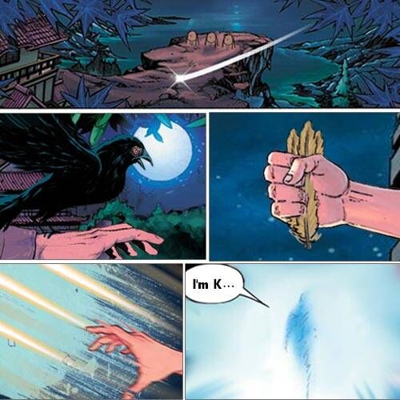
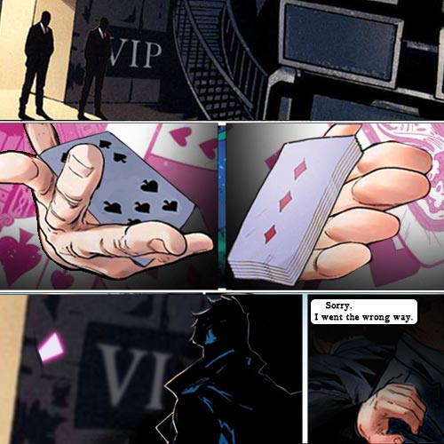
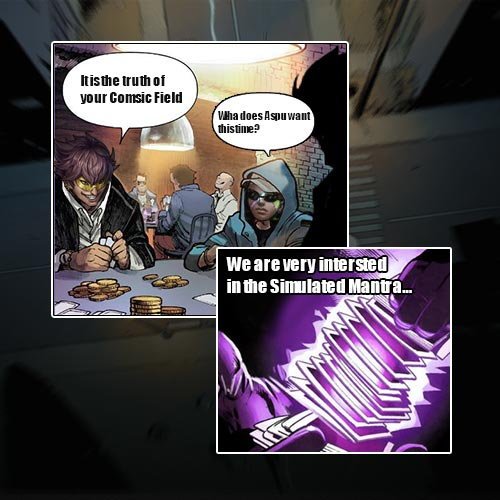

# Biography Kapoor
## Part 1

An Oriental man in a robe is teaching a group of children in the dojo.
Outside the dojo is an open training ground. The ground is full of targets of different heights. There are several weapon racks at the edge. One of the weapon racks is hung with a wooden card, which says 'throwing concealed weapons for practice' in ancient font. Some strange items are stacked on the other shelves, including metal playing cards of different colors and sizes, alloy marbles of different colors, metal feathers of different lengths and thicknesses, a whole box of nanoparticles, a complete set of special scalpels, etc.
"More important than talent is practice. If you don’t practice basic skills, you can’t control non-standard hidden weapons. For us, any mistake is fatal."
At this time, a mechanical bird flew into the dojo and interrupted the man's speech. The man raised his left hand, and the mechanical bird flexibly stopped on his arm.🐦
"There is new information." the mechanical sound came from the bird.
After the children left, the man took out a bead engraved with the word SSS, and immediately conjured 12 mechanical feathers. He threw out these 12 feathers and eventually the feather disappeared and a holographic projection appeared.
In the projection, a man dressed as a tourist spoke, “Commission No. Scarlet 01, I'm K. Target has been found, the suspect is human, and AAA has also taken action.”🃏
After the message was played, the projection contracted and turned into a bead. The man murmured to himself, "Hey, interesting, really want to know how much the Religion is willing to pay for this news.”

## Part 2

🪐FreeStar  🍻All Saints Bar
A slightly drunken man was stumbling over to the VIP section, just as he was about to enter, two bodyguards appeared and stopped him.
“who are you? Why won’t you let me go to the washroom?”
“Get out of here.” The body of the bodyguards has obviously been remodeled. 
The drunken looked up at the sign and suddenly realized something, “I got the wrong place, sorry guys.” He patted the bodyguard on the arm, turned around and left.
What the bodyguards did not realize, is that the man had thrown a card right at the VIP sign, which then changed color adapting to the wall it landed on.
...
The drunkard wandered into the bathroom and closed the cubicle door. He quickly turned on the video equipment and headphones, and what appeared in the screen was a scene of a group of people in black sitting and chatting together. 
Amid the group a voice spoke, “We found vessel No. 3, we’ve got to get it back, she is our most precious possession of this century.”

## Part 3

🛬Air Park
"Welcome to Paradise Casino." The two welcome waiters greeted warmly.
A man with a peaked cap and big sunglasses walked down from the aircraft.
“Lead the way.”.
🗝️Private luxury room.
Two men sit at both ends of the long gaming table.
“Dr.$age, you got the news too. Right? Just name your price.” The casual man broke the silence.
“If it’s still going to be to the same stuff, then we’ll just use the same price. You didn’t call me over here just for that, did you? K. “
K heard that and chuckled, a card flew towards $age and stopped right in front of his face, this mechanical card then projected out a picture.
$age glanced at the picture, his pupils narrowed and exclaimed, "Is this what I think it is?”
“Yep, it’s the ultimate truth of the cosmic field.”
"Tell me, what technology does Apsu need this time?”
“We are interested in the Simulated Mantra Technique.”

