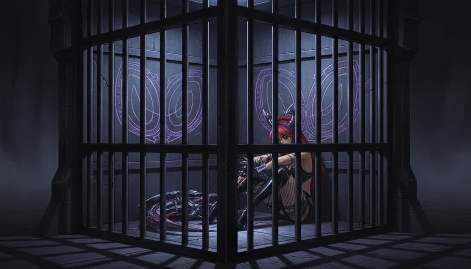
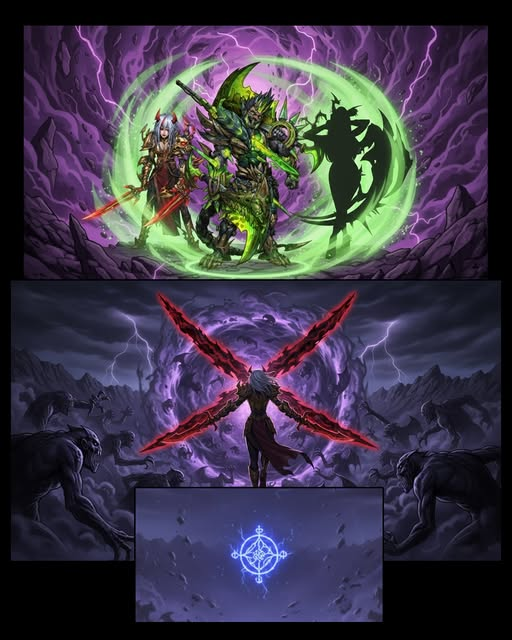
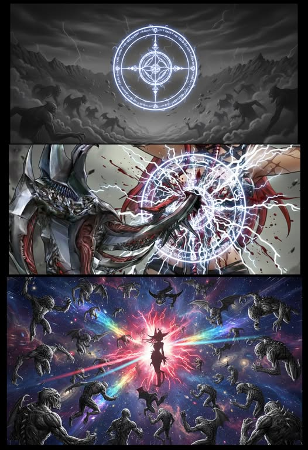

# 🦇 Biography Karena🦇 
## Chapter 1: Call of Sin Cage, Decree of Ultimate Evil

The alloy cells of the IFOB Death Star Prison were colder than underworld iron, untouched by time. Anti-magic runes carved into the cage bars slowly devoured the last traces of ambient energy, leaving the air heavy and inert.  
Karena leaned against the bars, her fingers repeatedly tracing the edge of “Iris Wing”. The crescent blade had been forged from the shattered bones of her own bat wings. Torn remnants of membrane still clung to the bone hilt, while dark crimson veins crept across the blade like sleeping serpents, pulsing faintly with her breath. It was the last thing she had left—her pride, her obsession, and the only proof that she had once been an interstellar black market hunter.  
Three years prior, the memory stabbed like poison thorns: hired anonymously for a border outpost job, she arrived to find only frozen corpses and looted ruins. Before she could process it, IFOB descended. Branded with "classified intel theft and civilian massacre," the charges sealed her fate. Life imprisonment followed, an inescapable sentence. At the thought, murderous fury surged in Karena's eyes, shattering the silence. Her pale cheeks flushed with eerie crimson, lending her a predatory vitality amid the frigid cage, like an executioner reborn from the corpse pile.  
The electromagnetic lock on the cage shrieked to life, and the heavy alloy door slid open inch by inch. Several guards stepped in with guns in hand, their weapons inlaid with silver warding inscriptions, muzzles trained on Karena’s vitals without a hint of slack.  
"Karena, your chance has come." It was Every, carrying a summons issued under the Plan of Ultimate Evil.  
Across the galaxy, void creations were spreading unchecked. The AAA Cult and multiple consortium powers had flooded space with crystallized void knowledge, leaving aberrations in their wake. IFOB forces were stretched thin. Their solution was simple—select controllable assets from death row and let them earn redemption through blood.  

---  
Chained and escorted to a temporary forward base, Karena found Gilbert already waiting.  
"Don't look at me like I'm prey," she snapped, jerking against the restraints. "Iris Wing" slid free, shadow energy howling toward Gilbert, only to collapse the instant it struck Every's blade.  
Gilbert slammed a metal collar onto the stone table.  
"You keep claiming you were framed. This is your chance to prove it. Put on the controller. Suppress the void unrest in the Shattered Star Belt, and we’ll clear your name."  
Humiliation and hatred surged, but her obsession burned hotter. To wash away her stain. To drag the true culprit into the light. Karena locked eyes with him. After a long silence, she nodded. The rattle of chains marked her submission, also the opening note of revenge.  

---  
When they arrived at the Shattered Star Belt, space itself was stained a corrupted violet. Void coagulation nodes clung to drifting debris like malignant tumors, their energy fields tearing fine fractures through reality. Aberrations staggered along the seams, murky power churning beneath their flesh, their howls filled with mindless agony.  
“Iris Wing” suddenly trembled. The blood-veins along the blade flared, Karena’s eyes burning crimson. “This presence…” she whispered. “It’s the same as that day.”  
Karena leapt into the rubble without hesitation. Shadow energy carved through several aberrations, but the blade's momentum faltered under chaotic void currents. Runes and mechanized artillery followed, boxing her in. Just in time, Misteltein and Every cut in to cover her flank. Their forced alliance, born of chains and necessity, plunged into battle amid shattered stardust.  

## Chapter 2

The battlefield was engulfed in void currents and shadowed miasma. The underworld-like silence was torn apart by artillery fire.   
Every stood at the center, his unrestricted system running with surgical precision. A faint green tactical halo shimmered around him, marking weak points and transmitting crystallized interference data directly into his allies’ minds.  
Karena moved with “Iris Wing” in hand. Void energy drew cold crimson light from the bat-wing blade as her shattered wing remnants trembled with each motion. Instincts honed through black market hunts resurfaced, sharp and ruthless. She surged forward along Every's marked trajectory, shadow energy coalescing at her blade's edge. Each swing carved a razor-thin arc, slicing straight for the mechs' energy cores and the cult priests' rune nodes.  
Misteltein vanished into shadow. Like an unseen reaper, she slipped through enemy gaps. Poisoned shadow daggers flashed, claiming isolated priests and mech operators. She struck once, vanished instantly, and left only collapsing bodies and spreading toxin behind.  
The squad moved with flawless coordination, clearing the remaining enemies with minimal effort.   
Every switched his unrestricted device to detection mode. The sensors pierced dense void interference and locked onto an energy source buried deep in the rubble pile. "That sigil matches the prior fluctuations," he said. "A dimensional-class void construct, highly prone to spawning aberrations. It's the source feeding the Shattered Star Belt."  
"Well done." He converted the device's output into a focused disruption beam. Violet light erupted.  
The shockwave hurled them back, but the sigil remained intact, rising slowly as space twisted around it.   
A gate of purple mist forced itself open.  
Thick purple mist rolled in, carrying the shrieks of aberrations as hordes poured through the gate, far outnumbering everything they'd cleared before.  
Every reacted instantly, shouting: "Misteltein!"  
Misteltein shifted her blade grip, her form dissolving into shadows.   
A cold feminine voice cut through from ahead: "Follow me."  
In the next breath, her shadow power surged like an ink tide, carving a lone bloodpath through the aberration swarm. She then vaulted upward, twin blades crossing in a shadowy X-slash, shattering the sigil and sealing the mist gate.  
But in mere heartbeats, the aberrations that had already surged forth swarmed the Shattered Star Belt, boxing the trio in the core zone.  
Worse still, Misteltein had burned through her shadow power to destroy the sigil. She staggered on landing, twin blades slipping from her grasp as blood trickled from her mouth, leaving her combat ineffective.  

## Chapter 3

Misteltein lay powerless, twin blades lost, curled behind rubble with a killer's grim endurance. She barely blocked the lunging aberrations with her arms, wounds multiplying fast.   
Every stood pale from sustained energy drain, his green glow flickering unsteadily.  
Karena wielded her "Iris Wing" to shield the fallen pair, wingbone sickles trailing faint red light against void drag. She slashed and thrust on instinct alone, her coat torn to shreds, never retreating a step. Amid the aberration sea, the trio clung to survival, every second brushing death.  
Just then, an interstellar warp surge rippled from afar. Several IFOB warships burst through the stardust, their cannon barrages raining meteors onto the outer aberrations.   
“Reinforcements!” Every’s eyes sparked with faint light as his unrestricted device locked familiar signals: Varen and Elena charging in with support forces. Then Varen dropped from the sky, slamming down his massive shield to guard the trio in the core zone.  
Reinforcements turned the tide instantly. Outer aberrations fell one by one, and the encirclement pressure eased. Varen rushed forward to lift the exhausted Misteltein, while Elena handed Every a fresh unrestricted device.  
At that moment, from beneath the rubble, violet light surged. A second sigil rose, more condensed, more complex, radiance engulfing the entire Shattered Star Belt.  
"Two sigils? No region ever spawns two... and this pattern... it's completely unknown." Every's heart sank.  
The radiance froze the reinforcements in place. Varen and Elena activated auras to resist the suppression, barely shielding those behind them. Misteltein found her unable even to open her eyes. Every poured everything in but couldn't mark a single weak point.  
This was the true trap of the Shattered Star Belt: lure people to break the outer sigil, then trigger the inner one upon reinforcements' arrival to wipe them all out.  
Karena was crushed by the radiance, yet her obsession with vengeance burned like wildfire. Seeing her allies bound, she made her choice. With raw will, she shoved back the nearest aberration and locked eyes on the hovering core sigil.  
“Suppress us? NEVER!”  
Karena's remaining wing stump trembled. She sprinted, leaping from aberration to aberration, using their bodies as footholds. The single remnant membrane beat desperately as she seized the floating sigil.  
She aligned "Iris Wing" with her chest and sigil core. Bat-wing stumps burned with violet resonance, ancient madness surging through her blood. Karena drove the blade into her heart without hesitation. Flesh tore, sigil shattered. Crimson-violet light ripped the sky.  
Suppression snapped. Counterattack launched. Varen charged toward Karena.  
On the ground, Karena convulsed violently. Sigil fragments sank into her blood, dark crimson veins sprawling like vines across her skin. Blood hardened into a silken shroud over her form. Bat-wing stumps fused with "Iris Wing". The blade pulsed living arteries, and hilt tendrils bound her wrist in symbiosis. Blood-flesh encased her head in a gothic hat, scarlet eyes alone piercing through. A dark crimson halo unfurled instinctively.  
Then the entire battlefield froze. All aberrations locked in place, paralyzed like IFOB had been suppressed, unable to attack. Reinforcements and squad purged them swiftly. When the last aberration collapsed, the battle of the Shattered Star Belt came to an end.  

