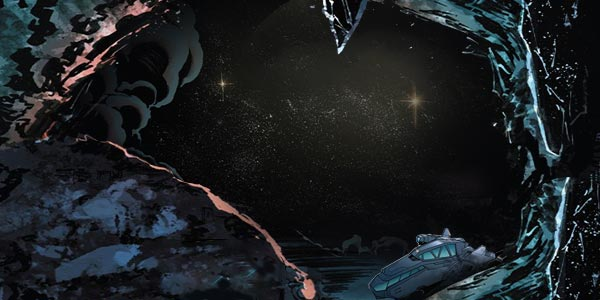
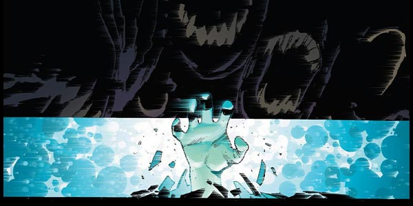
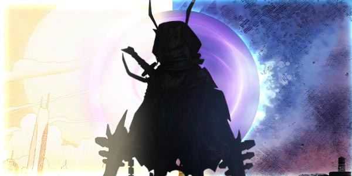

# Biography Lamia
## Part 1

🕸️The Heart of the Abyss
After passing through the mutated organisms only silent darkness was left.
At the Heart of the Abyss is an endless darkness, like a tide of blackness swallowing everything in its path.
Some soldiers were rescuing a wounded woman in an rundown aircraft. “Lamia, was everything that you did worth it? Sacrificing hundreds of lives just to know the biological mutations of the abyss.”
“Was that worth it?” Lamia spoke with a weak voice, “If these biological mutations were not found, then there would be no way to reverse the mutation itself and the lighthouse would fall soon after.”
The very thought of this made Lamia clench on to her necklace, which contained her newly developed anti mutation serum.
The atmosphere became cold, crowds of people became immersed in terror and despair after being transformed by the mutation. Then all of a sudden a pair of red scarlet eyes appeared in the darkness of the abyss, after which followed a thousand more all opening eyes simultaneously.
A terrible unknown entity had awakened.

## Part 2

The sound of countless mosquitoes buzzing in the head, which awoke Lamia to a splitting headache.
Her eyes had not opened yet, but her mind was cluttered with countless thoughts. All sounds could be heard crystal clear as if they were really close, she could even hear the sound of bug wings flapping at hundreds of meters away. 
Lamia opened here eyes with a frown and found herself in another world.
Her hearing, sight, sense of smell, power and agility had all reached a level of superhuman.
A broken limb stood on the ground before her, her whole team had turned into mummies. What happened? She touched her chest only to realize that it was empty. She then tried to recall what had happened, and realized that she had had no memory. All that was left was a thirst for blood.
“This is strange”, she thought, “why is it when others get infected they lose their consciousness, where as I still have mine? Is the serum working?I have to get back... to the Lighthouse.” Lamia struggled to stand and headed for the spacecraft, as she struggled she could hear a voice coming from the Abyss Core calling out to her.
“Come back, come back, you now belong to the darkness, come merge with me, come into the chaos, let us overturn the LightHouse together and create a new order of rule.”

## Part 3 Light House

Researcher Lamia was labeled as “lost” 7 days ago, her tracker’s signal shows a route that ordinary people cannot cross.
“Lamia has most likely been infected, this proves that that anti-serum is ineffective...”  a young researcher with glasses was looking at the research report.
“ No, Wright, look at her route, only a conscious organism can make that strict of a path.“
Dr. Ron’s face turned pale as he looked at the display panel, his fingers trembled slightly, while depicting the lines.
“She’s definitely still alive...just in a different form.”
Abyss
The Human Base cannot accomadate any other alien species. Lamia would know that policy better than anyone else.
This is the 13th day at the Abyss, this occurrence presents danger and opportunity. Over here, Lamia can get closer to the thing she has been researching at the Light House for so many years.
“Now I see...the transformation is not changing genes, it’s changing at will. For example, a bee can turn into a plant...or sometimes a local change can occur.”
This discovery overturned all the speculation of the lighthouse, and the legend of the base about Ythogtha spread by word of mouth, maybe it’s not legend afterall.
Outside the human base, in the abyss where genetically mutated creatures are rampant, Lamia chose to guard the lighthouse in her own way.

