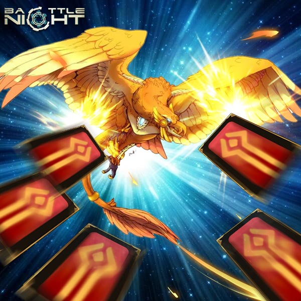
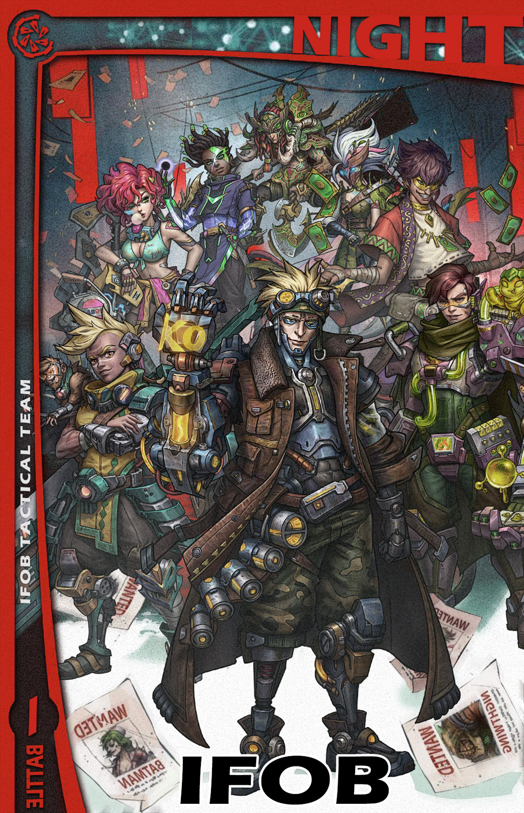
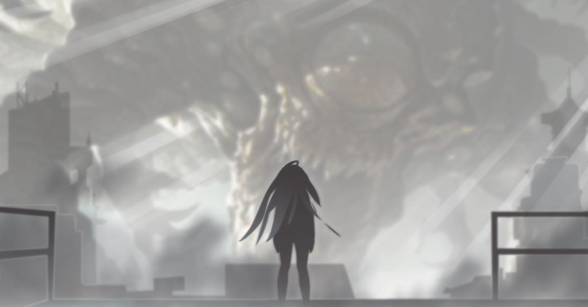

# Biography Lavinia
## Part 1

This here is a huge red crater. The soil and rocks inside seem to have crystallized due to the high temperature, exuding a dangerous atmosphere. When standing at the edge and looking into the bottom of the crater, it would seem as if the light is somewhat distorted.
A blue Starry Swallow flew by right over the red crater. It suddenly began to stir its wings violently and struggled to fly out of the crater. It failed and its body began to grow bigger, its tail had grown longer like a snake, its blue feathers had turned red, its wings had grown out claws and its beak had changed into that of an eagle’s. Then, it beamed, found its prey and dived towards two humans near the crater. One of them threw out five red metal cards, and the star swallow fell directly after being hit.
The two then carried on with their conversation, as if nothing happened.
“Hmm, this power, it’s truly from her, I feel like I knew nothing about the universe right now.” $age said.
“I understand that feeling. Now everybody is laughing, it turns out Dr.Sumio’s theory was right, but your Hero League took him for a lunatic and drove him away.”
“Before the truth is revealed, anyone can make a mistake. Anyway, enough about that, where can we find her now?”
“Follow AAA, ‘faith always guides them in a direction’.”
“Is it just us?”
“Do you think your offer can monopolize this information?”
“Who else did you sell it to?”
“IFOB.”
“……I hope I still have chance to invite her to collaborate with me on some research, honestly speaking, I have absolutely no confidence in this right now.”
“Hahahahaha, I will pray for you.”

## Part 2

“Bang”, the door opened, Shreatah entered the room gasping for breath, looking at Mikaela who just put down her tools, and said，
“Scarlet ... 1 ... has ... appeared.”
“Where?”
“Boehler, also the AAA, they fought, and made a pretty big racket.”
“That close to The Vortex? Inform Boomer, the rest act immediately.”
——
Several giant warships were hovering over Boehler, with their cannons aimed at the ground. On the ground, a white-haired girl was confronting a group of people in black robes, it’s just a temporary confrontation. There was a mess around them, full of broken and crystalline red rocks, prostrate black plants, indescribable creatures with countless eyes on their bodies, and a number of bodies of these bat-like creatures.
“No.3, no, Lavinia, consider our proposal, return with us, you’ve got talent, you are better than your father, he will be at your disposal.”
“Nice proposal, but I love to travel a lot. Like this time, I was attracted by The Vortex and travelled all the way here. Now, I think I can revenge while traveling!” Before she finished speaking, she charged towards the black-robed man with her big sword. 
As soon as the black-robed leader waved his hand, the rest of the black-robed men retreated, after which several beams of light were shot from the sky straight at Lavinia. In this bright white light, Lavinia then gradually disappeared.
After the light dissipated, a huge pit was left, and the black-robed leader slowly approached the pit.
“Whoosh, whoosh”，6 red metal cards were shot at him, but he quickly jumped away, dodging the cards just in time. He looked in front and saw 2 men jump down off an aircraft, it was $age and Kapoor. As he was about to speak an explosion occurred from above, apparently their warships had gotten into a dogfight with other unknown warships. Looking carefully he saw, that several more aircrafts at high speeds started flying towards him, and he took a step back unconsciously.
Soon, he finally could see who it was. There, jumping off the aircraft one by one was Gilbert, Shreatah, Vidar, Mikaela, Legolas, Rhaegal and more.
“IFOB.” His voice finally shaked.

## Part 3

Lavinia, who had just regained consciousness, found herself whiffing a familiar smell of formalin, oil and blood.
“I hate this smell.”
She opened her eyes and saw a familiar place, she was lying on her father’s lab table.
“I hate this place.”
Feeling a little rejuvenated, she tilted her head to look at the monitor, she squinted her eyes and read the keywords, “Sacrifice”. 
All of a sudden she started to feel agitated and angry.
“I hate that word.”
Just then, the door opened, a middle-aged man dressed in black had entered the room. There was a strange blush on his pale face. He seemed very excited, as he approached Lavinia with a bottle of red liquid.
“Come, my dear, this dragon blood should be more than enough to help you complete this ceremony. Our God is about to descend!”
“I hate this man, I hate his tone, I hate this ceremony, I hate his expressions, I hate this god, I hate everything here….. I want to leave here, yes, I would like to go out.”
Bang, everything around had solidified in an instant, space had broken like glass, and in between the shards of space were these thick eyes peeping from everywhere. Very naturally, Lavinia made eye contact with one of the eyes, and in an instant, she saw the history and truth of the whole universe, which was then followed by a severe headache. This pain gradually blurred her consciousness. She only could hear a dragon's roar, feel a connection with something, after which everything went calm.
——
When she opened her eyes again, she found herself at the bottom of a pit, and then recalled what had happened previously. She tore off the ripped coat and stood up, it seemed that the wounds had all healed up.
“Phew, yet another nightmare.”

