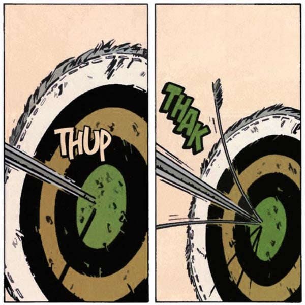
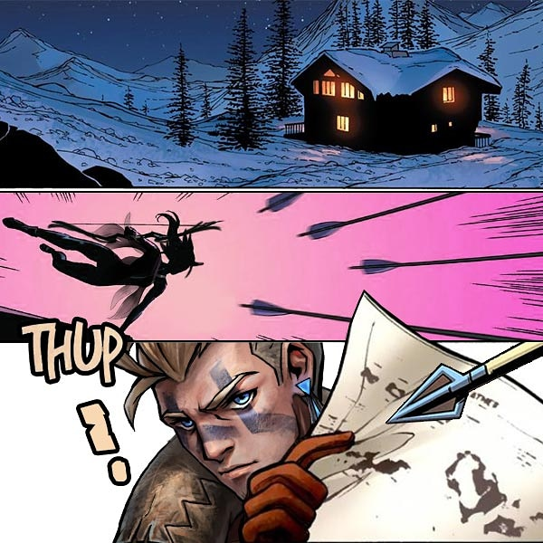
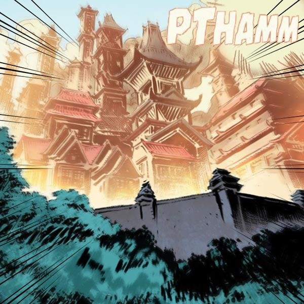

# Biography Legolas
## Part 1

The blade of the sword broke through the air with a whistling sound, a perfect bullseye
Legolas withdrew his arrow, finishing up on the day’s training session.
At that moment the sun had just risen.
The sun shone all over Diana Temple, exposing all of its glory and sacredness.
Birds were singing in the forest, and life begun with people embarking on this new day.
A stable peace was kept so well, that it seemed like no secular disturbances would ever fall upon the people living around the Diana Temple, all was peaceful and serene.
Legolas, looking at the Temple, sat down, gazed at his Goddess and devoutly bend his head down towards the ground with his arms crossed over his shoulders and said: “I will protect your people.” 
“Legolas, a stranger from the tribe is heading towards the Temple now.”

## Part 2

A person in rags approached, his face was covered in dirt, making it difficult to make out his face.
Legolas equipped her bow with an arrow, as she was wary of the approaching stranger.
“Why don’t you put away that dangerous thing of yours.” A familiar voice came from heavily cloaked fellow, it was the voice of the man who had disappeared 3 years ago.
Legolas lowered her bow and gasped with a joy of relief: Raphael! You’re back!”
Raphael chuckled: “I would like now to drink that wine I buried a few years ago”
Legolas was astounded at his appearance: “How did you end up like this?”
“On the way back I encountered battle between one tribe and the Lion Ape Tribe. I managed to save a few people. Quick! Help me carry them back to the village”

## Part 3

“Did you see Vidar of the Lion Ape Tribe?”
Legolas frowned with disdain: “He is a little kid.” 
“He is not some ordinary boy, it seems like these past 2 years the Iron Forest hasn’t been able to keep the peace.”
“Any war chaos shall not befall on the Diana Temple, this is the law of the Iron Forest”
“What if it’s not just the Iron Forest”, Raphael murmured as he gulped down his cup of wine, and then for a moment took a good look at Legolas: “It seems, even those fallen in Bifrost recruit troops. They don’t care about the Temple.”
Legolas stared at Raphael in silence
His tone then sank: “I have a feeling, that no matter what, something big is about to happen. Legolas”

