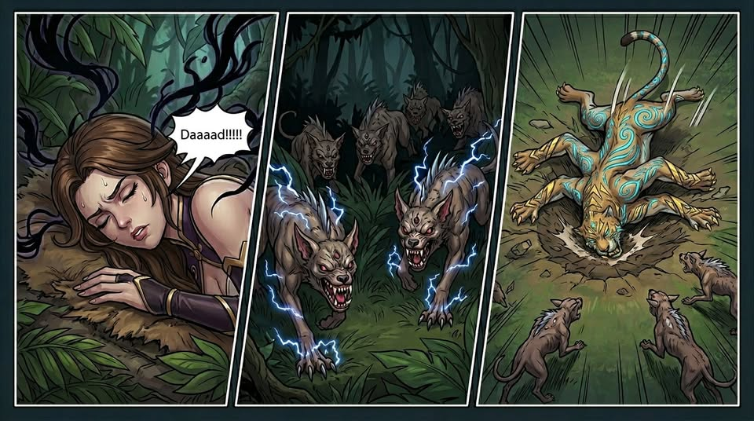
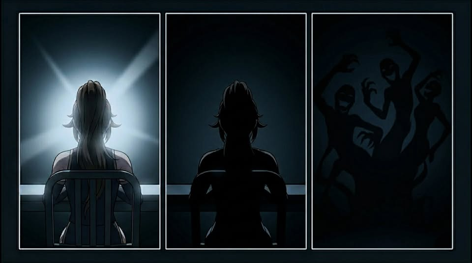
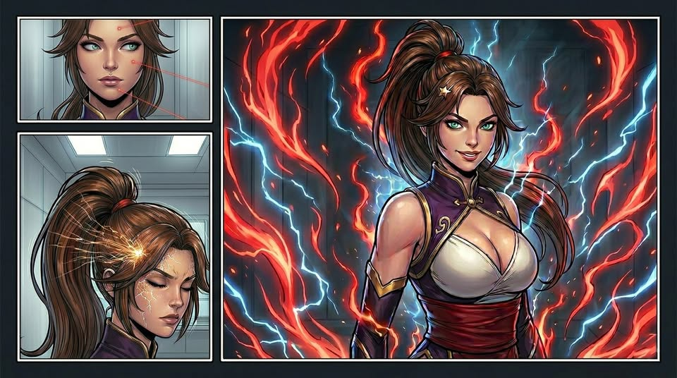

# 🪭 Biography Li Yu 🪭

## Chapter 1: Hell Below

The energy current tore her apart. In the endless tunnel, her consciousness splintered as data torrents flooded each fragment. Her sense of the three-dimensional world collapsed into nothingness. She fell into an “anomalous” jungle. Pain jolted her awake, then darkness swallowed her again. When she resurfaced, the dream returned.  
“An ion beam tore open the helmet. The head vanished instantly. Red and white splashed across the tactical display… Someone dragged her away…”  
“Dad!”Her scream drew the thunder hounds. And Bolkan.  
He tossed the corpse of a six-armed leopard beside the unconscious girl. The lingering sigil fluctuations on the carcass drove the hounds back. That was a survival trick he had learned in this hell.  
It was also the first time he had met someone from home. The girl was clearly speaking Galactic Common, but Bolkan chose to observe a little longer. Caution was the first rule of survival.  
Much later, she woke up. The leopard corpse made her recoil instinctively. After confirming it was dead, she scanned the jungle in confusion, as if searching for something. Her instincts remained sharp. She moved carefully through the trees, then suddenly turned back and hid inside a dense bush—while Bolkan watched silently.  
Dusk fell. The girl never moved. As the sigil aura faded, the hounds returned and tore into the carcass. Larger beasts fought over the flesh nearest the tainted mark. Then a bloody chunk landed straight in the bush. She was about to be exposed!  
Bolkan stopped hesitating. A hammer crashed down, thunder erupting as a hound dropped dead. His second hammer swept out in a ring of fire, blasting several beasts aside. Then the twin hammers collided, unleashing violent thunderfire through the jungle.  
The alpha hound whimpered, and the pack retreated. Even so, Bolkan didn't lower his guard. He kept channeling energy until both hammers finally shattered into dust.  
Only then did the timid voice behind him speak.  
“Dad…? Is that really you?”  
Bolkan turned. The girl's lost eyes overlapped with the memory of his own daughter somewhere beyond this nightmare.  
In the end, he nodded.  

## Chapter 2: Earth Between

“B50, repeat your account of the incident.”  
A blinding white interrogation light burned into Li Yu's eyes.  
“During extraction, the squad engaged enemy security forces. The remaining nine members chose to sacrifice themselves to ensure the client and I could withdraw. Every decision we made was for the client and for the company.”  
“Excellent. The company appreciates your contribution.”  
The light cut out.  
“Although your father died on a mission, his outstanding debts remain transferable under contract. However, in recognition of the exceptional performance shown by both you and your father, the company will waive half. You are also granted one month of paid leave. Recover well.”  
Li Yu rose, stepped out, and closed the door.  
The moment she left, laughter burst from the shadows. Along the walls, distorted silhouettes writhed and twisted.  
“A few lives for a spike in stock price? Hell of a deal.”  

---  
**One year later.**
“A10, repeat your account of the incident.”  
The same white light burned against her face.  
“During extraction, nine squad members were killed in action. I alone escorted the client to the designated location. Their sacrifices were for the client and for the company.”  
“Good. Very good. The company appreciates your contribution.”  
The man across from her ground the words out, then leaned in, voice barely above a whisper. “I know everything you did was to avenge your father. I don't care. Read what's on the teleprompter… or we both disappear.”  
Li Yu glanced at the scrolling text, then lowered her gaze.  
“My mission was completed. The client signed off on delivery. Anything that occurred afterward… is beyond my knowledge.”  
The light cut out.  
Silence lingered.  
After a moment, Li Yu shifted her gaze slightly. In the darkness, a shadow trembled, warped by fear. She turned, opened the door, and walked out without hesitation.  
A synthetic voice crackled over the speaker:  
“So I hear she burned through two full mags in the ICU—impressive. S2, this is what you call elite? A small outfit like ours can't afford liabilities like you. Your contracts have been reassigned to the Sigil Research Institute. Good luck out there… you'll need it.”  

## Chapter 3: Heaven Above

"Welcome to the Institute. Welcome to the Heaven Project. Together, you will contribute to the evolution of humanity."  
Li Yu drifted through the crowd like a tourist, quietly taking in her new employer. To her, every company looked the same.  
The guide moved on with practiced enthusiasm, showing off the luxury dining hall, training facilities, and living quarters. He explained that their job was simple: sharpen their skills, stay in peak condition, and, in time, enter the Heaven Laboratory for core experimentation.  
"Good question," the guide said with an easy smile. "Any cutting-edge research comes with some risk—but this project is built on Dr. Bolkan's latest breakthroughs. Its stability is exactly why he received this year's top Sobel Prize."  
"Regardless of outcome, all debts will be covered by our primary sponsor, Genesis. And for outstanding performers, there's even a chance to become the face of the company—no more debt, no more suffering. One step into heaven."  
"So please, take part with confidence."  
A scream tore through the lab, then abruptly cut off. S2 completed the final sigil carved into his body. In the next instant, his form twisted inward and burst apart, blood and flesh splattering across the walls.  
Li Yu watched in silence. So this was heaven. It no longer mattered. The moment she chose revenge, she had already given up any hope of a peaceful end. If this was where she died, so be it. One last contribution to their so-called "human progress."  
She took a breath and stepped forward.  
The energy current tore her apart. In the endless tunnel, her consciousness splintered as data torrents flooded each fragment. Her sense of the three-dimensional world collapsed into nothingness. And then—  
**108 hours later.**
Li Yu opened her eyes inside a nutrient chamber. 9 years in hell surged back at once.  
"Remarkable, Miss Li Yu. You succeeded." A calm, dignified voice filled the chamber. "You've made a tremendous contribution to humanity's progress. How do you feel?"  
Li Yu turned her head. Nearby stood a heavily modified cyborg, its body layered with high-end cyberware. One glance was enough—just a remote speaker. A puppet with no will of its own. She pressed the release valve. The chamber hissed open as she stepped out.  
Click. Click. Click. Mechanical echoes filled the room. Dozens of gun barrels snapped into place, trained on her. The "speaker" lifted a hand. The weapons withdrew.  
"You appear to be in excellent condition," it said lightly. "Perhaps we should discuss your endorsement contract? In a few weeks, we will hold a global press conference centered on you. All humanity will remember your name."  
Li Yu’s body tensed. Heat pulsed at her temples and near her heart. Miniature explosives—another chain the company thought could control her. Unfortunately, humanity still understood far too little about sigils. Threats like these no longer meant anything to her. But a press conference… that was useful. If her father still existed somewhere beyond this world, then he would see her.  
A faint smile touched her lips. "My honor," she said softly. "But I have one condition. I want EVERY WORLD to witness it."  

