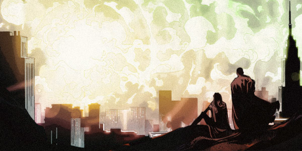
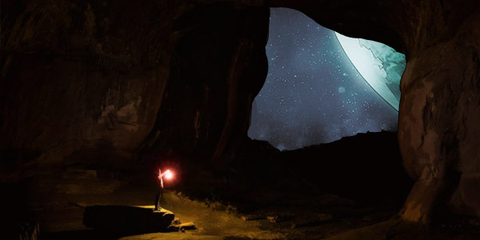
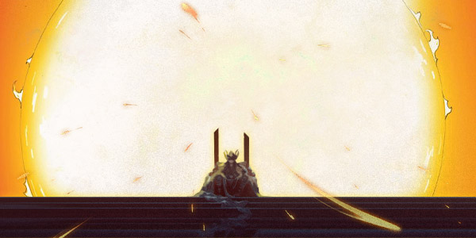
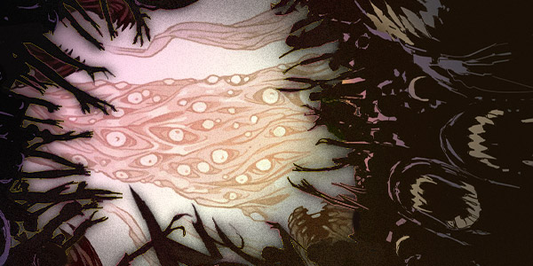
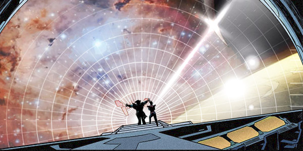

# 🍂 Biography Megalith 🍂
## Chapter 1

🔎**The Aviation Command Center.**  
A young commander stood in front of the screen, pointed to the red 'X' marks on the map and said, "you guys cannot make us go on a suicide mission. Fifteen fleets have been sent there, and not one has returned. There is undoubtedly a stronger civilization."  
"Hold your horses there, Shaka. This is what we are going to discuss in this conference. We didn’t detect any signs of carbon or silicon-based life on that planet; therefore, the life there could be mechanical. Or other forms of life which we humans cannot comprehend.” The talking old man stooped over. He was pretty short but spoke quite vigorously. He then started coughing violently, to whom everyone turned their attention; some of them stared at him with excitement, some with suspicion.  
(Coughing), “Someone just said that they would like to try probing another time. I want to inform everyone. The war has already begun! I announce, that it has begun and that the war decree is now in effect.” The old man took a pose straightening his back. Some generals had different opinions, but they moved their lips failed to say anything.  

---  
⭐**The Monoceros Beta Star, Flagship of Youth Self Defense Forces.**  
“What the hell is that....” looking at the scene, making everyone in the room shudder.  
The entire surface was without any real traces. Black plants grew all over the building debris, and the whole place was just in ruins everywhere. Even from the air, it was visible, by the looks of these magnificent collapsed buildings, that there once stood a remarkably advanced civilization here. Members of the Self Defense Forces in the fleet were unaware of what kind of tragedy had to occur for everything to become like this.  
A shrilling alarm went off; it was the heat sensor that had detected sudden high temperatures in specific areas; observing their detectors, it was as if several volcanoes were becoming active at the same time and as if they were growing in numbers.  
“Where is the nearest anomaly?Let’s go over and see.” The captain quickly commanded the fleet to proceed to the nearest anomaly.  
But once they got there, they could not find anything that qualified as an anomaly. They released numerous drones to survey the area.  
Then all of a sudden a dense fog set in. The alarm started to sound more and more shrill, but at that point, it didn’t phase anyone because everyone had their attention focused on watching their escort vessels melt and evaporate in an instant. And then it started happening to them.  
Any issues with the dust and fog? They probably don’t know the answer to that.  

---  
🌃**Hope City.**  
Right now, Hope City is like a Hell City; buildings are constantly collapsing, all kinds of people are screaming, running all over the place, some are praying, some are just staring at the launch pad of "Ark", some were torturing other people, some would say that this is hell itself.  
A man and a woman were shuttling through the chaotic crowds, avoiding being caught by the security guards. They quickly passed through the collapsed buildings used the ongoing chaos of groups of people to escape from the security’s peripheral view. They finally made it to the launch pad, but unfortunately, they were too late; the “Ark” had already taken off. The people on the ground watched as the Ark ascended into flight, watching the last hope of their civilization escaping.  
But the fog had just set in and the Ark quickly disappeared.  
After a brief silence, the apocalyptic carnival continues and the Evil laughed sinisterly in the dark.  
The girl was the first to return and asked the boy, “Shaka, still hesitating? Getting to the underground is our only option.” She then placed a wooden puppet into the boy’s hands.  

## Chapter 2

“Are you ready?”  
“Yes.” Shaka’s look on his face became serious; he held the puppet with hands firmly and then proceeded to make a chanting sound with his seemingly closed mouth. With this chanting, the ground started to erupt; the eruption became more evident. Everyone was lying on the ground for cover, except for Shaka and the girl who calmly sat across.  
As time went on, Shaka continued to make that clear sound, which started to become louder and louder, people started falling as they couldn’t catch ground anymore.   
“Ok, that’s enough.” The girl stopped everything. “That’ll do for the first time; it’s enough.”  
She then gently wiped off the blood from Shaka’s eyes. "Shaka...My lord, please lead your people to the new world.”  
The girl helped Shaka back up two steps, holding a metal staff. She plunged it into the ground where he was sitting, the earth then collapsed instantly, exposing an underground pathway leading down, the entrance looked like a tunnel dug out from a vast worm.  
Those who were brave came in for a closer look, and then more and more people gathered for a peep.  
“Are we saved? We’re saved!”  
“Long live Shaka! Long live Shaka!”  
“Long live Priest! Long live Priest!”  
The people had once again found their vitality in this shaking world.  
“Let’s go.” Shaka took the lead holding a torch down the path into the underground; observing this underground path, he was also shocked.  
“Lord Shaka, congratulations on becoming the first Dreamer on this planet; you have a talent.”  

## Chapter 3

Shaka sat on a throne in his palace. His palace was made from gold and jade. The palace was glorious, and its decorations sparkled so brightly that they illuminated its surroundings. At the top of palace, a beam of light magically shone through the ground, illuminating the whole kingdom like daylight. Outside the palace, pilgrims were gathering from all over the place, chanting Shaka’s name.  
Far off into the distance, there were buildings made of rock. The kingdom consisted of systematic agriculture. Harvest fields were located close to the light sources, where various aromatic vegetation would grow for harvests; this was the kingdom’s primary food source. Further down was the industrial area. 'Buses' could be seen running on the wide roads, which were half underground and half on the ground.  
It had been a while since Shaka had laid eyes on his kingdom, this time, he wanted to stand up for a better look, but alas, he tried without success. With all his might, he managed to move a finger. Unfortunately, this movement of his finger caused the light source of the kingdom to shake. Just at the moment priest rushed in.  
“My Lord, you’re awake. This here is the new body we prepared for you. You can use this move around.”  
Then Shaka heard a voice came from his throat, which couldn't be identified as a man's or a woman's.  
“Thanks again Tezcat, this will be the last time.“  
“That’s great. Congratulations.“  
Shaka was still pondering about the meaning of these conversations. First, he felt as if he was flying. Then, he saw himself sitting on the throne, which made him feel strange. Tezcat came over and blocked his view. She took out a mirror, which had black smoke fuming out of it; she then dropped a black seed in one of Shaka's robes, leaned over to his ear and said, "My dear lord~ I hope this can help you.” She naughty smiled. It was the first time Shaka saw that expression on her face, and soon after, he lost consciousness.  

## Chapter 4

🌃**Alpha Monoceres, Hope City.**  
Sand had covered up all history; not a single trace of civilization remained, huge boulders were randomly abandoned all over this land. But, only a plant grew on one boulder.  
“Bang”. A probe car came swerving out, driving past the boulder, which was then followed by 'buses' which were half underground, half on the ground, carrying several Tunal people, who were wrapped in armors. Buses were catching up. They kept going straight ahead, smashing all the boulders in the way, and quickly got closer to the probe car. At that moment, the probe car in front didn’t manage to avoid the black branches and flipped over. The buses slowly came to a halt, and the Tunals watched someone came out of the probe car. The leader was a men who held double blades in his hands and wore green armor. The Tunal people looked at him with fury. Still, he warily stared off to the side at the branches emerging from the rocks.  

---  
Shaka felt as if he was wandering in many silent and strange worlds. Sometimes it became a time cycle that kept repeating itself, sometimes he was watching a person keep running, and sometimes it was some meaningless daily routine where he couldn't see any faces. But as these experiences continued, he started to feel more and more powerful. He felt like something in him started to take root and grow inside. No one can say how long went by, but eventually, he began to hear the first sound. The sound became louder and louder as if there was something very fast coming closer and closer to him; he tried to turn over to evade it, but then he felt as if something bound him, he struggled with all his strength, and then the sound stopped. He had succeeded in stopping it, but still didn’t feel safe for the time being. He tried to struggle even more, and then he opened his eyes.  

---  
Little stones kept coming off the boulder, and this apparent unusual situation eventually caught the attention of the Tunal people. From the rocks they saw how a human figure appeared, they recognized the people inside.  
“Lord Shaka!”  
Shaka looked at the Tunal people, he saw the shriveled bodies wrapped in armors, those slender heads and ugly mouths. He felt sick to his stomach, were these really the people that had followed him that year?  
“It’s you! It’s no wonder. It’s good you’re awake. Do you not want to know about all that has happened? To be honest I don’t really know, but I can take you to see how you became this way. I just came from your sweethome. What do you think?”  
The double bladed man offered.  
Shaka looked at his sprouting metal body; he started experiencing a complex feeling of confusion and serenity, which he had never felt before. He was curious, very curious in the offer, so he nodded his head.  
Every was at the front leading the way, Shaka followed, other Tunals followed Shaka, they went back to the cave from which the probe car came out. All the way the Tunal people would give way when they saw Shaka until they reached the front of the palace.  
Every was at the front leading the way, Shaka followed, other Tunals followed Shaka, they went back to the cave from which the probe car came out. All the way the Tunal people would give way when they saw Shaka until they reached the front of the palace.  
Shaka saw the strange plants planted in the ground, which reeked of strong odour, but triggered a strong appetite. He managed to resist this urge and proceeded forward. He saw the dense, shrivelled and long crowds of Tunal people crawling on the ground. They shut their eyes as if they were in sweet dreams. By all accounts, they shouldn’t be able to live on the ground like this, even if the evil dust and fog has already disappeared. Looking up at the ceiling of the underground palace, he saw a stone carved into an octopus. Looking inside again, the throne looked like an illusion due to the darkness.  
“Is this real? I feel desperate .” Shaka didn’t say anything, but made a sound.  
“Desperate? This here is just the tentacles of a sleeping octopus and a naughty avatar of the Chaos. That fog is going to be the real trouble.” Every said.  
“To speak badly behind people’s back is not noble.” Tezcat emerged from the darkness, holding a mirror in her hands. “Boring, boring, I thought you were going to wake the octopus up somehow. Now, since you’re not going to fight, I’m leaving, I’ll wait for you up ahead. Good luck.“  
Every stuck out his sword stopping her in her tracks.  
Tezcat glanced at Every, then laughed some more.  
“All right all right. How about I’ll share with you some information, and you’ll let me go for that. I know the one you are looking for. What do you think?"  
Every with a stern face said, “Go on.”  
“Hahahaha, after witnessing all this, how do you think the Richard family can acquire this Extend technology which is far beyond your era just out of thin air? From exploration?” Tezcat suddenly stopped laughing, and sternly replied, “Every, are you ready to take the consequences of the truth?”  
Every still with a stern face, but Shaka noticed his body shaking uncontrollably.  
“Then, see ya?” Tezcat ignored Every, laughed and walked away disappearing into the darkness.  
After a long silence, Every fell into a melancholy state, turned around and went back.  
Shaka followed and said, “Hey, are you still going to fight them?”  
Every stopped in his tracks, and looked over at Shaka with surprise, “I've heard your legend. After waking up, you’re still the same guy as in the legend. Welcome, Shaka.“  
“Wake up? No, who knows if this all just happening is not another great dream? Shaka is my name in the last dream. You can now call me, emmm, call me Megalith.”  

## Chapter 5

“It’s not easy to meet up with you, Mr. Every. Don’t look at me like that, this was the most suitable body I could find”,  said the young woman.  
“That human alliance, if you’re here about that, then you don’t have to say anything.” Every had set the tone for this important conversation.  
“The fact of the matter is you can’t afford to be indifferent, especially after everything I’ve seen here, I’ve realized that everything is connected. Mr. Shaka, you probably are still unaware, what type of power is in that wooden puppet that she gave you. You’re the only thing in this universe that is not effected by it. Briefly put, once Richard’s family brought the puppet back to the human alliance, the connection was established. We......” She started to sob, but refrained from crying, she then continued saying, “Many many predecessors and descendants were sacrificed to clarify this. If only I had come to you sooner, Irene would’ve made the right call.“  
She breathed in a deep breath, pointed out the window, “Suppose it is as the ‘Apocalypse Recording’ says, that the entire Monoceros is an embyro, then that would mean His matrix is......”She stopped here. It seems that her words terrified herself.  
“Looks like this is more serious than we thought it was, thanks to the Beta Monoceros Civilization for leaving behind this book, we still have time.”  
“Me and Every stayed at Beta Monoceros the whole time, also because of Him, our targets align, there is collaboration to be discussed.” Megalith looked at the dust outside the window and said in a quiet voice.  
“Great, we will save as many people from Oasis as we can, if possible, we hope that they will come here to conitnue our plan. This time Mr.Sobel will stay here, as his knowledge and experience is very important to us.”  
Every nodded his head, looked out the window and said, “Welcome.“  

