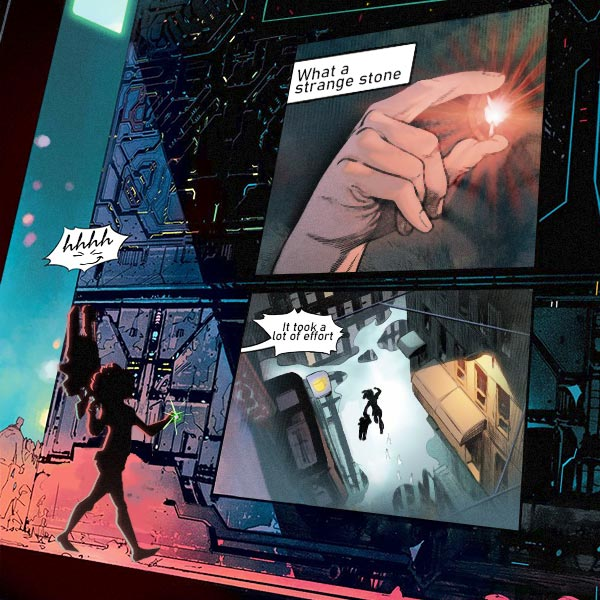
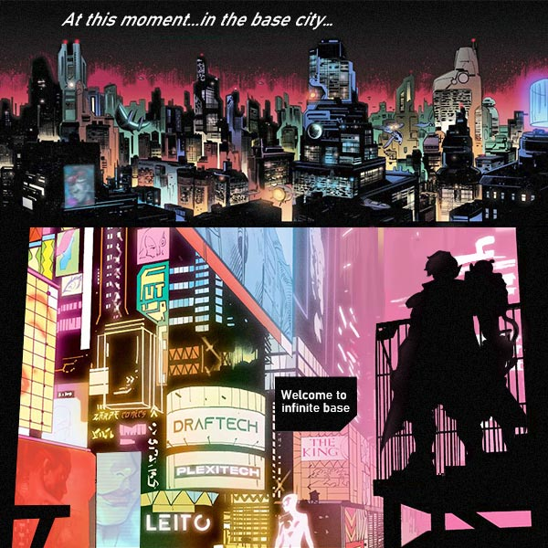
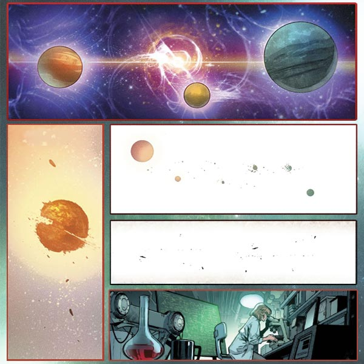

# ⚡ Biography Mikaela ⚡
## Chapter 1

**Ferry Planet**
Somewhere in a basement lab of a Chip Store, Mikaela was whistling a tune whilst studying an unknown raw material under the microscope, she was so focused that she didn’t notice the door open, as she started observing her specimen from another angle, she muttered, “why have there been so many it lately? It’s been so costly for us”
A hand from the darkness stretched out and grabbed her by the shoulder.
“Ahhhh!” Mikaela screamed, “who is that! You scared me half to death!”
She looked back and saw a red headed boy waving at her, “hey Mikaela, long time no see, I missed you”
“Get out of here, aren’t you supposed to be at that Frontline Base? Why did you come back?". Mikaela swatted the boy’s hand away. 
“It’s the Infinite Forward Operaing Base”, at that the boy then snapped his fingers, at which two military officers carrying a box walked in, “I have come here to show you this. Because after all, you are a nobody in the black market now.”
“I knew that you wouldn’t come over to see me”, even though Mikaela was reluctant, she went over to look in the box, in it was a rock of some sort with no clear outline, “is this a high dimensional matter?”

## Chapter 2

**Ferry Planet** 
“Brat!”
“Crying Ghost!”
“You and your disgraceful dad should take a hike.”
In a small alley, a group of kids were bullying a boy by throwing rocks and mud at him and by kicking and beating him. The boy was curled up in a ball, covering his head with his arms from the beating on his head (red hair), the scrawny little boy could only utter one sentence “ I can’t let you speak like that about my dad.”
“Hahaha”, responding with an even bigger laugh.
“Stop it you guys.” The group of kids looked at the entrance of the alley. Against the light, they could only see the back of a girl.
“Let’s get out of here. The evil Mikaela is about to arrive.” The kids were then driven away by the girl, only the curled up, red headed boy was left.
A girl then walked up to the boy, helped him up and patted the dust off of him, “Don’t worry it’s all over, let’s go home now, uncle is waiting for us at the dinner table.”
“I want to become stronger, so that one day I can protect Mikaela and dad.”
“What are you saying?” The girl tilted her head to look at the boy, his eyes were lit with fire.

---
Deep in the Skeleton Sea, there is a gradually developing space-time vortex, in this tranquil universe, this vortex seems to be slowly devouring the universe. On a planet at the face of a vortex, troops of all types of uniforms were coming and going, and an endless stream of material ships and transport ships of various forces. 
“Welcome to the Infinite Forward Operating Base. What do you think of the view here?”. Shreateh pointed at the vortex outside the window.
“Is this the officer treatment you were talking about? if I don’t help uncle to prove him experiment is right, I wouldn’t have cared about your alliance what so ever.” Mikaela glanced at her very clean but cramped room, ignoring Shreateh’s awkward look, she went on to exclaim, “as usual, I’ll be sleeping in the bedroom, and you’ll be sleeping in the living room.”

## Chapter 3

🌏 **Biography — Universe Particle** 🌏

What made Mikaela popular in black market is her knowledge about High Dimensional Matters (HDM). Universe Particle is one kind of HDMs. When the matter from a high dimension comes back to the 3 dimensional world, matter of other universes expand and contract in the chaotic dimension after passing through multi-dimensional channels. Most forms of matter cannot make it through this trip of dimensions, but just like the big bang, these particles must go through a process of entropy, high dimensions gradually then become into 3 dimensional ones, during this process, channels solidify and parallel universes are then connected.

"I have seen the truth of the multidimension universe, but I have no words to describe any details of it. "     ——Dr.Sumio

