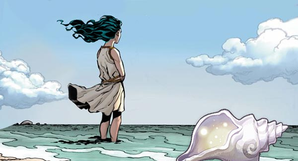
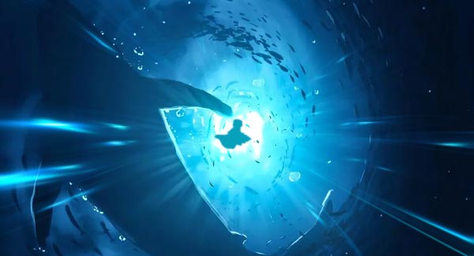
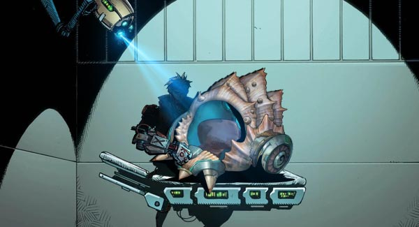

# 🌊 Biography Moana 🌊
## Chapter 1

🏝️On a lonely island lived an old fisherman named Ade. He longed to have a child, so he made wishes to the sea every day.  
One day, the old fisherman found a giant conch shell with exquisite patterns on the seashore. He carefully brought it home and placed it by his bed.  
That night, amidst the sound of waves, there was faint crying of a baby. The old fisherman awoke to find a baby lying in the giant conch shell, bathed in gentle moonlight.   
Inside the conch shell there was also a uniquely styled pendant, with the pendant stone rippling like layers of waves, and a liquid blue gem flowing in the center, emanating a deep blue radiance. Delighted, the old fisherman picked up the baby and named her Moana .  
As Moana grew up, she loved the ocean, always going out to look for beautiful seashells. She would also sing by the seaside, her wonderful voice calming the ocean surface.  
One time pirates attacked the lonely island, wanting to rob the fishermen's food. The young girl Moana stepped forward, touching the blue pendant that accompanied her growth, and suddenly huge waves surged up from the ocean to swallow the pirates' ships.  
One day, the waves brought a conch shell to Moana's feet. She heard the conch whispering, the ocean calling her name. From that day on, Moana grew increasingly drawn to the ocean.  

## Chapter 2

Moana would always secretly sneak into the forbidden waters around the lonely island. The blue pendant allowed her to breathe underwater, and she dove deeper and deeper.  
One day, at the bottom of the sea, she discovered a giant conch shell emanating a glow. This conch shell had complex patterns, giving Moana a feeling that it was extraordinary.  
Moana carefully caressed the conch shell, and suddenly scenes of the past appeared in her mind - this turned out to be the legendary Heart of the Ocean, recording the origins and history of the marine world. It had witnessed the glory of oceanic civilizations, and also experienced the suffering of marine life.  
Guided by the messages conveyed by the conch, Moana embarked on a journey to explore the ruins of oceanic civilizations.  
But the oceans on Earth had become extremely polluted, and many marine species had gone extinct. The ruins of oceanic civilizations no longer existed, replaced by prosperous underwater cities. Humans living in these seabed cities relied on oxygen conversion devices to get breathable air.  
"Can this still be called the ocean?" Moana wandered puzzlingly at the edge of the city.  
"Hey girl." Moana's thoughts were interrupted by an unfamiliar voice.  
"Don't get me wrong, I'm interested in the conch shell behind you."  
Moana looked back in shock, the giant conch had been silently following her all the way.  
"I can help you obtain its power, but you'll have to do me a small favor."  

## Chapter 3

Gilbert used advanced technology to modify and reinforce the conch shell, making it into armor that can be worn by humans. Then, he added complex devices inside the conch shell.  
"This conch shell armor will give you the protective power of marine creatures," Gilbert said to Moana.  
Finally, with Gilbert's help, Moana obtained this modified conch shell armor inherited from the conch shell. Wearing it, Moana gained tremendous defensive power.  
"Alright girl, it's your turn to shine now."  

---  
The pirate hacker group Black Tide invaded the central control system of the underwater city. They transmitted a virus program attempting to destroy the oxygen conversion device, putting hundreds of thousands of residents at risk of death.  
"I'll enter their base core, but dozens of genetically modified great white sharks stand guard there. Your task is to stop them."  
"Me?" Moana widened her eyes, "With my short limbs?"  
"Girl, the Heart of the Ocean has chosen you, and it will always protect you."  
Gilbert directly hacked into the system via neural implants in his brain, reversing the virus and transmitting it back to paralyze the pirate network.  
Outside the base core, Moana gathered seawater to form a huge bubble, trapping herself and the great white sharks inside.  
The great white sharks swiftly opened their massive jaws, sharp metal teeth glinting coldly in the bubble. They charged at Moana, but she nimbly dodged, then heavily struck the sharks' bodies while riding the conch shell chariot.  
The great white sharks angrily lashed their tails, creating vortexes to suck Moana in, ready to swallow her whole. At this moment, a powerful jet of high-pressure water suddenly blasted them back.  
Eventually Gilbert activated the backup oxygen device, while also releasing masses of micro photsynthetic robots into the seawater for rapid oxygen enhancement and disinfection.  
"Not bad girl, interested in joining IFOB?"  

