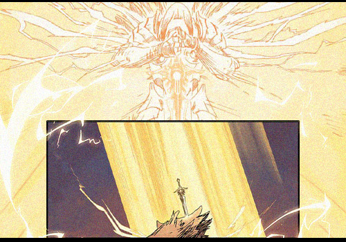
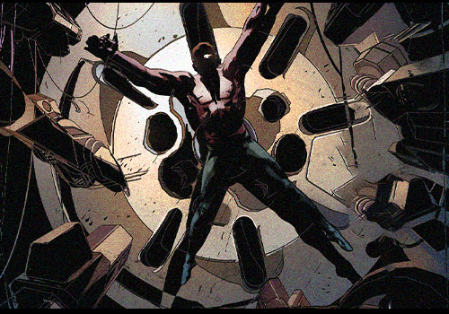
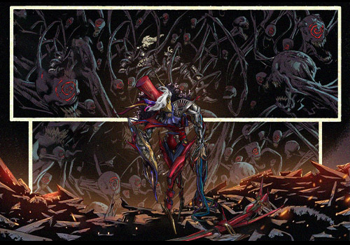

# 🩸 Biography Modrex 🩸
## Chapter 1

Once, Modrex was the kingdom's youngest paladin, his silver armor gleaming in the sunlight, his holy sword capable of banishing all darkness.  
His crimson hair burned like fire, his eyes alight with a thirst for justice. In countless battles against evil, Modrex remained undefeated, hailed as the "Child of Light."  
Yet everything changed when he led his troops deep into the Forbidden Forest, pursuing a fugitive in a black hood.  
At the heart of the forest, an ancient altar pulsed with eerie violet light, the air thick with the stench of death. The dark sorcerer awaited him, lips curling into a frigid smile.  
"Warrior of Light," the hooded figure chanted, "do you truly believe justice is absolute? Let me show you despair."  
A tide of dark energy surged forth. Modrex raised his sacred blade—only to feel his strength draining away. Curses coiled around his body like serpents, gnawing at his soul.   
He watched in horror as his silver armor blackened, his sword dimmed, and an unfathomable darkness welled up inside him.  
When reinforcements arrived, they found only corpses—and Modrex kneeling before the altar, his hair turned ashen, the light in his eyes forever extinguished.  

## Chapter 2: The Machine and the Curse

The curse did not merely corrupt his soul—it devoured his flesh. Agony became his shadow, every breath a torment worse than hellfire.  
To sustain his vengeance, he embraced forbidden arts—rebuilding himself into a half-mechanical monstrosity.  
In the depths of a subterranean forge, Modrex carved away his rotting flesh, replacing it with cold steel.   
The ticking of gears became his heartbeat; the hiss of steam, his breath. Each modification severed another tie to his humanity.  
His right arm became a curse emitter, pulsating with violet energy. Mechanical wings unfolded from his back, allowing him to stalk the night.   
His once-holy sword now took the form of a soul-reaping scythe. Most terrifying of all was his left eye—a shard of amethyst that peered into the deepest fears of his foes.  
A perfect fusion of curse and machine, Modrex was no mere fallen knight—he was a reaper straddling the line between life and death.   
Every strike carried soul-corroding curses, dooming enemies to slow, agonizing ends.  
Steam hissed from his joints, gears turned in his chest, and the faces of those he once knew blurred behind his mechanized visage.   
He no longer remembered his original face—only the unquenchable fire of vengeance.  

## Chapter 3

Through endless battles and slaughter, Modrex ascended to the apex of power.  
No longer a victim of the curse, he became its sovereign. Under his rule, an army of damned souls swept across the land, leaving only desolation in their wake.  
Standing atop ruins, Modrex gazed upon a burning city. His curse had evolved—no longer requiring touch, his mere presence plunged all living things into despair.   
Flowers withered, rivers turned black, and sunlight itself recoiled from the gloom surrounding him.  
His former comrades rallied a crusade to stop the fallen hero. But when they beheld Modrex’s true form, their hearts filled with dread.   
The knight of light they remembered was gone—replaced by a horror of steel and curses.  
"Do you still recognize me?" Modrex’s voice grated like grinding metal. "I, too, once believed in light and justice. But now I see—this world needs not salvation, but purification."  
The final battle raged before the royal capital. Alone against thousands, Modrex unleashed his curse like a plague, turning warriors into mindless husks.   
When the last foe fell, he slowly removed his mask—revealing a face now fully mechanized.  
From that day forth, the continent had a new ruler: Modrex, the Cursed Sovereign.   
His legend became a cautionary tale, his name synonymous with despair. In eternal night, gears turned without end, cursed energy flowing through vein-like conduits—waiting for the next harvest to begin.  

