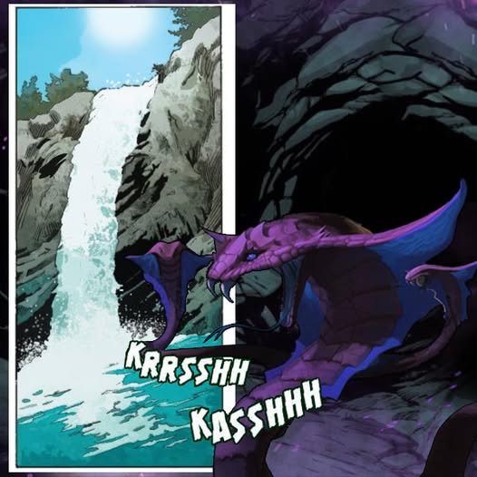
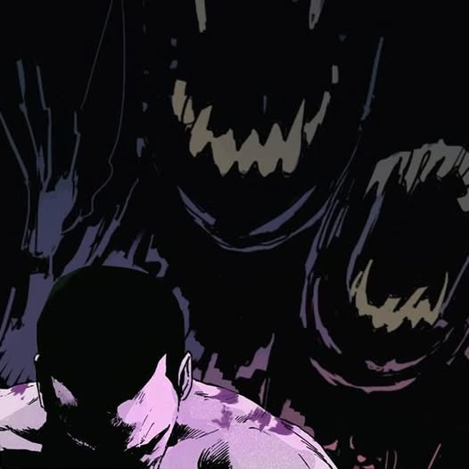
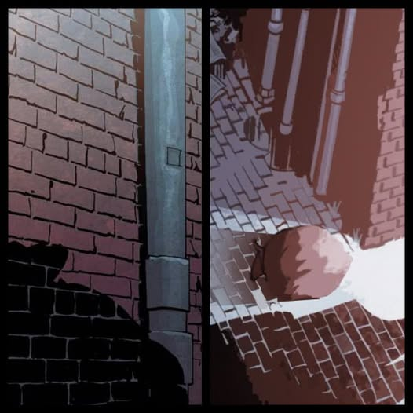

# Biography Nintu
## Part 1

Ancient Seabed.
Staring at the luminating magic herb, Giglamesh reached out his hand to grab some, at last a long awaited smile appeared on his face, he had finally obtained the magic herb at the mouth of his ancestors. On the way back home, he saw a clear spring, he placed the magic herbs aside by the shore, and went in for a dip to take a bath. While taking his bath, a purple snake crawled out from the bushes, grabbed his magic herb with its mouth and took off. The purple snake took the magic herbs into a cave, in the darkness of the cave a faint purple light appeared,
“Hiss, hiss, hiss”, the snake opened its mouth to drop the magic herbs, the snake hissed with its tongue out, as if asking for praise.
From the darkness then appeared a shadow of what appeared to be a human figure.
A hand then reached out and grabbed the magic herbs.
“Well done, my dear."

## Part 2

Bob was at the nightclub again late into the night. The roads in this early morning were empty. While he was reminiscing about back home, a shadow of a huge snake suddenly crossed his vision, and in an instant a trembling feeling overcame his whole body. He then ran as fast as he could back home, after which it had seemed that the shadow was gone. In a sigh of relief, he undressed getting ready to take a bath, he put on some jazz music to calm the nerves, it seemed like everything was normal.
Only he failed to notice the purple mark growing behind his back.
A week later Bob was found dead in his apartment.
Besides his body, a purple snake skin was also in the apartment, which was just freshly shed.

## Part 3

In the night, a man carrying a black pouch was walking on an empty street. The pouch was moving constantly, as if something alive was trapped in it.
Then all of a sudden a purple light flashed by.
And with one “thump” sound, that person was thrown to the ground.
The pouch was then opened, from which then crawled out multiple little purple snakes. The man was in pain, with all his effort using one hand, he stood up on his feet, his face covered in dust. The snake stared at him and then approached, while hissing its tongue out, almost touching his face. He wanted to scream as loud as he could, but fear had strickened his throat so tightly, that he could only utter small sounds of “eh eh eh”. At this moment he then noticed a beautiful image on the back of the snake. He then stuttered the following words. M..M..Medusa?!“.
“Medusa? Ah! Please don’t mistaken me for one of those cheap things, remember I am Nintu from Babylon.“
Nintu petted the big snakes head and said: “You’re probably hungry my dear, aren’t you. Look, your dinner is trembling in fear. Hahaha!“
“Ahhhhh, No!“

