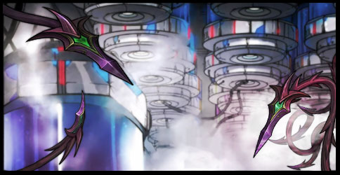
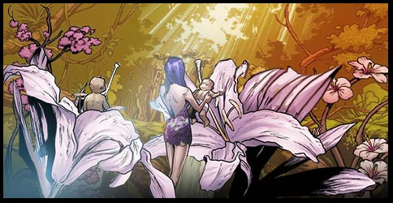
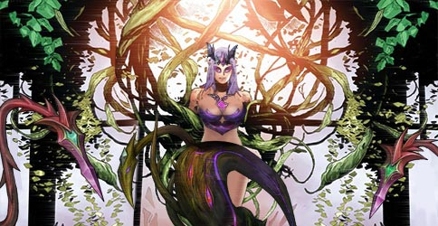

# Biography Nymph
## Part 1

🏛️The Alliance Lobby
“People will no longer worry about the future of our species. As the Garden of Eden, our technology is now mature and has had a significant breakthrough!
Our future is as bright as the stars that even the Gods cannot doubt! Our future is as ensured as our ancestors have decided as they stepped on this land!
Our future is one that everyone foresees!” 
“Hurrah!”
“Hurrah!”
“Hurrah!”
People chant along the new General’s name with fanatical expressions as they are enslaved upon the fantasies of the promised dream.
🐇Garden of Eden
Throughout the history of time, humans has always been a “tool” of some sort. Today, the sheep believe that the Garden of Eden is the First Galaxy’s womb. Where its existence is to breed. Young humans grew up in this very galaxy they call home, where they are taught the ways they want to be taught. 
People born in the Garden of Eden will live a prosperous, care-free life as if it was Heaven. There are no pain in the Garden of Eden,there is no such thing as negative emotions in this place.Big brother is always watching, ensuring that Garden of Eden is always a paradise, even by all means necessary...
The Alliance aims to create a perfect world through the Garden of Eden...

## Part 2

🐇Garden of Eden
The children grew up in the Garden of Eden, they have excellent genes, these intelligent kids will live on in the Capital Planet, the rest of the terminal kids will be given up for adoption to other planets.
The children played in the Garden of Eden, they all seem to have the same appearance.
Elliot wasn’t aware how long he had been soaking himself in green liquid, this was his first time in the real world. He was a real curious fellow, and thus left the team.
“Elliot, your head is bleeding.” said one of the little kids, pointing to his head. The children then gathered around closer to examine his head, and to see if there were any changes.
“You need to be careful.” A thin hand suddenly appeared on the top of Elliot’s head, and then several slender vines appeared all around him. The Vines then disappeared in a flash, Elliot’s wounds had been completely healed, not even a scar was left.
“Thank you, Master Nymph.” Elliot turned his head smiling to say his thanks.
“Thank you, Master Nymph.” The children had also gathered to say their thanks with the same 
smile.

## Part 3

Ever since his injury, Elliot would be in constant “pain”, his head would feel as if it was splitting in half. The more he thought about it, the more it would hurt, repeating emotional changes would scare him, he would need to find an answer to all this.
So he decided to go see Nymph. One early morning he snuck out of his rest cabin.
🌙Under the moonlight Nymph’s limbs were rooted into the ground with vines spread all over her body, she was surrounded by newly sprouted “seeds”, every seed contained a new species of humans.
“Master Nymph.”
His interruption did not anger her, instead she withdrew her vines into four regular human limbs.
“Elliot, what can I do for you?”
“I have been in a lot of pain lately, when flowers wither I become sad, when a companion is exiled I become angry, my mind is constantly aggravated with a million thoughts. What’s wrong with me?“
“Wouldn’t you like to experience these emotions and have the ability to think?“
“I would like things to go back to the way they were before.“
“Well, good boy, you will.”
Nymph gently rubbed his head, spikes from the palm of her hand penetrated Elliot’s head, he no longer felt the “pain”, and his mind and spirit then went into an eternal bliss.
God created the Garden of Eden too perfectly, a world this perfect is always doomed to collapse, any victory or ending is just another new beginning.

