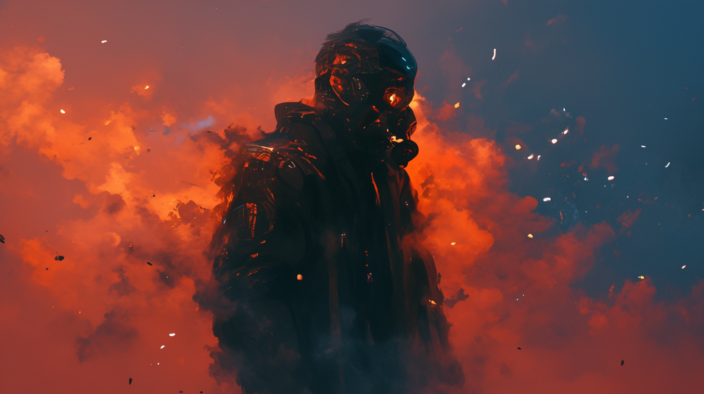
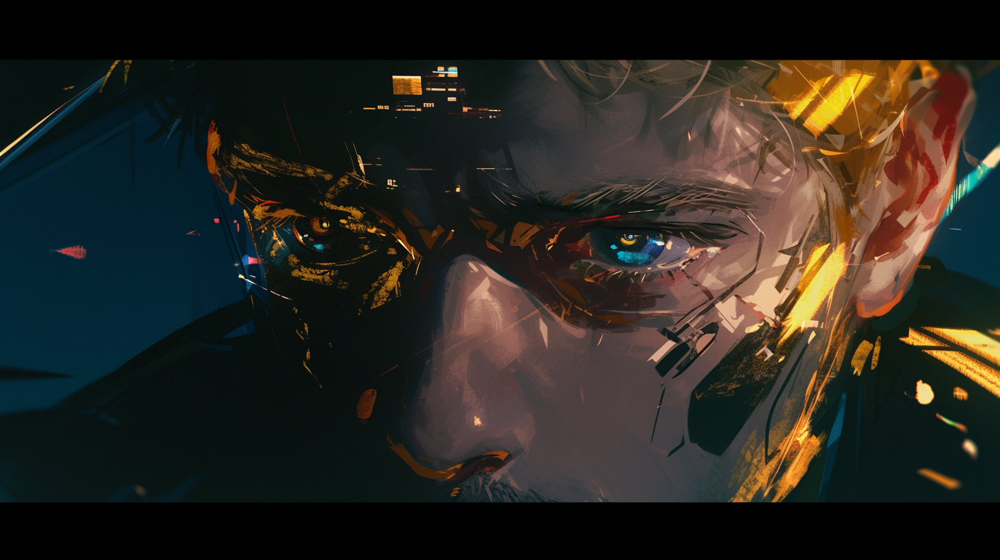
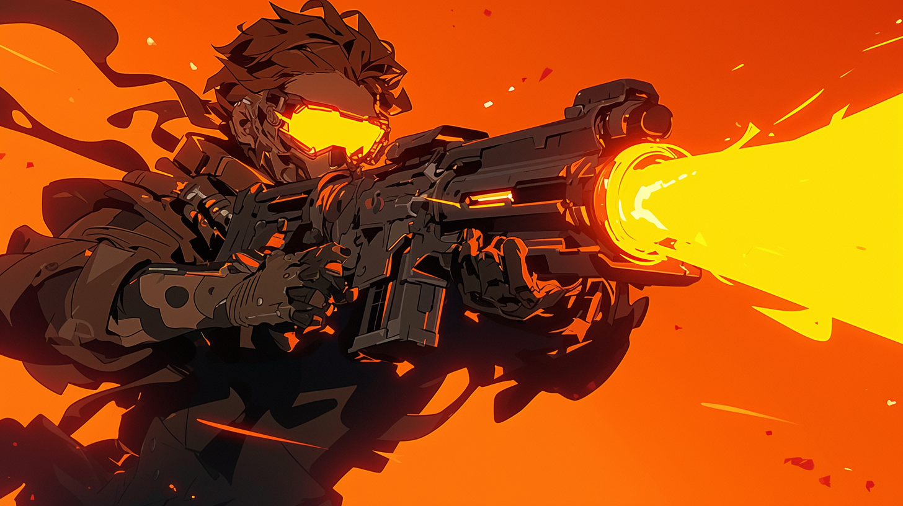

# 💥 Biography Raymond 💥
## Chapter 1

**An Unnamed Planet - Stranding**
A squad of soldiers clad in specialized combat gear silently navigates through the ruins of an abandoned apartment. The building's ground level has been obliterated, leaving only its subterranean structure intact. Authorized with the badge of Black Mist on their uniforms, these troops, following a 'Floater' drone, were on a grim mission to find survivors and eliminate them without mercy.
Eighteen levels below ground, in a modest 35-square-meter one-room apartment, stood an antiquated full-body gaming pod with a rectangular metal box on its base. Posted on it was a photograph of three young lads. The gaming pod's interface was flashing a red light, suggesting that the user's nutrient supply was nearly out. The light also casts an eerie glow on the surrounding dusty trophies, as if they were blinking rhythmically. The trophies encircled the pod just like flowers around a coffin, while the metal box served as an apt tombstone, signifying the burial of a person—or the imminent burial of one.
Raymond has spent a decade in this virtual world as a brilliant scientist who, with his inventions, transformed the world. He provided a blissful life for his family and friends, foiled all malicious actions aimed at him, and rectified his real-world regrets. Sitting at the pinnacle of his virtual world, he watched the flashing warning lights on the interface, quietly awaiting the death of his physical body in the real world. For sure, this should be the final act of a pre-arranged funeral.
Outside the room, the 'Floater' drone cautiously dimmed its lights, and the soldiers methodically arranged their formation. An engineer soldier activated the AI assistant on his helmet's HUD and silently took out a small box. He applied a lead-mercury metal liquid onto the door's hinge, operated his wrist-mounted interface, and then retreated. Another soldier pressed a red button, after which the combat suits inflated and hardened into a protective shell, while an arm shield unfolded into a massive explosion-proof barrier in front of the door. The captain raised his hand. Three fingers out, a countdown was ready...
"3, 2, 1...
No user detected. The gaming pod is shutting down..."
With a rumble, the door fell forward onto the ground, and two grenades were tossed into the room. A zap of electromagnetic pulse instantly cut the power to the gaming pod. The shockwave hit the metal box, knocking it onto the pod, followed by a cloud of smoke filling the room from a smoke grenade.

## Chapter 2

A long, sustained white noise pierced Raymond's ears. Though with his eyes were closed, loads of images flushed into his head: the dazzling spotlight when his Golden Rule won an award, the smiles of friends at the debut of his Power Reactor, and the relieved expressions on his dear parents' faces at the 'Legion' conference. Then, the cold faces of the attendees at the Energy Association's audit meeting, his home burnt in flames, an old friend behind the prison lasers, his girlfriend who betrayed the team, his old feeble mother on the hospital bed, the seal on the lab's door, and at last, his funeral.
His heart was filled with regret, for he knew that his invention had affected too many interests of all parties. If only he had realized sooner, if only he had paced everything more slowly... His thoughts began to drift, but a familiar electronic tone pulled him back.
"Encountered an unknown electromagnetic shock on the Central Recovery Unit…
Charging complete… Reboot complete… Entering standby mode… 
Remaining Liquid Energy: 2 Rays.
Critical condition detected… Level one emergency… 
Nanocore activated… Muscle tissue printing underway... Encapsulation complete… 
Starting injection... Installation complete... Proliferation underway... Tissue filling complete... Degradation complete, 1.275 Rays of Liquid Energy recycled. Recycle rate: 85%...
User exited level one emergency... Reevaluating... User in level three emergency... 
Searching for nearest hospital... Network connection failed, initiating environmental scan...
Security hazard detected. Emergency mode activated... Legion mode prepared... 
'Recruitment' in progress... 'Barrack' reached safety protocol threshold... 
Emergency Evasion Mode automatically selected for 'Marshal'...
'Shield Guard' time remaining: 29:59, 'Cavalry' time remaining: 09:59, 'Medic' time remaining: 29:59, 'Headquarter' time remaining: 99:99, 'Recycle Squad' time remaining 99:99..."
On the other side, the 'Floater' drone issued a warning abruptly. Out of nowhere, a violent shockwave swept in and knocked the front-line shield-holding soldiers away before they could properly raise their shields, sending even the teammates behind them flying out of the door. The remaining soldiers swiftly pressed against the wall, standing on high alert. As the dust inside the room cleared out, a man showed up, still in his red gaming helmet, clutching a long metal rod in the left hand, dressed in clothes that appeared strikingly retro, almost to the point of tattered.
"'Cavalry' charge complete... Liquid Energy being recycled... 'Recycle Squad' seized high-efficiency combustible materials... 'Flame Cavalry' recruitment underway..."
Raymond stepped out of the gaming pod, observing the 'Legion', his supposed tombstone, now operating on his hand at high speed. Nano-fabrications were continuously printed and injected into his body, repairing the damaged machinery. They also enveloped his limbs and joints for protection, and an energy generator was installed at his waist, transforming the core in his hand into a massive laser igniter. Secretly, the gaming pod behind him had been 'recycled' during the process. This was a cross-era creation developed based on the Golden Rule, a low-loss conversion center for all matter and energy, coupled with a nano-proliferation core, his groundbreaking invention that once made the energy and medical industries tremble. However, the 'Legion' model in his hand was only a family version, lacking higher manufacturing permissions and a reserve of dangerous weapon data. Should he be given enough materials, blueprints, and time, he could theoretically build a spaceship.
The 'reborn' Raymond stood in place for a long time, contemplating, and finally successfully merged his memories from the game with reality. Staring at the lines of red alerts on his HUD, he made up his mind:
"Enter command: Initiate Dano-Galilei-Raymond protocol."
"Authorization confirmed... Protocol initiated... Core system hosting successful. Developer mode activated... Welcome back, Ray 😊"

## Chapter 3

The squad leader, caught off guard by Raymond's counterattack, proved his mettle as an elite in ground combats, swiftly scattering a handful of Spider Grenades into the room to buy his team time to adjust. Each tiny grenade, no bigger than a tack, unfolded into a mini spider, scuttling towards the nearest heat source — Raymond. The other squad members, recovering from the shock, began to fire in a coordinated cross-shooting pattern under the protection of the shield-holding soldiers.
Just as Raymond regained his senses, he found himself under heavy fire. The Spider Grenades were detonated in an explosive matrix at his feet. The 'Shield Guard' on his waist deployed a protective shield, blocking most of the blast, but the grenades were an 'improved version', carrying metal shrapnel that penetrated the energy shield, causing him secondary damage. Raymond's left leg was instantly soaked in blood, but he paid it no mind. The Legion's Nano-intelligent Squad had arrived. It severed the pain perception in his leg, making him feel as if he was unharmed. He raised his right hand, which was outfitted with a prosthetic iron fist, as a shield over his head and quickly charged towards the door. As he exerted force on his left leg, the nano-troops proliferated rapidly, and the mechanical exoskeleton on his leg formed just in time to propel him out the door. Now's the fight time. Confronting the special forces team in the corridor, he calmly glanced at the HUD and pulled the trigger.
"'Barrack reached the Golden Rule equilibrium point, estimated to cycle for 43,200 hours... Overclocking mode activated... 'Giant Shield Guard' time remaining: 59:59... 'Flame Cavalry' time remaining: 19:59... 'Assassin' time remaining:19:59... 'Medic' time remaining: 59:59... Unknown distress signal received. Do you wish to deploy reinforcements?... Order received. 'Command HQ-2', 'Giant Shield Guard', 'First-Aid Troop', 'Recycle Squad' dispatched... 'Flame Charge' initiated..."
Clearly, the firepower suppression failed to trouble him. Rather, it provided him with an ample supply of 'Liquid Energy', even giving him the gap to reinforce others. He raised the 'Overclocked' laser igniter in his hand, firing a stream of laser mixed with high-temperature-resistant nano 'Assassins' at the enemy. The laser ferociously engulfed the squad in the corridor, while the 'Assassins' rapidly dismantled the squad's defensive components, then initiated a secondary explosion. The 'Assassins', having completed their mission, decomposed on the spot into an accelerant, causing the enemies to melt one by one in the blazing inferno.
After taking a break, Raymond followed the distress signal and soon reached the basement level, once the Apartment's management hall. The hall was littered with charred corpses, appearing as though they had been struck by lightning. Judging by their gear, they were clearly aligned with the enemies Raymond had burned. The traces of the battle extended up the staircase. "Above the stairs," he thought, then cautiously activated his energy shield and ascended the stairs.
"What the heck? The Company Alliance is gone?"
Unpredictably, Raymond was greeted by an endless expanse of ruins, collapsed buildings, and heaps of crushed construction materials. Nothing stood taller than two stories, and the ground seemed as if it had been plowed through. At that moment, the system notified him that reinforcement troops were approaching, and he spotted an odd duo in the distance — one resembling a rapper, the other a 'Terminator' angel.
"These little things belong to you, huh? Impressive. We're from IFOB, experts in post-disaster reconstruction. We've helped many stranded planets. Would you like to join us? Together, we can rebuild your home and search for more survivors. After all, there's strength in numbers."
"Of course... of course, there's strength in numbers."
"'Command HQ' has established a temporary network... 'Shelter' project initiated... Sufficient raw Liquid Energy detected, estimated to establish 5 command sub-units... We are having more companions this time, Ray ^o^"

