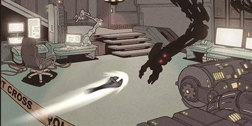
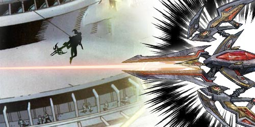
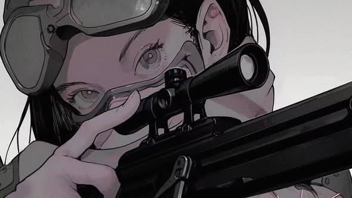
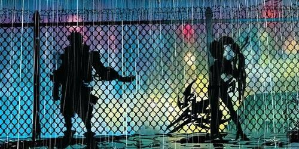

# 🔑 Biography Rena 🔑
## Chapter 1

📍**Machine City**  
The moon was hanging low in the sky, making the junkyard under it noticeable. The huge junkyard was parked with all kinds of cars, including the latest hovering sports car which was said to be the sort of vintage car unveiled in 1919.   
Suddenly, an abrupt curse broke the silence in the junkyard.  
"Dang it, there's a part missing." Mikaela banged the car angrily, which started creaking in response.  
She took a deep drag on her cigarette and headed toward the warehouse.  
Mikaela skillfully pulled open the roll-up door and casually threw away the spanner, which instantly gravitated to the corresponding position on the tool wall.  
"After travelling for so long on other planets, I believed that it is the best place for me." She made it to the swivel chair with a flourish and someone handed her a cup of coffee.  
"Of course. One can make more money here than in other places." She pointed to the opposite side, where the shelf that was used for the display of machine parts was packed with glowing halidoms, equipment and whatnots.  
"Kiddo, one who knows too much will be murdered." Mikaela blew a smoke ring and looked at the girl.  
The girl was about the age of a high school student, wearing a pair of black-framed glasses, with black hair covering most of her face.  

## Chapter 2

"Fizzzzzzzz."  
The communicator on Rena's chest was vibrating.  
"Crimson, at the west gate of S-Science Institute, the target carries biochemical weapons."  
"Copy that."  
"It’s time for our little friend to get to work." Mikaela jumped out of the swivel chair, walked over to the shelf, rummaged around for a while, took out a backpack and threw it at Rena.  
"Catch it. All the requests you made have been met. Also, I've made improvements to your heavy and giant arrow so that you can better target the enemy."  
Rena took a step back at the smash, "Thank you, Mikaela, I've got to go now. "  
"Hey, you haven't paid up! Don't you know how much that arrow cost? " Mikaela shouted, "What an ungrateful tyke! "  
Machine City was filled with all kinds of robots and mechanical creatures, but no one could exactly tell when this started to happen. These robots and mechanical creatures were usually developed by large companies or governments to perform various tasks.  
"The target is a scientist who has recently been working on a new type of robot. This robot can not only mimic how human act and think, but also can learn and evolve on its own. The potential of such robots is unlimited, but it also comes with huge risks. "  
When Rena arrived on the scene, she encountered a swarm of nanobots that were trying to attack the scientist and steal his research.  

## Chapter 3

Rena stood on the roof of the building, now wearing her mech; its armor was inlaid with red crystals, and the energy within was surging. Rena sighed, "Mikayla definitely couldn't be just a car workshop owner."  
She raised her giant crossbow, whose sights quickly auto-scanned the wielder, aimed at the attack target, and revealed the enemy's information in front of her.  
"Primary target identified, take action?"  
"Move," while a low voice travelled through the communicator, the spectral arrow instantly shot at a man in the black cloak. The instrument in his hand instantly shattered, and before he could react, the second arrow had already pierced his chest. The arrow then turned into pieces, leaving no trace.  
The mission was over, and Rena took out her phone, which displayed seven missed calls from her mother.  
"Dang it, I'm going to get another lecture from Mom. " She gave a sigh and walked towards the alleyway home.  
The Machine City on a rainy night was shrouded in thin smoke, with colorful brilliant neon lights shining. A figure gradually emerged from the smoke in front of her, and Rena stopped in her tracks, ready to take out her weapon.  
"Hey kiddo, relax, interested in joining IFOB?"  
Rena couldn't make out the other person clearly, except for the conspicuous blonde hair.  
"Not interested at all, thanks. " Rena clutched her backpack and quickly ran past him.  
"Hey, please hear me out. IFOB can take you on a free trip around the stars for free ......"  
IFOB? Sounds just like some hard work that requires travelling from planet to planet. Rena just wanted to win all the awards for physics and guard the city that she grew up with.  

