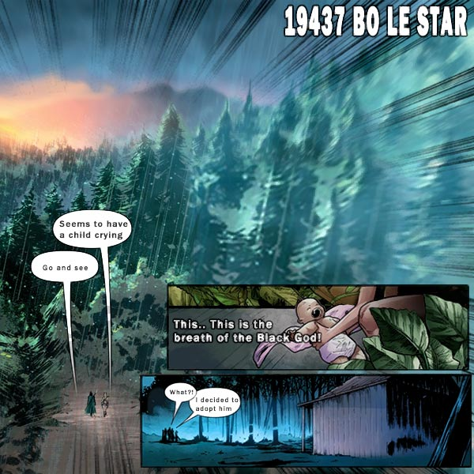
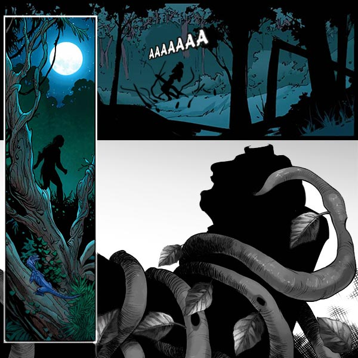
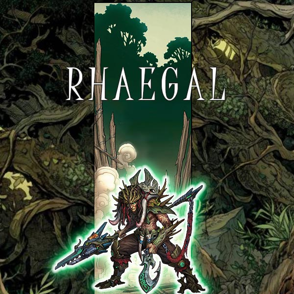

# Biography Rhaegal
## Part 1

Boehler Star
“Wow wow”
In the midst of a wasteland, baby cries were heard.
He had his Dragon members dig up the waste to find the baby. As soon as he held him in his arms, Yuan felt that this was a different power, it was a heavy and dense aura of the Black God.
This...this is Black God’s breath! “You must destroy it immediately”, exclaimed one of the dragon members.
The black god judges humans based on their origins, how can we do the same as it? That is what they want us to do. I will raise him as my own and call him Peace.“

19447 Camp Star
“Move faster, you worthless slugs,” Yelled the military officer.
In front of the car, there were a few ragged people, that were walking forward, they looked so bad that they resembled rotting flesh itself.
“Bang, bang”. Gun shots had sounded.
One of the people in front of the car fell to the ground, while the others simply kept moving forward. It was as if the people walking forward had no feeling, they simply kept walking forward, letting their blood drip away to the floor. The people walking by didn’t even seem to take any notice to them, instead just went about their business.
Camp Star is a planet consisting of a second generation of criminals, here they live somewhat of a prison lifestyle, besides the most infamous criminals, everyone here are descendants of other criminals, they are emotionless most of the time, they don’t know how to converse, their eyes are empty, all of their actions are purely driven by their instincts. 
On the side of the road, a boy was performing an act with a long spear, his face was dripping with sweat. Peace displayed incredible talent, an old man sat by and watched from the side, and from time to time would comment on the act, this person’s name was Rhaegal, an old Dragon member, who eventually retired from the group from after sustaining an injury, while fighting off the Black God Sect.
“Grandpa! Grandpa! I learned the Thunder Dragon Seven Thrusts.” Happily cried Peace.
“Not bad my man.” Rhaegal laughed, he then stood and gave Peace a stern look, “now I’m going to teach you the last move, this is the way to break the Thunder Dragon Seven Thrusts, the better you understand yourself, the better you can defeat your enemies. I will only demonstrate this once, so watch carefully, this move can only be used as a last resort, because this can only used when you’re about to die. But it is also possible to put your life into it. Remember this!“
Peace raised his spear in salute and said, “I will learn it well, Grandpa, and eventually join the Dragon group like you!“

## Part 2

Peace after all is the container of Black God. As he grew up, there was a voice that constantly whispered in his ears,
“You are now garbage like that Planet you have been thrown on, you must join us, as we are your real family, we are the Negative Alliance, you can find us through the Black God”.
The enchanted whisper in his ears made the boy grow up perplexed, as he watched the lifeless inhabitants, his heart couldn’t but feel content with what the voice was telling him, moreover, the more he approved the voice, the more powerful he became, he thought he knew the truth about the world, he was so excited when he made this discovery, and ran to tell his grandpa, “we must fend off those that consider us garbage, and show them what we are made of”, the response he got from grandpa was not what he expected, this was the first time he saw his grandpa’s smile disappear.
Rhaegal responded to him with a stern look, “remember, your fate is never predestined from birth, if you ever think like that again, will take back what I have taught you.”.
Feeling frustrated Peace ran out side and looked upon these hopeless people, he whispered to himself in discontent, “how could me and Grandpa be garbage, Grandpa is an hero”. He proceeded forward with full of resentment, and started going faster and faster, it felt as if he was going to travel all over this planet, he can’t find evidence that proved, that his grandfather’s words were true, which he did not expect. He also didn’t realize, that wherever he went, he would leave a trail of these twisted black plant seedlings.

Meanwhile, Rhaegal was feeling regretful, after his fight with Peace, perhaps he was being too strict with him, he decided quickly to go to the gates to get him back, but Peace was so fast, that he was already been very far away. He then unexpectedly saw the Dark Plants on the floor, his heart then started pounding, and his whole body went sweaty. He then realized that something was really wrong here, without hesitating he called Yuan, “Believe in me, believe in Peace”, with those words he rushed for forward with a burst of speed.

## Part 3

He forces of destruction of Black God are rampant and out of control. Within 10 minutes Camp Star was already 10% infected，countless people became victims of the Dark Plants，which were slaughtering troops with its dark spears. In the thick of Hesse Forest, Rhaegal, who was injured all over, finally found Peace.
The two simply looked at each other, with the forest behind grandpa and an army behind his grandson.
“Grandpa, I can’t find it, I can’t find it anywhere”
With that said, he turned around and charged towards the army, Rhaegal immediately reacted and charged towards his grandson to stop him.
“Why are you standing in my way? Get out of the way!”
His pupils completely dilated, he suppressed Rhaegal, Rhaegal started to feel he was losing vitality, so he fired a shot and then sighed, “I’ve really gotten old”, and charged upwards with an even stronger power, then he used back thrust.
“Be careful, Peace!”. As he cried the Seven Shot stabbed Peace straight into his heart.
Peace then stepped back with his left foot to turn around and used his spear back, this was the method to break the Seven Shot, which Rhaegal taught him. However, his spear didn't catch Rhaegal’s spear, instead he felt as if he was wrapped in warmth. Rhaegal hugged Peace in his arms, “Have you had enough already? Remember, you are not the Negative choice, you are not garbage. You are my pride.” 
“I am so sorry Grandpa, I was wrong.”
Peace turned around and looked at his Dark Plant spear, which was stabbed through Rhaegal.
“I’ll take care of your Dark Plant spear for now. Oh my, this is really cold actually, it must have been hard on you all these years. I leave my old friend to you.”
“Oh no! What have I done! Negative Alliance, the Black God!!!”
Many years later, Peace inherit his grandpa’s name with Rhaegal and passed his test, and went on to become a Dragon member, with them he fought in the front lines of the the Cult of All-Mother.

