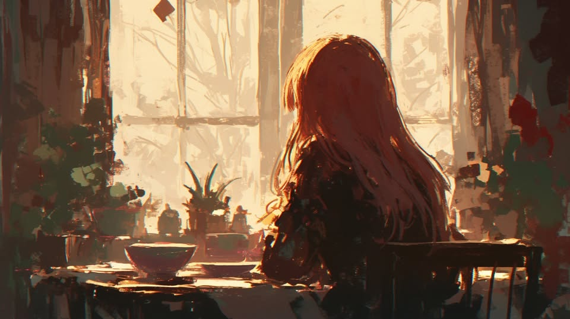
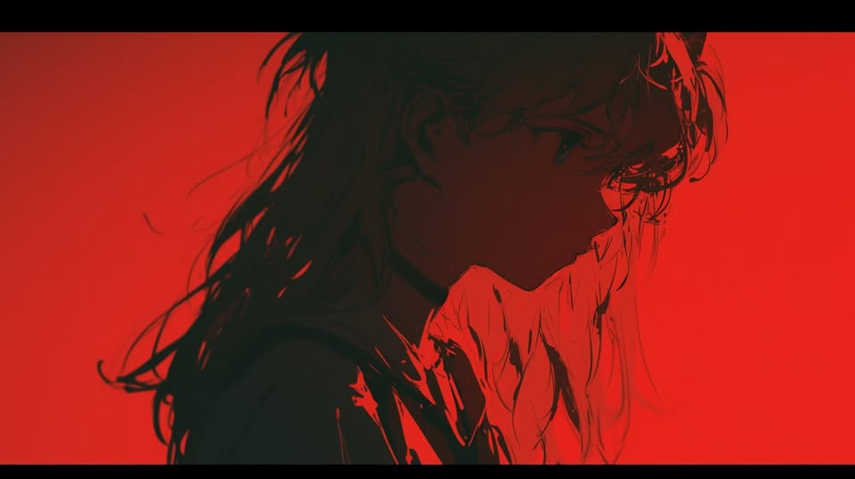
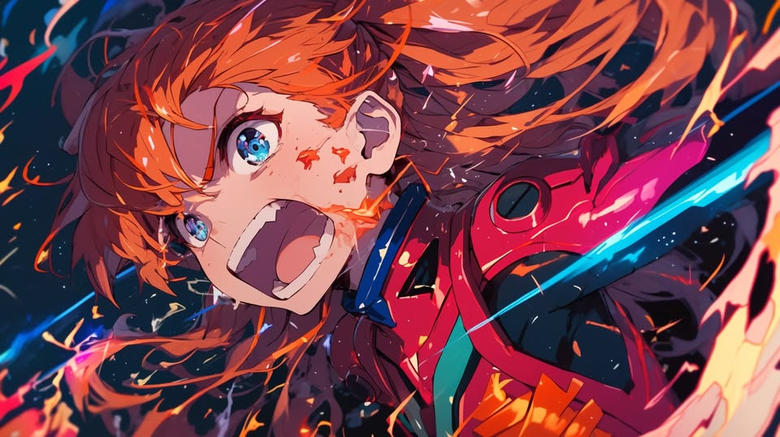

# 🎀 Biography Sarah 🎀
## Chapter 1

The artificial sunlight pierces through the blinds, illuminating numerous trophies on the bookshelf.  Among them, a transparent gilded trophy was placed in the most prominent position, with the name "Soteria," an ancient mythological guardian goddess, engraved on it. 
That trophy gleams silently in the sunlight. On the top shelf is a family photo: a father, a mother, and a little girl laughing heartily.
In her dream, Sarah finds herself in a land of light, so bright that she can barely open her eyes. Instinctively, she raises her hand to shield this light and then wakes up. She looks for the source. Turns out, it is the family photo reflecting the sunlight. 
So she gets out of bed, knocks the photo face down, and stares at the Soteria trophy for a moment before she sleepily goes to wash up.
Her father, a mech doctor, is busy preparing breakfast. Sarah glances around the living room and remembers that her mother has gone on a business trip to an unknown planet. It is said that a stranding has occurred there recently, leaving only one survivor, who had tried to commit suicide. Since the place is highly developed in mechanical technology, her mother, as an expert, had to go for exploration. 
Such boring adults, Sarah thinks.
"Oh, there you are. Try this retro breakfast I made. You'll be coming to the hospital with me today."
"Okie." Sarah picks at the 'retro' sandwich, eating absentmindedly as her thoughts drift away. Where will she end up in the future? She might probably end up in a hospital under her parents' arrangements. If she can not be a pilot, being a doctor isn't that bad. She consoles herself, but the sandwich in her hand tastes even bitter.
After breakfast, Sarah takes the space elevator to the terminal. Passing the security check, she boards the secret line—a hidden route undetectable by ordinary people. Sitting in her usual seat, she stares at the distant blue-green planet (Gremlin Star) in distant. Today's scenery seems more spectacular than yesterday's, with many small green meteors occasionally flying by, crashing into the planetary ring or the starlock ring, and disintegrating. How spectacular. If it weren't for these small meteors, she may not have noticed that the secret route had always been on the edge of the starlock ring, also wouldn't have wondered about the origins of the blue-green planet locked inside.
Upon landing at the 'hospital' space station, she skillfully makes her way to the operating room on the top floor, where her father has been busy for a while, trying to save the mech inside. It is said to be the mech left by a legendary "someone" before their disappearance, and once repaired, it might unravel the mystery of "their" disappearance.
The first time Sarah saw the mech, its joints were so twisted that she thought it would be a miracle to even retrieve the black box. However, after her father's treatment, all the external distortions have been restored without any parts replacement, and the mech now looks as good as new. She has secretly marveled at this many times. But, of course, the quality of a LEGENDARY pilot's ride to be exceptional should not be so surprising.
Unfortunately, the mech still can not start, but her father has made some progress. This makes Sarah feel somehow proud of her father. But then she feels annoyed as she still thinks her father is an "old dull doctor". She pulls out her smart terminal, logs into her social account, and starts scrolling through other people's happy moments. For a moment, she feels grateful that there's at least a window (slash, screen) to escape her mundane life.
“MY, GOD, Sarah! Take a look at this!”
As Sarah looks up, green meteors streak across the window of the space station, unnoticed by anyone. Everyone's attention is drawn to the deformed mass on a plate in her father's hands. Her father speaks, proudly.
"Has anyone seen a neural bundle tumor this big?" Sarah is shocked but doesn't want to show it, so she casually glances at it, and then glances again. Her curiosity can't hide from her father. He places the tumor in a liquid container and leaves Sarah alone while he and his colleagues go to their respective rooms to shower and disinfect.
Driven by impulse, Sarah suddenly thinks of the mech after the surgery. She looks up just the right moment that the mech is also 'looking' at her. It's on. Her heart beats quickly, and she looks around—no one is there! She quickly approaches, wiping her hands on her pants. As soon as she touches the mech, red lights flash and alarms blare. The surgery room's safety doors descend. "Oh, no. Dad's gonna be so mad!" Sarah is frozen in place.

## Chapter 2

The door to the rest area slams open, and the doctor watches as his colleagues emerge one by one from their rooms, but not his daughter. He glances at the sealed operating room. He detaches a button-sized earpiece from his wristband and sticks it behind his ear, preparing to contact the defense unit to unlock the safety door. "Ding," the elevator doors slowly open as transport robots carry out damaged mechs one after another. He takes a quick look at the operating room where his daughter is and decides she might be safer inside. Then he starts mobilizing the crew.
“Pharmacists, head to the pharmacy and grab as many emergency kits as you can. You'll be handling the pilots' rescue. Surgeons, bring your tools and start operating on the mechs right here. Prioritize first-degree emergencies. Move, move, move! How long the front line holds depends on how many we can save!”
Meanwhile...
Sarah searches the entire operating room but can't find the control switch for the safety door. Leaning against the mech, she habitually bites her finger, trying to make sense of the situation. Maybe she should check if the mech's communication system is still functional. If it is, she could contact her father. Her mind is clear. She turns around, grabs the cockpit handle, steps on the stirrup, and swings herself into the cockpit. She pauses for a moment and takes a deep breath.
"Start authorization."
The cockpit door automatically lowers and seals shut. Ambient lights activate, and the central control panel screen lights up.
"Oops. Network unstable. Please check your network settings~" a gentle voice echoes in her ear.
Maybe the communication module is down? Sarah opens the settings and indeed sees a red exclamation mark on the communication section. She opens the cockpit door, braces herself on the handle, and jumps down to the printer. Inputting commands, she starts printing the corresponding model of the communication module. Minutes later, she retrieves the encapsulated module from the cooling pool, waits for the low-temperature nano packaging on the surface to fully melt, then uses the mechanical surgical arm to implant it into the mech. As she closes the surgical window, the mech's lights flicker and it begins rebooting.
Back in the cockpit, Sarah tries again to gain authorization.
"Start authorization."
“Temporary authorization granted. Resuming the last unfinished communication. Connection expected, let's see, in 25 minutes.”
"Communication? What communication? Retrieve the log."
“You got it. Opening the address list.“
"Open the last unfinished communication log!"
"Sure thing! Retrieving safety door log."
"Wait, what? You can access logs at this level?" Sarah then manipulates the mech, placing its hands on the safety door.
"Device UHNHS313 detected. Would you like to connect?"
"Connect and unlock the safety valve for me."
“Understood, miss.”
The safety door slowly opens, revealing a scene Sarah could never forget for the rest of her life. A group of doctors, their white coats stained with blood, are reattaching the severed arm of a mech, with severed parts and debris piled up around them. On the right, a group of pharmacists is busy applying emergency packs to injured pilots, with no break and equipment to check their vital signs. Some pilots die as soon as the packs are applied, and their bodies are later discovered and temporarily stored in the cooler pharmacy.
On the left, the situation is even more cruel. A horde of green-skinned creatures (Gremlins) is launching a fierce assault on the mech defense line. They are fast, with strong bodies and terrifying regenerative abilities. The defense line is barely holding. Fortunately, repaired mechs from the rear can immediately rejoin the battle, while damaged ones at the front are covered and retreat to the rear for repairs. Sarah stands there, stunned, watching everything unfold. She suddenly understands why her parents have been so opposed to her becoming a mech pilot all these years.

## Chapter 3

"Ding dong, completing the pilot tutorial grants permanent access, with a limited-time offer of all-terrain intelligent assisted autopilot. Wanna give it a try?" The voice in Sarah's ear snaps her out of her daze.
"Are you serious? How could there be time for a tutorial now? Find a way to help them!"
"Got'cha. Black Knight module activate,. Shockwave auto-lock engaged, and now... Please release."
“wuaaaaaaaaaaa"
Sarah gives up thinking and screams as she takes actions. She ignites the thrusters, gliding along the curved wall, bypassing everyone, and landing at the forefront of the defense line. The moment she touches down, she releases the shockwave, hitting all the Gremlins in a straight line ahead. The Gremlins stand frozen in place, but those behind trample over the immobilized ones and continue their charge, coming right at her. Time seems to stop. Sarah looks at the Gremlins suspended in mid-air, suddenly recalling the battle in elementary school that brought her honor, the small figure now overlapping with herself.
The mech raises its right arm high. A faint electronic prompt says ("Seal released, shield module automatically deployed") accompanied by a slight cracking sound. Then, as golden light flows through the branches of the metal arm, a massive golden wall is released in front of all the Gremlins, halting their advance.
This shocks Sarah—this mech has a shield module too? Though the Gremlins in front can't breach the shield she just erected, the ones below are surging upwards toward her. The windows outside are swarming with Gremlins, their eyes glowing a deep green, ignoring everyone else, locking at just Sarah.
“Help me, lady mech!”
“Copy. I've planned an escape route for you."
Sarah falls silent as she looks at the escape route.
This is it? Countless images flash through her mind, finally settling on the family photo she had knocked over earlier. She feels a sudden relief, her gaze firm yet tinged with sorrow. She presses the broadcast button and shouts to her father.
"Dad, I love you! And tell Mom I love her too!"
She fires the shockwave at the floor, causing it to collapse. She jumps down, landing on the pile of Gremlin corpses, and pauses shortly as her father's calling to her is heard. After a brief hesitation, she runs towards the elevator, pries open the metal door, and jumps into the shaft. Once reaching the bottom, she charges forward with the mech's arm shield raised, eventually stopping at the docking bay. She opens the hatch. Before her is the cold vacuum of space, and behind her, immense pressure. She faces the Gremlin Star and leaps towards it.
The doctor watches out the window as a "shooting star" flies toward the Gremlin Star, followed by countless Gremlins, like a long green tail. He mutters to himself.
“I know this day would come. You are gifted this way. But I should have kept a closer watch on you. Sarah...”
Tears stream down his face. At that moment, all the Gremlins within the starlock ring seem to respond to some call, rushing back toward the Gremlin Star like a green storm.
In her fading consciousness, she hears a voice, indistinct whether male or female.
"Tutorial complete. Congratulations on unlocking full access. Well done, beginner. From now on, leave it to us."

