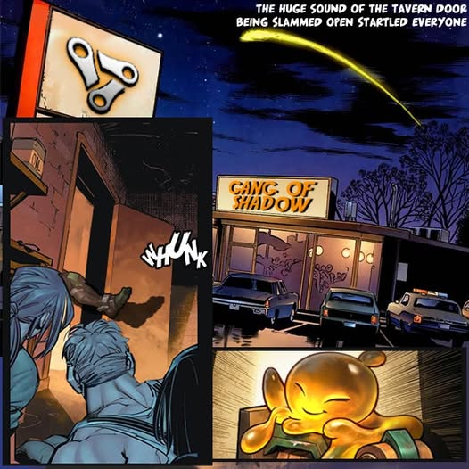
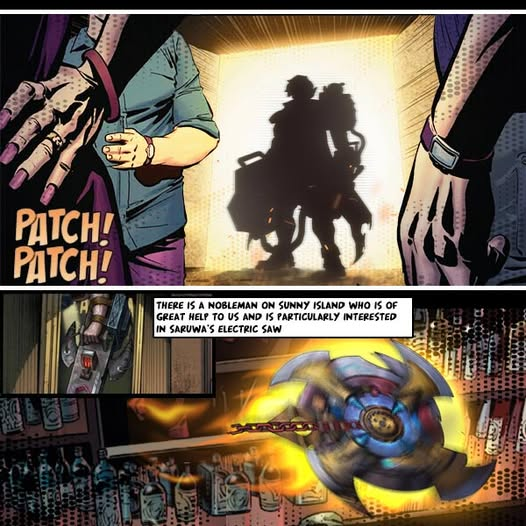
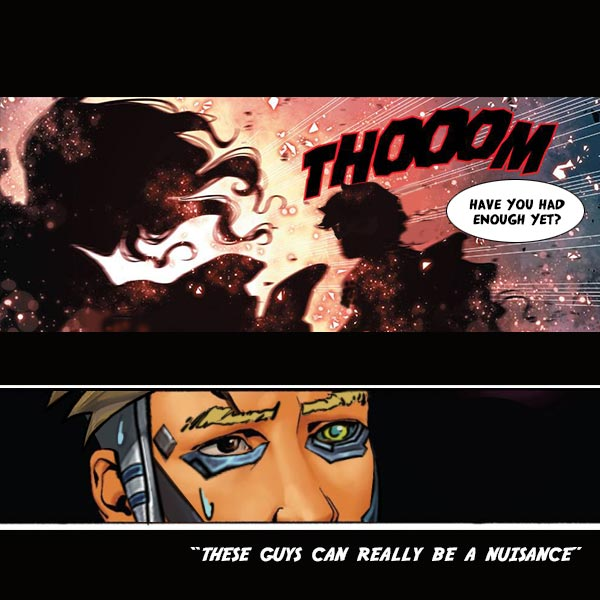

# Biography Shreateh
## Chapter 1

The huge sound of the tavern door being slammed open startled everyone, “who dares to recklessly interrupt a conference of the Dark Alliance?!” Everyone then looked over to Gilbert waiting for a response. Gilbert then helplessly shook his head: “Everybody, let me introduce someone to you. This is our Deputy Commander. Shreateh. Next time, remember to knock before entering”
Everybody then started to relax, but then for the next few moments, murmurs of doubt and suspicion started to fill the air. Everybody had once heard about the Commanding Officer, who left and traveled south, where he began Elemental training, and who also is to return. But this reckless behavior only made everybody disappointed and dissatisfied.
Shreateh, with complete content of himself, walked up to the center of the conference and laughingly said: “Hey everyone, nice to meet you all, I prepared a little holiday gift for everyone.” He then laid the bag he had in his hand on the ground, and once the item in bag exposed itself, people in conference couldn’t believe their eyes, “Thi...thi...why it’s the charred arm of the Fraudster Krosel himself!!!”

## Chapter 2

Shreateh then grabbed a chair, sat on it and placed his feet on the table, as of without a care in the world, while dabbling slime in his hands: “This guy got in my way, so I decided to teach him a lesson. He had a top hat on, as if he was some type of gentleman.“
A commotion started to erupt in the crowd, everybody started talking about their new Deputy Commander.
Alright, that’s enough. Quiet everyone. Shreateh, it just so happens that the Alliance has a task for you to do. There is a nobleman on Sunny Island who is of great help to us and is particularly interested in Saruwa's Electric Saw. You will take Beckinsale with you to retrieve it back and then send it over. She is good at communicating with the nobleman.” Gilbert said.
“I object to going with that noblewoman, who plays with wheels, she’s...”
Just before he could finish, a spinning disc went flying past the old lights of the tavern, heading straight for Shreateh. In a split second the lights of the tavern had been split in half, still hanging in the ceiling. A shiver went through the crowd, as if the room suddenly got colder by a few degrees.

## Chapter 3

At that sound, the room was suddenly ablaze in flames, and thick smoke filled the air, along with the sounds of grinding metal, making a screeching intolerable to noise. Amidst the smoke, Shreateh used the shield in his hand to block the spinning disc, although it was blocked, the mark that was left on his shield made it obvious, that it was not from an ordinary source of power. Meanwhile, the flame on his shield was an immortal flame, burning like the flames of Ares Chariot, the spinning disc constantly kept spinning against the shield creating non-stop fire and smoke. This situation became into a deadlock tie, it was difficult to distinguish who was the stronger one. At this moment, a few thunder bolts struck the ground a few times, and all the smoke had evaporated. 
Gilbert stood in between the shield and the disc, holding his hands up to separate the two sides. In a shrill voice, exclaimed: “Have you had enough yet? If not then I will use the power the sky to play along with you!”
“We’ve had enough, we make for our departure now.” Shreateh then in an instant received the shield salute, and then ran to the door. Beckinsale followed closely and headed straight for the door as well.
“These guys can really be a nuisance” exclaimed Gilbert, as he rubbed his head.

