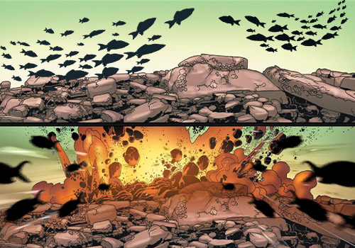
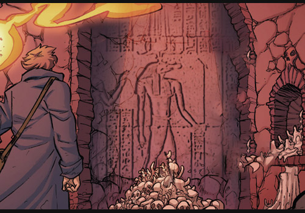
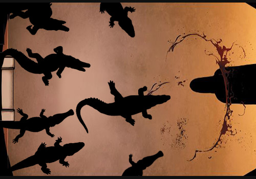

# 🐊 Biography Sobek 🐊
## Chapter 1

The silt beneath the riverbed suddenly stirred, scattering the shoals of catfish hunting for food.  
From the murky currents, a golden scale inscribed with ancient hieroglyphs flickered into view—then a second, a third… The slumbering god, buried beneath the sands of time, was waking.  
When Sobek opened his eyes, the Nile was no longer the river he remembered. The temples once raised in his honor had crumbled into quarries, the obelisks carved with sacred prayers reduced to mere building stones. His spear, Wrath of the Nile, lay half-buried in the riverbed, its shaft entangled in broken chains—the final seal left by the last priest, who had given his life to bind him.  
From the surface came the clatter of metal. Sobek's gaze pierced the waters to see twelve mechanical fishing vessels trawling the river, their iron nets sweeping away the last of the wild crocodiles. Among them, a young hatchling's scales shimmered gold beneath the sun, resembling the miracles once painted on temple walls. He saw an engineer wearing goggles writing down notes in excitement:  
“Perfect! These genetic samples are surely enough to recreate the ancient crocodile god!”  
Then a dark current surged beneath the waters. The engineer's terminal hanging at his waist flashed crimson warnings:  
Anomalous biological signal detected—  
Genetic match: 100%—  
Warning: Ancient god awakening—  
The last thing the engineer saw was the golden vertical pupil filling the screen.  

## Chapter 2

“Breaking: all contact lost with twelve autonomous fishing vessels operating in the Nile Ecological Reserve. Authorities are investigating the cause.”  
A corporate spokesperson faced the crowd of reporters, nervously wiping sweat from his brow:  
“We believe this was a technical failure. There’s no cause for alarm at this time.”  
But before the broadcast could cut away, the feed flickered—blurred—then resolved into an ancient mural:  
A crocodile-headed god, spear in hand, looming over a pile of shattered bones.  
Far beneath the city streets, a metallic clatter echoed under the streets.  
Security bots swarmed toward the source, sensors locking onto a tall figure, whose scales glinted gold, a three-meter spear arcing over his back like a living extension of his body.  
Before the first alarm could sound, the lead bot fell, impaled clean through its core.  
Sobek shook the spear free, drops of molten metal sliding from its tip.  
Behind him, twelve mechanical crocodiles rose from the sewers. Their eyes, once cold and blue, burned red as they turned toward him, their true master.  
“Heed my order: Wipe out every cloning factory.”  
The god's voice rumbled through the data stream.  

## Chapter 3

The main servers of Nile Technologies buckled under this sudden surge.  
On every holo-screen, Sobek's figure multiplied—replicating itself through streams of corrupted data. Faint firewalls collapsed before him, while classified files were dragged into the digital abyss like offerings to a god.  
Behind reinforced blast doors, the chairman roared:  
“Initiate the Godslayer Protocol!”  
An entire mechanized army powered up, weapon systems locking onto the intruder.  
But Sobek only smiled—a slow, predatory grin that reminded the technicians in the control room of a crocodile, jaws poised to snap shut on its prey.  
“You forget,” the god murmured, as his spear drove into the heart of the server,  
“the Nile was formed to consume.”  
Floodwaters burst forth from every cable, surging through the corridors.  
The mechanical army sparked and faltered, systems shorting out in line. Cloning vats shattered in rapid succession, sending biofluids cascading across the floor.  
When the emergency lights came back on, every display bore a single line of hieroglyphs. Translation software struggled, returning only two words:  
“God”  
“Returned”  
That night, as the rain poured down, city surveillance caught a golden figure striding toward the river's mouth. His spear had shifted, flowing into the datastream, while twelve mechanical crocodiles curled around his armored arms as shimmering electronic tattoos.  
And deep within the wreckage of Nile Technologies, a damaged monitor continued to flicker:  
Genetic samples missing  
Warning: Unknown signal detected  
Locating source...  

