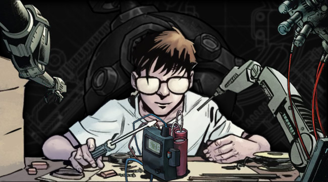
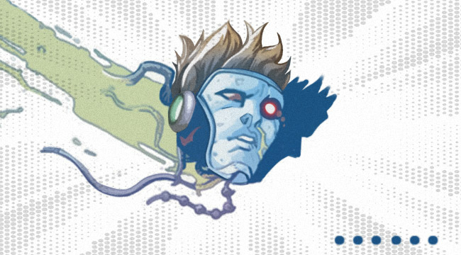
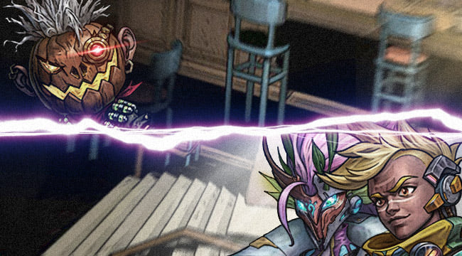

# Biography Sobel
## Part 1

Earth, at the workshop for shaping solid rocket fuel of the Third Research Institute of the Galaxy Aerospace and Technology Group.
“Sir, there’s someone here to see you.”
Sobel, who was in a metal pipe scraping gunpowder, held his breath for a moment when he heard this. He sheathed his scraper, and slowly climbed out of the metal pipe.
This is a man in a respirator mask, one of his shoulders stood higher than the other due to long periods of work and his hair was sparse. The big impact of working long periods with gunpowder has had on his body was quite visible. 
But over this long period, he had become one of best “craftsman” on the earth. No mistake was made during his whole life. People call him the master of gunpowder.
“Judas, how many times have I told you, do not disturb me while I am working.”
“Sorry, Sir, but she’s a senior official from headquarter.”
“Apologies, Mr. Sobel.” The voice of a young woman had interrupted their dialogue. 
Sobel saw a lady in the shadow against the sun. Her appearance did not resemble that of a senior official.
“And you are...” Sobel was astonished at what he saw.
“Judas, leave us for a moment.” She ordered and waited until Judas was at a distance.
“Mr. Sobel, I have come from the other ‘Server’. I need you to carefully listen to what I am about to tell you:
Please wake up......”

## Part 2

As Sobel regained consciousness, he discovered that his face was flat on the ground, like a dog trying to eat the floor. He tried to stand up, but he couldn’t feel his own body. He whispered a curse, as he came to realize that he was only a head.
“How could someone as old as me still have to go through this.”
A small cluster of flames spewed out of his mouth, which pushed his head over. 
“Bang”, the back of his head had hit a metal object, which had stopped his head from somersaulting. At this point, he could finally get a clear glimpse of his environment. He was surrounded by mountains of metal debris, it was a garbage dump.
“At least, if I’m lucky, I could probably get a body together here.”
In the following period of time, the sound of metal collision can be heard from time to time, and a head can be seen rolling "happily".
Sobel stopped in front of a toy android. This is the only relatively complete "body" he can find, and the toy also had a gunpowder smell to it, which he liked. 
His eyes blurred, and soon he heard a warning sound. 
“Scanning complete, body perfection degree at 79%, lightwave data transfer supported. Would you like to transfer consciousness data?”
“Initiate now.”
“Please unlock safety protocol.”
“Password: Gunpowder Sage, code: ‘now transferring...’Transfer complete. Unlock safety protocol.”
“Safety protocol has been unlocked, now transferring consciousness data, 99% conscious attention will be disconnected during transmission, now initiating transferring…10%...30%...60%...99%... all conscious attention will be disconnected soon, rebooting now in 3 seconds.”
“Welcome back, Mr. Sobel, transfer of consciousness data complete, the packet loss rate is 0%.”
Sobel felt very strange as if someone had woken him up from a deep slumber, it almost felt as if he couldn’t move. He took a look at his new body, and he started moving his hands and feet. He then sniffed that gunpowder smell from his new body and cracked a smile. A thought then came to him, which made him frown.
“Better yet, I’ll let them come. I have to figure out how to leave this place.”

## Part 3

Bohler, Tenth Satellite. 
A spaceship slowly landed on the ground. Once the spaceship had landed, a Cyborg IFOB dressed in green and white opened the trunk of the spaceship while listening to $age’s music, the rear compartment of this spaceship was filled with all sorts of mechanical accessories and old mechanical parts. 
Another young fellow dressed in the same stepped out from the cockpit, went over to the other Cyborg and took his headphones off from him.
“Stop singing and get to work, this place is too cold, let’s go to Moxxi’s Bar later and get something warm to drink.”
“Slow down, you know you can’t catch me, I move too fast on the gas don’t chase me, slow down…”（from Slow Down-Clyde Carson）
“Oh my...get back and wait for me there.” The young fellow gave the headphones back to the Cyborg and pushed him back into the cockpit. He then went back to the rear compartment and pressed a green button on the wall. The waste was then pushed into the garbage pit by a mechanical hand.
Once it was done, the young man pressed another button, where the mechanical hand started to withdraw. He then readjusted his suit and walked over to the cockpit without even looking back.
What he missed, was how a Halloween toy android hung on the back of the mechanical hand, the toy was looking back at the garbage dump while smoking a cigar. The smoke was puffing out of his eyes, ears and the top of his head. Soon, the rear compartment closed and the ship took off.
“Come on. It’s time for me to see this world.” Sobel thought.

## Part 4

"Hey, Patches. Come to see Moxxi again?”
“Who told you that? I just came over to get a drink and warm up.”
“Well, in that case, have fun. By the way, that mechanoid you came in with has quite the personality.”
“Which mechanoid?”
“You know, the one with the pumpkin head, he wasn’t with you?”
All of a sudden, a group of people started causing a commotion, Patches immediately stood up and said, “Is Moxxi there?” He went over to the commotion and saw that there were 3 people in confrontation with each other, while everyone around them was kicking up a fuss. 
“How dare they stir up commotion at Moxxi’s bar?”

----------------------------
Sobel frowned. His original plan is to keep a low profile and collecting the information. He didn’t think that things would end up this way. 
“Listen kids, I couldn’t help but overhear your interesting conversation, but I am not here to steal anything.” He kept trying to explain.
“You can explain to the police, the alarm of Moxxi’s bars is quite fast.” The two men with electroplated tattoos fiercely exclaimed.
At that moment an armed squad had entered the bar, “IFPD, show me your IDs. Huh? Are you Mechanoids or Cyborgs? Where’s your owner?”
“Captain, explosive material has been detected.” One of the team units had approached the captain and whispered into his ear.
“Officers Vidar and Legolas have already blocked the exit, so let’s not act irrationally here.” The captain whispered back.
At this moment Sobel too felt unease with the situation, he had thought that his cover was blown at this point, and started thinking of ways to escape. Just as he put his hand into his pocket, he felt a burning tingling sensation. At the same moment, he heard the warning sound, “Warning, unknown magnetic field detected, a force link by an unknown energy has been received.” At this time, even with Sobel's experience, he was a little nervous. He touched his bomb and calmed down a little.
“Please.” He shouted at the exit, “I am not here to cause trouble. I have important information.”
As he said this he had chucked a cigar out. The cigar was suddenly lit in the air and then burned out quickly. The smoke made Vidar and Legolas feel as if their powers were disturbed. Vidar frowned and put his hand behind his back to draw his sword.
“Officer, take it easy, as I am displaying my powers only in hopes to gain your respect. What I want to say, has something to do with the Vortex.”
Vidar and Legolas looked at each other and nodded their heads, “Alright then, Mr. Boomer, please take off all of your explosives and come with us to headquarters, where we can discuss this.”

