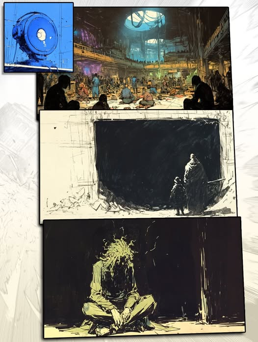
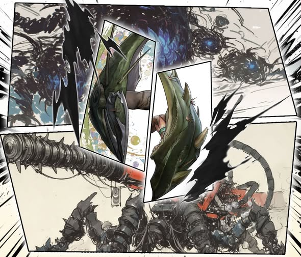
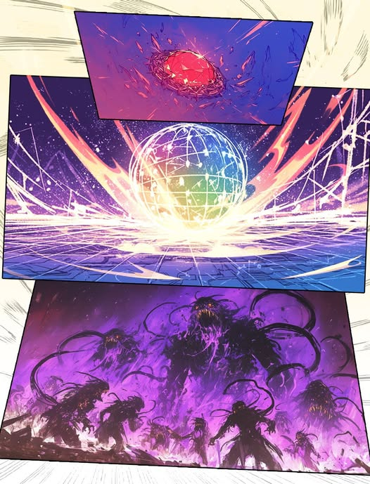

# 🌵 Biography Varen 🌵
## Chapter 1

Outside the atmosphere of Hematite Planet, in the command room of the Norn fleet, the navigator rose carefully under the watchful eyes of others and reported.  
“The fleet has fully exited the jump gate and is decelerating to its orbital path.”  
“Report on surface conditions,” the captain said, yawning as he spoke.  
“All twelve main mine entrances have completely collapsed. Ground posts are unresponsive.”  
“What a mess. Locate the new ore core, land at the core, and have Captain Kevin prepare the landing team. Once we secure the core, we withdraw.”  
“But the IFOB rescue operation…”  
“With such widespread collapse and so many aberrations, what rescue do you think we can do? You want to stay behind and try? Fine, be my guest. I’ll even triple your year-end bonus if you do.” The captain’s voice boomed through the room before shifting into a disgruntled mutter. “And you’re not wrong either. Last time Empyrean pissed off IFOB, and we didn’t get a single scrap of Shan-hai Universe resources. This time, we’ll do them a favor. All right… You, step up. Send an AI squad to restore the posts, then broadcast our landing coordinates to the underground. Our priority is still the core. Anyone else we encounter, we’ll rescue. Those who didn’t make it… they were lost before we arrived. You know how to report that, right?”  
“Yes, Captain!” Then the command room fell into a long silence, and no one dared to speak further.  

---  
**Mine #7, Level -13**
The survivors had turned the storage area into a temporary refuge. The structure was the most robust, explosion- and corrosion-proof, and the closed gates had protected several hundred people. They huddled on the floor, enduring pain in quiet, numbed anticipation.  
“This is the Norn rescue team. In six whirl cycles, we will land at the north post of Mine #7 to begin rescue operations for the survivors.”  
“This is the Norn rescue team…”  
The broadcast ignited the hall. People surged toward the safety gates, shoving against the security personnel stationed there. The foreman hurried out to restore order.  
“Calm down, everyone. I know that you’re all scared, but it’s still dangerous outside. Don’t act recklessly. We’ll lead you to the surface in an organized way.” He turned to give instructions. “Nate, go fetch Varen. We need him.”  
Nate’s face was full of panic. “But he—”  
“Afraid? What a baby. Kor, Kor, come here!” The foreman spat at Nate and called for Kor. “You’re from the same town as Varen. Convince him to help. Previously, we all lacked experience and mistook him for an aberration. That was our fault. But now, getting everyone out is more important than anything. Could you…”  
Kor nodded reluctantly, taking his son through the crowd to the storage door in the dark. He kicked aside chains and locks on the floor, pushed the half-open gate fully open, letting a sliver of light illuminate the hulking figure sitting with arms wrapped around knees.  
Varen looked up, saw them, and gave a faint smile.  

## Chapter 2

Guided by the foreman, guards, and Varen, the survivors reached the main lift. Designed to transport bulk ore from the warehouse to the surface, it now accommodated over a hundred people comfortably.  
On the lift, Varen finally exhaled. He had fought countless miner-aberrations along the way and felt weary. Yet he had safely brought everyone to this point. The greatest danger had passed. Relaxed for the first time, he even pondered his next destination after leaving Hematite Planet. With his arms deformed by mutations, a normal life was likely impossible.  
Lost in thought, a thunderous roar echoed from below. The lift trembled violently.  
“A large aberration,” someone said. A few in the crowd wept. They could see paradise above, but had they truly ever left hell?  
Kor gently placed his sleeping son onto Varen’s back, looking at the boy before shifting his gaze to Varen. Varen understood immediately and nodded.  
The foreman remained calm, slowing the lift to stop at this level.  
“Don’t be afraid. We are on Level -4, not far from the surface. Elders, women, and children evacuate first. Follow Varen to the exit. I’ll buy you some time.”  
Varen hesitated, unsure what to say. Stammering, he added, “The mine tunnels… I know them. That day… only my hands were affected. Don’t worry, I’ll get you out.”  
He entered the tunnels first.  
The foreman watched the evacuation, accepting a cigarette from Nate, laughing as he cursed. “So you’ve been hiding this good stuff, and only now you show it? Well, staying behind… at least we’ll keep each other company. Not so lonely, eh?”  
Those remaining cut all alloy cables under the foreman’s command, letting the lift plummet.  
At the same time, Varen faced fierce battles inside the tunnels. The source of the aberrations had transformed dead miners from the accident into new aberrations. His team suffered visible losses, and some fallen survivors even mutated shortly after.  
Young Kor on his back kept looking back at the group, biting his lip. Varen’s chest tightened. He swung with increasing force as green growths spread across his arms like living plants. Hardened green plates formed shields, sprouting thorns.  
The team’s pace quickened slightly, but then the deadly mechanical rumble returned, echoing clearly through the tunnels. The cursed large aberration had caught up.  
Varen stopped and listened carefully, then quickly moved in front of a survivor. Crossing his arms, his bracers expanded into a semi-spherical shield, protecting himself and those behind him.  
The aberration lunged from the side, colliding with Varen’s arms. Sparks lit the tunnel, yet his arms remained unscathed. The aberration paused, pushing most of its body further into the tunnels.  
Varen used the moment to herd everyone safely behind him. The aberration charged again, unleashing a stream of prismatic magical energy. Varen struggled to block every strike, moving backward while keeping the group protected. Only when high-temperature flames shot from behind toward the aberration did he instinctively dodge.  
Unwittingly, they had reached the heart of the aberration. The Norn “Rescue Team” was also there.  

## Chapter 3

The Norn forces temporarily held back the aberrations, yet the survivors’ situation remained critical. With the Norn forces completely blocking the path ahead, the survivors found themselves trapped between two threats.  
“Why won’t you let us through? Aren’t you here to rescue us?” someone shouted, sparking murmurs among the crowd.  
“Hey everyone, I am Kevin, ground commander. Valuable Norn assets are being transported from the rear. Stay calm. Once completed, evacuation begins immediately. Our firepower is enough to suppress this large aberration. You are safe.”  
Having reassured the survivors, Kevin turned back to check on the progress of the new ore core excavation.  
At the site, exposed blood-red crystals glimmered in the air, surrounded by a purple haze. No one remained alive.  
Void larvae! A trap!  
Kevin recognized it too late. These void insects, recently cultivated by AAA, established psychic links to all living creatures, releasing lethal toxins through these connections. Kevin’s face turned purple as he writhed on the ground, struggling in vain before finally succumbing to death.  
What Kevin did not know was that these insects had originally been a type of feed, intended to tame aberrations. The aberrations that consumed them would enter a brief dormancy due to the toxin. But before that, the insects would provoke the aberrations into frenzied pursuit. Naturally, more large aberrations appeared, completely blocking the mine tunnels.  
Soldiers and survivors sensed the danger. Kevin had not returned, no signal from the rear. Ammunition was nearly exhausted.  
As the defensive lines retreated, the aberrations grew increasingly aggressive around the insect horde. Order collapsed. Soldiers tried to withdraw in formation, while desperate survivors pushed through, breaking the ranks. All ran straight into the swarm, were poisoned, and fell struggling—everyone except Varen.  
Young Kor twitched silently on Varen’s back. Varen wanted to save him, to save everyone. He had promised to lead them out. But he could not comprehend the current chaos, let alone know how to fulfill that promise.  
The looming aberrations left no time for reflection. They charged him with terrifying speed. Varen had only enough time to hold Young Kor close before he was thrown into the center of the insect swarm. The impact drove red ore through his chest, yet he remained still, as if dead, while the boy slid from his arms, unconscious.  
The aberrations encircled the insects, greedily feeding. The visible mass of purple insects dwindled rapidly.  
Varen, unnoticed by all, was enveloped by the surging green energy of his arms, forming a dense sphere of vine-like growths. The scent of fresh grass and prismatic light radiated through the gaps, neutralizing the insect venom affecting the survivors.  
One by one, the survivors regained consciousness, watching as the aberrations fed and, sated, finally fell asleep.  
Young Kor hurriedly pushed aside the vine sphere, revealing Varen bare-chested, the red ore wound on his chest vanished, fully healed. He had just awoken, leaning against the crimson mineral, and struggled to stand.  
“I… I can lead everyone out.”  

---  
**Several weeks later, IFOB Research Institute, Conference Hall**
Looking at the screen and Mikaela’s report, Ella spoke first:  
“So this is a creation of [The Glory]? Related to my sigil?”  
“Uh…” Mikaela explained again. “Simply put, it’s a void ore. The void classification is $age’s sloppy label. Essentially, AAA engineered a new life form. We’re analyzing it, but likely from [The Glory]. We all know what they can do. When they’re in a good mood, they can flood scrap metal with so much knowledge that the junk turns into a whole new species. And if they take a weird liking to you, they might just cram your head full until it pops. The ore and your sigil are flow regulators, both leading to the transcendent one.”  
Mikaela’s affirmation sent a chill through the leaders who had witnessed multiple crises before.  
Cecilia clarified, “We need to find them. Such force can’t be accessed via mystic links or projections. These sudden technologies resemble knowledge manifesting, not breakthroughs.”  
“Actually, this may be worse than the Materland,” Wolf-Fang noted. “They found a Pillar, not the Chosen. I’ll go undercover in major guilds to find AAA intel.”  
“Unfortunately, Lavinia has to guard several aberrations. I can’t leave the Dimension Battlefield, or we might have been able to reach them through the portals,” Zephyr added via remote communication.  
“No matter, I'll check with the Kenyarians. They might know something,” Zeus said, seeming to have an idea.  
“Okay, I’ll return to Dreamland and try to seek aid from [The Chaos] through Star Wisdom,” Cecilia confirmed.  
“Then I'll remain in the main universe, awaiting your good news,” Wolfsbane said, sending vines to entwine all wrists, blessing them with Abundance across space and time.  
A new upheaval had begun.  

