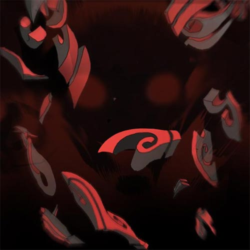
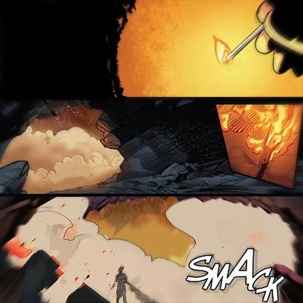
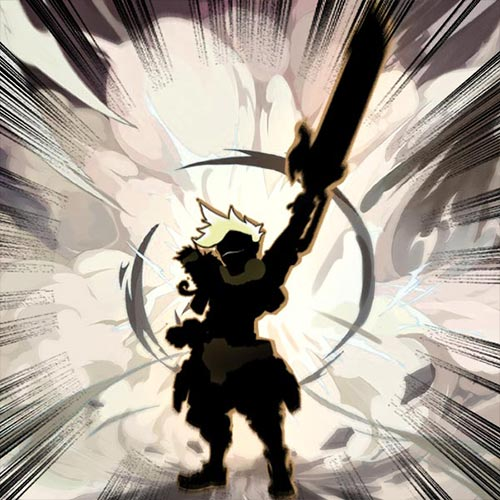

# 🌱 Biography Vidar 🌱
## Chapter 1

In the south western corner of the Iron Forest lies a special mountain forest, this place consists of the harshest mountain terrain, which is the main reason why it attracts adventurers, this has become the place which all adventurers want to conquer, but besides the treacherous terrain and all the labyrinths, it is also the base of the most mysterious tribe, known as the Lion Ape Tribe.  
During the peak of their reign, the Lion Ape Tribe ruled the Iron Forest, but unfortunately, their excessive behaviour angered the other surrounding tribes, which as a result almost led them to the brink of extinction. They now live in a corner of the forest for sake of their safety, but not only for their safety. But for the sake of waiting, waiting for the chosen one to appear.  

## Chapter 2

Reid is an experienced explorer, at that moment he instantly felt out the difference in his surrounding, when creatures started flying in his direction. This is usually considered to be a sign of danger, but his curiosity overtook his fear and prompted him to move forward.  
The path up the mountain had become terribly slippery, and to make matters even more complicated, Reids was now faced with a mountain wall of hundreds of tunnels, each tunnel made up of hundreds of vines and roots, and without a clue as to where each tunnel leads. Reid gulped in fear, explorer intuition suggested him one of the tunnels on the left side to avoid an encounter with any creatures that lurk within them. The climb up had brought him into a state of hopelessness, and due to the darkness he had feel his way through his surroundings, the stench of the mud he trekked through made the circumstances feel even more desperate. After 3 grueling minutes of climbing, he finally saw the light, his heart filled with excitement as he ran towards it, until he finally felt the warmth of sunshine touch his skin, the feeling of the sweet fresh air made him feel as if he was reborn.   
Reid then stumbled upon a scene, which he would never forget, there in front of the towering wall stood an altar made of a special ore, and deep within the altar a black bronze sword was placed in the ground. All the surrounding life fell silent and watched a black white-haired fellow move towards the sword. The wind howled as the young man gripped the sword with his hands, and with a great big roar he drew the sword from the ground. At that moment it seemed that time fell still, but then shortly after the silence, thunderous cheers were echoed throughout the entire valley. Reid had the uncontrollable urge to tell someone what had happened here.  

## Chapter 3

This was the 13th conflict since January, ever since Vidar had drew the sword, conflicts between tribes were coming to a peak, all the surrounding tribes were feeling threatened, as the sword, which had once brought death to their tribe members, has been drawn once again. As a result, they decided to invade the Lion Ape tribe before they invaded them, but over time, again and again, tribe members started to lose patience.  
Suddenly out of nowhere the Lion Ape Tribe leader made an announcement requesting for peace, and then arranged a conference where all tribe leaders can meet, it was here where the tribe leaders gazed their eyes on the young teenager, in who’s hands their fate lies. Resentment for Vidar from the tribe leaders filled the air. Vidar could undoubtedly feel the resentment towards him, but he remained calm and confident, and as he walked towards the main he hall, he announced to everyone:  
“Surrender to me, and I will revive the tribal civilization for all.”  

