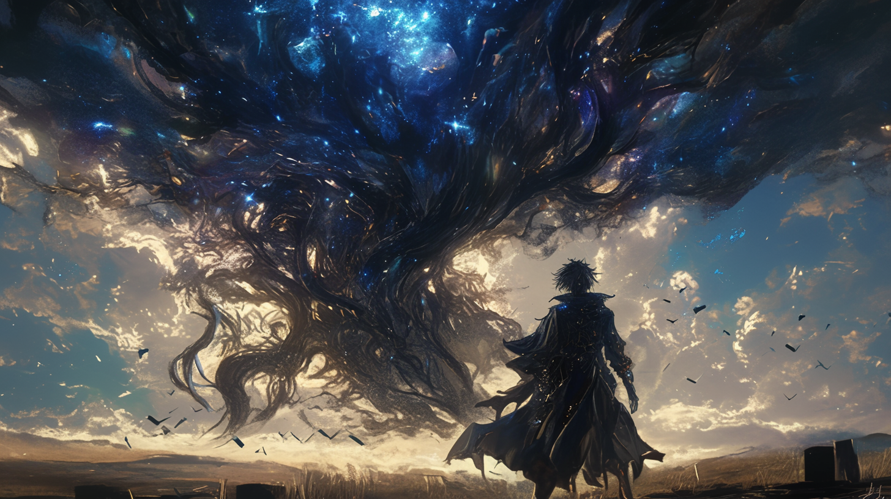
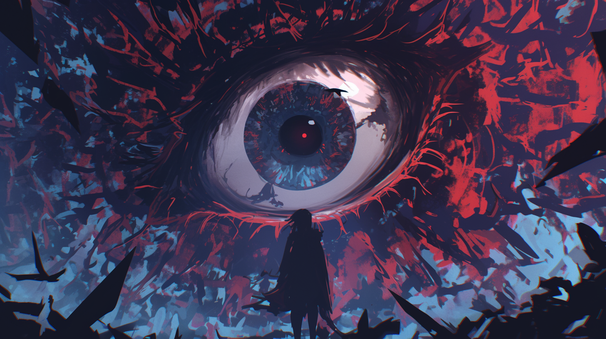
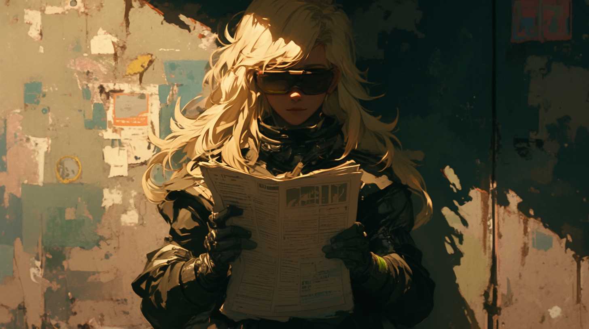
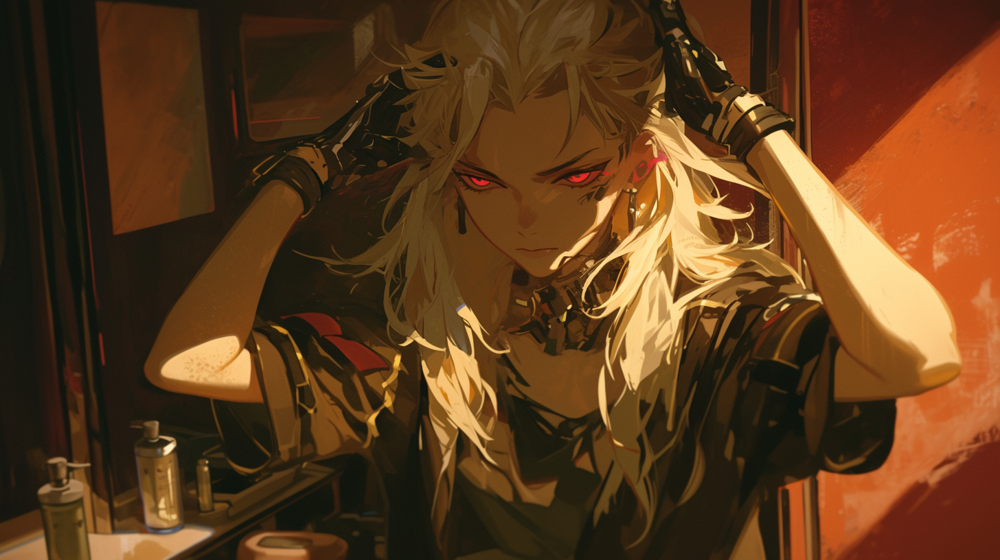
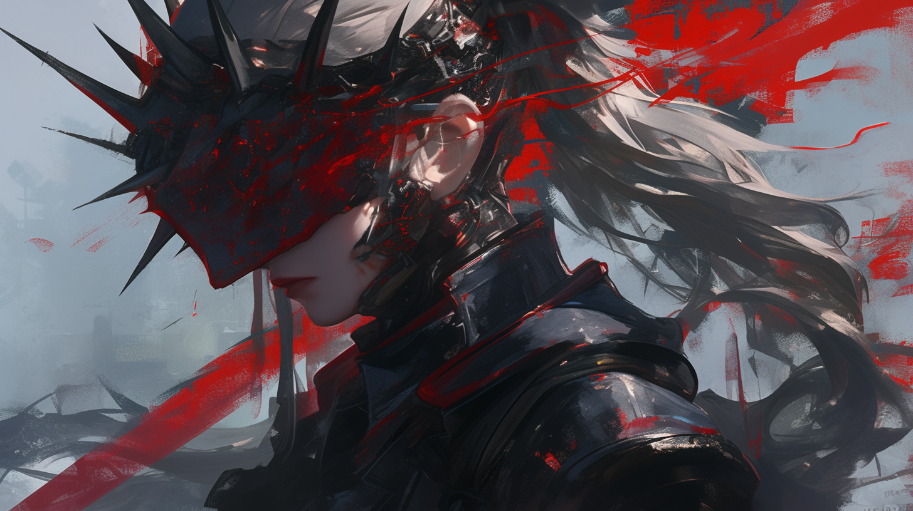
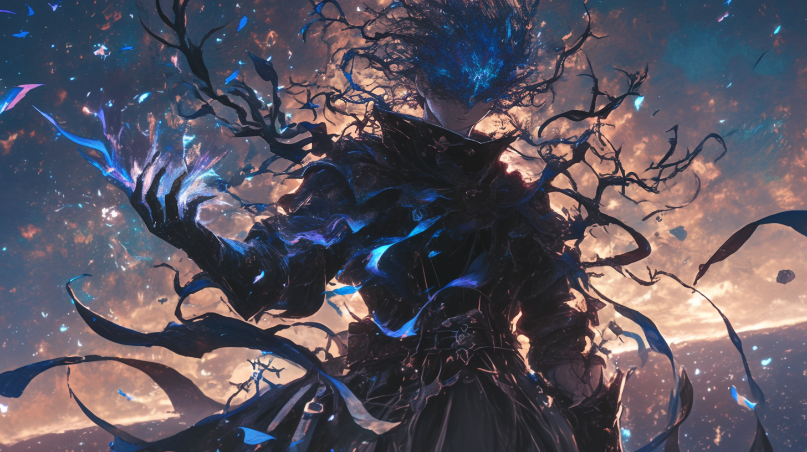

# 💫 Biography Wolfsbane & Wolf-Fang 💫
## Chapter 1

**Niggu Star**
Under the moon, there were some gang members, surrounding an elegant gentleman in a suit. They bowed to him very obsequiously. One of them was flattering,  
"My congratulations, Brother Roger! I admire you so much! You have made it to a backbone in just a few months. Consider me... I mean, order me to serve you whenever you want. I can do many things, hehe..."  
Roger smiled, seemingly very much enjoying the compliment. He lowered his head and signaled the man to light his cigarette. He glanced at the man, casually took out a mecha starter from the lining pocket of his suit, and threw it to him casually,  
"Look, our boss likes capable men. I could climb to this position today only because I have contributed my everything to the group. Go help me maintain the mecha in warehouse No. 11. I gotta do an important thing tomorrow morning. And remember to keep my mecha turned on. You'll be paid."  
Bow with noticeable happiness, the man set off to the task with many jealous gazes.  
Surrounded by people, Roger came to the retro villa made of high-quality ebony. This was also the only way to Materland Cliff. Finally, he was going to meet the one behind Ebo Candy. The case he had been pursuing for months was finally going to be solved. He told himself to stay cautious. Thrillingly yet nervously, he opened the door and walked in.  
Inside was a small theater, already sat many audiences. He followed the example of the others, found an empty seat, picked up the black robe, and put it on.  
And the spotlight was on as a man came to the stage. He opened his mouth, uttering unintelligible syllables. Suddenly, Roger's chair came alive, wrapping itself around him completely. Across the hall, all chairs turned into wooden cocoons, one after another. The man, satisfied, cast a glance around the lobby before bowing gracefully to take the curtain call. As if on cue, the spotlight dimmed. In the darkness, the ground began to writhe, and a massive, gaping maw emerged from it, swallowing every last cocoon…  

---  
"Welcome to Materland Cliff, lost lambs. Regardless of the lands you hail from or the motives that brought you here, tonight, you shall be reborn within the womb of the Mother, emerging as one of my own."  
The cocoons slowly unfolded, wooden tendrils snaking around the audiences' limbs, while others burrowed into the earth, holding them upright in place. 'Roger' opened his eyes to see a sheer cliff, smooth as a mirror, reflecting the twisted image of a giant, withered tree. Its barren branches still hung some shriveled leaves, and the whole tree was flickering crimson lights. All the branches stretched skyward, as if lifting a big full moon. Surrounding the tree were countless smaller ones of the same kind, densely planted, spreading all the way to his feet. A closer look revealed that the trunks were, creepily, sleeping human bodies.  
Without hesitation, he bit through his synthetic teeth, summoning his mech.  
A decaying scent of corn drifted from the giant tree, and the branches wrapped around their bodies grew even more active. The man reached inside his jacket, pulled out a silk handkerchief, and gently placed it over his eyes, bowing his head in reverent prayer.  
“Wgah'nagl, gof'nn wgah'nagl! Nilgh'ri llll mgleth fhalma!”  
Another full moon rose behind him. 'Roger' felt something crawling inside his left eye, the pain was unbearable. He struggled instinctively, but couldn’t move. He could only do silent screams as sweat and blood mixed, staining his shirt red.  
"Must pull it out." He had this only thought in his mind. With his left hand still wrapped in branches, he pulled out his eyeball. So many roots had already grown out from the bottom of his eyeball, and after dropped to the ground, it found a place in the grove to take root.  

## Chapter 2

It was as if the man praying had anticipated this to come. He turned his head to 'look' at Roger. Despite being a veteran, Roger could no longer maintain his composure—his other eye had started to itch as well. Fortunately, his "Knight" mech descended from the sky just in time, crashing down on that man. The hand cannon blasted the branches off his body, freeing Roger. He glanced at his now fully grown "left eye"—a small tree had sprouted, and atop it was a child, identical to him in appearance.   
This was so disgusting. Drawing his sword, he severed the tree, only to also slice through the child's legs. His first instinct was to end it with another strike. But the child murmured, "Father," stopping his action. "Whatever". He scooped up the child—who had yet to grow arms and now lacked legs—and placed it inside the cockpit.  

---  
Just as he was about to escape the scene, a sharp branch pierced his left shoulder. At that moment, the child opened its eyes, and Roger’s blood dyed its once-blue irises a deep red. Then, before Roger could react, the child and the mech sped away from him, while he was dragged upwards by some force towards the towering tree.  
He grabbed at the branches, trying to wrestle against the force pulling him, but it was all in vain. His injuries were too severe, leaving him powerless to resist. All he managed to do was clutch a handful of dried leaves before being dragged further toward the treetop. Yet, he didn’t give up. His hands desperately reached for anything he could grasp, and finally, he latched onto a hollow in the tree’s trunk, holding on with all his strength, even as his fingernails tore off and the skin of his palms wore away.  
Just as he was on the brink of losing consciousness, a strange realization struck him—he was no longer being pulled forward. He looked at his hands, astonished to see the dried leaves taking root in his arms, sprouting tiny buds. Even his wounds had nearly healed. He carefully observed his surroundings and loosened his grip just to see what may come. The force carried him onto another branch. Seizing the opportunity, he opened his mouth and began swallowing the leaves. Then to the next spot, and the next.  
Whatever these dried leaves were, they seemed to be working. Not only did they heal his injuries, but they also pushed the branch that had pierced him slowly out of his body. However, his leaf-eating behavior didn’t go unnoticed—it enraged the entity that ruled this place. The moon suddenly blazed with light, focusing its reflection squarely on him, and in an instant, he vanished.  

……………………  
"Gilbert, I give the IFOB to you. I think I’ll just go for undercover work"  
"But, Instructor—"  
Roger waved him off, walking out of the IFOB command room without giving Gilbert another chance to speak.  
……………………  
“Oh, my old friend, you know me. I gave up my name and so much else. I can’t teach him.”  
“Come on, Wolfsbane. I’ve heard of agents who even form temporary families for their missions. If you wished to, being his teacher wouldn’t be that hard, I suppose?”  
On Camp Star, Rhaegal spoke to the young Wolfsbane, while Peace watched aside with quiet curiosity.  
……………………  
“Wolfsbane… it’s Wolfsbane! Notify the priest, now!”  
“No need for that.” In an AAA outpost, Wolfsbane casually tossed the priest’s severed head to the ground, ignoring the panic of those fleeing. He walked over to a white-haired girl (Lavinia), releasing her from her bonds.  
……………………  
“Can a god be killed by a human?”  
Wolfsbane stayed silent.  
(Sigh) "I’m not sure why you’re asking me, or what you’re planning to do. But if gods do exist, you’re hardly human anymore, are you? Maybe that gives killing a god a possibility."  
“I just borrowed a bit of its power. Since you’ve said that, I’ll do my best. Thanks for everything you’ve done for me. I’ll come back for you.”  
In his bedroom, Wolfsbane stared blankly at the bullet holes in the wall, lost in thought. The ghostly woman (Cecilia) had just vanished. Though it was their first meeting, she had spoken to him as if they were old friends.  
……………………  
"Jay, look, the baby's smiling," in the delivery room, a young woman holding 'Roger' in her arms said softly to a man whose face was in shadow.  
"Mom..." Wolfsbane murmured as the young woman's face slowly twisted, transforming into the image of a full moon.  
……………………  
……………………  
……………………  
Countless images flashed by, and Wolfsbane found himself lost in time, drifting through glimpses of the past, present, and future.  
Yet in reality, he was still here, rooted beneath the giant tree. The wind sent a lullaby and carried away his consciousness. Having consumed the dried leaves, he had now become the second-largest tree in the forest, towering over other saplings. A fleeting emotion rose within him, only to be carried away by the wind to some unknown place. Half-awake, half-asleep, his limbs swayed gently in the breeze.  

## Chapter 3

"Father?" He heard a voice.  
Wolfsbane opened his eyes to find two overlapping images before him. It took him a while to regain consciousness, perhaps because he hadn’t been able to think clearly for so long. He realized one of the images was coming from his empty left eye, so he closed his right eye. After focusing, he saw himself lying on the floor of the mech’s cockpit, his legs fused at the roots of the machine. Living metal was spreading across his body, and at his shoulders, biomimetic muscle fibers and neural bundles twitched, while two metal arms were growing.  
"I need to check the mech’s damage first," Wolfsbane thought.  
"Father, finally you answered me! Please give me a moment; I still need some time to finish growing my body."  
"That voice again!"  
"Am I interrupting, father? I’ve been able to hear the voices of you and mother urging me to help you Descend, but then I couldn’t hear your voice anymore. I got worried, so I..."  
Wolfsbane thought for a while and realized his mind had indeed become more grounded than before, no longer drifting. It felt like anchored. Reflecting on what the voice had said, he got it that the "Mother" was possibly the giant tree and whatever entity lay behind it. To weaken that entity, he would need to destroy the forest. Recalling the memory fragments of the past and future he had seen during his lost moments, he knew he needed more anchors, more allies, to help him destroy the forest. Fortunately, there was this girl. Many things could be entrusted to her now. But why did her voice sound so much like the AI, White Queen? As he pondered, he gave his orders.  
"Well done. It is because of your call that I have hope of returning. Now, I will impart to you the necessary knowledge, and you will fulfill your mission on my behalf." With that, he passed on his memories as a covert agent, his combat skills, and some possibly future images to the girl. Then, he waited, resisting the breeze that sought to erode his consciousness, gathering strength and waiting for the right moment to come.  
Meanwhile, in the mech’s cockpit, a blonde girl—who looked exactly like Wolfsbane—pulled her legs out from the deck. Her legs, too, were metal prosthetics, leaving behind two holes oozing green fluid that were slowly closing up, self-repairing. The girl stepped out of the mech, oriented herself, and walked toward the city in distance.  
Back in the cockpit, an alert flashed on the display.  
“Warning! ALL Queen modules lost!”  
“Warning! Communications Pawn module lost!”  
“Warning! ALL Rook modules lost!”  
“Warning! ALL Bishop modules lost!”  
“Warning! White Knight module lost!”  
Yes. They had all become the girl’s nourishment for growth.  
The girl walked briskly toward a newsstand in the city. She picked up a newspaper, casually reading it while tapping rhythmically on the counter. Before leaving, she chose to pay using facial recognition. Not long after she left, an encrypted call request came through. The voice on the other end spoke first.  
“Glad you’re safe. We’ve received the mission briefing. Is there anything you need help with?”  
“My current codename is Wolf-Fang. I need Wolf-Fang’s authority level raised. Also, lock down Niggu Star—just a lockdown, no full assault. And tell Gilbert to coordinate with my operations. The operation codename is: 'Descent.'"  

## Chapter 4

**Bell Star**
Wolf-Fang's finger morphed into a small blade as she swiftly cut off her long hair. Then, pulling out a makeup kit, she applied makeup to give herself the appearance of a man. After changing into her pre-prepared clothes, she stepped out of the lounge and started a livestream, blending in perfectly as one of the tourists. As she approached the city gates, she looked for the landmarks from her memory. Just then, someone handed her an apocalyptic cult flyer. She mocked inwardly—how amusing that they would hand her a flyer. Well, she wouldn't mind ending this cult after finishing her business. She tucked the flyer into her pocket, but at that moment, an earthquake struck.  
“Damn, it’s started,” she muttered, feeling a surge of urgency. With no time to bother about the cult, she quickened her pace, looking for a quiet spot to blast a tunnel. Unexpectedly, members of the cult appeared and opened a tunnel for her. She couldn't help but wonder if Father had other servants in play.  
Once outside the city, she locked onto her target and leaped, sliding down the slope, only to be caught by a white-haired girl—the very person she had been searching for.  
Found her!  
She shut down her livestream and guided the girl toward EverGreat’s ship. Glancing at the mirage in the sky, she thought to herself, "By saving the Witch, I’ve saved millions of planets. Father will be proud." Jumping out of excitement, she sent a message to \$age and then left the area.  

---  
As soon as Wolf-Fang reached the first basement level of the building, she was spotted by a drone. It didn't take long for the Green Demon forces of Genesis to surround her.  
“Guess I have no choice but to fight. That's not elegant!”  
She infused her weapons with a crimson arcane, slashing through the air and sending arcs of energy slicing through this smoke-filled space. The glow reflected off the rising dust, turning the entire area into a swirling red cloud. From within the cloud, a figure manifested. Wolf-Fang wiped away non-existent sweat and continued on her way toward her destination. Luckily, her innate abilities outwon the Green Demons' regeneration powers, or she'd be stuck fighting them for longer.  
Reaching the 18th sublevel, she stood in front of the target’s apartment. Her finger morphed into a thin needle, slipping into the lock’s crevice. Arcane flowed through her fingers, and the door opened. She glanced at the display of the game pod. The person was still alive. Just to be sure, she topped up their nutrient solution. Then, she connected her White Queen module to the rectangular interface, copying the module over. Now, this “Legion” mobile communication hub was saved. Satisfied with her work, she carefully locked the door and left. Before leaving, as a habit, she dropped a quick text to her trusty helper, $age.  

---  
This time, Wolf-Fang had come for Hanba. According to her father's plan, only such a unique being could help destroy the withered forest. Its scorching life force was the exact opposite of the cold, withering energy of the forest. Even she dared not get too close. By the time she arrived on the scene, Hanba had already been crushed by D.  
From there, the situation got further out of control. Genesis and Aurora Order—the two major powers—had clashed, and Wolf-Fang realized things were slipping beyond her expectations. However, when she learned that even the IFOB had fallen into chaos and no one had come to mediate, she got it immediately—it had to be Gilbert’s doing!  
But well done, Gilbert! The bigger the chaos, the less likely anyone would notice her.  

---  
**Kathre**
Now she adopted the alias "Ken." She pretended to have the ability to tell the future, gathering a group of "scavengers" and forming an outsourcing team. Eventually, she was hired by Genesis and brought to this planet. Her original plan was to use her father’s identity—the "Many-Faced Saint"—to spread rumors to the Aurora Order, claiming that there was a chance to ascend to sainthood here, luring their strong members into creating chaos. In the chaos, she would then steal the power of the Keeper of the Moon-Lens. What she didn’t expect was to draw the attention of ‘The Fate Index’!  
Seeing her uncontrollable nosebleed, surely—her disguise had been seen through by Itheseos. He handed her a curved sword, and as they walked outside, he was the first to speak.  
“The Many-Faced Saint wouldn’t use such a clumsy trick to deceive people—nosebleed? Really, you thought that would work?”  
Wolf-Fang couldn’t quite read his intentions and, imitating her father’s tone, replied, “You see, Fate doesn’t take unnecessary risks, does it?”  
“Haha, now you sound somewhat like him. But let me tell you something he might be too embarrassed to admit—his disguises have never been seen through because he's shrouded by the night, and his mask—I gave it to him. I was there, at Materland Cliff, you know. It was I who concealed your tracks. So listen—this power is beyond your control. I will take it for you.”  
Now it's for Wolf-Fang to get speechless. What a strange "uncle". She kept a distance from him as they returned to the main hall.  
“Could you two give us a lift? I need to take our new General K to Empyrean.” Itheseos talked to Lavinia as he pushed Wolf-Fang in front of her, causing her heart to skip a beat. Even at such a close distance, Lavinia didn’t sense anything off about her. Glancing at Itheseos, she immediately realized that he wasn’t bluffing.  
Fine, the stronger he was, the more certain Father’s plan would succeed. Anyhow, it’s time to ascend to the Empyrean and free the chained blade —— Enus.  

## Chapter 5

🪐**Niggu Star**  
Wolf-Fang cut the mic, eyes fixed on the falling space station—burning up like a shooting star. She felt a brief moment of admiration—excitement, too. This was the moment.  
"Hang tight, kid," she shouted, " Lady Mech’s coming for you!"  
She hit the controller, pushing the ship forward like a streak of light, locked on Sarah’s trail.  
⛰️**Materland Cliff**  
Sarah’s mech came crashing down between two massive, dead trees. Whispers filled her head—endless, maddening. The pain in her head grew unbearable, and before she could resist, she blacked out.  
Moments later, a red glow followed her down from the sky. Wolf-Fang, standing calmly on her mech, surveyed the scene. Seeing Sarah was only unconscious, she nodded in approval.  
"Tutorial complete. Congratulations on unlocking full access. Well done, beginner. From now on, leave it to us."  
But suddenly, green meteors rained down, transforming into Green Demons that circled her. The largest of the trees stirred, creating clouds of dust to surround her and reducing visibility fast. The Green Demons roared, charging at her fiercely.  
"I’ll handle the first round," Wolf-Fang said with calm confidence. Light flared around her, flames igniting from her weapon. Her belt glowed faintly, and a message buzzed in her earpiece.  
"'Command' received. 'Legion' support is now active. Enjoy the hunting, Miss Wolf-Fang ^o^."  
With a flash, she became a red light, circling Sarah in loops. Red arcs of energy filled the air, cutting through the Demons. Flesh and bone flew—some burst into flame, others shattered into dust. Sarah lay, still and untouched, in the middle of a lake of blood.  
The largest tree sensed the danger. From its twisted branches, people—once trapped—began to fall free and targeted Wolf-Fang. They moved strangely—some crawling, others shooting forward on wooden tendrils, while a few floated like leaves.  
Wolf-Fang ceased. She stabbed her weapon into the ground and shouted, "Father!!!" Hence power was bestowed. More red sparks flickered around her, and spikes grew from her body. Her weapon transformed into a glowing crescent moon. One swipe—and the attackers beheaded. But even headless, they kept coming. Flesh grew from their cut wound, slowly but continuously.  
Seeing this, Wolf-Fang charged at the nearest "tree man". She's unmatched In one-on-one combat, of course, but their numbers and relentless regeneration turned the fight into a war of attrition. It was a brutal stalemate—both sides could heal and were healing as fast as they could.  
Time passed as it did. Until smoke rose from the cliff, and strange prayers whispered through the air. Above, the sun faded, and in an instant, night fell. A full moon hung high in the sky.  

## Chapter 6

Moonlight bathed the cliff again. It was another new moon hanging over the twisted branches of the ancient tree. Yet between the branches, only shadows—dark spaces connecting to something unknown. From that void, countless crimson eyes blinked open.  
Wolf-Fang, still battling the tree-beings, glanced up at the moon somewhat confusingly. "Mother?" she muttered, and her eyes lost focus. Her weapon slipped from her hands, and the red light around her dulled, mixed in some purple light. Seizing the chance, the tree-beings closed in, leaving her more wounds. Many wooden spikes lodged in her body, blocking her regeneration. She continued to emit (or let's say, lose) energy, and couldn’t wake up.  
A translucent veil gently descended, covering her and slowing the enemy’s assault. It was Itheseos. Showing a strict expression, he glanced at Wolf-Fang, then flung his red cloak into the air. The cloak expanded, temporarily blocking the moonlight, and the tree-beings fell into a deep sleep. But sweat dripped from beneath his mask—one drop after another.  
The sky twisted, and the cloak returned to Itheseos, now torn. Blood spilled from his mouth as the moonlight intensified, mocking his overreached behavior. The tree-beings began to move again, and from between the branches, rotten wooden tendrils emerged, reeking of rotten-corn-smelling stench. Crimson eyes blinked on the tendrils, luring Itheseos to be indulged in some illusion. His body trembled violently—then, all at once, it stilled, as if something within him had finally let go. He fell into the blood-soaked lake. Around him, transparent threads and light veils shuttled in the air. His legs twisted together, while his right arm bent backward unnaturally. With one last effort, he used his left arm to throw his cloak and mask, and then it was also twisted. Lying on his back, his eyes turned lustreless, and he moved no more. Only another sapling sprouted at the foot of the withered tree.  
Night fell once again. His discarded mask barely blocked the moonlight. But since the patterns on the mask began to fade, it was clear it wouldn’t hold much longer. More Green Demons appeared in the distance, while the saplings at the foot of the tree grew taller, nourished by blood. One of the tree-beings raised its weapon, aiming to cut Itheseos's head down. The blade came down—but stopped at his neck. Another tree-being had caught the blade, while its other hand plunged deep into Itheseos’s chest.  
“This is so not you. As, you see, fate doesn’t take unnecessary risks.”  
The pale Itheseos started to recover. His twisted limbs slowly straightened, and even his eyes began to regenerate. At some point, Sarah had also woken up, raising light shields around the three, temporarily stopping the enemies.  
"Static"  
Turned out, the tree-being was Wolfsbane in disguise. He silently removed the earpiece from Itheseos’s ear and put it on.  
“Here！“  He heard Gilbert’s voice.  
Wolfsbane turned and saw four figures emerge from the night—Every, Megalith, Sobel, and Irene. Wolfsbane looked in a complicated mood as they moved toward him, a small transport ship flew towards Wolfsbane and hovered over his head. Gilbert leaped down from the ship at first, followed by many others on many other ships, countless of ships lit up the night sky. They all came to help.  
What he saw—Grendel hovered in the air, flames coiling in his hands as he slowly descended from the sky. Ahead of him, Cucho’s greatsword blazed to life, fire surging along its length. Lamia drew her twin crossbows from her waist. From behind them, thorny blades sliced through the air, striking the ground with force—Nymph followed swiftly, her vines unfurling behind her as she landed, eyeing the tree-beings with an amused smile.  
Irene walked forward to the front-most and said,  
”Everything is permitted!” Her call was answered by countless Brotherhood members assembled behind her.  
To the left, the Cecilia sisters arrived, leading reinforcements from Dreamland. Xuxu and Aningákh rode a tiger, while Yae Kumo and Wukong flanked them, commanding their own elite forces with unwavering confidence. On the right, storm clouds churned in the sky—lightning flashing wildly—Zeus’s eyes blazed with electric fury as he surveyed the battlefield from above. Below, Lavinia circled on her dragon, spiraling above $age, Vidar, and the rest of the IFOB troops, the dragon’s mouth glowing with fire, ready to unleash destruction. At the center, atop a transport ship, Ms. A led the Aurora Order, with D silently following behind her, the flames atop his head confirmed his fierce battle spirit.  
Grendel looked around and asked, "Is that everyone?"  
”What? You wanted more?” Cucho quipped.  
Suddenly, chaos erupted among the Green Demons as wooden spikes sprouted everywhere. Yuan had arrived, leading Rhaegal and the Dragon Group.  
Wolfsbane felt a strange sense of calm as he watched them all gather. Meeting Gilbert’s assuring eyes, he took a deep breath.  
“IFOB！“  
”Assemble!”  
The charge began, but Wolfsbane did not move. He stood on the spot, an unseen force rippled out from him, spreading across the battlefield. Stars shimmered in the air as arcane energy filled the space, and the unique power of abundance flowed through every warrior, healing their wounds, reigniting their fighting spirit, and restoring their strength. Zeus unleashed thunder from the heavens, smiting demons with lightning. Cecilia operated time and space, while Lavinia became a living inferno, cutting through the Green Demons and tree-beings relentlessly.  
But they couldn't stop the dark portal atop the withered tree to open, revealing the monstrous entity within. Tendrils lashed out toward the heroes—some, caught off guard, were devoured by gaping maws at the tips, while others were struck down by thick limbs, severely hurt.  
Enus reacted first, pushing her power to the limit. With expert precision, she swung her chain, locking one of the tendrils in place. She brought her blade down, severing the tendril cleanly, showing the true Demon Hunter's power. This act encouraged others, and soon, the battle against the tendrils was fully underway.  
Meanwhile, under Ms. A's command, D charged the cliff, hammer in hand. Each strike sent cracks through the rock. The cliff wanted to put D into illusion with a luring voice, but unceased, D pressed on, widening the cracks—until the moon suddenly filled the entire cliff. A deep, jagged canyon ran across its surface: the moon opened its "eye". Flames roared from D’s head, he raised his hammer high, but couldn’t strike it down.  
From the distance, Abiroth came riding on a stream of black magnetic energy. Three Fates hovered at her side, ready to be revealed. The first—Rigel—unveiled, and thunder stroke. But the other two Fates remained hidden, growing hazy under the moon’s watchful gaze. Itheseos, now recovered, retrieved his mask and hurled it at Abiroth, shielding her from the moon’s eye. At that moment, the Nemesis Star revealed and gave her the power of inspiration. Cecilia, in perfect sync, appeared beside Abiroth, her hands channeling shining power into her. Finally, The Nameless Dark was revealed, and a deep, foreboding bell tolled, dragging everything into chaos. As the moonlight vanished, D seized the moment—his hammer crashed down, and the cliff shattered.  
With the moonlight cut off, the dark portal closed. The entity inside thrashed wildly, planting more saplings desperately, but its fate was told. It vanished, swallowed by the closing portal. Wolfsbane, now at the foot of the withered tree, slipped into the trunk. To end the story, the great tree shriveled and collapsed into dust.  
That night, humanity forged a new legend—terminated an ancient god, once feared, at Materland Cliff.  

