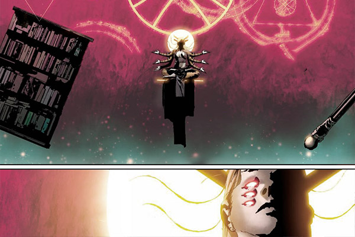
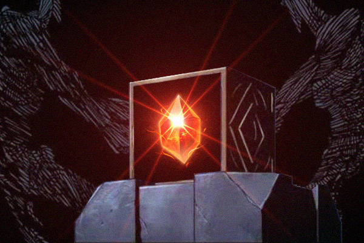
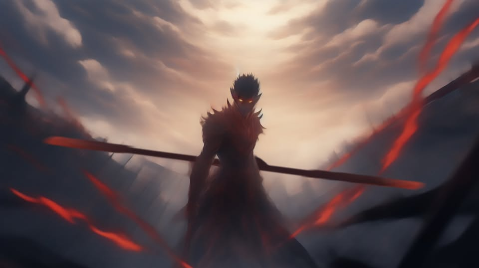

# 👑 Biography Wukong 👑
## Chapter 1: The City of Truth

In order to reach the Moon Hall, young Cecilia and her party came to the foot of Mount Barch, preparing to go over it and head to Glaad. Ever since Yae wiped out the Koujins, the plants in Mount Barch had been growing wildly for thousands of years without any harassment from their archrivals. The original mountain path had become rickety, and the twelve palaces built along it had been deserted. The good thing is that with Mr. Mouse leading the way, they never deviated from the mountain path and did not encounter any danger.
There was a legend about the twelve palaces built on the Mount Barch. Since ancient times, there had been people going on a pilgrimage by climbing palaces and ascending to the moon, from which the path earned the title of the heaven-ascending path. At the end of the path sit the Purity Moon Palace, behind which was the city of Glaad built along the mountain. Oddly, the Purity Moon Palace was located at the peak of the mountain, where had seen little rain or snow. No wonder all saw it as a holy object of pilgrimage. At this time, young Cecilia looked beyond at the Purity Moon Palace and found that it was no longer surrounded by its former golden splendor; the alloy that covered its outer wall was dull and densely filled with black and brown traces, looking evil and horrible. 
As the crowd was feeling sentimental, clouds of white fog emerged relentlessly from behind the Purity Moon Palace, spreading down rapidly. Suddenly, the place was filled with white fog and became barely visible. Young Cecilia groped her way towards the Palace, wanting to hide herself. However, she lost her footing and fell down into a huge black hole. On her way down, she had a feeling that this was strangely familiar, as if she had been here before and experienced many things. 
Suddenly, someone pulled her out. She opened her eyes and found herself standing in front of the Purity Moon Palace. The black hole and clouds of white fog were nothing but a surreal dream. Leaning against the wall of Purity Moon Palace was a grey-haired man with a shrunken nose and high forehead wearing gold armor and red robes, his body straightened up, his eyes tightly closed, looking pale and lifeless due to the cold weather. She stepped forward without making any noise and patted his shoulder gently. After what seemed like ages, the man did not move a bit or give any response, so young Cecilia went around him carefully and entered the Purity Moon Palace. In the meantime, the man slowly opened his eyes, revealing golden pupils.

## Chapter 2

📍The city of Glaad was originally a manor built by a scholar and his students at the foot of Mount Barch, where they studied alchemy, astrology and Theurgy. Unlike other scholars of the time, these scholars advocated sharing knowledge and exploring the universal truth together. They felt that it was out of the realm of possibility to achieve much with only a handful of people, and it was too arrogant to strive for infinite truth with their limited strength. After decades of research, they worked out a sort of drug, also known as cure-all, which could cure people of all diseases and ailments, for which their name spread everywhere. Countless people from different continents flocked to the city to study, do business and receive treatments, which fostered the development of a bustling metropolis with diversified culture from all over the world.

---
In Purvavideha Orphanage, located in the Lower District of Glaad, a skinny little boy with glasses was sitting on the floor carefully investigating the mechanical toys in his hands, with some drawing books from the eastern continent on his sides. Bang, the door was knocked open. The little boy then quickly shoved the drawing books and mechanical toys under the bed and crouched on the floor naturally with his hands on his head. However, nothing ensued.
"It’s me. There is no need to hide yourself, Hu San’er. I will be going to the Upper District soon. You must be on your own now. Be careful and believe in yourself. Do not give up."
Hu San’er looked up and saw the blonde boy put down a bag and rushed out of the room. He scrambled his way towards the door and heard only hasty footsteps; the blonde boy was already downstairs. So, Hu San’er got back into the room and opened the bag on the floor, inside which were the things that he had long craved: an Icositetrahedron toy and a sheet of Truth Brief, a newspaper. Since the introduction of steam-powered machines, the time required to produce cure-all and Elixir of eternal life was significantly reduced. The immortal made use of time to amass capital, exploiting the newborns and making them extend the top part of the mountain by constructing an airborne courtyard called "Heavenly Palace", for which they call themselves the Upper Class. Ever since, the city of Glaad was divided into Upper District and Lower District, causing the circulation of knowledge to be cut off. Living in the shadow of the Heavenly Palace, people in the Lower District never got to see the sun and impart knowledge. In their eyes, the thick exhaust from the steam-powered engines of the Heavenly Palace somehow did make it the city of the sky.
Granted, gifted people like Hu San'er were not a rare sight in the Lower District. For all that, the so-called “Upper Knowledge” concerning alchemy and steam power was nowhere to be found in the Lower District, where knowledge dismissed by the Upper Class as “Lower Industry Basic Knowledge”, such as metal shaping, mechanical assembly and power machine maintenance, was easily accessible, let alone those encapsulated in the Truth Brief, such liquid alloy, mithril, mech suit, human transmutation and the third generation of Elixir, which were considered cutting-edge technologies even in the Upper District. 
After reading the newspaper, Hu San’er picked up the Icositetrahedron toy, which was painted with different patterns on each side. One who could open the Icositetrahedron by restoring the correct patterns would be rewarded with candy and mechanical parts. What Hu San'er received was a ticket, which wrote, 1v1 Trial Tutoring ticket to Spiritual Terrace College. The ticket had a crescent and three Stars-of-David drawn on it and an address written on it, with a door pattern next to the address. Fascinated by the verisimilitude of the door pattern, Hu San'er touched it with his index finger. Surprisingly, the door did open and dragged him in.
Hu San'er felt vertiginous. In front of him were bright-colored beams of light, twinkling stars, multi-colored bubbles, and distorted faces. Suddenly, a bell tinkled and awakened Hu San'er. He found himself sitting on a tatami opposite a statue of a faceless six-armed black Buddha. As he was about to look at his surroundings, the eye without pupil in the Buddha's forehead opened abruptly. Emitting the sound of intersecting cogs, the Buddha's six arms moved, grabbing both arms of Hu San'er with a pair of its own hands, holding down both legs of Hu San'er with the second pair and cupping Hu's head with another pair. Buddha's eyeballs rolled rapidly, revealing six pupils. As soon as Hu Saner saw them, he simply passed out. Due to coma, Hu San'er had quite a dream, in which he was able to study in a school, and had his own laboratory, a splendid manor where he preserved all kinds of hand-made mech suit and a huge alchemy furnace which he used to create a new mithril, a kind of liquid alloy made from mithril that can be controlled by human's willpower. He was introducing the new mithril on the stage when he looked down on his audience, who consisted of merely human brains and no other body structures. The terrifying sight gave Hu San'er a fright. He then woke up to find himself lying under the ceiling of the orphanage. It was a dream then. However, Hu San'er still remembered all the details of his study. That knowledge was true.

## Chapter 3

In the dean's office of the Purvavideha Orphanage, a man with white gloves in a white suit was sitting cross-legged in the dean's seat, with a cigar between his lips, and squinting at the device on the table. To his left and right stood two soldiers wearing lightning mech, with steel hammers hanging from their waists, winged helmets on their heads, red robes on their shoulders, and the lightning pattern on their chests. Hu San'er surveyed this mech suit, and though unable to detect the location of the core of the power machine, he understood that the yellow liquid flowing on the handle of their hammers was a kind of mithril. Mithril, when activated, could flow through the mech suit like blood, providing it with unlimited energy.
"Dean Hu, you must be very aware that it is illegal to make a steam-powered engine without permission. Producing electricity at will in orphanage can be punishable by death. However, the Heavenly Palace has long been eager to seek talents, so we will not be pursuing this matter any further. Instead, we would like to hire you as the honorary consultant for Palace of Heaven and provide a laboratory for you to continue the research on this miniature power machine. You may pack up your stuff now. We will return to the Heavenly Palace together in a while."
Thinking of a blonde boy, Hu San’er agreed without saying much.

---
It has been six months since Hu San’er first set foot on Palace of Heaven. After he published the new power machine technology in the name of Heavenly Palace, no one ever visited his lab again. He requested to meet the man in white suit, but no response was given. It was after so many attempts that he finally realized the honorary title was nothing but a cover for technology theft. In desperate need of strength to protect his knowledge, he remembered that new mithril and his self-made mechs in his dream. After months of challenging work, Hu San’er completed a simplified glider, with the help of which he managed to leave the Heavenly Palace and returned to the Lower District. In the Lower District, he secretly imparted knowledge to his students in the orphanage during the day and studied armor and mithril in the underground at night. Days in and days out, he finally recreated the huge alchemy furnace.
As he was examining the black mithril that was fresh out of the furnace and using his willpower to reshape it, the entire room wobbled, accompanied by a loud bang. Then came the sound of heavy footsteps from above; the folks from Heavenly Palace arrived. Black mithril quickly took the shape of a ring and wrapped around his finger. He checked out the improved Thor mech suit lining up by the wall, jumped into one of them and switched on its power machine. With a sizzle, steam spurted from the winged helmets and the radiators next to his fingers and back, and the liquid on the hammer started to flow. Hu San'er stomped his feet and rushed out of the underground warehouse. After getting out of the warehouse, he came face to face with two soldiers wearing Heavenly Palace version of Thor mech suits. Hu San’er tightened his grip on the handle of the hammer until it was imbued with electricity. He shook the hammer with a jerk to hit the soldier to his left, shattering the soldier’s armor, and then ensnared the helmet of the soldier to his right with the chain that connected the hammer head and handle, and punched the soldier in the face with his steel gauntlets. Blood surged from the radiators of the soldier’s helmet. At this right moments, other soldiers arrived but did not dare to take a step forward seeing this.
"We wouldn't expect anything less from you, Dean Hu. We did not take you seriously before and underestimated you. But it is not too late. This time we come with utmost sincerity to invite you to be the associate dean of Alchemy Academy of Heavenly Palace. Do not get angry so soon. See who I brought."
The man in the white suit came out from behind the soldiers, pushing a blonde man forward. Hu San’er caught the man naturally but was entangled in the chains from the surrounding soldiers. With these chains wrapped around him, Hu San’er had no other alternative but to bend down to protect the blond man and be restrained. 
"Dean Hu, we are genuinely sincere."
After saying that, he pointed to the blonde man. Hu San'er reluctantly opened the chest plate and got out from the suit. As Hu San’er set his feet on the floor, the blond man in front of him looked up abruptly. The color drained from his distorted face. With a punch in his abdomen, Hu San'er felt a twinge of pain in the stomach and passed out.

## Chapter 4

The dazzling light woke Hu San’er up. He was lying on an operating table facing the huge moon, unable to move. 
"Look who's awake. Do not freak out. We are giving you immortality surgery to prove our sincerity. After the surgery, you may go to the Alchemy Institute to start your post. You will never have to worry about life, death, health, and sickness. You can go on the quest for the truth you desire. By the way, your friend only has one stomach left. After all, the diet in the orphanage is not decent. It makes sense that no one ever wants to have it. If you do not mind, I can give it to you as a gift. If you want the rest of his parts, I can help you as well. But I do not suggest you using outdated parts on your immortal body.”
Hearing this, the veins in Hu San's neck bulged, his mouth kept spewing blood, letting out a whirring sound, his eyes staring at the moon and shedding tears. The man in the white suit seemed to enjoy watching this scene and waited until Hu San'er was exhausted before putting him to sleep with a shot.
It was at this time that Hu San'er finally remembered what he saw in the eyes of black Buddha. No matter how hard he tried, Hu San’er would end up on this operating table, unable to alter his fate. The feeling of being held down by the six arms of the black Buddha was the same as being confined to the operating table. Thinking of this, a surge of fury overwhelmed him, which was further exacerbated by the memory of the stone monkey that he learned from the drawing book he read as a child. The mithril on his finger then turned into a staff. He swung the staff to ward off the six-armed. The black Buddha backed away and disappeared, letting out a disdainful laugh. 
Recovering the sight again, Hu San'er looked at the reflects on the glass, found that his brain was exposed to the surroundings, his lower limbs were crippled, and his chest was propped up by some metal. However, his arms remained intact. When he looked at them, he saw that his left hand was holding an Icositetrahedron toy, and his right hand was carrying the mithril ring.
It did not take a long time for Hu San’er to decipher the icosahedron, inside which was the same type of ticket that was painted with a crescent and three Stars-of-David, 
“Excellent graduate of Spiritual Terrace College, Hu San’er. Special award, one Wukong Mech Suit, by Many-faced Subhuti”
As soon as Hu San’er finished reading, the ticket turned into liquid and surrounded him. Hu San’er was then wrapped in brick-red armor, with his hair turning grey and the mithril on his right hand turning into a staff. Hu San’er was set free. He strode forward, seemingly dancing to the ear-piercing alarm, which sounded like Beijing Opera, drew his staff, pricked the oncoming soldiers, leapt behind them, and withdrew his staff eventually. After a short pause, with a sizzle being emitted from the armor of Hu San’er, all soldiers fell to the ground with a loud bang. He looked at the cloak on a soldier, ripped it off and put it on. Something was weighing on his mind. He wanted to wreak havoc in the Heavenly Palace! 
At the center of the Heavenly Palace stood the man in the white suit, with a cigar between his lips, looking at Hu San'er who was in blood-red mech. Due to the burning buildings around, the face of Hu San’er was glowing. As Hu San’er advanced, the Heavenly Palace continued to collapse.
"I have to say that I still underestimated you. I am the High Priest of Moon Lake. The Heavenly Palace will never fall if I am around. So don't bother." 
He walked toward Hu San, laughing. As he took a step, half of the man’s body was smashed. Subsequently, the remaining part of his body began to swell, with his skin turning green. The man turned into a giant merman. He grabbed Hu San's by the head, crushed his visor, removed his staff and threw him away. Hu San’er penetrated rows of buildings and laid buried beneath the debris. 
In the darkness, Hu San's anger dissipated. His morale was gone due to his shattered armor and his broken limbs. Feeling weak and hopeless, he decided to wait silently for death. As he closed his eyes, he heard someone say, "Don't give up." With the blonde-haired man sprang to his mind, Hu San’er opened his eyes, the golden pupil of which saw through the darkness. The paper of "Truth Brief" in front of him disentangled by itself, revealing the third generation of the Elixir, a spherical object emitting Cyan glows. 
"Meet Subhuti. Bid adieu to Subhuti. Preserve fire with golden lotus. Produce Cinnabar in blue moon. Upturn five elements to create chaos. Wukong is not you, you are Wukong." 
The Elixir, or Cinnabar, came down and incorporated into the forehead of the immobile Hu San’er. As fragments of the armor gravitated towards him, Hu San’er was healed. The mithril rolled back. His brand-new armor emitted brick-red glows. With a flash of green light appeared in his eyes, Hu San’er broke through the debris, shouting "I--am--Wukong." He raised the growing mithril Staff over his head and slashed downward vigorously. The high priest barely had the time to escape, so he covered his head with forearms to parry the attack. One strike after another, the Staff left mithril marks on the Priest’s body, weakening his forearms. Finally, the man’s skin was ripped open. Wukong let out a long scream. Steam spewed out from the radiators of his armor, and mithril on his armor flowed hastily. In a blink, Wukong, the spewing steam and the flowing mithril all disappeared, leaving only a scarlet trace. Seeing this, the high priest hurriedly lowered his hands. Then in a wink, the upper half of his body was vanished, while the other half remained on the spot. Behind him, Wukong stood still briefly. After a while, the high priest's head fell off to the ground.
At this time, the armor on Wukong was incomparably bleak. He walked and walked, hobbled to the Moon Palace, leaned against the wall on a stick, looked at the moon in the sky and fell into deep sleep again. It had been five hundred years since he was last awake.

