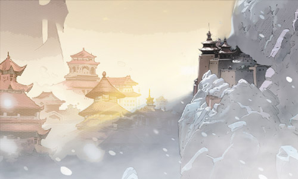
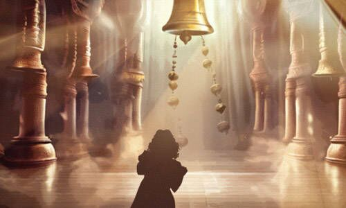
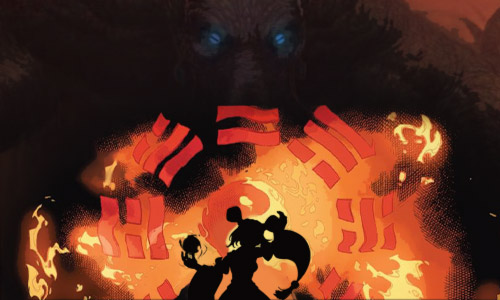

# ⚫ Biography Xuxu ⚪
## Chapter 1

Zhouzhuang, located in the easternmost part of Eastern Continent in Dreamland, is the village that is closest to Spring City and at the far end of the mouth of the Ya River. However, the local never go near Ya River, except water cremation undertakers, who send the deceased back to the embrace of their mother river. An old man named Quan is the village's longest living water cremation undertaker. He has not buried people for a rather long time and often fished up some strange things from the river. The other day he fished up a little girl and a big rat.
The little girl wanted to follow him to Spring City. Quan, usually looking unapproachable, was happy and busy making arrangements. On the way to Spring City, Quan excitedly told of the history of Spring City to the little girl.

---
Legend has it that there was a very powerful country in Eastern continent, which was built in the dream by the most powerful Dream Weaver in history - Zhou. Then the king named Shang conquered the whole continent, which amazed but also concerned all gods. Shang sent a squad of soldiers in golden-silk war-robes to the real world to invite Zhou to settle in Dreamland. Zhou agreed gladly and was appointed as divine master by Shang, which made him on an equal footing with the king. After Zhou’s arrival, the gods, afraid of what the dream Weaver was capable of, cast a curse upon the inhabitants of Dreamland, “Whoever enters dreams of his own volition will never return”, thus Zhou was confined in his dream and never returned. Worse still, the gods even brought about a natural disaster, which made the entire continent instantly become a wasteland. Luckily, Zhou’s daughter, who outshining her father, pulled the entire Spring City into her dream at the last minute, saving a piece of land in the corner of Eastern Continent for humans to live in. But doing so, she bore the gods’ curse, never standing to return from her dream. People in search of gold in the forbidding wasteland more than once saw a young damsel wandering alone with her eyes closed. And in her honor, the people of Spring City built a temple to her in the city and set that day as the Spring Festival.

---
The story ended and they arrived in Spring City.

## Chapter 2

Spring City, the true sanctuary of Eastern continent, where almost all people that are still awake go to cleanse the body and mind every Spring Festival. Although it was Quan’s first time to come to Spring City, as soon as he set foot on the city, he felt as if he had been free from the burden of all his life, with the white hair at his temples becoming more alive. He raised his head, looked around and stared at the gold-domed building far beyond. He took the little girl's hand and walked towards it.
The Goddess of Dream Temple, where Zhou used to live, were nearly wiped out in the natural disaster, except for the house made of turquoise. After the disaster, people built a golden roof over it in honor of the Goddess of Dream. The fact that the open space around the temple was filled with pilgrims who kept kowtowing made Quan a bit distressed. At this time, the priest of the temple came out, with an orchid crown on his head and a mask that symbolizes Tai Chi covering his face, and the pilgrims packed up their belongings and retired respectfully, leaving only the bewildered Quan and the girl in the vast open space.
"Now we have a few who have entered the dream at their own volition, thus these people are allowed to worship the Goddess. You three may come in." The temple priest ignored the exciting crowd around him and turned to enter the temple, Quan and his group dashed a little bit to catch up with the temple priest. "According to the Goddess, all human beings that enter the immortal’s dream, are granted a chance to ring the bell and make a wish. Two of you folks are rewarded with this chance, please go ahead to the Dream-Weaving Hall. I wish that all your dreams will come true." With that being said, the temple priest sat down at the table in the front hall and continued to flip through the ancient books on the table.
Quan, watching the little girl ringing the bell to make a wish, had a hint of longing deep down. "Clang~", the sound of the bell drifted from inside the house, to the city, to the outskirts of the city, and even to the wilderness. The young damsel who was walking towards Spring City with her eyes closed, suddenly opened her eyes and vanished into thin air. Spring City also disappeared, leaving behind only the turquoise house and Quan. Quan quickly reacted and walked out of the house, only to see the little girl was now standing on an unfinished bridge, with a strange young damsel by her side.

## Chapter 3

At the edge of the cliff, the young damsel cast a spell, and the Yin and Yang Carps flash away. Radiant light started giving off from the little girl’s body. Suddenly, in the blink of an eye, the unfinished bridge extended across the sea, disappeared at the end of sight, together with the little girl. After that, the young damsel panted and closed her eyes again, Quan took a great leap forward, but only heard a slight whisper.
"Win this time please, Your Highness."
The young damsel fainted and fell off the cliff, Quan reached out his hands but did not manage to grab her. He looked down from the edge of the cliff, only to see the young damsel dropped on a small hill, which in fact is thousands of dead bodies of the same girl. Also at this moment, somewhere Quan could not see, the bell-ringer giant stopped for a moment, and the medicinal lake, gurgling like shredding tears, slowly lifted a young girl with her eyes closed and sent her to the shore. The young girl, with her eyes closed, staggered up and hobbled towards the Spring City again, waiting for her next chance to wake up.
Suddenly Quan heard a snoring sound behind him, and Spring City revealed itself again. Still standing at the door of the Dream-Weaving Hall, he turned around and saw the temple priest who had been fast asleep. He moved closer to nudge the temple priest, wanting to wake him up. Surprisingly, the temple priest turned into a cloud of dust, leaving behind his crown, mask and robe. “So, I have already rang the bell.” Quan said to himself and then put on the crown, mask and robe on the table. By doing so, he accidentally turned the ancient book on the table to the page where all of it began — “Old Calendar — The Memoir of Xuxu”

---
Xuxu, is the daughter of The Great Dreamer - Zhou and The Saint Cure - Zhuang. She was precociously bright, learned Ringing Bell to Build Dream from her father; Balancing Yin and Yang to Heal from her mother. When Xuxu was 8, she travelled in her Great Dream, and reached a new world. She went so far that she fell in the Black Abyss, and trapped in the Dream.
In next 5 years, her father Built the Spring City, her mother Dug the Medicinal Lake, they gathered all talented people to treat Xuxu. That day, hundred Bells rang, thousand Herbs boiled, million citizens prayed, sounds shook the continent, aroma filled the sky. Yet, Xuxu did not return but Black Abyss did. Evils kidnapped Xuxu, the Song of Abyss spread, whoever fall asleep turned into Dark Creatures. In a second, Dark Clouds dominated the sky, Black Tides washed the continent, everything got deadly quiet. 
At this moment, Zhou and Zhuang sacrificed their bodies, started Zhou's Last Great Dream with the help of Yin and Yang, finally brought back the Spring City and their daughter. Alas, Zhou's body became the Giant Demon, and Zhuang's body arose the Evil Medicinal Lake. Seeing this, Xuxu was outraged. Then, when her punch arriving, Dream came and Shackles gone; when her Palms cycling, Herbs emerged and Wounds healed. When winds and thunders blowing, Yin Yang Shield was gathered; and when Tai chi suppressing, Black Tides was smashed to pieces. Finally, Evils feared and ran, only left their Curse. In the following thousand years, when Xuxu sleeps there is the Human Kingdom, and when she wakes there is the Evil Abyss. Therefore, she can never meet her parents again.

