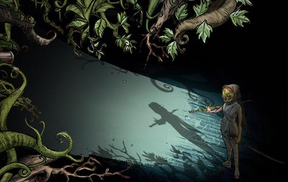
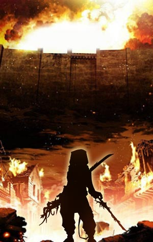

# Biography Yae Kumo
## Part 1

Anun, on the inside, connects its front gate and rear gate with a broad main road, while on the outside, surrounds itself with layers of high walls to ward off any possible hazard. The mountain that is not far away from Anun is Mount Barch, to whose opposite stands Glaad, the most famous city across the globe. Normally, adventurers would team up in the tavern of Anun before hitting the road, to protect themselves from baddy ambush and Koujin attack. At this moment, a young girl was trying to persuade the ranger in front of her to let her to join his ranks. The ranger, who looked young and seemed to have just come of age, gripped a special Totsuka-no-Tsurugi sword hanging from his belt, looking embarrassed.
"Listen, young lady, I would love to have one more travel companion, but this journey holds special meaning to me. Plus, it may be romantic for me and my better half, but it is too dangerous a trip for you. If you could wait, I’d be glad to take you on a trip a few years later. To Glaad, or the moon, you name it."
Apparently, an innocent little girl like her would not possibly understand what one’s better half means. She then asked, “What’s your better half? Can I be your better half as well?” 
"Haha, Yae Kun, just take this little girl with us. She will be safe with us", a girl interrupted.
Dressed in a long white robe, with a golden silk nubuck belt around her waist, which also bore a special sword with an ornate spike hanging from its hilt and some vines wrapping its sheath, this woman was none other than the famous Anun swordsman, Kumo Hime.
Just when Yae was about to take his stand, an ear-piercing roar caused by violent tremor came from outside of the tavern. Yae stormed out of the tavern and looked to the gate ahead; the whole area was covered in a thick cloud of smoke, from inside of which came desperate screams for help. After what seemed like ages, the smoke started to clear away, with wounded rangers dashing out from it one after another. “Koujins are flocking in, the protective walls have been destroyed” they repeated, panicked and terrified. Taken aback, Yae quickly drew his sword out from its sheath. But before dashing forward, something sprang to his mind, and he turned towards the little girl.
"Young lady, wait me at the opposite gate. Don't stop, no matter what you see and hear."
Kumo Hime stroked the little girl’s head and rushed into the thick smoke with Yae without saying a word.

## Part 2

The little girl started running desperately for life. When she rushed across the gate, a swathe of bright light descended in front of her. She subconsciously covered her eyes in her hands, and suddenly everything went quiet, leaving behind no screams, no sounds of fighting and killing, only the sounds of the wind blowing across grass. After a while, she opened her eyes and saw corpses everywhere, of people and eerie plants. Feeling a bit terrified, the little girl took a step back and touched something behind her, she then quickly turned around and backed up in fear. The little girl was about to scream when she realized that it was Yae, thus was able to stifle the screams. Yae was covered in blood now, with a sword in each hand, one of which belonged to Kumo.
"Don’t be afraid, I will protect you, for whatever it takes. I will keep my promise and escort you to the end of the journey. You may leave this to me and move on. "
As Yae was talking to young Cecilia with his back against hers, his chest was rising and flopping violently, gasping for fresh air. Strange green liquid covered both of his swords and his body, where eerie green sprouts had begun to grow. Yae looked at the new green buds growing on his arms, hammered his swords into the ground and pulled out the sprouts with a muffled grunt. The new buds were twisting wildly in his hands. He looked at them furiously, threw them into his mouth and started chewing on them.
"What’s the hold-up? The intermission is over. "
With his breathing simmering down, Yae assumed his starting stance, squat down and swept forward with his two swords, leaving the Koujins before him screaming on the ground. However, it did not take long for the plant-like monsters to get to their feet again. They were waving their tentacles vigorously as if they couldn't be killed. As they were still recovering from the Yae’s last attack, Yae swept the sword in his left hand to force back the herd, and the sword in his right hand to pin down a singled out Koujin to the ground. He then bent down to feast on that poor Koujin, which put up a violent fight and made harsh squeaks before it died. Only then did the little girl understood why those Koujins were so afraid to come forward. She could not control her complex feelings, burst out crying and turned around run away eventually.
Seeing this, Yae let out a sigh of relief and got to his feet with the help of his swords. He then lifted the two swords and spit some green liquid on them, with a hideous smile on his face, "I don’t know how long I will be able live, but, your poison seems to have less effect on me now. An eye for an eye, you guys can get a taste of your own poison."

